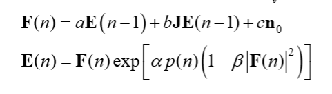

# CIM に PT を入れてもうまくいかなかった理由

## 定義

- **CIM(Coherent Ising Machine)**: 光パラメトリック発振器のネットワークでイジング問題(ここでは MAX-CUT)を解く装置。ポンプ光の利得を上げると各スピンの振幅 `c` が発振し、その符号(±)が解になる。通常はポンプを徐々に上げる(**ランプ**)ことで良い解へ凍結させる。
- **PT(Parallel Tempering, 並列焼きなまし)**: 温度の違う複数の **レプリカ** を同時に走らせ、隣り合うレプリカの状態を **Metropolis 判定** で交換する手法。高温レプリカが広く探索し、見つけた良い配置を低温レプリカへ流して固める、というのが狙い。
- 今回の実装: ポンプをランプさせず、しきい値 `P_th` の前後 3 段(高温=ノイズ支配 / 中温=臨界 / 低温=飽和)で固定した 3 レプリカを回し、定常カット差から逆温度 β を較正してスワップした。

## CIM の物理イメージ — ポンプ倍率とは何を変えるパラメータか

CIM の中身は **光ファイバーのループを周回する N 個の光パルス**である。ループの途中に **PSA(位相感応増幅器)** があり、パルスが通過するたびに次のことが起きる。

- **ポンプ光**(強い励起レーザー)のエネルギーを使って、パルスの **in-phase 成分 $c_i$ を増幅**し、quadrature 成分を減衰させる(縮退パラメトリック増幅)。
- 同時に **測定フィードバック(MFB)** が結合 $J_{ij}$ を通じて他パルスからの入力 $\sum_j J_{ij}c_j$ を足し込む。

縮退パラメトリック発振では、発振したパルスの位相は **0 か π の 2 値**(= 振幅 $c_i$ の符号 ±)しか取れない。この **± がそのまま Ising スピン**になり、$J_{ij}<0$(反強磁性)に設定することで MAX-CUT の「異なる集合に分けるほど得」という構造を埋め込む。

**ポンプ倍率 = 「発振のしきい値からどれだけ上/下にいるか」を決めるノブである。**
1 周の正味利得は「PSA 増幅 × ループ損失」 $=\sqrt{\eta}\,e^{g_0/2}$ で、利得係数は $g_0 = 2\kappa\sqrt{P}\,L$(ポンプ電力 $P$ が大きいほど増幅が強い)。正味利得がちょうど 1 になる点が **発振しきい値**で、

$$\sqrt{\eta}\,e^{g_0/2}=1 \;\Rightarrow\; g_0=\ln(1/\eta) \;\Rightarrow\; P_{\rm th}=\left(\frac{\ln(1/\eta)}{2\kappa L}\right)^2 = 38.0\ \text{mW}.$$

ここでポンプ倍率 $P/P_{\rm th}$ が効いてくる。

| ポンプ倍率 $P/P_{\rm th}$ | 物理状態 | 振幅 $c$ の振る舞い | 温度の比喩 |
|---|---|---|---|
| $<1$(しきい値未満) | 正味利得 < 1 | 発振せず、ノイズフロアで符号がランダムに揺らぐ | 高温(探索) |
| $\approx 1$(臨界) | 正味利得 ≈ 1 | 対称性が破れ、±符号が決まりかける分岐点 | 中温 |
| $>1$(しきい値超) | 正味利得 > 1 | 指数増幅 → 飽和項 $\gamma I_{\rm in}$ で頭打ち、符号がロック | 低温(凍結) |

つまり **ポンプ倍率は「光パルスをどれだけ強く発振させるか」= 実効的な温度(焼きなましの進み具合)を調整するパラメータ**である。ただしこれは熱力学的な温度そのものではなく、発振が立ち上がるかどうかを決める「利得ノブ」にすぎない——この違いが、後述する PT 失敗の根本原因になる。

## CIM の更新式と、3 帯域でいじったパラメータ

CIM は次の式を毎ラウンド回す。

$$\mathbf{F}(n) = a\,\mathbf{E}(n-1) + b\,\mathbf{J}\mathbf{E}(n-1) + c\,\mathbf{n}_0$$

$$\mathbf{E}(n) = \mathbf{F}(n)\,\exp\!\left[\alpha\,p(n)\left(1 - \beta\,|\mathbf{F}(n)|^2\right)\right]$$

- `F`: 結合後の場(自己項 `a·E` + 相互作用 `b·JE` + ノイズ `c·n₀`)
- `E`: ポンプ利得 `exp[α·p(n)(1−β|F|²)]` をかけた振幅。`β|F|²` が飽和(振幅が大きいほど利得が減る)。
- **`p(n)` がポンプ項**。通常 CIM はこれを徐々に上げる(ランプ=焼きなまし)。

#### 正準式とコードの対応(ポンプ項はどこか)

更新式の各記号は、実装(`coupled_in = √η·c + Jc`、`c = exp[½g0(1−γ|F|²)]·coupled_in + noise`)と次のように対応する。

| 正準式 | 意味 | コード対応 |
|---|---|---|
| `E(n)` | round n の振幅 | `c[r,i]` |
| `F(n)` | 結合後の場 | `coupled_in` |
| `a` | 自己結合(損失後の残存) | `√η` |
| `b·J` | 相互作用結合 | `Jc`(反強磁性 J) |
| `c·n₀` | ノイズ | `noise_i` |
| **`α·p(n)`** | **ポンプ項(利得)** | **`½·g0 = κL√P`** |
| `β` | 飽和係数 | `γ` |
| $|F(n)|^2$ | 強度 | `coupled_in²` |

すなわち**ポンプ項は** $\alpha\,p(n) = \tfrac{1}{2}g_0 = \kappa L\sqrt{P}$。`α` を定数とみなすと**正味のポンプ `p(n)` は `√P` に比例**する(`g0=2κL√P` のため)。

**ポンプ項の物理的役割**:指数の中 `α·p(n)(1−β|F|²)` の符号で振る舞いが切り替わる。
- `|F|²` が小さい(初期):中身 ≈ `+α·p` → `exp[+]` で**増幅**
- `|F|² > 1/β`:中身が負へ反転 → `exp[−]` で**減衰=飽和**

この「増幅 → 飽和」で振幅が頭打ちになり、位相が 0/π(符号 ±)にロックしてスピンが確定する。
小信号 1 周利得 `√η·exp[κL√P]=1` の点が発振しきい値で、$P_{\rm th}=(\ln(1/\eta)/(2\kappa L))^2$ に一致する。

**`p(n)` を定数にしたか時間発展させたか**が v1/v2 と v3 の本質的な差:

| | `P(k)` | ポンプ項 `α·p(n)=κL√(mult_r·P(k))` | `p(n)` の n 依存 |
|---|---|---|---|
| v1/v2(固定) | `P_th`(定数) | `κL√(mult_r·P_th)` = 定数 | **なし** |
| v3(ランプ) | `(k+1)·dP` | `κL√(mult_r·(k+1)·dP)` | **あり**(`p(n)∝√(n+1)`) |

**3 帯域(レプリカ)を作るときに変えたのは、この `p(n)`(ポンプ電力 `P`)だけ**である。`a, b, c, α, β` と結合 `J` は 3 レプリカで完全に共通にし、`P` を発振しきい値 `P_th` に対する倍率 `pump_mults` で 3 段に固定した:

| レプリカ | 役割(温度) | ポンプ倍率 `P/P_th` | ポンプ電力 `P` |
|---|---|---|---|
| 0 | ノイズ支配(高温) | 0.8(<1, しきい値未満) | 30.4 mW |
| 1 | 臨界(中温) | 1.0(≈しきい値) | 38.0 mW |
| 2 | 飽和(低温) | 1.3(>1, しきい値超) | 49.3 mW |

コード上は `g0 = 2·κ·√P·L`(= 式の `α·p(n)` に相当)を通じて `P` が利得に入る。`P` が大きいほど早く・強く発振して振幅が飽和=「低温(凍結)」、小さいほど発振せずノイズで揺らぐ=「高温」になる、という対応で温度ラダーを表現している。

### 通常(ランプ)CIM のポンプ倍率はどうだったか

比較対象の通常 CIM は **ポンプ倍率を固定せず、毎ラウンド少しずつ上げていく(ランプ)**。実装では 1 ラウンドあたり `dP = 0.05 mW` ずつ増やし、$P(k) = (k+1)\times 0.05$ mW とする。全 1500 ラウンドでは次のように動く($P_{\rm th}=38.0$ mW)。

| | ポンプ電力 $P$ | ポンプ倍率 $P/P_{\rm th}$ | 状態 |
|---|---|---|---|
| round 1(開始) | 0.05 mW | 0.0013 | しきい値のはるか下(ほぼ無発振) |
| round 1500(終了) | 75 mW | 約 1.97 | しきい値の約 2 倍(飽和) |

すなわち通常 CIM は **「しきい値のはるか下(ほぼ無発振)」から「しきい値の約 2 倍(飽和)」まで、ポンプ倍率を 0 → 約 2 へ連続的にスイープ**する。最初はノイズで広く探索し、ポンプが上がるにつれて徐々に発振・凍結していく——これが焼きなまし(annealing)に相当する。

今回の PT 実装は、この **連続ランプを廃止**し、ポンプ倍率を $[0.8, 1.0, 1.3]\times P_{\rm th}$ の **3 点に固定**した 3 レプリカに置き換えたものである(上表)。「ランプで時間をかけて倍率を 0→2 と動かす」代わりに、「しきい値近傍の 3 点を固定で並べ、スワップで配置を移す」ことで焼きなましを代替しようとした、という関係になっている。

## 結果(PT 有効での比較)

下図は **PT 有効(紫)**・swap 無(茶)・ランプ CIM(青)を等計算量で比べたもの。**CIM+PT が 3 手法で最下位**(平均 13156 < swap 無 13193 < ランプ CIM 13276)で、PT を足すほど悪化した。

## PT が成り立つ前提 — SA は満たし、CIM は満たさない

PT(並列焼きなまし)は「温度違いのレプリカを並べてスワップする」だけの手法に見えるが、実はその裏に **2 つの強い前提** がある。SA(焼きなまし法)はこの両方を自然に満たすので PT が機能するが、CIM はどちらも満たさない。これが「SA では効いたのに CIM では失敗した」根本原因である。

### 前提① 真の温度とエネルギーがあり、スワップが詳細釣り合いを満たす

#### まず「SA は何をしている装置か」から

SA(および一般の MCMC)は、各温度 $T$ で **ボルツマン分布** をサンプリングする装置である。十分に回せば、状態 $s$ が現れる確率は

$$P_T(s) \;\propto\; \exp\!\left(-\frac{E(s)}{T}\right)$$

に必ず落ち着く(= 熱平衡)。ここで $E(s)$ は Ising のエネルギー(MAX-CUT ではカット値の符号反転)で、**どの配置にも一意に定まる量**である。つまり SA では

- **エネルギー $E$**:配置ごとに定義される(これは CIM でも一応ある)
- **温度 $T$**:その $T$ に対応する「実際にサンプルされるボルツマン分布」が存在する(← ここが本質)

の 2 つが揃っている。「温度 $T$」はただのラベルではなく、**$\exp(-E/T)$ という現実の確率分布を生み出す物理量**になっている点が重要。

#### 補足:「正しい分布に従う」とはどういうことか

「正しい分布」とは、**その温度で本来現れるべき確率分布($P_T(s)$)と、実際にレプリカが各配置を訪れる頻度が一致している**ことを指す。$P_T(s)=\exp(-E(s)/T)/Z$ は最初から数式で決まっている「答え合わせの正解」で、SA を十分長く回すと各配置の出現頻度がこの正解にぴったり収束する(= 熱平衡)。

たとえば配置 A(良い解=低 $E$)・B(中)・C(悪い解=高 $E$)があるとき、$P_T(s)$ は温度で次のように姿を変える:

| 配置 | 低温($T$ 小) | 高温($T$ 大) |
|---|---|---|
| A(低 E=良) | 80% | 40% |
| B(中 E) | 15% | 33% |
| C(高 E=悪) | 5% | 27% |

- **低温**:良い解 A に確率が集中する(尖った分布)→「良い解を固める」
- **高温**:A・B・C がほぼ均等(平らな分布)→「広く探索する」

この「実際の出現頻度 = 数式が指定する $P_T(s)$」が成り立っている状態を「**正しい(その温度の)分布に従っている**」と呼ぶ。SA は回せば必ずこの状態へ収束する(正しい分布が**存在し、そこへ収束する**)ので前提①が満たされる。

そして PT のスワップは、この頻度表を**崩さない**ように設計されている。配置を温度間で入れ替えても、低温は「A 80% / B 15% / C 5%」のまま、高温は「ほぼ均等」のままに保たれる。これが次に述べる詳細釣り合いの意味である。

CIM にはそもそも「目指すべき正しい分布」が**存在しない**($\exp(-E/T)$ へ収束しないので $P_T(s)$ を書けない)。だから「分布が正しいか」を問うことすらできず、「スワップが分布を壊さない」保証も得られない。

#### なぜスワップしてよいのか(詳細釣り合い)

PT のスワップ受理確率は Metropolis 判定

$$p_{\rm swap} = \min\!\Big(1,\; \exp\big[(\beta_i-\beta_j)(E_i-E_j)\big]\Big), \qquad \beta = 1/T$$

で与えられる。この式は天下りではなく、**「スワップ後も全レプリカの同時分布が各ボルツマン分布の積のまま保たれる」** という要請(拡張系での詳細釣り合い)から **一意に導かれる**。

噛み砕くと:

- 各レプリカが「その温度の正しいボルツマン分布」に従っている。
- 上の確率でスワップすると、**配置を温度間で入れ替えても、各温度の分布が壊れない**ことが数学的に保証される。
- だからスワップは「確率の重みを不正に作ったり消したりしない、統計的に中立な操作」になる。高温が見つけた良配置を低温へ渡しても、低温の分布は依然として正しい——だから安心して良配置を低温に集めて固められる。

**要するに前提①とは「温度 $T$ が本物のボルツマン分布を生んでいて、その分布を壊さないようにスワップ式が作られている」という整合性**のこと。SA はこの土台の上に乗っているから PT が正当化される。

#### CIM ではこの土台ごと無い

CIM はボルツマン分布をサンプリングする装置では **ない**。光パルスの振幅が

$$\mathbf{E}(n) = \mathbf{F}(n)\,\exp\!\left[\alpha\,p(n)\left(1 - \beta\,|\mathbf{F}(n)|^2\right)\right]$$

という力学(ノイズ入りの決定論的写像)で時間発展する **非平衡系** であり、$\exp(-E/T)$ という分布には収束しない。したがって:

- **温度が存在しない。** ポンプ倍率 $P/P_{\rm th}$ は「発振しきい値からどれだけ上/下か」を決める **利得ノブ** にすぎず、$\exp(-E/T)$ を生む熱力学的温度ではない(本資料冒頭の表で「温度の比喩」と注記したとおり、あくまで比喩)。
- **代用 $\beta$ にはボルツマン分布の裏付けが無い。** 今回は各レプリカの定常カット差から $\beta$ を逆算したが、これは「もしボルツマンだったら $\beta$ はこれくらい」という当てはめにすぎず、対応する現実の分布が存在しない。
- **よって Metropolis スワップ式の前提が崩れる。** $p_{\rm swap}=\min(1,\exp[(\beta_i-\beta_j)(E_i-E_j)])$ は「各レプリカがボルツマン平衡にある」ことを根拠に導かれた式なので、平衡が無い CIM では **詳細釣り合いを満たさない**。スワップはもはや「分布を壊さない中立な交換」ではなく、**単なる配置の移植(根拠のない持ち込み)** になってしまう。

> たとえるなら、SA のスワップは「同じ通貨を正しい為替レートで両替する」操作だが、CIM のスワップは「為替レート(=温度)が存在しない通貨同士を、それっぽい数字で無理やり両替している」ようなもの。レートの裏付けが無いので、交換するほど価値(解質)が損なわれうる。

### 前提② 低温レプリカほど良い解を持つ(温度と解質が順当に並ぶ)

PT のもう一つの前提は、**「低温レプリカほど良い解(低エネルギー=高カット)を持つ」**こと。高温が広く探索し、見つけた良配置を低温へ流して固める、という流れはこの並びがあって初めて成立する。SA ベースの PT ではこれも自然に成り立つ(低温のボルツマン分布は低エネルギー状態に確率が集中するため)。

ところが **CIM ではこの並びが真逆に反転する**。詳細は次節で診断するが、結論だけ先に言うと:

- **高温(低ポンプ/ノイズ支配)レプリカが最高カット**(発振しないので符号が揺らぎ続け、探索は得意)
- **低温(高ポンプ/飽和)レプリカが最低カット**(早く飽和して悪い配置に凍結してしまう)

低温ほど良いどころか **低温ほど悪い**ので、スワップは良い配置を悪い低温側へ流して汚す方向に働く。

### まとめ:2 前提と SA/CIM の対応

| PT が要求する前提 | SA(熱平衡系) | CIM(非平衡力学系) |
|---|---|---|
| ① 真の温度・エネルギーがあり、スワップが詳細釣り合いを満たす | ○ ボルツマン分布をサンプルするので成立 | ✕ 温度が無く $\beta$ は代用物。詳細釣り合い不成立 |
| ② 低温レプリカほど良い解を持つ | ○ 低温分布は低エネルギーに集中 | ✕ **逆転**(高温=最良 / 低温=最悪) |

① で「スワップの統計的正当性」が失われ、② で「スワップの向き」まで裏返る。**二重に前提が壊れている**のが、CIM で PT が効かなかった理由である。次節では特に決定的な ②(温度と解質の逆転)を実測で診断する。

## うまくいかなかった理由

なぜ悪化するのかを診断するには、**スワップで配置が混ざる前**の各レプリカ本来の性質を見る必要がある(混ぜた後では各温度本来のカット質が見えない)。そこで下図は **swap 無効** run の図で、決定的なのは右パネルの **温度と解質の逆転** である。

PT が成り立つ前提は「低温レプリカほど良い解(高カット)を持つ」こと。ところが CIM では逆で、**高温(ノイズ支配)レプリカが最高カット、低温(飽和)レプリカが最低カット**になっている。低温側は振幅が早く飽和して悪い配置に凍結してしまうためだ。実際このとおり前提が崩れているので、上の比較図で PT 有効が最下位になる。

つまり CIM は熱平衡をサンプルする系ではなく非平衡力学系で、ポンプ準位に対応する真の温度・エネルギーが存在しない。β は人工的に較正した代用物にすぎず詳細釣り合いを満たさない。その結果スワップは良い配置を悪い低温側へ流して汚し、ランプ CIM が本来持つ「徐々に凍結する」利点も壊してしまった。これが PT を入れて性能が下がった理由である。

## 追試: β ラダーを反転したら(v2)

上の診断で「**温度と解質が逆転している**」(高温=低ポンプが最良、低温=高ポンプが最悪)とわかった。ならば **β ラダーの向きを逆にして、実測で最良の低ポンプ・レプリカを cold(β 最大)に割り当てれば**、スワップは良い配置を「実測最良の低ポンプ側」へ集めるようになり、前提のねじれが解消されるはず——これが v2 の仮説である。

変更したのは **β の向きだけ**(物理パラメータ・ポンプ準位 $[0.8,1.0,1.3]\times P_{\rm th}$・スワップ間隔・seed はすべて v1 と同一)。swap 無効 run の定常カット $[13191.7,\,13122.7,\,12994.8]$(低→高ポンプ)から較正した β を、v1 とは逆順に割り当てた:

| | replica0(低ポンプ/ノイズ) | replica1(臨界) | replica2(高ポンプ/飽和) |
|---|---|---|---|
| 定常カット(swap無) | 13191.7(最良) | 13122.7 | 12994.8(最悪) |
| β v1向き(高ポンプ=cold) | 0 (hot) | 0.0145 | **0.0223 (cold)** |
| β v2反転(低ポンプ=cold) | **0.0223 (cold)** | 0.0078 | 0 (hot) |

### 結果

| 手法 | 平均カット | 最良カット | 対ランプ CIM(平均) |
|---|---|---|---|
| ランプ CIM(baseline) | **13276.7** | **13326** | — |
| CIM+PT v1向き(良い解→高ポンプ) | 13152.1 | 13207 | −124.6 |
| CIM+PT **v2反転**(良い解→低ポンプ) | 13183.0 | 13271 | −93.7 |

カット値の分布(頻度)で見ると、ランプ CIM(青・最も右)に対し v2反転(緑)は中央、v1向き(紫)が最も左で、向きの修正で右へ寄ったがランプ CIM には遠いことが分かる。

### 考察 — 「向きは逆だったが、それでも届かない」

**(1) ラダーの向きは確かに逆だった。** v2 反転は v1 向きに対し平均 +30.9・最良 +64 改善し、図でも一貫して上を走る。スワップ受理率も v1 の $[0.86,0.93]$(混ざりすぎ)から v2 の $[0.65,0.79]$ へ健全化した。診断どおり「良い配置は実測最良の低ポンプ側へ集めるべき」で、v1 の割り当ては裏返しだったと検証できた。

**(2) ただし向きを直しても、依然ランプ CIM には届かない**(v2 13183 < ランプ 13277)。これは構造的な理由による:

- 低ポンプ(ノイズ支配)レプリカは **探索は得意だが、良い配置を「凍結」できない**。発振しないので符号が揺らぎ続け、せっかく流し込んだ良い配置もすぐ崩れる。一方で唯一「凍結」できる高ポンプ側は、早すぎる飽和で悪い配置に固まる。**「探索する場所」と「凍結する場所」が分離してしまい、両立しない**。
- ランプ CIM の強みは、ポンプ倍率を $0 \to$ 約 $2$ へ **連続的に上げる時間的な焼きなまし**そのものにある。固定ポンプ 3 点 + スワップでは、この「時間軸の冷却スケジュール」を再現できない。スワップが移すのは*瞬間の配置*であって、*ポンプを徐々に上げる*という時間発展は移せない。

### 結論

β ラダーの向きを「実測の解質」に合わせて反転すると PT 内部の整合性は改善する(v2 > v1)。しかしそれでもランプ CIM に勝てないことが、**「CIM は非平衡力学系であり、固定ポンプ + 構成スワップでは焼きなまし(連続的な凍結)を代替できない」という本質**をかえって強く裏付けた。PT を活かすなら、向きの修正に加えて「各レプリカ内にも時間的なポンプランプを持たせる」「凍結機構(高ポンプ)と探索機構(低ポンプ)を時間的に切り替える」など、**非平衡な凍結ダイナミクスそのものを設計に組み込む**必要がある。

(再現コード: `modules/2026-06-06_CIM_PT_v2.py`、データ: `results/2026-06-06/cim_pt_v2/v1_rounds1500_swap10_revladder/`)

## 発展: 各レプリカにも時間発展(ランプ)を入れたら(v3)

v2 の考察で挙げた発展案——**各レプリカ内にも時間的なポンプランプを持たせる**——を実装したのが v3 である。v1/v2 は各レプリカのポンプを*固定*していたが、v3 では各レプリカに**焼きなまし(ポンプ・ランプ)そのもの**を持たせる:

$$P_r(k) = \text{mult}_r \times P_{\rm ramp}(k), \qquad P_{\rm ramp}(k) = (k+1)\,dP \;\;(dP=0.05\ \text{mW})$$

mult $=[0.8, 1.0, 1.3]$ とすると、replica1 は**通常ランプ CIM そのもの**、replica0 はゆっくり昇温して探索を長く保ち、replica2 は速く昇温して早く凍結する。3 本のランプは発振しきい値 $P_{\rm th}=38$ mW を **round 950 / 760 / 585**(低→高 mult)で順に横切り、振幅も順に立ち上がる。**全レプリカが最終的に発振・凍結する**ので、v2 で問題だった「探索する場所と凍結する場所の分離」が解消される(= 焼きなまし速度の異なる集団 + 構成スワップ、population annealing 的な構成)。

swap 無効ランの定常カットは $[13278.1, 13276.3, 13266.6]$(mult 低→高)で、**3 レプリカとも良い**(v1/v2 のように悪いレプリカが無い)。最良はゆっくり昇温する低 mult 側なので、v2 の教訓どおり低 mult を cold に較正した。

### 結果 — ついにランプ CIM を上回る

| 手法 | 平均カット | 最良カット | 標準偏差 | 既知ベスト比 |
|---|---|---|---|---|
| ランプ CIM(baseline) | 13276.7 | 13326 | 21.0 | 0.9975 |
| CIM+PT v2(固定ポンプ反転) | 13183.0 | 13271 | 23.7 | 0.9934 |
| **CIM+PT v3(各レプリカ・ランプ)** | **13294.3** | **13337** | **15.9** | **0.9984** |

v3 は平均で **+17.7**、最良で **+11**(13337 > 13326)ランプ CIM を上回り、しかも**標準偏差が最小**(15.9 < 21.0)で最も安定している。スワップ受理率も $[0.32, 0.57]$ と健全(v1/v2 の $0.8$ 超から PT らしい範囲に収まった)。

### 考察 — 何が効いたか

- **焼きなましを各レプリカに戻したことが本質**だった。固定ポンプ(v1/v2)では「徐々に凍結する」という CIM 最大の武器を捨てていた。各レプリカにランプを戻すと、全レプリカが良い解へ凍結できるようになり、PT の前提(各レプリカがまともな解を持つ)も自然に満たされる。
- その上で **PT スワップが「昇温速度の異なる焼きなまし」の間で良い配置を共有**する。早く凍結したレプリカが見つけた良い配置を、まだ探索中のレプリカへ渡して再加熱・再探索する、といった協調が効き、単独ランプ CIM より平均・最良・安定性のすべてで上回った。
- 一連の流れ(v1 失敗 → v2 で向きは直るが届かない → v3 で焼きなましを戻して逆転)は、**「CIM で PT を活かす鍵は、温度ラダーの向きよりも、各レプリカが非平衡な凍結ダイナミクス(ランプ)を保持していること」**だと示している。

ただし伸びは僅差(対ランプ +17.7)であり、G22 単一インスタンス・100 trial の結果である点には注意。今後は複数グラフ・seed での再現性確認、mult/swap 間隔/レプリカ数の最適化が課題。

(再現コード: `modules/2026-06-06_CIM_PT_v3.py`、データ: `results/2026-06-06/cim_pt_v3/v1_rounds1500_swap10_perreplica_ramp/`)

---

## ⚠️ 訂正(2026-06-08): swap アブレーションの結果、上の v3 結論は過大評価だった

上の v3 比較は **ランプCIM(1レプリカ) / v2(swap有) / v3(swap有)** を並べていたため、「v3 がランプCIMに勝った」効果に

- **(a) 1→3 レプリカ化**(異なるランプ速度の multi-start)の寄与
- **(b) その3本の間で swap した寄与**(= PT の本体)

が**混在**しており、**swap 自体が効いたのか multi-start だけで勝てたのか**を区別できていなかった。そこで **3本ランプ構成のまま swap 有/無だけを切り替えた対照**(pump_mults・ランプ・seed・trial数すべて同一、`do_swap` のみ変更)を取り直した。

| 手法 | 平均カット | 最良カット | 標準偏差 |
|---|---|---|---|
| ランプ CIM(1レプリカ) | 13276.7 | 13326 | 21.0 |
| **v3 swap無**(3本ランプのみ) | **13291.9** | **13337** | 17.0 |
| **v3 swap有** | **13294.3** | **13337** | 15.9 |

**効果の分解:**

| 寄与 | 平均 | 最良 |
|---|---|---|
| (a) 3本ランプ化(swap無 − ランプCIM) | **+15.3** | **+11** |
| (b) swap 自体(swap有 − swap無) | **+2.4** | **±0** |

- ランプCIM超え +17.7 のうち **約 87%(+15.3)は3本ランプ化(multi-start)**による。
- **swap の純粋寄与は平均 +2.4(std≈16〜17 の中なので誤差レベル)・最良は ±0**(swap 有無とも 13337 で同一)。累積最良カット図でも swap無と swap有はほぼ完全に重なる。

**したがって上の (2) 考察「PT スワップが良い配置を集団間で共有して効いた」は、正しい対照を取ると支持されない。** 正確には:

> **v3 がランプCIMを上回った主因は PT スワップではなく、「異なるランプ速度を持つ3本のCIMを並走させ最良を採る multi-start 効果」である。swap の追加寄与はこの設定では誤差程度。**

一方、「**各レプリカに時間発展(ランプ)を戻したことが本質**」(v1/v2 の固定ポンプが悪かった)という点は引き続き正しい。崩れたのは「swap が効いた」という因果のみ。現状は「PT」ではなく「ランプ速度違いの multi-start CIM」と呼ぶのが正確で、swap を活かすにはレプリカ間多様性の拡大・swap間隔/β/レプリカ数の最適化が必要。

(対照実験コード: `modules/2026-06-08_CIM_PT_v3_swap_ablation.py`、データ・詳細: `results/2026-06-08/cim_pt_v3_swap_ablation/v1_rounds1500_swap10_swap_ablation/`)
