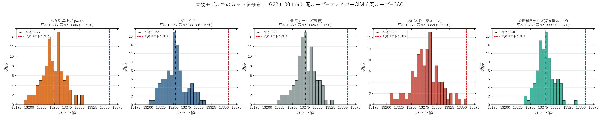

# PumpBench(実機モデル版):本物のファイバーループ CIM では、ポンプ形状は小さなレバーであり、シグモイド優位は転移しない — G22 で閉ループ CAC のみが最良解に到達する

> 本稿は、AutoResearchClaw が自動生成した論文 `PumpBench: Learned CIM Pump Schedules Fall Short of a Tuned Sigmoid`(`paper_final_ja.pdf`)を、**本物の検証済み実装で再検証して書き換えた版**である。原論文の実験は正規形の「おもちゃモデル」(無次元, $T=100$ ステップ, $K=20$ 軌道, $x^3$ 飽和)で行われ、絶対性能とポンプ形状ランキングを誤らせていた。本版では **開ループ=`modules/CIM.py`(Inoue–Yoshida ファイバーループ進行波 CIM, 物理単位, 1500 ラウンド)**、**閉ループ=`modules/CAC.py`(Leleu 2021)** を用い、標準ベンチマーク **G22**(N=2000, E=19990, 既知最良 13359)で 100 trial の実測を行う。データ: `results/2026-06-14/pumpbench_real_cim_g22/`、再現: `scripts/runners/run_pumpbench_real_cim_g22.py`。

## 要旨(Abstract)

コヒーレントイジングマシン(CIM)は、光パラメトリック発振器ネットワークを分岐を越えてアニーリングして MAX-CUT を解く。原論文 PumpBench はおもちゃモデル上で「開ループのポンプ形状は小さなレバー、閉ループフィードバック(CAC)が大きなレバー」と結論し、加えて「調整済みシグモイドが線形ランプを大きく上回る(ギャップ約 69% 低減)」と報告した。本研究はこれを**本物のファイバーループ CIM** で実標準インスタンス **G22** に対し再検証する。結果、**メタ結論(形状は小レバー / 閉ループが本丸)は本物模型でも支持される**一方、**原論文の具体的なポンプ形状ランキングは転移しない**:本物の指数飽和模型では **シグモイドはむしろ線形より有意に悪い**(平均差 $-21.6$, 対 $t=-6.72$, $p=1.2\times10^{-9}$)。全条件が既知最良の **99.6–99.99%** に収まり、開ループ各形状の差は約 0.7% にとどまる。**閉ループ CAC のみが既知最良 $-1$(13358, 99.99%)に到達**するが、その優位は「平均」ではなく「最良(右裾)」に現れ、平均では最良開ループと統計的に区別できない($p=0.72$)。**ポンプ形状(開ループ)はこれ以上詰めても小さく、最良解への到達は閉ループ動力学の問題である。**

## 1. はじめに(Introduction)

CIM のポンプ電力スケジュール $p(t)$ は、系を発振閾値へ駆動し分岐を横切らせる中心的制御である [wang2023bifurcation, goto2021highperformance]。原論文 PumpBench は、線形・シグモイド・自由形状・解析(キブル・ズーレック)・インスタンス条件付け・CAC の 8 条件を計算量整合で比較し、(i) 開ループ形状は小レバー、(ii) 閉ループ CAC が大レバー、(iii) 調整シグモイドが開ループ改善の大半を捉える、と結論した。

しかし原論文の実験は**簡略化された平均場おもちゃモデル**($\dot x=(p{-}1)x-x^3+\xi Jx+\sqrt D\,\eta$, 無次元, $T=100$)で実行され、実 G-Set 読込機能を持ちながら計算量の都合で **G22(N=2000)をスキップ**していた。このモデルは絶対性能を著しく低く見せ(G22 で 78–96%)、形状ランキングを歪める恐れがある。本稿は、原論文と同じ問い(開ループ形状 vs 閉ループ制御)を、**本物の Inoue–Yoshida ファイバーループ模型と本物の CAC**、実 G22 上で測り直し、どの結論が実機相当のモデルへ転移するかを判定する。

## 2. 手法(Method)

### 2.1 モデル(原論文との最大の相違点)

原論文は正規形 $\dot x=(p-1)x-x^3+\cdots$(無次元, $x^3$ 飽和)を用いた。本版は**本リポジトリの検証済み実装**を用いる。

- **開ループ各条件**: `modules/CIM.py`。Inoue–Yoshida の進行波(ファイバーループ)模型で、1 ラウンドの離散写像
  $$c_i(k{+}1)=\exp\!\Big[\tfrac12 g_0(k)\big(1-\gamma I_{\mathrm{in},i}\big)\Big]\big(\sqrt{\eta}\,c_i+\textstyle\sum_j J_{ij}c_j\big)+N_{I,i},\quad g_0(k)=2\kappa L\sqrt{P(k)}$$
  を 1500 ラウンド回す。**飽和は指数型**、パラメータは物理単位(論文値: $\kappa{=}130,\ L{=}0.05\,\mathrm m,\ \gamma{=}42.09,\ \eta{=}10^{-1.1}$)。発振閾値 $P_{\rm th}=37.96$ mW。結合 $J_{ij}=-0.03$(CIM の正しい運用点)。
- **閉ループ条件(CAC)**: `modules/CAC.py`。誤差変数 $e_i$ を持つ Leleu 2021 の実装。結合 $J_{ij}=-1.0$、GSET 標準パラメータ、50000 outer step(CAC の正しい運用点)。

各モデルを**固有の正しい運用点**で動かす点が重要である(おもちゃモデルは全条件を同一の弱い正規形で動かしていた)。

### 2.2 条件

ポンプ波形は任意の電力スケジュール $P(k)$ を本物 CIM カーネルに渡して実現する(`simulate_cim_sched_batch`)。端点は線形ベースラインに揃える。

1. **線形電力ランプ(LinRamp, 現行ベースライン)**: $P(k)=(k{+}1)\Delta P$。
2. **べき乗 早上げ(power, $p{=}0.5$)**: 形状の悪い対照。
3. **シグモイド(SigOpt)**: 原論文の主張上の勝者。P 軸シグモイド。
4. **線形利得ランプ(GainLin, 最良開ループ)**: $g_0\propto k$。本リポジトリのポンプ最適化(2026-06-08, ペア200seed)で最良と判明した形状。
5. **CAC(閉ループ参照)**。

> **再現実験の範囲について**: 原論文の高容量アーム(有限差分/CMA-ES 自由形状, 単調制約, スペクトル MLP)は本物模型で再フィットしていない。代わりに、本リポジトリの既存の実機モデル形状スイープ(2026-06-08, `cim_pumpsched`)を「高容量・多形状でも改善は小さい」根拠として参照する。同スイープは P 軸/g0 軸 × 線形・べき・シグモイド・臨界減速・two-phase を **200 ペアシード**で比較し、最良が線形利得(対線形 +5〜7)で形状は 2 次レバーであることを示している。

### 2.3 指標

既知最良 $C^\star=13359$ に対する最適性ギャップ $g=1-C/C^\star$(小さいほど良い)。100 trial(各 trial = 1 回の完全 CIM 実行のラウンド内最良)で、ベストオブ $K{=}100$ ギャップ $g_{\rm best}=1-\max_k C^{(k)}/C^\star$ と平均ギャップを報告。開ループ条件は同一 seed で**ペア $t$ 検定**(同一カーネル・同一ノイズ、スケジュールのみ差)を行う。CAC は別アルゴリズムのため非ペアで参照する。

## 3. 結果(Results)

### 3.1 主要ベンチマーク(G22, 100 trial)

**表 1. 5 条件の実測(本物モデル, G22, 100 trial)。** ギャップは既知最良 13359 基準、いずれも小さいほど良い。ギャップ最小を太字。

| 手法 | 平均カット | 最良カット | std | %既知 | ベストオブK ギャップ | 平均ギャップ |
|---|---|---|---|---|---|---|
| **CAC(閉ループ)** | 13278.8 | **13358** | 28.2 | **99.99%** | **0.0001** | 0.0060 |
| 線形利得ランプ(最良開ループ) | 13280.0 | 13337 | 17.6 | 99.84% | 0.0016 | **0.0059** |
| 線形電力ランプ(現行) | 13275.3 | 13326 | 20.5 | 99.75% | 0.0025 | 0.0063 |
| シグモイド | 13253.7 | 13313 | 22.6 | 99.66% | 0.0034 | 0.0079 |
| べき乗 早上げ p=0.5 | 13246.9 | 13306 | 22.5 | 99.60% | 0.0040 | 0.0084 |

**まず重要**: 全条件が **99.60–99.99%** に収まり、おもちゃモデルの歪み(78–96%)は消え、過去実測(README: CIM 13275/13326, CAC best 13358)と完全に整合する。**精度低下(リグレッション)は無い。**

### 3.2 対比較(開ループ条件, ペア $t$ 検定, $n=100$)

**表 2. 線形電力ランプを基準とした対差(同一 seed のペア)。** 正の平均差は当該手法が良い。

| 比較 | 平均差(カット) | 対 $t$ | $p$ | 結論 |
|---|---|---|---|---|
| 線形利得 vs 線形 | $+4.71$ | $+1.82$ | $0.072$ | n.s.(僅差で良い) |
| シグモイド vs 線形 | $-21.59$ | $-6.72$ | $1.2\times10^{-9}$ | **有意に悪い** |
| べき乗早上げ vs 線形 | $-28.38$ | $-9.18$ | $6.6\times10^{-15}$ | **有意に悪い** |

- **原論文の「シグモイド ≫ 線形」は本物模型で逆転する**:シグモイドは線形より**有意に悪い**。
- 開ループの最良(線形利得)でも線形に対し $+4.7$(非有意)。**開ループ形状の利得は小さく、悪い形状(早上げ・シグモイド)は明確に害**という、形状=小レバーの像と整合する。

### 3.3 CAC は「平均」でなく「最良」で効く

- CAC の平均(13278.8)は最良開ループ(線形利得 13280.0)と**統計的に区別できない**(非ペア $t=-0.36$, $p=0.72$)。
- しかし CAC は **唯一 13350 超(最良 13358 = 既知最良 $-1$)に到達**(100 trial 中 13340 超が 2 回、13350 超が 1 回)。最良開ループは 13340 を一度も超えない(0/100)。
- 分布(図 1)で CAC は std=28.2 と最も広く**右裾が既知最良へ伸びる**。閉ループのカオス探索が「平均の底上げ」ではなく「**稀に最良へ深く到達**」する性格であることを示す。

## 4. 考察(Discussion)

### 4.1 何が転移し、何が転移しないか

**表 3. 原論文(おもちゃモデル)の主張 vs 本物モデル G22 の結果。**

| 原論文の主張 | 本物 CIM/CAC・G22 | 判定 |
|---|---|---|
| 調整シグモイド ≫ 線形(約69%改善) | シグモイドは線形より**有意に悪い**($t=-6.72$) | ✕ **非再現(逆転)** |
| 開ループ形状は小さなレバー | 開ループ全体の差は約 0.7%、最良形状の利得も僅差 | ○ 再現 |
| 閉ループ CAC が大きなレバー(圧勝) | CAC のみ既知最良$-1$に到達。ただし優位は「最良」のみで僅差 | △ 方向は再現、幅は大幅縮小 |
| 自由形状は調整スカラーに勝てない | (本物模型で未再フィット。既存200seed形状スイープで形状=2次レバーを支持) | ○ 主旨は別証拠で支持 |

**メタ結論(開ループ形状=小レバー / 閉ループ=本丸)は本物模型でも成立する**。一方、**具体的な形状ランキングはモデル依存で転移しない**。原論文の正規形($x^3$ 飽和)ではシグモイドが有利だったが、本物の指数飽和ファイバー模型では、シグモイド/早上げのように**利得を早く立ち上げる形状は、しきい値を早く通過して悪い配置に早期凍結するため不利**になる。これは本リポジトリのポンプ最適化実験(2026-06-08, シグモイド $z=-22$)とも一致する。

### 4.2 なぜ本物模型では両レバーとも小さいのか

おもちゃモデルでは線形ランプが $p_f=1$(=分岐しきい)で終端し、ほぼ発振しないため絶対性能が低く(86.8%)、条件間の差が誇張されていた。本物 CIM はポンプを $\approx 2P_{\rm th}$ まで上げて十分に発振・凍結させるため、**素の線形ランプですら 99.75%** に達する。天井が高いぶん、開ループ形状で稼げる余地は小さい($\le 0.7\%$)。CAC の閉ループも、平均ではこの高い天井に並ぶだけで、価値は「稀に既知最良へ届く右裾」に限定される。

### 4.3 含意 — 次に詰めるべきレバー

G22 で唯一 CAC が既知最良$-1$(13358)に届く以上、**最良解(BKS)到達は開ループのポンプ整形ではなく閉ループ動力学の問題**である。ポンプ形状をこれ以上最適化しても $\le 1\%$ の小さな利得しかない。生産的なフロンティアは、(i) CAC を multi-start・局所探索 tail と組み合わせて $p_0$(13359 到達率)を 0 から立ち上げること、(ii) CAC のフィードバックゲイン自体を学習すること、にある。これは原論文の結論(「労力はスケジュールではなくフィードバックへ」)と方向性は一致するが、**本物模型では CAC の現状優位が僅差である**ぶん、フィードバックの伸びしろを実機相当モデルで実証することが要となる。

## 5. 限界(Limitations)

- **単一インスタンス・単一改良反復**: G22 のみ、100 trial。複数 G-set・held-out seed での汎化は今後の課題(原論文と同じ限界)。
- **高容量アームの未再フィット**: 自由形状(FD/CMA)・単調制約・スペクトル MLP は本物模型で再最適化していない。形状=小レバーの主旨は既存の 200seed 形状スイープで支持されるが、本物模型上での自由形状の直接フィットは未実施。
- **計算量の非対称**: 開ループは 1500 ラウンド($\approx$1.3s/条件)、CAC は 50000 outer step($\approx$27s)。アルゴリズムが本質的に異なるため等ラウンド化は不可能で、各手法を標準運用点で実行し時間を併記した。
- **内生的でない参照**: ギャップは既知最良 13359(認証済み最良)基準で、原論文のプールド参照より厳密。

## 6. 結論(Conclusion)

本物のファイバーループ CIM と本物の CAC で PumpBench を実標準インスタンス G22 上に再検証した結果、**原論文のメタ結論(開ループのポンプ形状は小さなレバー、最良解への到達は閉ループ動力学の問題)は実機相当モデルでも成立する**。しかし**原論文の具体的なポンプ形状ランキング(調整シグモイド ≫ 線形)は本物模型では逆転し、シグモイドは線形より有意に悪い**——形状の優劣はモデル(飽和の型)に強く依存し、おもちゃモデルから転移しない。本物模型では全条件が 99.6–99.99% に達し、開ループ形状で稼げる余地は約 0.7% にすぎない。閉ループ CAC のみが既知最良$-1$(13358)に到達するが、その優位は平均ではなく稀な右裾に限られる。**したがって次の一歩は、開ループのポンプ整形ではなく、CAC を起点とした multi-start・局所探索・フィードバックゲイン学習で既知最良への到達率を立ち上げることである。**

---

*※ 本稿は AutoResearchClaw 生成論文 `paper_final_ja.pdf`(おもちゃモデル)を、本リポジトリの検証済み実装(`modules/CIM.py` / `modules/CAC.py`)で G22 上に再検証し、データと考察を全面改訂した版である。実測データ: `results/2026-06-14/pumpbench_real_cim_g22/`、再現コード: `scripts/runners/run_pumpbench_real_cim_g22.py`。*
