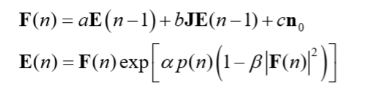

# 解説資料：CAC の振幅補正機構・採用ポンプ関数・CIM 正準更新式による統一

作成日: 2026-06-14 / 対象実装: `modules/CAC.py`(Leleu 2021) / `modules/CIM.py`・`modules/2026-06-08_CIM_pumpsched.py`
関連実験: `results/2026-06-14/pumpbench_real_cim_g22/`(本物モデルでの G22 再検証)

本資料は 3 部構成。**Part A** は CAC の誤差フィードバック($e_i$)による振幅補正の正確な仕組み。**Part B** は本物モデル実験で採用した 4 つのポンプ関数のグラフと、その違いの明示。**Part C** は CIM の正準更新式(2 式)を引き合いに、Part A・Part B が式のどの項に対応するかを統一的に整理する。

---

# Part A. CAC の振幅補正フィードバック機構

CAC は通常の CIM(振幅 $x_i$ のみ)と違い、**振幅 $x_i$ と誤差変数 $e_i$ の 2 変数**を回す。実装(`modules/CAC.py`)の式は次の 2 本である。

$$
\dot x_i=(p-1)x_i - x_i^3 + \underbrace{\beta_{\rm inj}\,e_i\,\textstyle\sum_j J_{ij}x_j}_{I_{\rm inj}\ (\text{注入項})}
\qquad\qquad
\dot e_i=-\beta_0\,(x_i^2-a)\,e_i
$$

## A-1. $e_i$ が掛かるのは「結合項」であって「振幅そのもの」ではない

実装では

```
I_inj[i] = beta_inj * e[i] * Jx[i]      # Jx = Σ_j J_ij x_j（他パルスからの結合入力）
dx = (p-1)*x - x^3 + I_inj
```

すなわち $e_i$ が掛かるのは **他パルスからの結合入力 $\sum_j J_{ij}x_j$（注入項）だけ**である。CIM でいう $F=\sqrt\eta c+Jc$ のような「全体の入力振幅」や、パルス自身の $x_i$ には掛からない。自己項 $(p-1)x_i-x_i^3$ は $e_i$ の影響を受けない。**$e_i$ は「パルス $i$ が結合からどれだけ駆動されるか」を決める“パルスごとの結合ゲイン”**である。

## A-2. 「平均化」ではなく「各パルスを共通の目標 $a$ に引き寄せる」フィードバック

補正の本体は誤差更新 $\dot e_i=-\beta_0(x_i^2-a)e_i$。誤差信号は **強度 $x_i^2$ と目標 $a$ の差**である。

| 状況 | $(x_i^2-a)$ | $e_i$ の動き | 結合駆動 $I_{\rm inj}$ | 結果 |
|---|---|---|---|---|
| 振幅が大きすぎ $x_i^2>a$ | 正 | **減る** | 弱まる | そのパルスは引き下げられる |
| 振幅が小さすぎ $x_i^2<a$ | 負 | **増える** | 強まる | そのパルスは押し上げられる |

ポイント：これは「全パルスの平均を取って平均に寄せる」明示的な平均化ではない。**各パルスが独立に、同じ目標 $a$（目標強度）へ向かうよう結合ゲイン $e_i$ が自動調整される**だけで、結果として全パルスの $x_i^2\to a$ に揃う（＝均一化が“創発”する）。

**なぜ結合ゲインを絞ると振幅が下がるのか**：CAC は $p\approx0.78<1$ で**分岐しきい下**に置かれ、自己項 $(p-1)x$ は減衰側である。振幅は結合注入 $I_{\rm inj}$ で支えられているので、$e_i$ を絞れば駆動が減ってそのパルスは下がり、$e_i$ を増やせば上がる。だから $e_i$ で各パルスの定常振幅を直接コントロールできる。

## A-3. 重要：揃えるのは強度 $x_i^2$ であって符号ではない（$\pm$ は保たれる）

「振幅を $a$ に揃える」と聞くと、$+$ と $-$ のうち片方（例：$+\sqrt a$）に集まって符号の偏りが消え、解にならないのでは、と心配になる。しかしそうはならない。**誤差が $x_i$ ではなく $x_i^2$（強度＝大きさの2乗）に対して計算される**からである。

実装の誤差は `de = -β0·(x_prev_sq - a)·e`、すなわち $(x_i^2-a)$。`alpha` のコメントも「目標振幅²の中心値」。つまり目標 $a$ は**強度 $x_i^2$ に対する目標**であり、

$$x_i^2 \to a \quad\Longleftrightarrow\quad |x_i| \to \sqrt a$$

$x_i^2$ は符号に依らず常に正なので、$+\sqrt a$ も $-\sqrt a$ も**等しく目標を満たす**。

| パルス | $x_i^2$ | 誤差 $(x_i^2-a)$ | $e_i$ |
|---|---|---|---|
| $x_i=+\sqrt a$ | $a$ | 0 | 満足（安定） |
| $x_i=-\sqrt a$ | $a$ | 0 | **同じく満足（安定）** |

$-\sqrt a$ のパルスも $x_i^2=a$ を完璧に満たすので、**フィードバックは符号に盲目**で「$+$ に寄せる」力は一切働かない。揃うのは**大きさ $|x_i|$ だけ**で、$\pm$ の内訳には手を出さない。

**符号を決めるのは結合**：自己項 $(p-1)x_i-x_i^3$ は $x_i$ の奇関数＝符号対称（1個のスピン単体では $\pm$ 等価）。$\pm$ を決めるのは反強磁性結合 $\sum_j J_{ij}x_j$ で、「隣り合うパルスは逆符号が得」という MAX-CUT 構造が各符号を引っ張り、集団は自然に $+$ 群・$-$ 群へ分かれる。

**「全部 $+$」は安定解にならない**：全同符号は cut=0 の最悪配置で、反強磁性結合がこれを能動的に不安定化する（$e_i$ は大きさしか見ないので止めはしないが、結合ダイナミクスがそこへ収束させない）。

> 大域 $Z_2$ 対称性：全スピンを同時反転すると $\sum_j J_{ij}x_j$ も反転して方程式は不変。$e_i$ は $x_i^2$ 依存でこの対称性を壊さない。よって意味を持つのは「$+$ 群と $-$ 群への分割」だけで、どちらを $+$ と呼ぶかは任意。

## A-4. 静的な均一化ではなく「動的フィードバック＋カオス探索」

均一化“だけ”ではない。同じ仕組みに 2 つの時間変化が乗っている。

- **目標 $a(t)=\alpha+\rho\tanh(\delta(H-H_{\rm opt}))$**：現在解が最良 $H_{\rm opt}$ から離れて停滞すると $a$ が上がり、振幅に強い圧をかける。
- **結合ランプ $\beta_{\rm inj}$ の成長とリセット**：$\beta_{\rm inj}$ を 0 から線形に育て、一定時間 $\tau$ 改善が無ければ 0 にリセット（再加熱）。

この 2 つが $(x,e)$ のフィードバックと組み合わさり、**準最適解を能動的に壊して探索し直すカオス的軌道**を生む。

## A-5. なぜこれが効くか（CAC の存在意義）

素の CIM は、たまたま大振幅になったパルスが結合 $\sum_j J_{ij}c_j$ を支配し、$H$ を最小化しない配置に固まる（＝**アナログ誤差／振幅不均一トラップ**）。振幅を $a$ に揃えれば、**解として意味があるのは「符号」だけ**になり、振幅の偶然で解が歪まなくなる——これが CAC の核心である。

## A-6. まとめ（誤解しやすい点の補正）

> ❌ 「入力振幅に $e_i$ を掛けて、振幅を平均化している」
>
> ✅ 「**他パルスからの結合入力 $\sum_j J_{ij}x_j$ に $e_i$ を掛け**、誤差 $(x_i^2-a)$ に基づくフィードバックで**各パルスの強度を共通目標 $a$ に引き寄せる**。結果として大きすぎ・小さすぎが消えて均一化されるが、目標 $a$ と結合ランプ $\beta_{\rm inj}$ が動的に変わるので、単なる均一化ではなく探索も駆動している」
>
> さらに「振幅を $a$ に揃える」は **強度 $x_i^2\to a$（＝大きさ $|x_i|\to\sqrt a$）** の意味であり、符号 $\pm$ には触れない。$\pm$ は反強磁性結合 $\sum_j J_{ij}x_j$ が自由に決めるので、$+$ に偏って解が潰れることはない（A-3 参照）。

---

# Part B. 採用したポンプ関数の比較

本物モデル実験（`scripts/runners/run_pumpbench_real_cim_g22.py`）の開ループ 4 条件は、**同じ端点・同じ 1500 ラウンドで、ポンプ波形の「形」だけを変えている**（[Part A の CAC は閉ループで別軸]）。図は実際の生成関数（`make_P_sched`）から描いたもの。


## B-1. 2 つの軸（電力 P と利得 g0）

ポンプは 2 層で見える。電力 $P(k)$ と、実際に分岐を駆動する利得 $g_0(k)=2\kappa L\sqrt{P(k)}$。発振しきい値は $g_0=g_{0,\rm th}=\ln(1/\eta)$、等価に $P=P_{\rm th}=37.96$ mW。両者は $g_0/g_{0,\rm th}=\sqrt{P/P_{\rm th}}$ の関係。**全条件で始点 $P/P_{\rm th}\approx0$、終点 $P/P_{\rm th}\approx1.98$（しきいの約 2 倍）を共通**にし、その間の軌道だけが違う。

## B-2. 4 関数の定義と、しきい超えラウンド

$\tau=(k+1)/K$ を正規化時間、$s(\tau)\in[0,1]$ を正規化形状とする。

| 関数 | 形状の作り方 | 利得 $g_0$ の立ち上がり | しきい超え round | 実測 best / 平均 |
|---|---|---|---|---|
| **線形利得ランプ(最良)** | $g_0\propto\tau$（g0 軸 linear, 等価に $P\propto\tau^2$） | 一様・最も緩やか | **1056（最遅）** | best 13337 / 平均 13280 |
| 線形電力ランプ(現行) | $P\propto\tau$（P 軸 linear） | 早く立ち上がる（$g_0\propto\sqrt{\tau}$ で凹） | 760 | best 13326 / 平均 13275 |
| シグモイド | $P\propto s_{\rm sig}(\tau)$（遅-速-遅） | 中央で急加速し臨界域を一気に通過 | 753 | best 13313 / 平均 13254 |
| べき乗 早上げ p=0.5 | $P\propto\tau^{0.5}$（P 軸 power） | 極端に早く立ち上がる（最も凹） | **384（最早）** | best 13306 / 平均 13247 |

## B-3. 形の違い（図の読み方）

- **左パネル（電力 $P/P_{\rm th}$）**：線形電力＝直線。線形利得＝**下に凸**（$P\propto\tau^2$ なので前半ほぼ平ら→後半急上昇）。べき乗早上げ＝**上に凸**（前半で急上昇）。シグモイド＝**S 字**（中央で急）。
- **右パネル（利得 $g_0/g_{0,\rm th}$）**：線形利得＝**直線**（定義どおり）。線形電力＝**凹**（$g_0\propto\sqrt{k}$ で早く立つ）。べき乗早上げ＝**最も凹**（最速で立つ）。シグモイド＝中央急加速。
- 各曲線上の丸が**しきい超え点**、赤破線が発振しきい値。

## B-4. 他形状との違いと、性能との対応

実測（B-2 右端）と図を重ねると、効いているレバーが読める。

- **しきいを遅く超え、利得を一様に上げる形ほど良い**：線形利得（超え 1056, best 13337）＞線形電力（760, 13326）＞べき乗早上げ（384, 13306）。**低利得での探索を長く取り、ゆっくり凍結する**ほど良い解に届く。
- **ただし“しきい超えラウンド”だけでは決まらない**：シグモイド（超え 753）は線形電力（760）とほぼ同時に超えるのに**平均で最も悪い（13254）**。原因は**臨界域の通過の速さ**——シグモイドは中央で急加速して**臨界近傍を一気に駆け抜ける**ため、対称性の破れ（符号選択）に時間をかけられず、悪い配置に凍結しやすい。
- まとめると、開ループの良し悪しは **(1) しきい超えの遅さ（＝低利得探索の長さ）と (2) 臨界域をゆっくり通過するか** の 2 点で決まる。両方を満たすのが**線形利得ランプ**で、本物模型の開ループ最良となる。
- 一方、これらの開ループ形状差は **すべて 99.6–99.84%** の範囲（best で 13306〜13337）に収まり、**形状は 2 次のレバー**にすぎない。既知ベスト 13359 に唯一肉薄する（best 13358）のは、Part A の閉ループ CAC である。

> 背景の整合性：この「しきい超えを遅らせ、過剰に上げない」という結論は、本リポジトリのポンプ関数最適化実験（2026-06-08, ペア 200 seed）の知見（g0 軸 linear が最良、シグモイド $z=-22$ で悪化）と一致する。

---

# Part C. 正準更新式（図）で全体を整理する

Part A（CAC）と Part B（ポンプ関数）は、実は CIM の**正準更新式の別々の項**に対応している。それを 1 枚で整理する。



$$\mathbf{F}(n) = a\mathbf{E}(n-1) + b\mathbf{J}\mathbf{E}(n-1) + c\,\mathbf{n}_0 \quad\text{…①(結合場の形成)}$$
$$\mathbf{E}(n) = \mathbf{F}(n)\exp\!\big[\alpha\,p(n)\big(1-\beta|\mathbf{F}(n)|^2\big)\big] \quad\text{…②(飽和つき増幅)}$$

1 周＝1 ラウンドで「①結合場をつくる → ②増幅して飽和」が起きる。

## C-1. 各項の意味

**式①（結合場の形成）**
- $a\,\mathbf{E}(n-1)$：**自己項**。ループ損失で減った自分の残り（$a=\sqrt\eta$）。
- $b\mathbf{J}\mathbf{E}(n-1)$：**相互作用項**。結合行列を通した他パルスからの入力 $\sum_j J_{ij}E_j$（MAX-CUT の問題構造はここに入る）。
- $c\,\mathbf{n}_0$：**ノイズ**（真空ゆらぎ／ASE）。
- → 合成された $\mathbf{F}(n)$ が「増幅器に入る場」。

**式②（増幅＋飽和）**
- $\alpha\,p(n)$：**ポンプ項（利得）**＝ Part B で最適化した対象。
- $(1-\beta|\mathbf{F}|^2)$：**飽和**。$|\mathbf{F}|^2$ 小→ $e^{+}$ で増幅、$|\mathbf{F}|^2>1/\beta$→ $e^{-}$ で減衰。
- 「増幅→飽和」で振幅が頭打ちになり、位相が $0/\pi$（符号 $\pm$）にロック＝イジングスピン。

## C-2. `modules/CIM.py` との対応（記号 → コード）

| 図の記号 | 意味 | コード（`modules/CIM.py`） |
|---|---|---|
| $\mathbf{E}(n)$ | round $n$ の振幅 | `c[i]` |
| $\mathbf{F}(n)$ | 結合後の場 | `coupled_in` |
| $a$ | 自己結合（損失） | `sqrt_eta`（$=\sqrt\eta$） |
| $b\mathbf{J}$ | 相互作用結合 | `Jc`（matvec, J に係数 -0.03 込み） |
| $c\,\mathbf{n}_0$ | ノイズ | `noise_i` |
| $\alpha\,p(n)$ | **ポンプ項** | $\tfrac12 g_0=\kappa L\sqrt{P(n)}$ |
| $\beta$ | 飽和係数 | `gamma`（=42.09） |
| $\lvert\mathbf{F}(n)\rvert^2$ | 強度 | `I_in = coupled_in**2` |

コードの核心 `c = exp[½·g0·(1−γ·I_in)] · coupled_in + noise` が、まさに式②（＋ノイズ）。

> 細かい注：正準式①はノイズを $\mathbf{F}$ に入れるが、実装は増幅後の $\mathbf{E}(n)$ に足す。物理的役割（ASE/真空ノイズ）は同じで、置き場所が違うだけ。

## C-3. しきい値（分岐）も式から出る

小信号（$|\mathbf{F}|^2\to0$）では②は $\mathbf{E}(n)\approx\mathbf{F}(n)\,e^{\alpha p(n)}$。①の自己項とあわせ 1 周の正味倍率は $\sqrt\eta\,e^{\alpha p(n)}$。これが 1 を超えると発振：

$$\sqrt\eta\,e^{\alpha p_{\rm th}}=1\ \Rightarrow\ 2\alpha p_{\rm th}=\ln(1/\eta)\ \Rightarrow\ g_{0,\rm th}=\ln(1/\eta),\quad P_{\rm th}=37.96\ \text{mW}$$

Part B のポンプ関数図で各曲線が赤破線（しきい）を横切る点は、まさにこの条件。

## C-4. Part A / Part B はこの 2 式のどの項か（統一）

| 触る項 | 何を変えるか | これまでの呼び名 | レバーの大きさ |
|---|---|---|---|
| 式② のポンプ項 $\alpha p(n)$ | ポンプ波形の時間軌道（開ループ） | **Part B**（線形利得/線形電力/シグモイド/べき乗） | 小（G22 で ~0.7%, 2 次レバー） |
| 式① の相互作用項 $b\mathbf{J}\mathbf{E}$ | パルスごとの誤差ゲイン $e_i$ で結合を変調（閉ループ） | **Part A**（CAC） | 大（唯一 best 13358＝既知最良$-1$に到達） |

- **Part B（ポンプ最適化）= 式② の係数 $\alpha p(n)$ の“形”選び**。$\alpha p(n)=\tfrac12 g_0=\kappa L\sqrt{P(n)}$ なので、線形利得＝ $g_0\propto n$、線形電力＝ $\alpha p\propto\sqrt n$、等。形だけ変えても効果は小さい。
- **Part A（CAC）= 式① の結合 $b\mathbf{J}\mathbf{E}$ を変調**：$b\,\mathbf{J}\mathbf{E}\to b\,(e_i\odot\mathbf{J}\mathbf{E})$、$\dot e_i=-\beta_0(x_i^2-a)e_i$。
- → **「開ループ（②の係数）＝小レバー / 閉ループ（①の結合構造）＝本丸」**という結論は、結局この 2 式の**どの項に手を入れるか**の違いに帰着する。ポンプ最適化は②の係数、CAC は①の結合構造を動かしている。

---

## 成果物

- 図: `docs/20260614/pump_schedules.png`（生成: `scripts/plotting/plot_pump_schedules.py`）
- CAC 実装: `modules/CAC.py` / ポンプ形状生成: `modules/2026-06-08_CIM_pumpsched.py`（`make_P_sched`）
- 関連: `docs/20260613/1847_CIM_vs_CAC.md`（CIM/CAC の全体比較）、`docs/20260614/1702_PumpBench_realmodel_ja.md`（本物モデル再検証論文）
