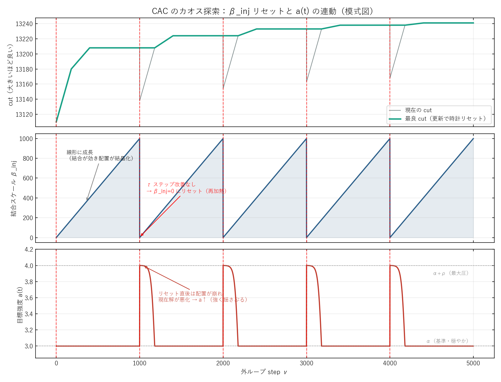

# 解説資料：CAC の「動的 $a(t)$・$\beta_{\rm inj}$ リセットによるカオス探索」

作成日: 2026-06-15 / 対象実装: `modules/CAC.py`(Leleu 2021)
前提資料: `docs/20260614/1810_CAC_feedback_and_pump_functions.md`（Part A の A-4 を本資料で掘り下げる）

A-1〜A-3 で見たのは「$e_i$ が各パルスの強度 $x_i^2$ を共通目標 $a$ に揃える（＝均一化）」という**補正**の側面だった。本資料は、CAC が均一化“だけ”でなく**探索**も駆動する 2 つの時変ノブ——**目標 $a(t)$** と **結合ランプ $\beta_{\rm inj}$ のリセット**——を詳しく説明する。

---

## 0. おさらい：2 つの時変ノブ

CAC の更新で、時間とともに変わる量は次の 2 つ。

$$
\dot x_i=(p-1)x_i-x_i^3+\underbrace{\beta_{\rm inj}(t)\,e_i\,\textstyle\sum_j J_{ij}x_j}_{I_{\rm inj}},
\qquad
\dot e_i=-\beta_0\big(x_i^2-a(t)\big)e_i
$$

- $\beta_{\rm inj}(t)$：**結合全体のスケール**（注入項 $I_{\rm inj}$ の大きさを決める）。
- $a(t)$：**目標強度**（各パルスが揃えにいく $x_i^2$ の目標）。

GSET 設定値（`compute_gset_parameters`）：$\alpha=3.0,\ \rho=1.0,\ \delta=2.6/N,\ \gamma=2/N,\ \tau=9N$。

---

## 1. $\beta_{\rm inj}$ — 結合ランプとリセット（焼きなまし＋停滞検知の再加熱）

`modules/CAC.py` の該当処理（外ループ内）：

```
beta_inj += gamma_growth          # Step7: 毎ステップ +γ で線形成長
...
if (nu - nu_c) > tau_iters:        # Step9: τ ステップ改善なし →
    nu_c = nu;  beta_inj = 0.0     #         β_inj を 0 にリセット
if H < H_opt:                      # Step10: 最良更新 →
    H_opt = H;  nu_c = nu          #         時計 ν_c をリセット（ランプ継続）
```

時計 $\nu_c$ は「最後に最良を更新した（or リセットした）時刻」。$\beta_{\rm inj}$ は毎ステップ育ち、**最後の改善から $\tau$ ステップ経っても更新が無ければ 0 に落とす**。

**物理像**（模式図のパネル2）：

| $\beta_{\rm inj}$ | 系の状態 |
|---|---|
| $\approx 0$（リセット直後） | 結合オフ。パルスはほぼ独立で、配置は崩れて自由（探索的） |
| 成長中 | 結合が効き始め、反強磁性で隣を押し分け、**配置が結晶化・符号ロック**していく → cut 改善 |
| 大（改善が続く間） | 時計が更新され続けてランプ継続 → **凍結が深まる** |
| 停滞 $\tau$ 到達 → 0 へ | **結晶化した（行き詰まった）配置の“接着剤”を外す**。配置が溶け、別の状態から再ランプ |

つまり $\beta_{\rm inj}$ は **「アニール（結合を上げて固める）→ 行き詰まったら再加熱（結合を0に落とす）→ 再アニール」** のサイクルを刻む。シミュレーテッドアニーリングの reheat に相当するが、**停滞を検知して自動でトリガー**される点が違う。

---

## 2. $a(t)$ — 動的な目標強度（適応的な揺さぶり圧）

$$
a(t)=\alpha+\rho\tanh\!\big(\delta\,(H-H_{\rm opt})\big),\qquad \Delta H=H-H_{\rm opt}\ge 0
$$

$H=K-2C$ は現在のイジングエネルギー（小さいほど良い）、$H_{\rm opt}$ はこれまでの最良。$\Delta H$ は「いまの解が最良からどれだけ離れているか」。

**2 つのレジーム**（模式図のパネル3）：

| 状況 | $\Delta H$ | $a(t)$ | 効果 |
|---|---|---|---|
| 最良にいる（良い解） | $\approx 0$ | $\to\alpha=3.0$（低） | 穏やか。落ち着いて固める |
| 最良から遠い／崩れた直後 | 大 | $\to\alpha+\rho=4.0$（高） | 強い圧。振幅を大きく駆動して揺さぶる |

$a$ を上げる＝各パルスをより大きな強度 $\sqrt a$ へ駆動する＝**系に注ぐ“エネルギー”を増やす**。要するに $a(t)$ は **「うまくいっていないほど強く揺さぶる」適応フィードバック**で、解の質 $H$ をダイナミクスへ戻している。リセット直後は配置が崩れて現在 $H$ が悪化（$\Delta H$ 大）→ $a$ 急上昇 → 脱出を後押し。良い配置に近づくと $a$ は基準へ戻り沈静する（模式図の $a$ の山）。

---

## 3. 2 つが組み合わさると「カオス探索」になる

- **$\beta_{\rm inj}$ リセット** ＝ 硬い・離散的な不安定化（接着剤除去、停滞でトリガー）。
- **$a(t)$** ＝ 連続的・適応的な不安定化（解の質に応じた揺さぶり圧）。

この 2 つが $(x,e)$ のフィードバックと噛み合い、系は**固定点に落ちない**：

- 良い解にいる間は穏やかに沈静（$a$ 低・$\beta_{\rm inj}$ 育つ → 深く凍結）。
- 停滞した瞬間に両機構が発動（$\beta_{\rm inj}=0$・$a\uparrow$）→ 配置を壊して再探索。

結果、軌道は**非周期的で初期条件に鋭敏**——これが「カオス」（Chaotic Amplitude Control の名の由来）。ただし**確率的な乱択ではなく、決定論的だが複雑な軌道**である点に注意。

---

## 4. 模式図（読み方）



赤い縦破線がリセット時刻（3 パネル共通）。

- **上（cut）**：緑＝最良 cut（階段状に更新）、灰＝現在 cut。リセット直後に現在 cut が一度落ち（配置が崩れる）、$\beta_{\rm inj}$ の再成長で回復し、しばしば新しい最良へ。
- **中（$\beta_{\rm inj}$）**：サワトゥース。0 から線形成長 → 停滞 $\tau$ でリセット → また 0 から。
- **下（$a(t)$）**：リセット直後に $\alpha+\rho$ 付近まで跳ね上がり（強く揺さぶる）、最良へ近づくと $\alpha$ へ戻る（穏やか）。

> これは概念図。実際の run の $\beta_{\rm inj}/a(t)/$cut トレースは `run_cac_viz`（AHC 風プレーヤー）で再生できる。

---

## 5. なぜ「ランダム再スタート」より効くのか

「停滞したら壊して再探索」だけならランダム再スタートと同じに見えるが、CAC は次の点で賢い。

1. **記憶を引き継ぐ**：リセットするのは $\beta_{\rm inj}$（結合スケール）だけで、**$e_i$（各パルスの結合ゲイン＝振幅補正の“記憶”）は保持**される。前のアニールスイープで学習した「どのパルスをどれだけ結合させるか」を引き継いで再探索する。ランダム再スタートは毎回ゼロから無記憶。
2. **タイミングを適応的に選ぶ**：停滞検知（$\tau$）で「行き詰まったときだけ」壊す。改善が続く間は壊さず深掘りする。
3. **揺さぶりの強さを質で変える**：$a(t)$ が解の質 $\Delta H$ に応じて圧力を調整する。

→ 構造（$e_i$, $H$）を使って **「いつ・どれだけ壊すか」を決める再探索**。これが「SA の単純ランダム探索より効率的に解空間を訪問する」の中身である。

---

## 6. これまでの検証との接続

- この探索性こそが、本物モデルの G22 で **CAC が唯一 best 13358（既知最良$-1$）に届いた**源泉（分布の右裾）。
- ただし **平均は底上げしない**（最良開ループと統計的に同等, p=0.72）。探索が「**稀に深く当たる**」性格であることを意味する。
- 次研究の論点「右裾を平均へ引き上げる」「multi-start で裾を引く」「局所探索 tail で near-miss を BKS に変換」は、まさにこの $a(t)/\beta_{\rm inj}$ 探索の**当たりをどう確実化するか**という問いに直結する。

---

## 成果物・関連

- 図: `docs/20260615/cac_dynamics_schematic.png`（生成: `scripts/plotting/plot_cac_dynamics_schematic.py`）
- 実装: `modules/CAC.py`（Step7/9/10 が本資料の機構）/ 実トレース再生: `scripts/plotting/run_cac_viz.py`
- 前提: `docs/20260614/1810_CAC_feedback_and_pump_functions.md`（A-1〜A-3：$e_i$ による振幅補正）
