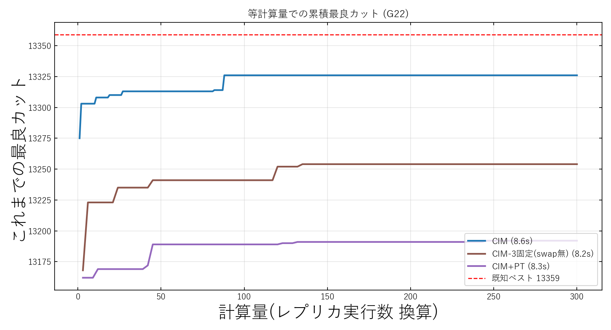
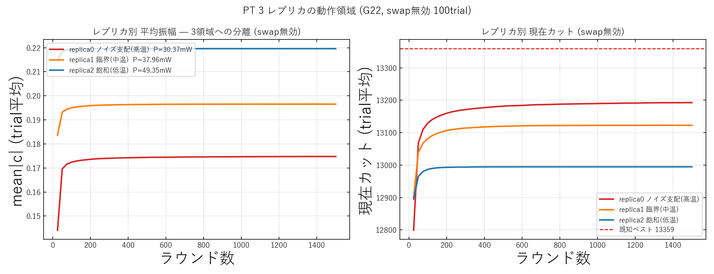

# CIM に PT を入れてもうまくいかなかった理由

## 定義

- **CIM(Coherent Ising Machine)**: 光パラメトリック発振器のネットワークでイジング問題(ここでは MAX-CUT)を解く装置。ポンプ光の利得を上げると各スピンの振幅 `c` が発振し、その符号(±)が解になる。通常はポンプを徐々に上げる(**ランプ**)ことで良い解へ凍結させる。
- **PT(Parallel Tempering, 並列焼きなまし)**: 温度の違う複数の **レプリカ** を同時に走らせ、隣り合うレプリカの状態を **Metropolis 判定** で交換する手法。高温レプリカが広く探索し、見つけた良い配置を低温レプリカへ流して固める、というのが狙い。
- 今回の実装: ポンプをランプさせず、しきい値 `P_th` の前後 3 段(高温=ノイズ支配 / 中温=臨界 / 低温=飽和)で固定した 3 レプリカを回し、定常カット差から逆温度 β を較正してスワップした。

## 結果

等計算量で比べると **CIM+PT(紫)が 3 手法で最下位**(平均 13156 < swap 無 13193 < ランプ CIM 13276)。PT を足すほど悪化した。

## うまくいかなかった理由

決定的なのが下図右の **温度と解質の逆転** である。

PT が成り立つ前提は「低温レプリカほど良い解(高カット)を持つ」こと。ところが CIM では逆で、**高温(ノイズ支配)レプリカが最高カット、低温(飽和)レプリカが最低カット**になっている。低温側は振幅が早く飽和して悪い配置に凍結してしまうためだ。

つまり CIM は熱平衡をサンプルする系ではなく非平衡力学系で、ポンプ準位に対応する真の温度・エネルギーが存在しない。β は人工的に較正した代用物にすぎず詳細釣り合いを満たさない。その結果スワップは良い配置を悪い低温側へ流して汚し、ランプ CIM が本来持つ「徐々に凍結する」利点も壊してしまった。これが PT を入れて性能が下がった理由である。
