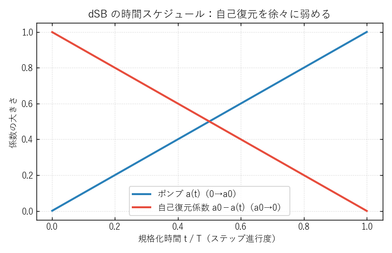
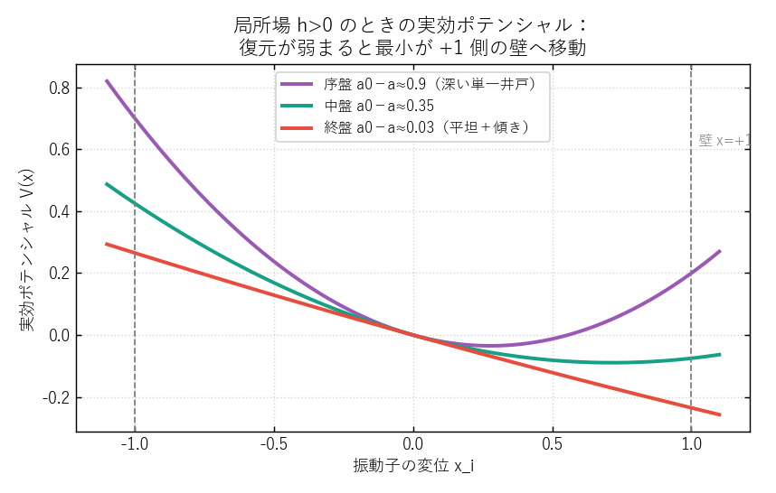
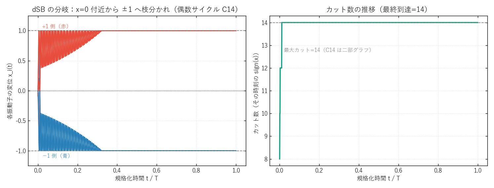

# dSB（離散シミュレーテッド分岐法）アルゴリズム 詳細解説

*対象: 本リポジトリ `modules/SB.py` の `dSB`（discrete Simulated Bifurcation）。*
*PACE 論文で「全インスタンス平均で最も信頼できる単体ソルバ（平均相対 gap 0.192%）」となった手法。*
*式・パラメータはすべて実装（`modules/SB.py`）に忠実。出典: Goto et al., Science Advances 2019 / 2021。*

---

## 0. 30 秒でわかる dSB

- **何をするか**: MAX-CUT（イジング基底状態探索）を、**N 個の古典振動子（バネ付きの玉）の運動方程式を時間積分する**ことで解く。
- **核心アイデア**: 各スピンを 1 個の振動子 $x_i$ で表す。最初は全員 $x_i\approx 0$。時間とともに系を不安定化させると、$x_i$ が **$+1$ か $-1$ のどちらかに「枝分かれ（分岐, bifurcation）」**する。どちらに分かれるかは結合 $J_{ij}$（＝グラフの辺）が決め、結果として**カットの大きい配置**に落ち着く。
- **dSB の "d"**: 振動子間の力を伝えるときに、相手の生値 $x_j$ ではなく**符号 $\mathrm{sign}(x_j)\in\{-1,+1\}$ を使う（離散化）**。これだけで精度が大きく上がる。
- **強み**: 単純な 3 本の更新式の繰り返しだけ。GPU/SIMD/Numba で**並列化しやすく速い**。本研究では密・疎・大規模すべてで安定して上位。

---

## 1. 前提: MAX-CUT とイジング模型

無向グラフ $G=(V,E,w)$ の MAX-CUT は、頂点を 2 グループに分け**またぎ辺の総重みを最大化**する問題：
$$
C(s)=\tfrac{1}{2}\sum_{(i,j)\in E} w_{ij}\,(1-s_i s_j),\qquad s_i\in\{-1,+1\}.
$$
これは結合行列 $J$ をもつ**イジングエネルギーの最小化**と等価：
$$
H(s)=-\tfrac{1}{2}\sum_{i,j} J_{ij}\,s_i s_j .
$$
本リポジトリでは `build_coupling_matrix(n, edges, coupling=-1.0, weights)` で $J_{ij}=-w_{ij}$（辺の重みに $-1$ を掛けたもの）を作ります。あとは「$H$ を最小化する $\pm1$ 配置 $s$」を見つければよく、**dSB はこの $s$ を物理シミュレーションで近似的に探します**。最後に各手法共通の重み付きカット関数で採点します。

---

## 2. SB の物理的アイデア: スピンを振動子に置き換える

SB は各スピン $i$ を、**位置 $x_i$ と運動量 $y_i$ をもつ 1 個の古典振動子**で表します（バネに繋がれた玉のイメージ）。系全体は次のハミルトニアンに従って動きます（dSB/bSB の場合, 概念式）：
$$
H_{\text{SB}}=\frac{a_0}{2}\sum_i y_i^2 \;+\; \sum_i V_i(x_i)\;-\;c_0\sum_{i,j} J_{ij}\,x_i\,(\cdots)
$$

ポイントは **2 種類の力のせめぎ合い**です：

1. **自己復元力** $-(a_0-a(t))\,x_i$ … 各玉を中心 $x_i=0$ に引き戻すバネ。係数 $(a_0-a(t))$ は**時間とともに弱くなる**（後述）。
2. **結合力** $+c_0\sum_j J_{ij}\,\mathrm{sign}(x_j)$ … 隣の玉の符号に応じて、この玉を $+$ 側か $-$ 側へ押す力。グラフの辺がこれを作る。

最初は復元力が強く、全員 $x_i\approx0$ で身動きが取れません。時間が進むと**復元力を徐々に抜いていく**ので、最後は結合力だけが残り、各玉は**隣との関係が最も「安定」になる方向（＝イジングエネルギーが低い方向）**へ $\pm1$ に振り分けられます。これが「分岐」です。

### 時間スケジュール（実装に忠実）
実装では分岐パラメータ $a(t)$ を $0\to a_0$ へ線形に増やします。第 $k$ ステップ（全 $N_{\text{step}}$ ステップ）で
$$
a(t_k)=\frac{k+1}{N_{\text{step}}}\,a_0,\qquad\text{よって自己復元係数}\quad a_0-a(t_k):\; a_0 \to 0 .
$$
つまり**バネの強さを $a_0$ から $0$ まで滑らかに緩める**スケジュールです。



---

## 3. なぜ $\pm1$ に分かれるのか: 実効ポテンシャルの図

結合をいったん「外からかかる一定の力 $h_i=c_0\sum_j J_{ij}\mathrm{sign}(x_j)$（局所場）」とみなすと、玉 $i$ が感じる実効ポテンシャルは
$$
V_i(x)=\tfrac{1}{2}\,(a_0-a(t))\,x^2 \;-\; h_i\,x ,\qquad |x|\le 1\ (\text{壁拘束}).
$$

- **序盤**（$a_0-a\approx a_0$）: 二次の井戸が深く、最小は $x=0$ 近く。玉はほとんど動けない。
- **中盤**: 井戸が浅くなり、傾き $-h_i x$ の効果が効いて最小が片側へずれる。
- **終盤**（$a_0-a\approx0$）: 井戸がほぼ消え、ポテンシャルは傾いた直線に近づく。最小は**局所場 $h_i$ の符号側の壁（$+1$ か $-1$）**へ移動 → 玉はその壁に貼り付く。



各玉の最終符号は「自分の周りの玉の符号が作る局所場 $h_i$ の向き」で決まります。全員が同時にこれを満たそうとすると、系全体は**イジングエネルギーの低い（＝カットの大きい）配置**へ向かいます。

---

## 4. 運動方程式と離散化（dSB の本体）

### 連続形（dSB）
$$
\dot{x}_i = a_0\,y_i,\qquad
\dot{y}_i = -\big(a_0-a(t)\big)\,x_i \;+\; c_0\sum_{j} J_{ij}\,\mathrm{sign}(x_j).
$$
bSB との違いは**結合に $\mathrm{sign}(x_j)$ を使う**点だけ（次節）。

### 離散形（シンプレクティック・オイラー法, 実装の通り）
各ステップ $k$（刻み幅 $\Delta t=$ `dt`）で、**$y$ を先に更新してから $x$ を更新**します（シンプレクティック＝エネルギーが暴れにくい数値積分）：

$$
\begin{aligned}
&\text{(局所場)}\quad (Jx)_i=\sum_{j\in N(i)} J_{ij}\,\mathrm{sign}(x_j)\\
&\text{(運動量)}\quad y_i \leftarrow y_i + \Delta t\big[-(a_0-a(t_k))\,x_i + c_0\,(Jx)_i\big]\\
&\text{(位置)}\quad x_i \leftarrow x_i + \Delta t\,a_0\,y_i\\
&\text{(壁拘束)}\quad |x_i|>1 \Rightarrow x_i \leftarrow \mathrm{sign}(x_i),\ \ y_i \leftarrow 0
\end{aligned}
$$

- **壁拘束**: 玉が $|x|=1$ を越えたら壁で止め、運動量を 0 にする（行き過ぎを防ぎ、$\pm1$ に収束させる仕掛け）。
- **読み出し**: 任意時刻のスピンは $s_i=\mathrm{sign}(x_i)$。実装は**毎ステップ重み付きカットを計算し、これまでの最良配置を保持**（anytime に良い解を返せる）。

### 実際の分岐の様子（小インスタンスで dSB を実走）
偶数サイクル $C_{14}$（二部グラフなので最大カット $=14$）で dSB を回すと、$x_i$ が $0$ 付近から $\pm1$ へきれいに枝分かれし、カットが最大値へ駆け上がります。



---

## 5. 3 つの変種: aSB → bSB → dSB

SB には連続的な改良の歴史があり、`modules/SB.py` は 5 変種（加熱版含む）を実装しています。中核は次の 3 つ：

| 変種 | 運動量の力 $\dot y_i$ | 振動の抑え方 | 結合に使う量 | ひとこと |
|---|---|---|---|---|
| **aSB**（断熱) | $-[(a_0-a)+K x_i^2]\,x_i + c_0\sum_j J_{ij}x_j$ | **Kerr 非線形項** $Kx^3$ | $x_j$（生値） | 元祖。滑らかだが精度は控えめ |
| **bSB**（弾道) | $-(a_0-a)\,x_i + c_0\sum_j J_{ij}x_j$ | **壁拘束** $\lvert x\rvert\le1$ | $x_j$（生値） | Kerr を壁に置換、高速 |
| **dSB**（離散) | $-(a_0-a)\,x_i + c_0\sum_j J_{ij}\,\mathrm{sign}(x_j)$ | **壁拘束** $\lvert x\rvert\le1$ | $\mathrm{sign}(x_j)$ | **結合を符号に離散化 → 精度向上** |

### なぜ dSB（符号化）が効くのか
bSB は結合に**連続値 $x_j$** を使うため、まだ $0$ 近くで定まっていない玉の「中途半端な値」が力に混ざり、解の質を濁します。dSB は $\mathrm{sign}(x_j)\in\{-1,+1\}$ を使うので、**力が常に「最終的な離散スピン $\pm1$ が作る局所場」に一致**します。これにより、連続ダイナミクスと最終的な離散問題（イジング）とのズレが減り、Goto 2021 が報告するとおり精度と頑健性が上がります。本研究でも dSB は全インスタンスで安定上位でした（第 8 節）。

> 補足: 加熱版 **HbSB / HdSB** は、壁で $y=0$ にされた玉を再び動かすため、壁拘束の「後」に $+\gamma\,y(t_k)\,\Delta t$ を足します（Goto 2021 Eq.22）。本研究の標準は無加熱の dSB です。

---

## 6. パラメータと自動設定

| 記号 | 実装名 | 役割 | 既定/推奨 |
|---|---|---|---|
| $a_0$ | `a0` | 分岐の到達点・運動の速さ | $1.0$ |
| $\Delta t$ | `dt` | 積分の刻み幅 | $0.5$ |
| $N_{\text{step}}$ | `num_steps` | 総ステップ数（主要な計算量ノブ＝予算） | 予算グリッド $150\!\sim\!15000$ |
| $c_0$ | `c0` | 結合力の強さ | **自動**（下式） |
| `init_scale` | 初期 $x,y$ の振幅 | $0.1$ |
| $K$ | `K` | Kerr 係数（**aSB のみ**） | $1.0$ |

**結合強度の自動決定**（Goto 2021 推奨, `auto_c0`）:
$$
c_0=0.5\sqrt{\dfrac{N-1}{\sum_{i,j} J_{ij}^2}}.
$$
結合の総量でスケールを正規化するので、グラフの密度・重みが変わっても結合力が暴れません。

### 本研究での調整（公平性プロトコル）
PACE では全 6 手法をインスタンスごとに Optuna で調整します。dSB の探索空間は **variant・$\Delta t$・$a_0$・$c_0$**（表 2）。実行は `algo_registry.run_sb` が `variant="dSB", a0=1.0, dt=0.5`、$c_0$ は `auto_c0` を既定に、Optuna 上書きがあればそれを使います。

---

## 7. 擬似コード

```
アルゴリズム: dSB (discrete Simulated Bifurcation)
入力: イジング結合 J (J_ij = -w_ij), 頂点数 N, ステップ数 N_step,
      a0, dt, c0 = 0.5 sqrt((N-1)/Σ J_ij^2)
出力: スピン配置 s（best-of トラッキング）

各 trial を並列に:
  x_i, y_i <- 一様乱数(±init_scale)          # 全員ほぼ 0 から開始
  best <- -∞
  for k = 0 .. N_step-1:
      a_t   <- (k+1)/N_step * a0              # ポンプ 0→a0
      a_dif <- a0 - a_t                       # 自己復元 a0→0
      for i:  (Jx)_i <- Σ_{j∈N(i)} J_ij * sign(x_j)   # 符号で結合（dSB）
      for i:  y_i <- y_i + dt*( -a_dif * x_i + c0*(Jx)_i )   # 運動量
      for i:  x_i <- x_i + dt*a0*y_i                          # 位置
      for i:  if |x_i|>1: x_i <- sign(x_i); y_i <- 0          # 壁
      cut <- Σ_{(i,j)∈E} w_ij * [ sign(x_i) ≠ sign(x_j) ]     # 重み付きカット
      if cut > best: best <- cut;  s <- sign(x)               # 最良を保持
  return s
```

1 ステップの計算量は $O(|E|)$（結合）。全体で $O(N_{\text{step}}\,|E|)$。trial（複数初期値）は完全並列です。

---

## 8. 本研究（PACE）での dSB の位置づけと性能

すべての手法をインスタンスごとに Optuna 調整し、同一の重み付きカットで採点した結果（小さいほど良い、各列の最良が dSB の箇所を太字）：

| 指標 | G22 | K2000（密） | G55 | G70 | 平均相対 gap |
|---|---:|---:|---:|---:|---:|
| dSB の絶対 gap | 1 | 59 | **15** | **42** | **0.192%** |
| dSB のベスト到達時間 | 1.16s | 10.08s | 2.87s | 1.91s | — |
| dSB が gap≤0.5% に到達 | 0.03s | 10.08s | 0.20s | 1.91s | — |

- **最も信頼できる単体ソルバ**: 4 インスタンス平均の相対 gap が **0.192%** で全手法中最小。どこでも大崩れしない。
- **大規模疎グラフの勝者**: G55（gap 15）・G70（gap 42）で単体トップ。
- **時間効率も最良**: 密な K2000 でも **10 秒で gap 59**（物理ソルバ CIM/CAC は数十秒かけても gap 800〜1000 の壁）。「速くて正確」を一貫達成。
- **ハイブリッドの精錬器の良き相方**: 物理ソルバ（CIM/CAC）の探索結果を Tabu Search で磨く構図に対し、dSB は**単体で完結して強い**点が際立つ。

> 詳しい時間推移は同梱の `results/.../paper/qa_v2/gap_vs_time_v1.png`（相対 gap 対 対数時間）を参照。K2000 で dSB と GA だけが急降下し、CIM・CAC・PT-ICM が高い棚で停滞する様子が一目で分かります。

---

## 9. 長所・短所・他手法との比較

**長所**
- 更新が単純な 3 本の式 → **ベクトル化・並列化が容易**（Numba `prange`、GPU 向き）。
- 連続ダイナミクスなのに、符号離散化（dSB）で**離散問題とのズレが小さい**。
- 密・疎・大規模を問わず**安定**（本研究の最大の美点）。

**短所・注意**
- $\Delta t$ が大きすぎると数値発散・激しい振動（シンプレクティックでも限界あり）。本研究は $\Delta t=0.5$ で安定確認。
- 完全に最適解を保証する手法ではない（あくまでヒューリスティック）。本研究でも G22 では GA に 1 カット届かず。
- 単一の良解を「磨き上げる」局所探索ではないので、**最後に Tabu Search 等で仕上げる**とさらに良くなる場合がある。

**他手法との関係**
- **CIM/CAC（物理ソルバ）**: 同じ「連続ダイナミクスで分岐」系だが、CIM は光パラメトリック発振の飽和、CAC は誤差変数による振幅補正を使う。dSB は**古典力学＋符号離散化**でソフトウェア実装が素直、かつ密インスタンスで CIM/CAC より頑健。
- **SA / Tabu Search**: こちらは「1 スピンずつ反転する離散局所探索」。dSB は**全スピンを同時に連続更新**する点が根本的に異なる（並列性が高い）。
- **GA（メメティック）**: 集団＋交叉＋Tabu の重量級。小〜中規模で最良だが大規模では世代予算不足になりやすい。dSB は**軽量で大規模スケール時の安定性**に勝る。

---

## 10. 実装メモ（`modules/SB.py`）

- `@njit(parallel=True)` で trial 並列。`NUMBA_NUM_THREADS=4` 推奨（スレッド過剰購読対策）。
- 結合 $J$ は CSR 疎行列（`J.data/indices/indptr` を手書きループ）。密 K2000 でも辺リストで走る。
- **重み付きカットで採点**: `edge_w` を使い、$\pm1$ 重みの K2000 でも正しく評価（非重みグラフは $+1$）。
- 公開 API: `simulate_sb_batch(n, J, edges, num_steps, num_trials, *, variant="dSB", a0=1.0, dt=0.5, c0=None, weights=..., seeds=...)`。`c0=None` なら `auto_c0(J, n)`。

---

## 参考文献
- H. Goto, K. Tatsumura, A. R. Dixon, "Combinatorial optimization by simulating adiabatic bifurcations in nonlinear Hamiltonian systems," *Science Advances* **5**, eaav2372 (2019).
- H. Goto et al., "High-performance combinatorial optimization based on classical mechanics," *Science Advances* **7**, eabe7953 (2021).（bSB / dSB の提案）

---

## 付録: 本解説の生成物
- 図: `docs/dSB_figs/{ramp,potential,trajectory}_v1.png`（生成: `scripts/plotting/plot_dsb_concept_figs.py`）。
- trajectory 図は `modules/SB.py` の dSB 更新式を小インスタンスで忠実に再現したもの。
