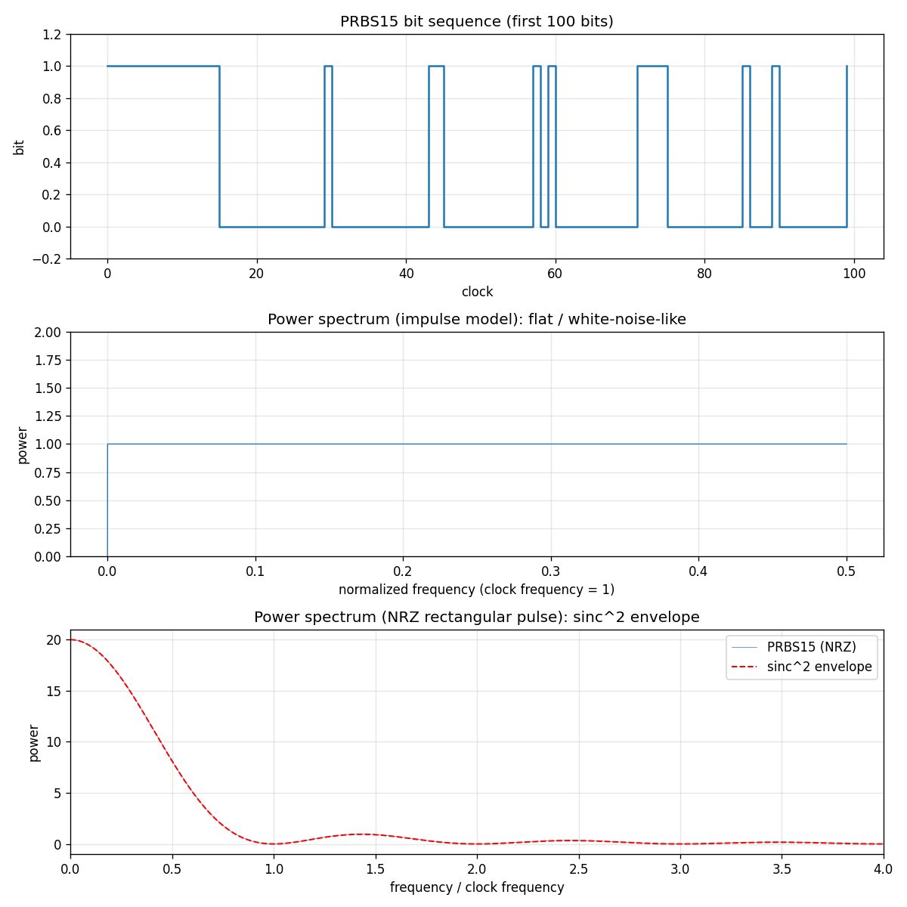
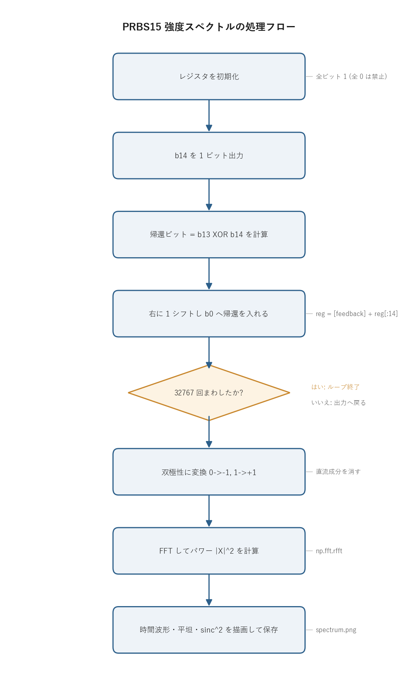
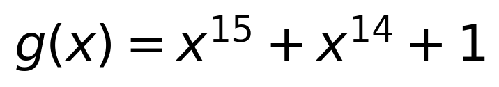
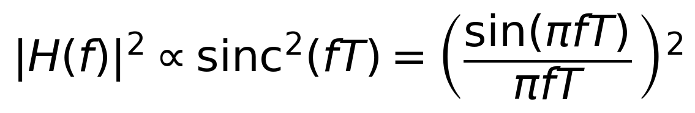

# 問題1: PRBS の生成と強度スペクトル

## 問題

光ファイバ通信で送信データの代わりに使う **PRBS (pseudo random bit sequence, 擬似ランダムビット系列)** を生成する。15 ビットのシフトレジスタ (LFSR) を使い、1 クロックごとに次の操作をする。

- レジスタを **右に 1 ビットシフト**
- 最高次ビット **b14 を出力**
- 最低次ビット **b0 に b13 XOR b14 を入力**

この操作を `2^15 − 1 = 32767` 回繰り返すとレジスタが初期値に戻る。つまり **周期 32767 ビットの PRBS** が得られる。1 周期分を生成し、強度スペクトルを図示する。

## 実行結果(出力)

```
周期           : 32767 ビット
1 の個数       : 16384  (理論値 2**14 = 16384)
0 の個数       : 16383
先頭 32 ビット : 11111111111111100000000000000100
1 周期後に初期状態へ復帰: True
スペクトル図を保存しました: .../problems/01_prbs15/spectrum.png
```

生成された図(時間波形・平坦スペクトル・sinc² スペクトルの 3 段):



> **図の読み方**
> - **上段**: PRBS の時間波形(先頭 100 ビット)。0/1 が不規則に並ぶ。
> - **中段**: インパルスモデルの強度スペクトル。直流以外は高さ約 1 で平坦になり、白色雑音に近い。
> - **下段**: NRZ 矩形パルスの強度スペクトル。線スペクトル群が sinc² 包絡線(赤破線)を埋め、クロック周波数の整数倍でヌルになる。

---

## 0. 処理の流れ

`solution.py` を実行すると、次の順で処理が進む。



前半(初期化からループ終了まで)が LFSR による系列生成、後半が双極性変換と FFT によるスペクトル計算にあたる。生成と解析が一本道でつながっていて、分岐はループ終了判定の 1 箇所だけになる。

---

## 1. 仕組み: 線形帰還シフトレジスタ (LFSR)

レジスタの状態を `b0, b1, ..., b14`(b14 が出力側)とする。1 クロックの動作は次の 3 つ。

```
出力        = b14
帰還ビット  = b13 XOR b14
シフト      = [b0..b13] を 1 つ右へ送り、空いた b0 に帰還ビットを入れる
```

新しい状態は次のようになる。

```
b0' = b13 XOR b14   (帰還)
b1' = b0
b2' = b1
 ...
b14' = b13
```

`XOR` は mod 2 の足し算なので、この回路は **GF(2)(2 元体)上の線形漸化式**になっている。帰還に使うビット(タップ)が 13 と 14 の位置にあり、対応する **生成多項式**は



である。

### なぜ周期が 2^15 − 1 になるのか

15 ビットのレジスタが取りうる状態は `2^15 = 32768` 通り。ただし **全 0 状態は XOR しても全 0 のまま**なので、ここに入ると抜け出せない(禁止状態)。残る `2^15 − 1 = 32767` 通りを 1 つも欠かさず巡回できれば周期が最大になる。

これが起きるのは生成多項式が **原始多項式 (primitive polynomial)** のときに限る。`x^15 + x^14 + 1` は GF(2) 上の原始多項式として知られていて、得られる系列を **M 系列 (maximal-length sequence)** と呼ぶ。コードでは「1 周期回すと初期状態(全 1)に戻る」ことを実際に確認している。

全 0 だけが禁止なので、初期値は 0 以外なら何でもよい(このコードでは全ビット 1 で始める)。

---

## 2. M 系列の性質(プログラムで確認できること)

長さ `N = 2^15 − 1` の M 系列には次の性質がある。

| 性質 | 内容 | 本問での値 |
| ---- | ---- | ---------- |
| 平衡性 (balance) | 1 周期中の「1」の数は「0」の数より 1 個だけ多い | 1 が `2^14 = 16384` 個、0 が `16383` 個 |
| 自己相関 | 1 周期ずらした相関は、ずれ 0 で `N`、それ以外は `−1` | ほぼ理想的な鋭いピーク |
| ランレングス | 連続する同符号の長さの分布が乱数的 | 図(先頭 100 ビット)参照 |

平衡性と、ほぼ −1 一定の自己相関の 2 つが、PRBS が「周期内ではランダム雑音のように見える」根拠になる。

---

## 3. 強度スペクトル

ここでいう強度スペクトルはパワースペクトル `|FFT|^2` のこと。コードでは見方を 2 つ示している。

### (a) インパルスモデル(1 ビット = 1 サンプル): 平坦スペクトル

各ビットを瞬時値とみなして FFT すると、M 系列ではほぼすべてのスペクトル線が等しい高さになる(直流成分だけは平衡性によりほぼ 0)。これは自己相関がほぼ δ 関数であることのフーリエ対応で、全周波数へほぼ均一にエネルギーが広がっていることを意味する。図の中段が平坦になるのはこのため。

双極性 (0→−1, 1→+1) に変換してから FFT している。こうすると直流が消えて、広帯域成分が見やすくなる。

### (b) NRZ 矩形パルスモデル: sinc² 包絡線

実際に光ファイバを伝送するのは、各ビットを 1 ビット時間だけ保持した **NRZ 矩形パルス**波形。幅 T の矩形パルスのフーリエ変換は sinc 関数なので、パワースペクトルの包絡線は



となり、**クロック周波数の整数倍でヌル(0)**になる。図の下段で、PRBS のスペクトル線群が sinc² 包絡線(赤破線)を埋めているのが分かる。第 1 ヌルがクロック周波数 = 1 に来ていて、信号帯域の目安になる。

(a) と (b) は矛盾しない。(a) の「白色的な多数の線スペクトル」に、(b) の「パルス整形による sinc² 包絡線」が掛かったものが、実際の送信スペクトルにあたる。

---

## 4. 関数ごとの詳細

`solution.py` には 3 つの計算関数と `main` がある。それぞれ引数・戻り値・内部処理を順に見ていく。

### `generate_prbs15(initial_state=None)`

LFSR を 1 周期まわして出力ビット列を返す関数。

| 項目 | 内容 |
| ---- | ---- |
| 引数 | `initial_state`: レジスタ b0..b14 の初期値(0/1 の長さ 15 リスト)。省略時は全ビット 1。 |
| 戻り値 | `(output, reg)`。`output` は長さ 32767 の `int8` 配列、`reg` はシフト後の最終レジスタ状態。 |

内部の流れ。

1. 初期状態を決める。`initial_state` が `None` なら `reg = [1]*15`。指定があれば長さ 15 かどうか、全 0 でないかを確認し、全 0 なら `ValueError` を投げる(全 0 に入ると系列が出ないため、ここで弾く)。
2. 出力用に `output = np.empty(32767, dtype=np.int8)` を確保する。
3. 32767 回ループする。各回で次をやる。
   - `output[i] = reg[14]`(b14 を出力)
   - `feedback = reg[13] ^ reg[14]`(b13 XOR b14)
   - `reg = [feedback] + reg[:14]`(右シフト+帰還)
4. ループ後の `reg` を `output` と一緒に返す。

`reg = [feedback] + reg[:14]` の 1 行が「右に 1 シフトして b0 に帰還を入れる」を表す。`reg[:14]` が古い b0..b13 で、その先頭に新しい b0(=feedback)を付け、b14 は捨てる(すでに出力済み)。リストの作り直しで毎クロック新しい状態を作っているので、元のレジスタを書き換えてはいない。

### `line_spectrum(bits)`

インパルスモデル(1 ビット = 1 サンプル)の強度スペクトルを計算する。

| 項目 | 内容 |
| ---- | ---- |
| 引数 | `bits`: 0/1 のビット列(ndarray)。 |
| 戻り値 | `(freq, power)`。`freq` は正規化周波数 `[0, 0.5]`、`power` はパワー。 |

処理は 3 行。

1. `signal = 2.0 * bits - 1.0` で双極性 (0→−1, 1→+1) に変換する。これで直流が消える。
2. `spectrum = np.fft.rfft(signal)` で実数入力用 FFT をかける。`rfft` は対称な後半を計算しないぶん速い。
3. `power = |spectrum|^2 / len(signal)` でパワーに直し、`freq = np.fft.rfftfreq(len(signal))` で周波数軸(クロック = 1 の正規化)を作る。

M 系列ではここで得られる `power` がほぼ平坦になる。

### `nrz_spectrum(bits, samples_per_bit=20)`

NRZ 矩形パルスとして送ったときの強度スペクトルを計算する。

| 項目 | 内容 |
| ---- | ---- |
| 引数 | `bits`: ビット列。`samples_per_bit`: 1 ビットを何サンプルで保持するか(矩形パルスの幅)。 |
| 戻り値 | `(freq, power)`。`freq` はクロック周波数を 1 とした周波数。 |

`line_spectrum` との違いは、FFT の前に **`np.repeat(signal, samples_per_bit)` で各ビットを複製して矩形パルスにする**ところ。1 ビットを 20 サンプル続けることで、幅 T のパルスを作っている。サンプリング周波数がクロックの `samples_per_bit` 倍になるので、最後に `freq` を `samples_per_bit` 倍してクロック単位に直す。この矩形パルスの効果で、包絡線が sinc² 形になりクロックの整数倍でヌルになる。

### `main()`

全体をつなぐ関数。

1. `generate_prbs15()` で系列と最終レジスタを得る。
2. 1 の個数・0 の個数・先頭 32 ビットを表示し、平衡性(1 が 16384 個)を確認する。
3. `final_reg == [1]*15` で、1 周期後に初期状態へ戻ることを確認する。
4. `line_spectrum` と `nrz_spectrum` を呼ぶ。
5. matplotlib で 3 段(時間波形 / 平坦スペクトル / sinc² スペクトル)の図を作り、`spectrum.png` に保存する。図のラベルは日本語フォントに依存しないよう英語にしている。

---

## 5. 実行

```bash
python solution.py
```

標準出力は冒頭の「実行結果(出力)」、生成図は `spectrum.png` を参照。処理フロー図 `flow.png` は `python make_flow.py` で作り直せる。

---

## 6. 計算量

- 系列生成: `O(N)`(`N = 32767`。Python のループでも一瞬で終わる)
- FFT: `O(M log M)`(`M` はサンプル数。NRZ は `N × samples_per_bit` 点)

ビット生成は NumPy のビット演算でベクトル化もできるが、LFSR は前の状態に依存する逐次処理なので、ここでは可読性を優先して素直なループにしている。
