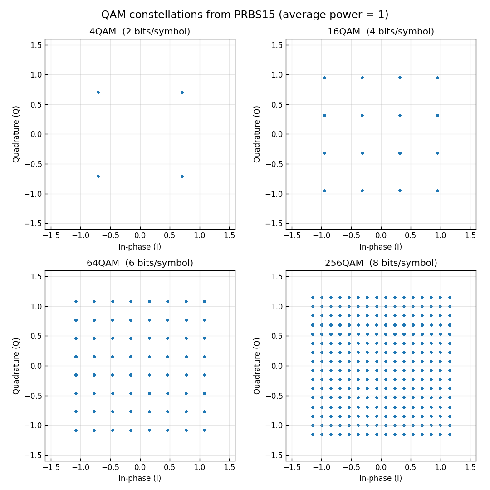
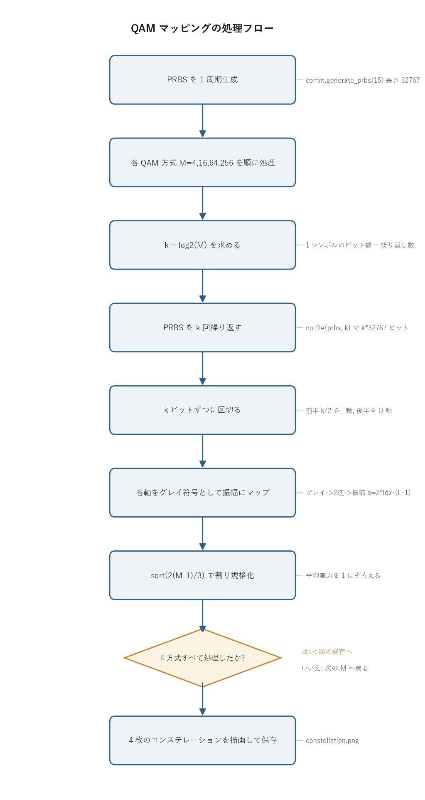

# 問題1-2: PRBS から QAM シンボルへの変換(QAMマッピング)

## 問題

問1で作った周期 32767 ビットの PRBS を $k$ 回繰り返し、グレイ符号化された
4QAM / 16QAM / 64QAM / 256QAM のシンボル列へ変換する。シンボル数はいずれも
$2^{15}-1 = 32767$ とする。繰り返し数 $k$ は QAM の次数(1シンボルあたりのビット数)に等しく、

| 方式 | 1シンボルのビット数 $k$ | 1軸のレベル数 $L=\sqrt{M}$ |
| ---- | --- | --- |
| 4QAM | 2 | 2 |
| 16QAM | 4 | 4 |
| 64QAM | 6 | 8 |
| 256QAM | 8 | 16 |

平均強度(平均シンボル電力)が 1 になるよう規格化し、コンステレーション(複素平面の散布図)を確認する。
このビット列からシンボル列への変換を QAMマッピングと呼ぶ。

> 記号について: 問題文では繰り返し数を $M$ と書いているが、QAMの多値数(4,16,64,256)と
> 紛らわしいので、ここでは多値数を $M$、1シンボルのビット数(=繰り返し数)を $k=\log_2 M$ と書く。

## 実行結果(出力)

```
PRBS 周期        : 32767 ビット
  4QAM: ビット/シンボル=2, シンボル数=32767, 平均電力=1.0000, I軸レベル数=2
 16QAM: ビット/シンボル=4, シンボル数=32767, 平均電力=1.0000, I軸レベル数=4
 64QAM: ビット/シンボル=6, シンボル数=32767, 平均電力=1.0000, I軸レベル数=8
256QAM: ビット/シンボル=8, シンボル数=32767, 平均電力=0.9999, I軸レベル数=16
```



> 図の読み方: 各点が1つのシンボル。QAMの次数が上がるほど格子が細かくなり、
> 隣り合う点の間隔が狭くなる(雑音に弱くなる)。すべて平均電力1に規格化してあるので、
> 外周の点の半径はどの方式でもおおよそ同じ範囲に収まっている。

---

## 0. 処理の流れ

`solution.py` を実行すると、次の順で処理が進む。



まず PRBS を1周期だけ作り、これを全方式で共通の入力として使う。あとは
4QAM・16QAM・64QAM・256QAM を順に回すループで、各方式について「ビット列を作る →
グレイ符号として振幅にマップする → 規格化する」を繰り返す。分岐はループの継続判定の
1箇所だけで、本質的にはビットを複素数に変換する一本道になっている。マッピングの中身
(ビットの区切り・グレイ復号・振幅計算・規格化)は共通ライブラリ `comm.bits_to_symbols`
の中にまとめてあり、`solution.py` 側はそれを呼ぶだけで済む。

---

## 1. QAM とは: I/Q 平面の格子点

QAM (Quadrature Amplitude Modulation, 直交振幅変調) は、搬送波の
同相成分 (In-phase, I) と直交成分 (Quadrature, Q) の2つを独立に振幅変調する方式である。
同相成分は搬送波 $\cos(2\pi f_c t)$ に、直交成分は $\sin(2\pi f_c t)$ に乗る。
この2つは位相が 90 度ずれていて互いに直交するので、受信側で混ざらずに分離できる。
複素ベースバンドで表すと、1シンボルは

$$ s = a_I + j\,a_Q $$

という1つの複素数になる。$a_I, a_Q$ がそれぞれ離散的な振幅レベルをとる。
方形 (square) QAM では、I軸・Q軸が同じ $L=\sqrt{M}$ 値の PAM (Pulse Amplitude Modulation)
になっていて、振幅レベルは奇数の等間隔値

$$ a \in \{-(L-1),\,\dots,\,-1,\,+1,\,\dots,\,(L-1)\} $$

をとる。例えば 16QAM なら $L=4$ で、各軸が $\{-3,-1,+1,+3\}$ の4レベル。
I と Q を組み合わせて $4\times 4 = 16$ 通りの格子点ができる。レベルを奇数だけにしてあるのは、
0 を含めずに正負対称に並べることで平均が 0 になり(直流成分が出ない)、隣り合うレベルの
間隔が一定の 2 になるためである。

つまり $M$-QAM は (√M値PAM) × (√M値PAM) に分解できる。この分解のおかげで、後の処理
(マッピング・判定)を「I軸とQ軸を別々に扱えばよい」という簡単な形にできる。`comm.py` の
マッピングも判定も、実部と虚部を独立な PAM として処理している。

---

## 2. グレイ符号化: なぜ必要か

各格子点には $k=\log_2 M$ ビットを割り当てる。割り当て方には自由度があるが、
隣り合う点どうしが必ず1ビットだけ違うように割り当てるのがグレイ符号 (Gray code) である。

受信側で雑音が乗ると、判定ミスは隣の点に間違えることが圧倒的に多い(隣の点が一番近いので、
そこへずれる確率が最も高い)。グレイ符号にしておけば「隣に間違える=ビット誤りは1個だけ」で
済むので、シンボル誤り1個あたりのビット誤りが最小になる。これがそのまま BER(ビット誤り率)を
下げる。仮に普通の2進割り当て(例: 0,1,2,3 を `00,01,10,11`)にすると、レベル1からレベル2への
隣接ミスで `01`→`10` の2ビットが同時に反転してしまう。

本実装では、$k$ ビットを前半 $k/2$ ビット(I軸)と後半 $k/2$ ビット(Q軸)に分け、
各軸を独立にグレイ符号化している。1軸($L$値PAM)のグレイ符号化は次の手順で行う。

```
ビット(グレイ符号) --グレイ→2進--> レベル番号 idx (0..L-1) --> 振幅 a = 2*idx-(L-1)
```

`グレイ→2進` 変換は `b = g ^ (g>>1) ^ (g>>2) ^ ...`(共通ライブラリ `comm._gray_decode`)。
デマッピング(問1-5)では逆に `2進→グレイ` 変換 `g = b ^ (b>>1)` を使う。

例として 16QAM の I軸(4値, 2ビット)のグレイ割り当てを示す。

| ビット(グレイ) | 2進index | 振幅 $a_I$ |
| --- | --- | --- |
| `00` | 0 | $-3$ |
| `01` | 1 | $-1$ |
| `11` | 2 | $+1$ |
| `10` | 3 | $+3$ |

振幅が1段変わるごとにビットが1個だけ変化している。表の上から下まで、`00→01→11→10` と
どの隣どうしも1ビットしか違わないことが確認できる。

> 計算例: 16QAM で 4 ビット `1011` を1シンボルに変換してみる。$k=4,\ L=4,\ kk=2$ なので、
> 前半2ビット `10` を I軸、後半2ビット `11` を Q軸のグレイ符号とみなす。
>
> | 軸 | グレイビット | 整数 $g$ | グレイ復号 $b=g\oplus(g\!\gg\!1)$ | レベル番号 idx | 振幅 $a=2\,\text{idx}-3$ |
> | --- | --- | --- | --- | --- | --- |
> | I | `10` | 2 | $2\oplus1 = 3$ | 3 | $+3$ |
> | Q | `11` | 3 | $3\oplus1 = 2$ | 2 | $+1$ |
>
> よって規格化前の複素シンボルは $a_I + j\,a_Q = 3 + j$。これを次節の $\sqrt{10}$ で割ると
> $$ s = \frac{3 + j}{\sqrt{10}} \approx 0.9487 + 0.3162\,j $$
> となる。電力は $|s|^2 = (3^2+1^2)/10 = 10/10 = 1$ で、ちょうど外周の最大電力点になっている。
> グレイ復号で `10`(=2)が振幅順では一番外側のレベル idx=3 に飛ぶ点に注意(前掲の表の
> `10`→$+3$ と一致)。

---

## 3. 平均電力1への規格化

レベル $\{\pm1,\pm3,\dots,\pm(L-1)\}$ をそのまま使うと、平均シンボル電力は方式ごとにバラバラになる
(レベル数が多いほど外側のレベルが大きくなり、平均電力が増える)。比較の土俵をそろえるため、
全方式で平均電力を 1 に合わせる。

1軸($L$値PAM、各レベル等確率)の平均電力は、奇数レベルの2乗平均を計算すると

$$ \mathbb{E}[a^2] = \frac{1}{L}\sum_{i=0}^{L-1}\bigl(2i-(L-1)\bigr)^2 = \frac{L^2-1}{3} = \frac{M-1}{3} $$

になる。$\sum (2i-(L-1))^2$ は $\{\pm1,\pm3,\dots\}$ の2乗和で、整理すると $L(L^2-1)/3$ になり、
$L$ で割って上の式が出る。I軸とQ軸は独立で電力が足し合わさるので、規格化前の平均シンボル電力は

$$ \mathbb{E}[|s|^2] = 2\cdot\frac{M-1}{3} = \frac{2(M-1)}{3} $$

となる。そこで全シンボルを $\sqrt{2(M-1)/3}$ で割れば、平均電力がちょうど 1 になる
(共通ライブラリ `comm.qam_norm`)。こうしておくと、異なるQAM方式どうしを
同じ SNR の土俵で比較でき、問1-3 以降で雑音を加えるときにそのまま効いてくる。

> 計算例 ($M=16$): 1軸のレベルは $\{-3,-1,+1,+3\}$ なので、2乗和は
> $(-3)^2+(-1)^2+(+1)^2+(+3)^2 = 9+1+1+9 = 20$。これを $L=4$ で割って
> $\mathbb{E}[a^2] = 20/4 = 5 = (16-1)/3$。I・Q を足して規格化前の平均シンボル電力は
> $\mathbb{E}[|s|^2] = 2\times5 = 10 = 2(16-1)/3$。割り算係数は
> $$ \text{qam\_norm}(16) = \sqrt{2(16-1)/3} = \sqrt{10} \approx 3.1623 $$
> となり、前節で `1011` を変換したシンボル $3+j$ をこの $\sqrt{10}$ で割ったことと一致する。
> 他の方式も同様に計算でき、$\sqrt{2(M-1)/3}$ は次の値になる。
>
> | 方式 | $2(M-1)/3$ | qam\_norm $=\sqrt{2(M-1)/3}$ |
> | --- | --- | --- |
> | 4QAM | $2$ | $1.4142$ |
> | 16QAM | $10$ | $3.1623$ |
> | 64QAM | $42$ | $6.4807$ |
> | 256QAM | $170$ | $13.0384$ |
>
> 次数が上がるほど割り算係数が大きくなる(外側のレベルが大きいぶん、強めに縮める)ことが読み取れる。

出力の「平均電力=1.0000」は、生成したシンボルから実測した値である。256QAM だけ 0.9999 と
わずかにずれるのは、PRBS が完全な乱数ではなく有限長(32767)の系列なので、各レベルの
出現回数がわずかに偏るため。系列を長くすれば 1 に近づく。

---

## 4. 「PRBS を $k$ 回繰り返す」の意味

シンボル数を $2^{15}-1=32767$ に固定したいので、必要なビット数は $k\times 32767$ になる。
PRBS は1周期 32767 ビットしか無いので、これを $k$ 回タイル状に並べて必要本数をそろえる
(コードの `np.tile(prbs, k)`)。

```
4QAM   : 32767 ビット × 2回 = 65534 ビット → 32767 シンボル
256QAM : 32767 ビット × 8回 = 262136 ビット → 32767 シンボル
```

これでどの方式でもシンボル数が同じ 32767 になり、後段の比較が公平になる。実運用では
PRBS をそのまま流し続けて適当な長さで切り出すが、ここでは「全方式でシンボル数をそろえる」
という目的のために `np.tile` でちょうど整数周期ぶんを作っている。

---

## 5. 関数ごとの詳細

`solution.py` 本体は `main()` だけで、マッピングの実装は共通ライブラリ `comm.py` 側にある。
ここでは両方を順に見ていく。

### `solution.main()`

4方式のコンステレーションを計算して1枚の図にまとめる。

| 項目 | 内容 |
| ---- | ---- |
| 引数 | なし |
| 戻り値 | なし(`constellation.png` を保存し、統計を標準出力する) |

内部の流れ。

1. `comm.generate_prbs(15)` で長さ 32767 の PRBS を1周期生成する。これを全方式で共通の入力に使う。
2. `n_sym_target = len(prbs)` で目標シンボル数(32767)を固定する。
3. `M` を `[4, 16, 64, 256]` の順に回し、各方式で次をやる。
   - `k = int(np.log2(M))` で1シンボルのビット数を求める。
   - `bits = np.tile(prbs, k)` で PRBS を $k$ 回繰り返す。`bits[: n_sym_target*k]` で長さを念のため切りそろえる。
   - `sym = comm.bits_to_symbols(bits, M)` でQAMマッピングする(規格化までやってくれる)。
   - `np.mean(np.abs(sym)**2)` で平均電力、`np.unique(np.round(sym.real, 6))` の長さで I軸レベル数を求めて表示する。
   - `ax.scatter(sym.real, sym.imag)` で I-Q 平面の散布図を描く。
4. 4枚をまとめて `constellation.png` に保存する。

`n_levels = len(np.unique(np.round(sym.real, 6)))` の1行は、実部に現れる相異なる値の個数を
数えていて、これが理論どおり $L=\sqrt{M}$ になることの確認になる。`np.round(..., 6)` は浮動小数の
微小誤差で同じレベルが別物に数えられるのを防ぐためにある。

### `comm.bits_to_symbols(bits, M)`

QAMマッピングの本体。ビット列を規格化済みの複素シンボル列に変換する。

| 項目 | 内容 |
| ---- | ---- |
| 引数 | `bits`: 0/1 のビット列。長さは $k=\log_2 M$ の倍数。`M`: QAM多値数。 |
| 戻り値 | 長さ `len(bits)/k` の複素 ndarray(平均電力1に規格化済み)。 |

内部の流れ。

1. `qam_params(M)` で `k`(1シンボルのビット数)・`L`($\sqrt{M}$)・`kk`(軸あたりビット数 $k/2$)を取り出す。
2. `bits.size % k != 0` ならビット数が合わないので `ValueError` を投げる(入力チェック)。
3. `g = bits.reshape(-1, k)` でビット列を1シンボル $k$ ビットずつの行に並べ替える。
4. 各行の前半 `g[:, :kk]` を I軸グレイ符号の整数、後半 `g[:, kk:]` を Q軸グレイ符号の整数に直す(`_bits_to_int`)。
5. `_gray_decode` でグレイ符号をレベル番号 `0..L-1` に直す。
6. `i_amp = 2*i_idx - (L-1)` で振幅 $\{-(L-1),\dots,(L-1)\}$ に変換する(Q軸も同様)。
7. `(i_amp + 1j*q_amp) / qam_norm(M)` で複素シンボルにまとめ、規格化して返す。

`(i_amp + 1j*q_amp) / qam_norm(M)` の1行が QAM の定義そのもので、実部に I軸の振幅、虚部に
Q軸の振幅を入れた複素数を、平均電力が1になる係数で割っている。

### `comm.qam_norm(M)`

平均電力を1にする割り算係数 $\sqrt{2(M-1)/3}$ を返すだけの関数。第3節の式をそのまま実装している。

### `comm.generate_prbs(n_bits=15)`

問1の LFSR を共通ライブラリ化したもの。生成多項式 $x^{15}+x^{14}+1$ の Fibonacci 型 LFSR を
$2^{n}-1$ 回まわし、長さ 32767 の 0/1 系列を返す。詳しい仕組みは問1の解説を参照。

---

## 6. コードのポイント

- `comm.generate_prbs(15)`: 問1の LFSR を共通ライブラリ化したもの。全方式共通の入力ビット源。
- `np.tile(prbs, k)`: PRBS を $k$ 回繰り返してビット列を作る。
- `comm.bits_to_symbols(bits, M)`: QAMマッピング本体。`bits` を $k$ ビットずつ区切り、
  前半をI軸・後半をQ軸のグレイ符号として複素シンボルに変換し、`qam_norm(M)` で規格化する。
- `ax.scatter(sym.real, sym.imag)`: コンステレーション(I-Q平面散布図)を描く。

### 実行

```bash
python solution.py
```

標準出力は冒頭の「実行結果」、生成図は `constellation.png` を参照。処理フロー図 `flow.png` は
`python make_flow.py` で作り直せる。

---

## 7. この問題のつながり

ここで作った QAM シンボル列が、以降の問題の出発点になる。

- 問1-3: このシンボル列に AWGN(白色ガウス雑音)を加えて受信を模擬する。
- 問1-4: 雑音が乗ったシンボルを最近傍判定(decision)する。
- 問1-5: 判定結果をビットに戻す(QAMデマッピング)。グレイ符号化の逆変換を使う。
- 問1-6: 送信ビットと比べてビット誤り率(BER)を求める。
