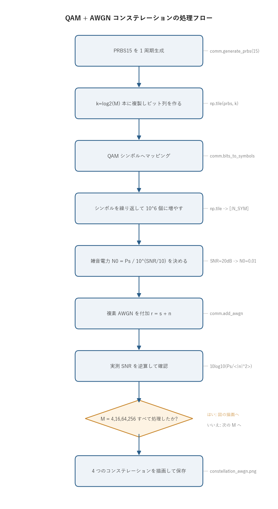

# 問題1-3: QAM シンボルへの白色ガウス雑音(AWGN)付加

## 問題

問1-2 で作った QAM シンボル列を繰り返して**シンボル数を $10^6$** に増やし、**SNR = 20 dB** に相当する白色ガウス雑音(AWGN)を付加する。雑音付加後のコンステレーションを 4QAM / 16QAM / 64QAM / 256QAM の 4 方式について図示する。

## 実行結果(出力)

```
シンボル数 : 1000000
SNR        : 20.0 dB  (雑音電力 = 0.0100)
  4QAM: 実測SNR=20.01 dB
 16QAM: 実測SNR=20.00 dB
 64QAM: 実測SNR=20.00 dB
256QAM: 実測SNR=20.00 dB
```


> **図の読み方**
> - もとは 1 点だった格子点が、雑音でガウス分布の雲に広がる。
> - 4QAM は点が遠く離れているので雲は重ならない。
> - 256QAM は点が密集していて、隣の雲とほとんど重なる。
> - これが「高次 QAM ほど雑音に弱い(誤りやすい)」ことの可視化になる。

---

## 0. 処理の流れ

`solution.py` を実行すると、次の順で処理が進む。



前半が送信シンボルの用意(PRBS 生成 → QAM マッピング → $10^6$ シンボルへ複製)、後半が雑音付加とコンステレーション描画にあたる。SNR から雑音電力を決めて複素 AWGN を足し、実測 SNR で設計どおりかを確認する流れが一本道で続く。分岐は「4 つの多値数すべてを処理したか」のループ判定 1 箇所だけになる。

---

## 1. AWGN(加法性白色ガウス雑音)

**AWGN (Additive White Gaussian Noise)** は、受信機の熱雑音などをモデル化した最も基本的な雑音で、次の 3 つの性質をまとめた名前になっている。

- **加法性 (Additive)**: 信号に足し算で加わる($r = s + n$)。信号の大きさによらず一定の統計で乗る。
- **白色 (White)**: パワーが全周波数に均一で、時間的に無相関。前のサンプルの雑音から次のサンプルの雑音は予測できない。
- **ガウス性 (Gaussian)**: 振幅が正規分布に従う。多数の独立な微小要因の和なので、中心極限定理により正規分布になる。

複素ベースバンド表現では、I 成分(同相)と Q 成分(直交)それぞれに独立な正規分布の雑音が乗る。

$$ r = s + n,\qquad n = n_I + j\,n_Q,\quad n_I, n_Q \sim \mathcal{N}\!\left(0,\ \tfrac{N_0}{2}\right). $$

ここで $N_0$ は複素雑音の総電力(分散の合計)で、I 軸と Q 軸に半分ずつ($N_0/2$)振り分けられる。I/Q が同じ分散の独立な正規分布なので、複素平面で見ると雑音は等方的(どの方向にも同じ広がり)の円対称ガウス分布になる。図でどの格子点も同じ大きさの丸い雲に見えるのはこのため。

---

## 2. SNR から雑音の大きさを決める

**SNR (Signal-to-Noise Ratio)** は信号電力と雑音電力の比。通信では dB で表すことが多く、dB と真数(線形)の関係は次のとおり。

$$ \mathrm{SNR_{lin}} = 10^{\,\mathrm{SNR[dB]}/10}. $$

SNR = 20 dB なら $\mathrm{SNR_{lin}} = 10^{2} = 100$、つまり信号電力が雑音電力の 100 倍ということ。

平均シンボル電力を $P_s$(本問では規格化により $P_s = 1$)とすると、付加すべき雑音総電力は信号電力を SNR で割った値になる。

$$ N_0 = \frac{P_s}{\mathrm{SNR_{lin}}} = \frac{1}{10^{20/10}} = \frac{1}{100} = 0.01. $$

これを I/Q に半分ずつ分けるので、各軸の雑音の標準偏差は次のように決まる。

$$ \sigma = \sqrt{\frac{N_0}{2}} = \sqrt{0.005} \approx 0.0707. $$

この $\sigma$ が、各格子点の周りに広がる雲の「半径の目安」になる。共通ライブラリ `comm.add_awgn` はこの計算をそのまま実装している。

```python
noise_power = signal_power / 10**(snr_db/10)      # N0
sigma = np.sqrt(noise_power / 2)                   # 1軸の標準偏差
noise = sigma * (randn + 1j*randn)                 # 複素ガウス雑音
```

出力の「実測 SNR」は、付加した雑音から $10\log_{10}(P_s / \langle|n|^2\rangle)$ を逆算した値。$10^6$ シンボルで平均しているので、4 方式とも 20.00 dB ちょうどに揃う。設計どおりの雑音を付加できたことを数値で確認できる。

---

## 3. 高次 QAM が雑音に弱い理由

すべての方式を平均電力 1 に規格化しているので、コンステレーション全体が収まる外径はどの方式でもほぼ同じになる。一方で点の数は 4 → 16 → 64 → 256 と増える。同じ広さに点を詰め込むほど、隣り合う点の最小距離 $d_{\min}$ が小さくなる。

方形 QAM(平均電力 1 規格化)の最小ユークリッド距離は次の式で求まる。

$$ d_{\min} = \frac{2}{\sqrt{2(M-1)/3}} = \sqrt{\frac{6}{M-1}}. $$

分母の $\sqrt{2(M-1)/3}$ は平均電力を 1 に揃えるための割り算係数(`comm.qam_norm`)で、$M$ が大きいほど大きくなる。その結果 $d_{\min}$ は $M$ の増加とともに縮む。

判定では各点を「自分のテリトリーの中心」とみなし、隣との中点($d_{\min}/2$)を境界にする。受信点がこの境界を越えると隣の点に誤判定される。各方式の値を並べると次のようになる。

| 方式 | $d_{\min}$ | $d_{\min}/2$(判定境界までの余裕) |
| ---- | --- | --- |
| 4QAM | 1.41 | 0.71 |
| 16QAM | 0.63 | 0.32 |
| 64QAM | 0.31 | 0.15 |
| 256QAM | 0.15 | 0.077 |

雑音の標準偏差 $\sigma \approx 0.071$(SNR = 20 dB)と比べると、4QAM では余裕 $0.71$ が $\sigma$ の約 10 倍あり、境界を越えることはほぼない。一方 256QAM では余裕 $d_{\min}/2 \approx 0.077$ が $\sigma$ とほぼ同じになる。受信点が標準偏差ぶん揺れただけで隣の境界へはみ出すので、誤りが頻繁に起きる。図で 256QAM の雲が大きく重なって見えるのは、この余裕の少なさを表している。

---

## 4. 関数ごとの詳細

`solution.py` には送信シンボルを作る `make_symbols` と、全体をつなぐ `main` がある。雑音付加や QAM マッピングの中身は共通ライブラリ `comm` 側にある。

### `make_symbols(M, n_sym)`

PRBS から M-QAM シンボルを作り、繰り返して `n_sym` シンボルに増やす関数。

| 項目 | 内容 |
| ---- | ---- |
| 引数 | `M`: QAM の多値数(4, 16, 64, 256)。`n_sym`: 最終的に必要なシンボル数($10^6$)。 |
| 戻り値 | 長さ `n_sym` の複素 QAM シンボル列(`np.ndarray`、規格化済み)。 |

内部の流れ。

1. `prbs = comm.generate_prbs(15)` で長さ 32767 の PRBS を 1 周期分作る(問1 の M 系列)。
2. `k = int(np.log2(M))` で 1 シンボルあたりのビット数を求める(4QAM なら 2、256QAM なら 8)。
3. `bits = np.tile(prbs, k)` で PRBS を `k` 本つなげ、1 ブロックぶんのビット列にする。長さ `32767 × k` になり、これがちょうど 32767 シンボル分のビットに対応する。
4. `sym_block = comm.bits_to_symbols(bits, M)` でビット列を QAM シンボルへマッピングする(グレイ符号化、問1-2 と同じ)。
5. `reps = int(np.ceil(n_sym / len(sym_block)))` で、$10^6$ に届くまで何回繰り返すかを計算する。
6. `sym = np.tile(sym_block, reps)[:n_sym]` でブロックを繰り返してから先頭 `n_sym` 個に切り詰める。

`np.tile(prbs, k)` の 1 行が「PRBS を k 本並べる」を表す。各シンボルに k ビット要るので、1 周期 32767 ビットの PRBS を k 本用意すれば、32767 シンボルぶんのビットが揃う。最後の `[:n_sym]` で過不足なくちょうど $10^6$ シンボルにそろえている。

### `main()`

全体をつなぐ関数。

1. `rng = np.random.default_rng(SEED)` で乱数生成器をシード固定で作る。これで毎回同じ雑音(同じ図)が出る。
2. シンボル数と、SNR から計算した雑音電力 $10^{-\mathrm{SNR}/10} = 0.01$ を表示する。
3. `2×2` のサブプロットを用意し、`QAM_ORDERS = [4, 16, 64, 256]` を順に処理する。各 $M$ で次をやる。
   - `sym = make_symbols(M, N_SYM)` で送信シンボルを作る。
   - `rx = comm.add_awgn(sym, SNR_DB, signal_power=1.0, rng=rng)` で複素 AWGN を付加する。
   - `meas_snr = 10*log10(mean(|sym|^2) / mean(|rx-sym|^2))` で実測 SNR を計算して表示する。`rx - sym` が付加した雑音そのものなので、その平均電力が分母になる。
   - 受信点の先頭 `n_plot = 4000` 点だけを散布図に描く($10^6$ 点すべてだと真っ黒につぶれる)。軸範囲は $\pm 1.7$、アスペクト比を等しくして格子の形を保つ。
4. 全体タイトルを付け、`constellation_awgn.png` に保存する。

`signal_power=1.0` を明示しているのは、規格化済みの理論値 1 を基準に雑音を決めるため。これを省くと `comm.add_awgn` が `sym` から実測した平均電力を使うが、規格化で 1 とわかっているので固定値を渡している。

### 参考: `comm.add_awgn` の中身

雑音付加の本体は共通ライブラリにある。

1. `signal_power` が `None` なら `sym` から平均 $|sym|^2$ を実測する(本問では 1.0 を明示)。
2. `noise_power = signal_power / 10**(snr_db/10)` で雑音総電力 $N_0$ を求める。
3. `sigma = sqrt(noise_power / 2)` で 1 軸あたりの標準偏差を求める。
4. `noise = sigma * (randn + 1j*randn)` で実部・虚部が独立な複素ガウス雑音を作り、`sym + noise` を返す。

`randn`(`rng.standard_normal`)は標準正規分布 $\mathcal{N}(0,1)$ の乱数なので、`sigma` を掛けると分散 $\sigma^2 = N_0/2$ になる。I/Q 独立に同じ分散で作るので円対称のガウス雑音になる。

---

## 5. 実行

```bash
python solution.py
```

標準出力は冒頭の「実行結果(出力)」、生成図は `constellation_awgn.png` を参照。処理フロー図 `flow.png` は `python make_flow.py` で作り直せる。

---

## 6. この問題のつながり

雑音で広がった受信シンボルは、次の **問1-4** で「最も近い格子点」へ判定(decision)し、**問1-5** でビットに戻し、**問1-6** で誤り率(BER)を測る。SNR = 20 dB では 4QAM〜64QAM はほぼ誤りなし、256QAM だけ誤りが出る。この問題の図で 256QAM の雲が重なって見えたことが、そのまま BER の差として現れる。
