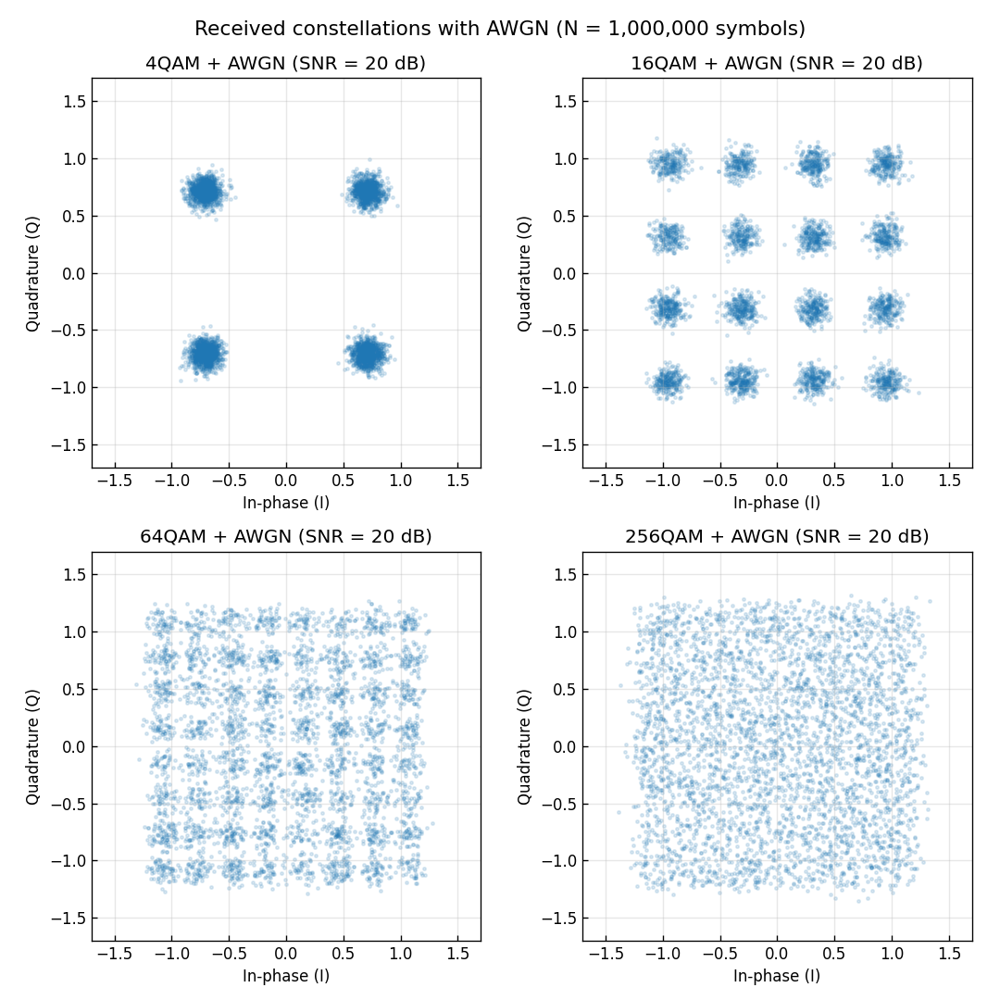

# 問題1-3: QAM シンボルへの白色ガウス雑音(AWGN)付加

## 問題

問1-2 で作った QAM シンボル列を繰り返して **シンボル数を $10^6$** に増やし、
**SNR = 20 dB** に相当する白色ガウス雑音(AWGN)を付加する。雑音付加後のコンステレーションを図示する。

## 実行結果(出力)

```
シンボル数 : 1000000
SNR        : 20.0 dB  (雑音電力 = 0.0100)
  4QAM: 実測SNR=20.01 dB
 16QAM: 実測SNR=20.00 dB
 64QAM: 実測SNR=20.00 dB
256QAM: 実測SNR=20.00 dB
```



> **図の読み方** — もとは1点だった格子点が、雑音で **ガウス分布の雲** に広がる。
> 4QAM は点が遠く離れているので雲は重ならないが、256QAM は点が密集していて
> 隣の雲とほとんど重なってしまう。これが「高次QAMほど雑音に弱い=誤りやすい」ことの可視化である。

---

## 1. AWGN(加法性白色ガウス雑音)とは

**AWGN (Additive White Gaussian Noise)** は、受信機の熱雑音などをモデル化した最も基本的な雑音で、

- **加法性 (Additive)**: 信号に足し算で加わる($r = s + n$)
- **白色 (White)**: 全周波数に均一なパワー(時間的に無相関)
- **ガウス性 (Gaussian)**: 振幅が正規分布に従う

複素ベースバンドでは、I成分・Q成分それぞれに独立な正規分布の雑音が乗る:

$$ r = s + n,\qquad n = n_I + j\,n_Q,\quad n_I, n_Q \sim \mathcal{N}\!\left(0,\ \tfrac{N_0}{2}\right). $$

ここで $N_0$ は複素雑音の **総電力**(分散)で、I/Q に半分ずつ($N_0/2$)振り分けられる。

---

## 2. SNR から雑音の大きさを決める

**SNR (Signal-to-Noise Ratio)** は信号電力と雑音電力の比。dB と真数(線形)の関係は

$$ \mathrm{SNR_{lin}} = 10^{\,\mathrm{SNR[dB]}/10}. $$

平均シンボル電力を $P_s$(本問では規格化により $P_s=1$)とすると、必要な雑音総電力は

$$ N_0 = \frac{P_s}{\mathrm{SNR_{lin}}} = \frac{1}{10^{20/10}} = \frac{1}{100} = 0.01. $$

これを I/Q に分けるので、各軸の標準偏差は

$$ \sigma = \sqrt{\frac{N_0}{2}} = \sqrt{0.005} \approx 0.0707. $$

共通ライブラリ `comm.add_awgn` はまさにこの計算をしている:

```python
noise_power = signal_power / 10**(snr_db/10)      # N0
sigma = np.sqrt(noise_power / 2)                   # 1軸の標準偏差
noise = sigma * (randn + 1j*randn)                 # 複素ガウス雑音
```

出力の「実測SNR」は、加えた雑音から逆算した $10\log_{10}(P_s / \langle|n|^2\rangle)$ で、
すべて 20 dB ちょうどになっており、設計どおりに雑音が付加できたことを確認できる。

---

## 3. なぜ高次QAMほど雑音に弱いのか

すべての方式を平均電力1に規格化しているので、コンステレーション全体が収まる
**外径はほぼ同じ**。一方、点の数は 4→16→64→256 と増える。
その結果 **隣り合う点の最小距離 $d_{\min}$ が小さくなる**。

方形QAM(平均電力1規格化)の最小ユークリッド距離は

$$ d_{\min} = \frac{2}{\sqrt{2(M-1)/3}} = \sqrt{\frac{6}{M-1}}. $$

| 方式 | $d_{\min}$ | $d_{\min}/2$(判定境界までの余裕) |
| ---- | --- | --- |
| 4QAM | 1.41 | 0.71 |
| 16QAM | 0.63 | 0.32 |
| 64QAM | 0.31 | 0.15 |
| 256QAM | 0.15 | 0.077 |

雑音の標準偏差 $\sigma \approx 0.071$(SNR=20 dB)と比べると、256QAM では判定境界までの余裕
$d_{\min}/2 \approx 0.077$ が $\sigma$ とほぼ同じになってしまう。つまり頻繁に隣の点へはみ出す。
だから図で 256QAM の雲が大きく重なって見える。

---

## 4. コードのポイント

- `make_symbols(M, N_SYM)` — 問1-2 と同じマッピングのあと、`np.tile` でシンボルを
  繰り返して $10^6$ シンボルに増やす。
- `comm.add_awgn(sym, SNR_DB, signal_power=1.0, rng=rng)` — SNR指定で複素AWGNを付加。
  `signal_power=1.0` と明示しているのは、規格化済みの理論値1を基準にするため。
- `rng = np.random.default_rng(SEED)` — シードを固定し、毎回同じ雑音(=同じ図)が出るようにしている。
- 散布図は全 $10^6$ 点だと真っ黒になるので、先頭 4000 点だけを描いている。

### 実行

```bash
python solution.py
```

---

## 5. この問題のつながり

雑音で広がった受信シンボルを、次の **問1-4** で「最も近い格子点」へ判定(decision)し、
**問1-5** でビットに戻し、**問1-6** で誤り率(BER)を測る。
SNR=20 dB では 4QAM〜64QAM はほぼ誤り無し、256QAM だけ誤りが出る、という結果につながる。
