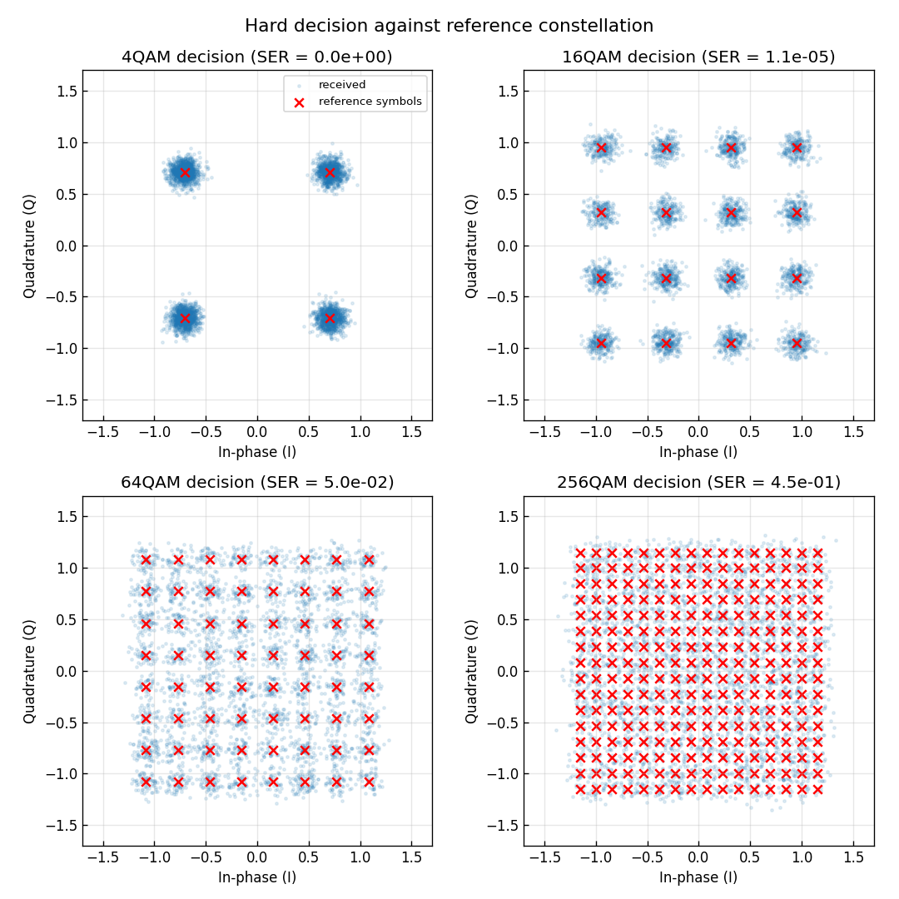
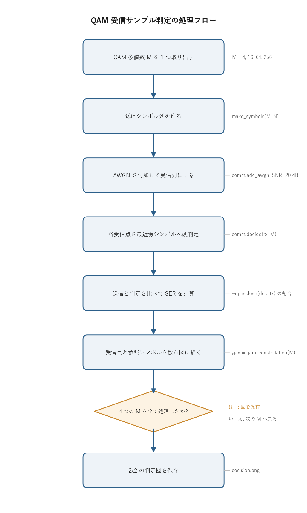

# 問題1-4: 受信 QAM サンプルの判定(decision)

## 問題

AWGN(加法的白色ガウス雑音)が付加された各受信サンプルについて、参照シンボル($M$ 個のコンステレーション点。例えば 16QAM なら 16 種類)からユークリッド距離が最も近いシンボルを選び、受信シンボル列を復号する。この最近傍選択を判定(decision)と呼ぶ。4QAM, 16QAM, 64QAM, 256QAM の 4 方式について、判定後のシンボル誤り率(SER)を測り、受信点と参照シンボルを散布図にする。

## 実行結果(出力)

```
シンボル数=1000000, SNR=20.0 dB
  4QAM: シンボル誤り数=      0, SER=0.000e+00
 16QAM: シンボル誤り数=     11, SER=1.100e-05
 64QAM: シンボル誤り数=  49920, SER=4.992e-02
256QAM: シンボル誤り数= 453705, SER=4.537e-01
```



> **図の読み方**
> - 青い雲が受信点(雑音で広がったサンプル)、赤い × が参照シンボル(判定の基準点)。
> - 判定とは「各受信点を、最も近い赤 × に割り当てる」操作にあたる。
> - 4QAM では雲が判定境界をまたがず誤り 0。256QAM では隣の × まで雲が重なり、約 45% のシンボルが取り違えられる。
> - 同じ SNR = 20 dB でも、多値数が上がるほど点の間隔が詰まって誤りやすくなることが、左上から右下に向かって読み取れる。

---

## 0. 処理の流れ

`solution.py` を実行すると、次の順で処理が進む。



4 つの多値数(4, 16, 64, 256QAM)について、送信 → 受信(雑音付加)→ 判定 → SER 計測 → 描画を同じ手順で繰り返す。分岐は「4 方式を全て処理したか」のループ判定 1 箇所だけで、各方式の処理自体は一本道になっている。判定の中身(最近傍シンボル選び)は共通ライブラリ `comm.decide` が担当し、`solution.py` 側はそれを呼んで誤りを数えるだけにしてある。

---

## 1. 判定(decision)と最尤判定

判定は、受信したサンプル $r$ を見て「送られたシンボルはこの $M$ 個のうちどれだったか」を一つに決める操作。AWGN は実部・虚部とも平均 0 の対称なガウス分布なので、雑音が大きくなる確率は距離が遠いほど小さい。したがって「送信シンボルとして最も尤もらしいのはどれか」を選ぶ最尤判定(Maximum Likelihood)は、受信点に最も近いコンステレーション点を選ぶこと、すなわち最近傍判定と一致する。式で書くと

$$ \hat{s} = \arg\min_{c \in \mathcal{C}} |r - c|^2 $$

となる($\mathcal{C}$ は $M$ 個の参照シンボル集合、$r$ は受信サンプル、$\hat{s}$ が判定結果)。

なぜ最尤と最近傍が一致するのかを確かめておく。各シンボルが等確率で送られるとき、$r$ を受け取ったうえで $c$ が送られた事後確率は、ベイズの定理から尤度 $p(r \mid c)$ に比例する。複素 AWGN の尤度は

$$ p(r \mid c) = \frac{1}{\pi N_0} \exp\!\left(-\frac{|r-c|^2}{N_0}\right) $$

で、指数の肩が $-|r-c|^2/N_0$。これを最大にするのは $|r-c|^2$ を最小にする $c$ だから、最尤判定は距離最小の点を選ぶことに帰着する。ここが「最近傍 = 最も尤もらしい」の根拠になる。

---

## 2. 方形QAMでは「軸ごとの丸め」で済む

参照シンボル $M$ 個すべてとの距離を総当たりで計算してもよいが、$10^6$ サンプル × 256 点は計算が重い。方形QAMでは I 軸と Q 軸が独立な格子になっているので、もっと速い方法がある。距離の 2 乗を展開すると

$$ |r-c|^2 = (r_I - c_I)^2 + (r_Q - c_Q)^2 $$

と I 成分の項と Q 成分の項の和に分かれる。$c_I$ は I 軸上の PAM レベル、$c_Q$ は Q 軸上の PAM レベルで、互いに独立に選べる。和を最小化するには各項を別々に最小化すればよいので、

- I 軸: $(r_I - c_I)^2$ を最小にする $c_I$ = $r_I$ に最も近い I 軸レベル
- Q 軸: $(r_Q - c_Q)^2$ を最小にする $c_Q$ = $r_Q$ に最も近い Q 軸レベル

と分解できる。2 次元の最近傍探索が、軸ごとの 1 次元の丸め 2 回に落ちる。これがスライサ(slicer)と呼ばれる方式で、共通ライブラリ `comm.decide` は各軸を $O(N)$ で丸める。

軸あたりのレベル数を $L=\sqrt{M}$、レベルを $\{-(L-1), \ldots, -1, +1, \ldots, (L-1)\}$ の偶数間隔(間隔 2)とすると、丸めは次の整数演算で書ける。

```python
x = sym * qam_norm(M)                              # 整数振幅スケールに戻す
i_idx = clip(round((x.real + (L-1)) / 2), 0, L-1)  # I軸を最近傍レベル番号へ
q_idx = clip(round((x.imag + (L-1)) / 2), 0, L-1)  # Q軸を最近傍レベル番号へ
```

`(x + (L-1))/2` でレベル `{-(L-1)..(L-1)}` を `{0..L-1}` の番号にずらし、`round` で最も近い格子点へ丸め、`clip` で外周より外に出た点を端のレベルに留める。`clip` がないと、外側レベルから外に飛び出した受信点が存在しないレベル番号に丸められてしまう。外周の点には外側に判定境界がないので、端に張り付かせるのが正しい最近傍になる。

> **手で追う計算例(16QAM, 受信点 $r = 0.45 - 1.2j$)**
>
> 16QAM は $L=\sqrt{16}=4$、軸レベルは $\{-3,-1,+1,+3\}$、規格化係数は $\text{qam\_norm}(16)=\sqrt{2(16-1)/3}=\sqrt{10}\approx 3.162$。
>
> 1. **規格化解除**: $x = r \cdot \sqrt{10} = (0.45 - 1.2j)\times 3.162 \approx 1.423 - 3.795j$。これで整数間隔(間隔 2)の格子に戻る。
> 2. **I 軸の番号化と丸め**: $(x_I + (L-1))/2 = (1.423 + 3)/2 = 2.212 \xrightarrow{\text{round}} 2$。範囲 $[0,3]$ 内なので clip は効かず、I 軸番号 = 2。
> 3. **Q 軸の番号化と丸め**: $(x_Q + (L-1))/2 = (-3.795 + 3)/2 = -0.397 \xrightarrow{\text{round}} 0 \xrightarrow{\text{clip}[0,3]} 0$。round の結果 $0$ がたまたま範囲内だが、もっと外側なら clip が端 0 に留める($x_Q$ が外周 $-3$ の外に大きく出ているケース)。Q 軸番号 = 0。
> 4. **振幅へ戻す**: $c_I = 2\cdot 2 - 3 = +1$、$c_Q = 2\cdot 0 - 3 = -3$。
> 5. **再規格化**: $\hat{s} = (1 - 3j)/\sqrt{10} \approx 0.316 - 0.949j$。
>
> 念のため 16 点との距離を総当たりしても最近傍は同じ $0.316 - 0.949j$(距離 $\approx 0.285$)で、軸ごとの丸めが 2 次元最近傍と一致することが確認できる。

> **判定境界をまたぐ数値例(16QAM, I 軸)**
>
> 規格化後の I 軸レベルは $\{-3,-1,+1,+3\}/\sqrt{10} = \{-0.949,-0.316,+0.316,+0.949\}$。隣り合うレベルの中点が判定境界で、レベル $+1$ と $+3$ の境界は規格化値で $2/\sqrt{10}\approx 0.632$。
>
> | 受信 $r_I$ | 規格化解除 $x_I$ | $(x_I+3)/2$ | round | 判定レベル |
> | --- | --- | --- | --- | --- |
> | $0.60$ | $1.897$ | $2.449$ | $2$ | $+1$ |
> | $0.64$ | $2.024$ | $2.512$ | $3$ | $+3$ |
>
> 境界 $0.632$ をわずかに下回る $0.60$ は $+1$ に、わずかに上回る $0.64$ は $+3$ に落ちる。AWGN による $r_I$ のゆらぎがこの中点を越えるかどうかが、そのまま判定誤りの分かれ目になる。

---

## 3. シンボル誤り率(SER)の解釈

判定結果が送信シンボルと一致しない割合が SER(Symbol Error Rate)。SNR = 20 dB での 4 方式の結果は、問1-3 の最小シンボル間距離 $d_{\min}=\sqrt{6/(M-1)}$(平均電力 1 に規格化したとき)と雑音の標準偏差 $\sigma$ の大小で説明できる。

雑音 $\sigma$ を求めておく。SNR = 20 dB は線形比で $10^{20/10}=100$。複素 AWGN の総電力(両軸合わせた電力)は信号電力 1 を 100 で割って $N_0 = 0.01$、これを 2 軸に等分するので 1 軸あたりの分散は $N_0/2 = 0.005$、標準偏差は $\sigma=\sqrt{0.005}\approx 0.071$ になる。判定境界までの片側の余裕は隣のシンボルとの中点までの距離 $d_{\min}/2$ なので、$d_{\min}/2$ が $\sigma$ の何倍あるかが誤りやすさを決める。

| 方式 | $d_{\min}/2$ | $\dfrac{d_{\min}/2}{\sigma}$ | 実測SER | 理論SER(方形QAM厳密式) |
| ---- | --- | --- | --- | --- |
| 4QAM | 0.71 | 10.0 | 0 | $\sim10^{-23}$(実質ゼロ) |
| 16QAM | 0.32 | 4.5 | $1.1\times10^{-5}$ | $1.0\times10^{-5}$ |
| 64QAM | 0.15 | 2.2 | $4.99\times10^{-2}$ | $5.0\times10^{-2}$ |
| 256QAM | 0.077 | 1.1 | 0.454 | 0.454 |

理論SERは、まず 1 軸(PAM)あたりの誤り確率

$$ p = 2\left(1-\frac{1}{L}\right) Q\!\left(\sqrt{\frac{3\gamma_s}{M-1}}\right) $$

を求め、I 軸と Q 軸が両方正しいときだけシンボルが正しいので

$$ \mathrm{SER} = 1-(1-p)^2 $$

として計算したもの($\gamma_s$ は 1 シンボルあたりの SNR、$Q$ は標準正規分布の上側確率、$L=\sqrt{M}$)。係数 $2(1-1/L)$ は、端のレベルは片側にしか境界がなく、内側のレベルは両側に境界がある事情を平均したもの。共通ライブラリ `comm.ber_theory_qam` が同じ $Q$ 関数で計算している。実測と理論がよく一致しており、判定が正しく実装できていることが確認できる。

> **16QAM での具体的な当てはめ**
>
> 上の計算例と同じ 16QAM で数字を入れてみる。規格化後のレベル間隔は $d_{\min}=2/\sqrt{10}\approx 0.632$ なので、判定境界までの片側余裕は $d_{\min}/2\approx 0.316$。一方 $\sigma\approx 0.071$ だから、余裕は $\sigma$ の $0.316/0.071\approx 4.47$ 倍ある。内側レベルの片側誤り確率は $Q(4.47)\approx 3.9\times10^{-6}$ 程度で、これを軸あたり係数 $2(1-1/4)=1.5$ 倍した $p\approx 5.8\times10^{-6}$ が 1 軸の誤り確率、$\mathrm{SER}=1-(1-p)^2\approx 1.16\times10^{-5}$ となり、実測 $1.1\times10^{-5}$ とよく合う。

数値で読むと境界が見える。判定境界までの余裕 $d_{\min}/2$ が雑音 $\sigma$ の約 4.5 倍ある 16QAM ではほぼ誤らない($10^{-5}$ 台)。比が 2.2 倍に下がる 64QAM で SER は約 5% に跳ね上がり、比が 1.1 倍まで詰まる 256QAM では半分近くを誤る。$Q$ 関数は引数に対して急激に小さくなるので、余裕がわずかに減るだけで誤り率が桁で悪化する。これが高次QAMの難しさで、同じ SNR でも多値数を上げるほど雑音耐性が落ちる。

---

## 4. 関数ごとの詳細

`solution.py` には系列生成の補助関数 `make_symbols` と、全体をまわす `main` がある。判定の中核は共通ライブラリ側の `comm.decide` なので、それも合わせて見ていく。

### `make_symbols(M, n_sym)`

指定した多値数 $M$ の送信シンボル列を、必要な長さだけ作って返す関数。

| 項目 | 内容 |
| ---- | ---- |
| 引数 | `M`: QAM多値数(4, 16, 64, 256)。`n_sym`: 必要なシンボル数。 |
| 戻り値 | 長さ `n_sym` の規格化済み複素QAMシンボル配列。 |

内部の流れ。

1. `comm.generate_prbs(15)` で長さ 32767 の PRBS(擬似ランダムビット列)を作る。
2. `k = int(np.log2(M))` で 1 シンボルあたりのビット数を求める(4QAM なら 2、256QAM なら 8)。
3. `np.tile(prbs, k)` で PRBS を $k$ 回つないでから `comm.bits_to_symbols(..., M)` に渡し、1 ブロック分のシンボル列 `sym_block` を得る。PRBS を $k$ 倍に伸ばすのは、$M$ が大きいほど 1 シンボルが多くのビットを食うので、十分な長さのビット列を用意するため。
4. `reps = ceil(n_sym / len(sym_block))` で何回繰り返せば足りるかを計算し、`np.tile(sym_block, reps)[:n_sym]` で `n_sym` ちょうどに切り出して返す。

ブロックを繰り返して使うので、生成は一度きりで済み、$10^6$ シンボルでも軽い。

### `comm.decide(sym, M)`(判定の中核)

受信サンプルを最近傍コンステレーション点へ硬判定する関数。`solution.py` が判定に使う本体。

| 項目 | 内容 |
| ---- | ---- |
| 引数 | `sym`: 受信した複素シンボル配列。`M`: QAM多値数。 |
| 戻り値 | 各サンプルを最近傍格子点へ丸めた複素シンボル配列。 |

内部の流れ。

1. `qam_params(M)` から軸あたりレベル数 `L = √M` を得る。
2. 内部関数 `_slice_indices` で各軸の最近傍レベル番号を求める。ここが第 2 節の丸め。`x = sym * qam_norm(M)` で平均電力 1 の規格化を解いて整数間隔のスケールに戻し、`np.rint((x.real + (L-1)) / 2)` で I 軸を最も近い番号に丸め、`np.clip(..., 0, L-1)` で 0..L-1 に収める。Q 軸も同様。
3. レベル番号を振幅 `2 * idx - (L-1)` に戻し、`(i_amp + 1j*q_amp) / qam_norm(M)` で再び平均電力 1 に規格化して返す。

`np.rint` が「最も近い格子点への丸め」、`np.clip` が「外周の外に出た点を端に留める」を担う。ループを使わず NumPy のベクトル演算だけで全サンプルを一度に処理するので $O(N)$ で速い。

### `comm.qam_constellation(M)`

参照シンボル($M$ 個の格子点)を返す関数。図に赤 × で重ねるのに使う。

| 項目 | 内容 |
| ---- | ---- |
| 引数 | `M`: QAM多値数。 |
| 戻り値 | $M$ 個の規格化済み複素コンステレーション点(順番はシンボル番号順ではない)。 |

`levels = 2*np.arange(L) - (L-1)` で軸レベル `{-(L-1)..(L-1)}` を作り、`np.meshgrid` で I-Q の全組み合わせ $L \times L = M$ 点を生成し、`qam_norm(M)` で割って平均電力 1 に規格化する。判定の基準点そのものなので、これを図に描くと「受信点がどの × に丸められるか」が目で追える。

### `main()`

全体をつなぐ関数。

1. `np.random.default_rng(SEED)` で乱数生成器を固定し、結果を再現可能にする。
2. `2x2` のサブプロットを用意し、`QAM_ORDERS = [4, 16, 64, 256]` を順にまわす。
3. 各 $M$ について次をやる。
   - `make_symbols(M, N_SYM)` で送信シンボル `tx` を作る。
   - `comm.add_awgn(tx, SNR_DB, signal_power=1.0, rng=rng)` で SNR = 20 dB の雑音を付加し、受信 `rx` を得る。`signal_power=1.0` は規格化済みなので電力 1 を明示している。
   - `comm.decide(rx, M)` で判定 `dec` を得る。
   - `np.count_nonzero(~np.isclose(dec, tx))` で送信と判定が異なるシンボル数を数え、`N_SYM` で割って SER を求める。浮動小数の等値比較なので `==` ではなく `np.isclose` を使う。
   - 受信点(先頭 4000 点)を薄い青で散布し、`comm.qam_constellation(M)` の参照シンボルを赤 × で重ねる。
4. 全方式を描いたら `decision.png` に保存する。図のラベルは日本語フォントに依存しないよう英語にしている。

`~np.isclose(dec, tx)` の `~` は論理否定で、「一致したか」を反転して「誤ったか」のブール配列にしている。雑音と判定をベクトルでまとめて処理しているので、$10^6$ シンボル × 4 方式でも短時間で終わる。

---

## 5. 実行

```bash
python solution.py
```

標準出力は冒頭の「実行結果(出力)」、生成図は `decision.png` を参照。処理フロー図 `flow.png` は `python make_flow.py` で作り直せる。

---

## 6. この問題のつながり

判定で得た「最も近い参照シンボル」を、次の問1-5 でビットに戻し(デマッピング)、問1-6 で送信ビットと比べてビット誤り率(BER)を求める。SER はシンボル単位、BER はビット単位の誤り率で、グレイ符号のおかげで隣接シンボルへの取り違えが 1 ビット誤りで済む。そのため両者は単純な比例に近い関係になり、本問の SER がそのまま次の BER 評価の土台になる。
