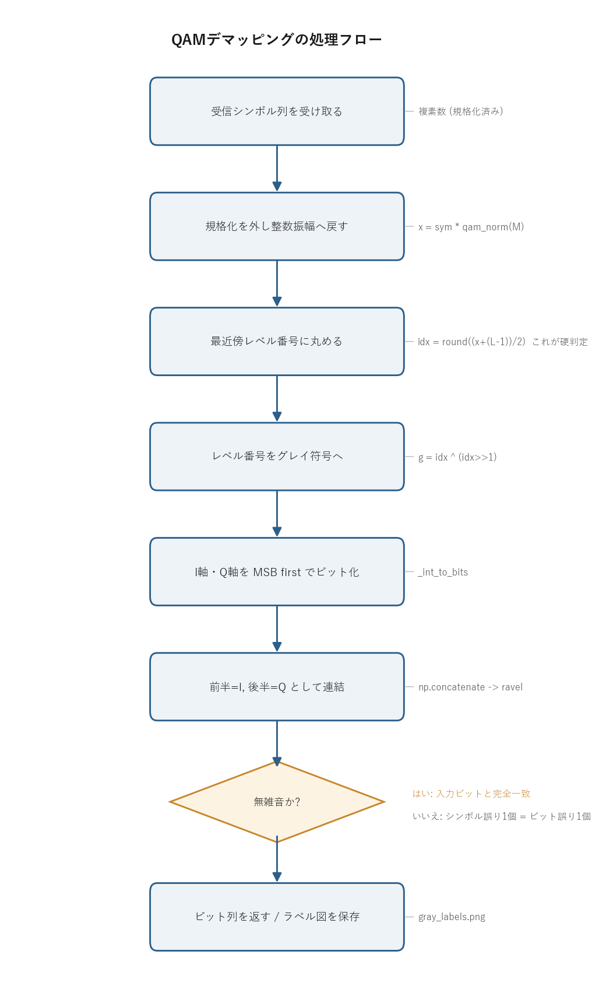

# 問題1-5: 受信シンボル列のビット系列への変換(QAMデマッピング)

## 問題

判定で得た受信シンボル列を、もとのビット系列へ戻す。この処理を **QAMデマッピング** と呼ぶ。マッピング(問1-2)のちょうど逆操作にあたる。方形QAMなので I 軸(実部)と Q 軸(虚部)を独立に処理し、各軸で得たビットを「前半=I軸・後半=Q軸」の順に連結して 1 シンボル分のビットに戻す。

このコードでは次の 2 つを確認する。

- 無雑音なら「マッピング → デマッピング」が完全に元のビットへ戻ること(両者が互いに逆写像であること)。
- 16QAM のグレイ符号ラベル付きコンステレーションで、隣り合うシンボルのラベルが必ず 1 ビットしか違わないこと。

## 実行結果(出力)

```
=== 無雑音での往復確認 (マッピング -> デマッピング) ===
  4QAM: 入力 40000bit -> 20000シンボル ->  40000bit  完全復元=True
 16QAM: 入力 80000bit -> 20000シンボル ->  80000bit  完全復元=True
 64QAM: 入力120000bit -> 20000シンボル -> 120000bit  完全復元=True
256QAM: 入力160000bit -> 20000シンボル -> 160000bit  完全復元=True

=== 16QAM: 横方向に隣接するシンボルのビット差 (グレイ性の確認) ===
  0000 -> 0100 : 変化ビット数 1
  0100 -> 1100 : 変化ビット数 1
  1100 -> 1000 : 変化ビット数 1
```


> **図の読み方**
> - 各点の上のラベルが、そのシンボルに対応する 4 ビット(前 2 桁=I軸、後 2 桁=Q軸)。
> - 横に 1 つ動いても、縦に 1 つ動いても、ラベルは必ず 1 ビットだけ変わる。これがグレイ符号の効果。
> - 4 つの象限を見ると、左右(I 軸)で前 2 桁が、上下(Q 軸)で後 2 桁が変わっていることが読み取れる。

---

## 0. 処理の流れ

`solution.py` の本体は「マッピング → デマッピングの往復確認」と「ラベル図の描画」の 2 部構成だが、中心になるのはデマッピング(`comm.symbols_to_bits`)で、その内部処理を 1 本の流れにすると次のようになる。



受信シンボルを受け取り、規格化を外して整数振幅スケールに戻し、最近傍のレベル番号に丸める(これが硬判定)。レベル番号をグレイ符号に直し、I 軸・Q 軸それぞれを MSB first でビットに展開し、前半=I・後半=Q の順に連結してビット列を返す。分岐は「無雑音か雑音込みか」の 1 箇所だけで、無雑音なら入力ビットへ完全に戻り、雑音込みでも隣のシンボルへの誤判定はビット誤り 1 個で済む。

---

## 1. デマッピングはマッピングの逆変換

マッピング(問1-2)は、各軸について次の順でビットを振幅に変換していた。

$$ \text{ビット(グレイ)} \xrightarrow{\text{グレイ→2進}} \text{レベル番号 idx}\ \xrightarrow{\;a = 2\cdot\text{idx} - (L-1)\;} \text{振幅} $$

ここで $L = \sqrt{M}$ は 1 軸あたりのレベル数(16QAM なら $L=4$)、レベル番号 idx は $0,1,\dots,L-1$、振幅 $a$ は $\{-(L-1),\dots,-1,+1,\dots,+(L-1)\}$ の奇数値をとる。デマッピングはこれを逆にたどる。

$$ \text{振幅}\ \xrightarrow{\;\text{idx} = \dfrac{a + (L-1)}{2}\;} \text{レベル番号 idx}\ \xrightarrow{\text{2進→グレイ}} \text{ビット} $$

`2進 → グレイ` 変換は `g = b ^ (b >> 1)`(共通ライブラリ `comm._gray_encode`)。I 軸・Q 軸それぞれで $kk = k/2$ ビットを得て、前半=I・後半=Q の順に連結すれば 1 シンボル $k = \log_2 M$ ビットに戻る。

#### 16QAM の 1 軸対応表(振幅 → レベル番号 → グレイ → ビット)

16QAM は $L=4$ なので、1 軸($kk=2$ ビット)のレベル番号 idx・振幅 $a=2\cdot\text{idx}-3$・グレイ符号・ビット列は次の 4 通りしかない。デマッピングは「振幅 → ビット」の向き(右へ)に読む。

| 振幅 $a$ | レベル番号 idx | グレイ符号(整数) | ビット(2桁) |
| :----: | :----: | :----: | :----: |
| $-3$ | 0 | 0 | `00` |
| $-1$ | 1 | 1 | `01` |
| $+1$ | 2 | 3 | `11` |
| $+3$ | 3 | 2 | `10` |

振幅順に idx を 1 段ずつ上げると、ビット列は `00 → 01 → 11 → 10` と毎回 1 桁だけ変わっている(これがグレイ符号)。I 軸・Q 軸とも同じ表を使う。

#### 計算例:判定シンボル $+1-3j$(規格化値)をビットに戻す

実部 $+1$・虚部 $-3$ のコンステレーション点を例にとる。規格化係数は $\text{qam\_norm}(16)=\sqrt{2(16-1)/3}=\sqrt{10}\approx3.1623$ なので、受信する規格化シンボルは

$$ s = \frac{1 + (-3)j}{\sqrt{10}} \approx 0.3162 - 0.9487\,j $$

これをデマッピングすると次の表のように追える。

| 段階 | I 軸(実部) | Q 軸(虚部) |
| ---- | :----: | :----: |
| ① 規格化を外す $a = (\text{規格化値})\times\sqrt{10}$ | $+1$ | $-3$ |
| ② レベル番号 $\text{idx}=(a+3)/2$ | $(1+3)/2=2$ | $(-3+3)/2=0$ |
| ③ グレイ符号 $g=\text{idx}\oplus(\text{idx}\!>>\!1)$ | $2\oplus1=3$ | $0\oplus0=0$ |
| ④ ビット(MSB first, 2 桁) | `11` | `00` |

前半=I・後半=Q の順に連結して、最終的なビット列は **`1100`** になる。上の対応表で振幅 $+1\to$ `11`、振幅 $-3\to$ `00` を引いた結果と一致している。

#### 往復確認:ビット → シンボル → ビット で元に戻る

問1-2 のマッピングの逆になっていることを、別のビット列 `1001` で確かめる。前半 `10`=I 軸、後半 `01`=Q 軸。上の対応表を「ビット → 振幅」の向き(左へ)に読むと `10`$\to a_I=+3$、`01`$\to a_Q=-1$ なので、

$$ s = \frac{3 + (-1)j}{\sqrt{10}} \approx 0.9487 - 0.3162\,j $$

これをデマッピングに通すと、振幅 $+3\to$ `10`、振幅 $-1\to$ `01` で連結 `1001` となり、入力ビットに戻る。`solution.py` の「完全復元=True」は、これを全シンボル・全方式でまとめて確認したものにあたる。

実際の `comm.symbols_to_bits` は、振幅からレベル番号を求める段で **最近傍丸め(硬判定)** を同時に行う。そのため雑音を含む受信シンボルを渡しても、判定とデマッピングを一気に通してビット列まで変換できる。流れだけ書くと次のようになる。

```python
i_idx, q_idx = _slice_indices(sym, M)      # 振幅 -> 最近傍レベル番号 (ここが判定)
i_gray = _gray_encode(i_idx)               # 2進 -> グレイ符号
q_gray = _gray_encode(q_idx)
bits = concat(int_to_bits(i_gray), int_to_bits(q_gray))   # ビットへ
```

### なぜ最近傍丸めが「判定」になるのか

規格化シンボル `sym` に規格化係数 `qam_norm(M)` を掛けると、振幅が整数スケール(奇数値 $\pm1,\pm3,\dots$)に戻る。送るときの振幅は $a = 2\cdot\text{idx} - (L-1)$ なので、逆に解くと $\text{idx} = (a + (L-1))/2$ となり、これは整数になる。雑音が乗って $a$ が少しずれても、`np.rint` で最も近い整数に丸めればもとのレベル番号が復元できる。これがそのまま「最も近いコンステレーション点を選ぶ硬判定」になっている。両端のレベルからさらに外側へ振れた点は `np.clip` で $0$ から $L-1$ に押し込み、存在しないレベル番号が出ないようにしている。

数値で見ると分かりやすい。さきほどの $+1-3j$ に雑音が乗り、整数スケールに戻した振幅が $a_I=+0.7$、$a_Q=-2.6$ になったとする(本来は $+1$ と $-3$)。レベル番号の式に入れると

$$ \text{idx}_I = \operatorname{rint}\!\frac{0.7+3}{2} = \operatorname{rint}(1.85) = 2,\qquad \text{idx}_Q = \operatorname{rint}\!\frac{-2.6+3}{2} = \operatorname{rint}(0.2) = 0 $$

となり、雑音前の idx($I{=}2,\ Q{=}0$)がそのまま復元される。以降は無雑音のときと同じ表をたどって `1100` に戻る。判定の境界は隣り合う振幅の中点(例えば $+1$ と $+3$ の境界は $a=+2$、すなわち $\text{idx}=2.5$)なので、雑音が中点を越えない限り正しいレベルに丸まる。

---

## 2. 「完全復元=True」の意味

無雑音であれば、マッピング → デマッピングは元のビット列に完全に戻る(全方式で `True`)。これは両者が互いに逆写像であることの直接の確認になっている。途中の丸めは無雑音だと振幅が厳密に奇数値なので、誤差ゼロでもとのレベル番号に戻る。

ビット数とシンボル数の関係は次のとおり。

- 入力ビット数 = (シンボル数) × $k$($k = \log_2 M$)
- マッピングでビット数は $1/k$ のシンボル数に圧縮され、デマッピングで元のビット数に戻る

例えば 256QAM では $k=8$ なので、160000 ビット → 20000 シンボル → 160000 ビット、と過不足なく往復する。出力表の「入力ビット数」と「出力ビット数」が全方式で一致しているのは、この往復が情報を落としていないことを示す。

このコードでは多値数を変えても 1 シンボルあたりのシンボル数(20000)をそろえているので、入力ビット数だけが $k$ に比例して増えていく。4QAM(40000ビット)から 256QAM(160000ビット)まで一直線に増えるのはそのためで、表を縦に見ると $k = 2,4,6,8$ がそのまま読み取れる。

---

## 3. グレイ符号がデマッピングで効く理由

図と出力の「変化ビット数 1」が示すとおり、コンステレーション上で隣り合うシンボルのラベルは 1 ビットしか違わない。雑音で 1 つ隣の点に誤判定されても、ビット誤りは 1 個だけで済む。

もし通常の 2 進割り当て(例:振幅順に `00, 01, 10, 11`)を使うと、`01`(振幅 $-1$)→ `10`(振幅 $+1$)の誤りで 2 ビット同時に誤る。グレイ符号はこれを避けるので、シンボル誤り 1 個あたりのビット誤りが最小になり、BER が下がる。QAM でグレイ符号を使うのはこのためで、例外なくこの割り当てを採る。

### グレイ符号の作り方と「隣り合うと 1 ビット差」の理由

整数 `idx` のグレイ符号は `g = idx ^ (idx >> 1)` で作る。idx を 1 増やすと、2 進表現では下位の連続する 1 が 0 に変わり、その上のビットが 1 つ立つ(繰り上がり)ため複数ビットが同時に変化する。グレイ符号は「隣り合う数のあいだで必ず 1 ビットだけ変わる」性質を持つ符号で、`idx ^ (idx >> 1)` はその標準的な構成になっている。レベル番号は振幅順に並んでいるので、コンステレーション上で隣り合う点はレベル番号が 1 違いになり、そのグレイ符号も 1 ビット差になる。出力の `0000 → 0100 → 1100 → 1000`(idx でいうと $0 \to 1 \to 2 \to 3$)は、I 軸を 1 段ずつ動かしても前 2 桁が毎回 1 ビットしか変わらないことを示している。

### シンボル誤り率とビット誤り率の関係

低めの誤り率の領域では、誤りはほとんどが「最も近い隣のシンボルへの 1 個ずれ」で起き、その 1 個ずれはグレイ符号のおかげで 1 ビット誤りになる。したがって

$$ \mathrm{BER} \approx \frac{\mathrm{SER}}{k} \quad (k = \log_2 M) $$

という関係が近似的に成り立つ。1 シンボルあたり $k$ ビット運んでいて、シンボル誤り 1 個につきビット誤りが 1 個なので、ビットあたりに直すと $1/k$ になる、という勘定である(問1-6で実際の数値で確認する)。

---

## 4. 関数ごとの詳細

このコードは `solution.py` の `main` 1 つで、デマッピング本体は共通ライブラリ `comm.py` の関数を呼び出している。中核の `comm` 側関数から順に見ていく。

### `comm.symbols_to_bits(sym, M)`

シンボル列を硬判定 + デマッピングしてビット列に戻す、デマッピングの本体。

| 項目 | 内容 |
| ---- | ---- |
| 引数 | `sym`: 規格化済みの複素シンボル列(雑音を含んでよい)。`M`: QAM 多値数(4, 16, 64, 256, …)。 |
| 戻り値 | 1 次元のビット列(`int8`)。長さは `len(sym) × log2(M)`。 |

内部の流れ。

1. `qam_params(M)` で $k$(1シンボルのビット数)、$L=\sqrt{M}$、$kk=k/2$(1軸のビット数)を得る。
2. `_slice_indices(sym, M)` で各軸の最近傍レベル番号 `i_idx, q_idx`(各 $0..L-1$)を求める。ここが硬判定。
3. `_gray_encode` で各軸のレベル番号をグレイ符号に直す。
4. `_int_to_bits` で各軸のグレイ符号を $kk$ ビットの MSB first ビット行列に展開する。
5. `np.concatenate([i_bits, q_bits], axis=1)` で I の後ろに Q をつなぎ、`.ravel()` で 1 次元に並べて返す。

`np.concatenate([...], axis=1).ravel()` の 1 行が「前半=I・後半=Q の順でシンボルごとに並べる」を表す。`axis=1` で各シンボルの行の中で I ビット → Q ビットの順に横へ連結し、`ravel()` でシンボルを縦から横へほどいて 1 本のビット列にしている。

### `comm._slice_indices(sym, M)`

規格化シンボルから各軸の最近傍レベル番号を求める、硬判定の中核。

| 項目 | 内容 |
| ---- | ---- |
| 引数 | `sym`: 規格化済み複素シンボル。`M`: QAM 多値数。 |
| 戻り値 | `(i_idx, q_idx)`。各軸のレベル番号($0..L-1$ の整数配列)。 |

処理は 3 行。

1. `x = sym * qam_norm(M)` で規格化を外し、振幅を整数スケール($\pm1,\pm3,\dots$)に戻す。
2. `i_idx = clip(rint((x.real + (L-1)) / 2), 0, L-1)` で実部のレベル番号を求める。`rint` で最近傍整数に丸めるところが判定で、`clip` で範囲外を両端に押し込む。
3. 虚部も同様に `q_idx` を求める。

`(x.real + (L-1)) / 2` は、マッピングの $a = 2\cdot\text{idx} - (L-1)$ を idx について解いた式そのもの。無雑音なら割り切れて整数になり、雑音込みなら `rint` が最も近い idx を選ぶ。

### `comm._gray_encode(n)` と `comm._int_to_bits(vals, nbits)`

`_gray_encode` は `n ^ (n >> 1)` で 2 進整数をグレイ符号に変換する 1 行関数。`_int_to_bits` は整数配列を `(len, nbits)` のビット行列(MSB first)に展開する。`(vals[:, None] >> shifts) & 1` で各ビット位置を一気に取り出していて、`shifts` を上位から下位の順(`nbits-1, …, 0`)に並べることで MSB first になる。

### `solution.py` の `main()`

全体をつなぐ関数。3 つのパートに分かれる。

**(a) 無雑音での往復確認**

1. `rng = np.random.default_rng(0)` で再現性のある乱数源を作る。
2. `QAM_ORDERS = [4, 16, 64, 256]` の各 $M$ について、$k = \log_2 M$ を求め、`20000 * k` ビットのランダムビット列を作る(シンボル数を 20000 にそろえるため)。
3. `comm.bits_to_symbols(bits, M)` でマッピングし、`comm.symbols_to_bits(sym, M)` でデマッピングする。
4. `np.array_equal(bits, rx_bits)` で完全一致を確認し、ビット数・シンボル数とともに表示する。

**(b) 16QAM のグレイ符号ラベル図**

1. $M=16$ について `qam_params` で $k, L, kk$ を得る。
2. $g = 0..15$ の各シンボル番号について、`(g >> (k-1-i)) & 1` で 4 ビットの MSB first ビット列を作り、`comm.bits_to_symbols` で対応するシンボル位置を求める。
3. 各点を散布図に打ち、`ax.annotate` でビットラベルを点の上に等幅フォントで注記する。
4. `gray_labels.png` に保存する。

**(c) 隣接シンボルのビット差の確認**

Q 軸を `[0, 0]` に固定し、I 軸のレベル番号を $0$ から $L-1$ まで 1 段ずつ動かす。各段で `comm._gray_encode` → `comm._int_to_bits` でラベルを作り、前の段との `np.count_nonzero(full != prev)` で変化ビット数を数える。グレイ符号なら毎回 1 が出る。

ラベル図の各点の真上にラベルを置く処理で、`bits_to_symbols(bits, M)[0]` の `[0]` は「長さ 1 のシンボル列の最初の要素」を取り出すためのもの。`bits_to_symbols` は配列を返す前提なので、1 シンボルだけ作っても配列で返り、その先頭を取って 1 つの複素数にしている。

---

## 5. 実行

```bash
python solution.py
```

標準出力は冒頭の「実行結果(出力)」、生成図は `gray_labels.png` を参照。処理フロー図 `flow.png` は `python make_flow.py` で作り直せる。

---

## 6. この問題のつながり

これでビット送信 → マッピング → 雑音 → 判定 → デマッピングの一巡がそろった。次の **問1-6** では、デマッピングで得たビット列を送信ビットと比較して誤りビット数とビット誤り率(BER)を求め、3 節の $\mathrm{BER} \approx \mathrm{SER}/k$ の関係を実測で確かめる。あわせて処理時間も測る。
