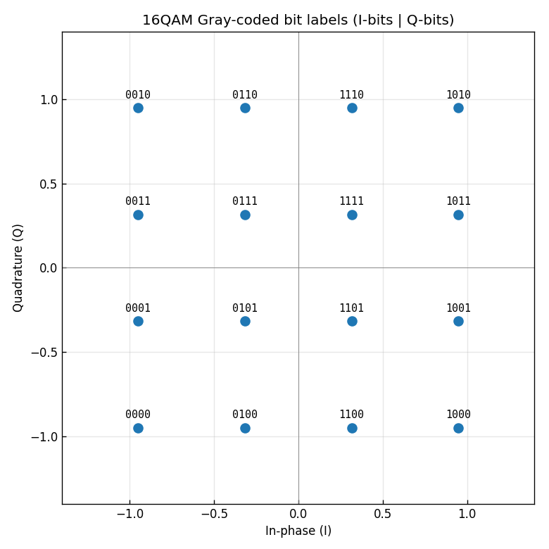

# 問題1-5: 受信シンボル列のビット系列への変換(QAMデマッピング)

## 問題

判定で得た受信シンボル列を、もとのビット系列へ戻す。この処理を **QAMデマッピング** と呼ぶ。
マッピング(問1-2)のちょうど逆操作である。

## 実行結果(出力)

```
=== 無雑音での往復確認 (マッピング -> デマッピング) ===
  4QAM: 入力 40000bit -> 20000シンボル ->  40000bit  完全復元=True
 16QAM: 入力 80000bit -> 20000シンボル ->  80000bit  完全復元=True
 64QAM: 入力120000bit -> 20000シンボル -> 120000bit  完全復元=True
256QAM: 入力160000bit -> 20000シンボル -> 160000bit  完全復元=True

=== 16QAM: 横方向に隣接するシンボルのビット差 (グレイ性の確認) ===
  0000 -> 0100 : 変化ビット数 1
  0100 -> 1100 : 変化ビット数 1
  1100 -> 1000 : 変化ビット数 1
```



> **図の読み方** — 各点の上のラベルが、そのシンボルに対応する4ビット(前2桁=I軸、後2桁=Q軸)。
> **横に1つ動いても、縦に1つ動いても、ラベルは必ず1ビットだけ変わる**。これがグレイ符号の効果。

---

## 1. デマッピング = マッピングの逆変換

マッピング(問1-2)は

$$ \text{ビット(グレイ)} \xrightarrow{\text{グレイ→2進}} \text{レベル番号}\ \xrightarrow{\;a=2\cdot\text{idx}-(L-1)\;} \text{振幅} $$

だった。デマッピングはこれを逆にたどる:

$$ \text{振幅}\ \xrightarrow{\;\text{idx}=\frac{a+(L-1)}{2}\;} \text{レベル番号}\ \xrightarrow{\text{2進→グレイ}} \text{ビット} $$

`2進→グレイ` 変換は `g = b ^ (b>>1)`(共通ライブラリ `comm._gray_encode`)。
I 軸・Q 軸それぞれで $k/2$ ビットを得て、**前半=I、後半=Q** の順に連結すれば1シンボル $k$ ビットに戻る。

共通ライブラリ `comm.symbols_to_bits` がこの処理をしている。実際には判定(最近傍丸め)と
デマッピングを一気に行うので、**雑音を含む受信シンボルを直接ビットに変換**できる:

```python
i_idx, q_idx = _slice_indices(sym, M)      # 振幅 -> 最近傍レベル番号 (これが判定)
i_gray = _gray_encode(i_idx)               # 2進 -> グレイ符号
q_gray = _gray_encode(q_idx)
bits = concat(int_to_bits(i_gray), int_to_bits(q_gray))   # ビットへ
```

## 2. 「完全復元=True」の意味

無雑音であれば、マッピング → デマッピングは**完全に元のビット列に戻る**(全方式で `True`)。
これは両者が互いに逆写像であることの直接の確認になっている。

- 入力ビット数 = (シンボル数) × $k$
- マッピングでシンボル数は $1/k$ に圧縮され、デマッピングで元のビット数に戻る

例えば 256QAM では 160000 ビット → 20000 シンボル → 160000 ビット、と過不足なく往復している。

## 3. グレイ符号がデマッピングで効く理由

図と出力の「変化ビット数 1」が示すように、コンステレーション上で**隣り合うシンボルのラベルは1ビットしか違わない**。
雑音で1つ隣の点に誤判定されても、**ビット誤りは1個だけ**で済む。

もし通常の2進割り当て(例:`00,01,10,11` を振幅順に)を使うと、
`01`(振幅 $-1$)→ `10`(振幅 $+1$)の誤りで **2ビット同時に誤る**。
グレイ符号はこれを避けるので、シンボル誤り1個あたりのビット誤りが最小になり、BER が下がる。
これが「QAMでは必ずグレイ符号を使う」理由である。

数式で言うと、低めの誤り率領域では「シンボル誤り≒隣への誤り」「隣への誤り=1ビット誤り」なので

$$ \mathrm{BER} \approx \frac{\mathrm{SER}}{k} \quad (k=\log_2 M) $$

という近い関係が成り立つ(問1-6で実際に確認する)。

## 4. コードのポイント

- `comm.symbols_to_bits(sym, M)` — 判定 + デマッピングをまとめて行う。
- グレイ符号ラベル図は、全 $M$ シンボルについて「ビット列 → シンボル位置」を1つずつ描き、
  各点にビットラベルを注記して作っている。
- 隣接ビット差の確認では、I 軸のレベルを1段ずつ動かしてラベルの変化ビット数を数えている。

### 実行

```bash
python solution.py
```

## 5. この問題のつながり

これでビット送信 → マッピング → 雑音 → 判定 → デマッピングの一巡がそろった。
次の **問1-6** では、デマッピングで得たビット列を送信ビットと比較して
**誤りビット数とビット誤り率(BER)** を求め、さらに **処理時間** を測る。
