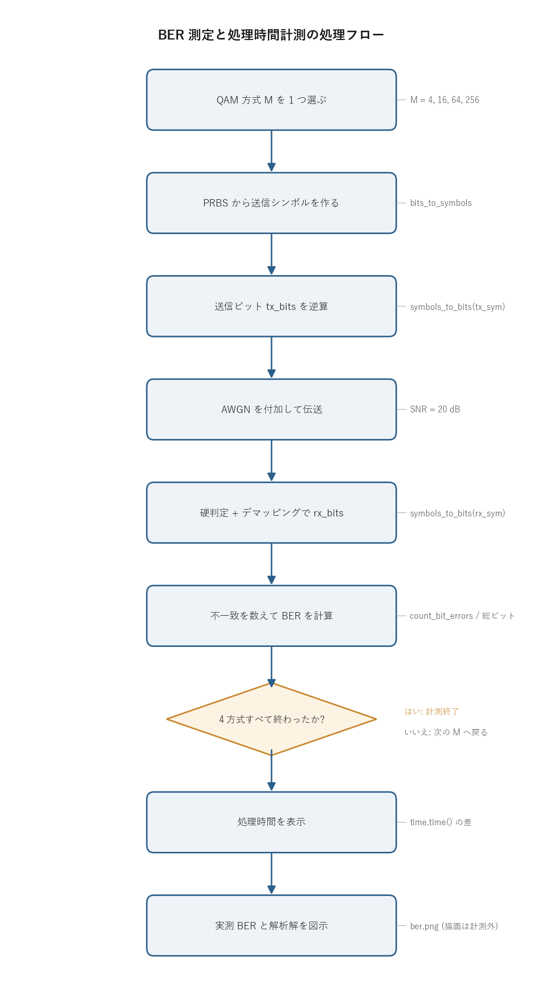

# 問題1-6: ビット誤り率 (BER) の測定と処理時間の計測

## 問題

復号したビット系列と送信ビット系列を 1 ビットずつ比べて誤りビット数を求め、ビット誤り率 (BER) を計算する。さらに `time` ライブラリの `time` 関数で処理時間を測定する(波形プロットは計測対象に含めない)。

問1-2 から問1-5 までで作った部品(QAMマッピング、AWGN付加、硬判定、デマッピング)を 1 本につなぎ、送受信チェーン全体が正しく動くことを BER で確かめる。

## 実行結果(出力)

```
シンボル数=1000000, SNR=20.0 dB

     方式       誤りビット数        総ビット数      BER(実測)     BER(解析解)      SER/k
    4QAM            0      2000000    0.000e+00    7.620e-24  0.000e+00
   16QAM           11      4000000    2.750e-06    2.904e-06  2.750e-06
   64QAM        50564      6000000    8.427e-03    8.486e-03  8.320e-03
  256QAM       523745      8000000    6.547e-02    6.517e-02  5.671e-02

Required time for programming: 0.795 s (波形プロットを除く)
```


> **図の読み方**
> - 棒が実測 BER、赤い◇が解析解。縦軸は対数。
> - QAM 次数が上がるほど BER が桁で悪化する(4QAM はほぼ 0 なので棒が出ない)。
> - 実測と解析解がほぼ重なっていて、チェーン全体が正しく動いていると分かる。

---

## 0. 処理の流れ

`solution.py` を実行すると、次の順で処理が進む。



QAM 方式 `M` を 1 つ選ぶたびに、PRBS からの送信シンボル生成、AWGN 付加、硬判定とデマッピング、誤り計数までを一直線に通す。これを 4 方式(4/16/64/256QAM)ぶん繰り返し、その所要時間を `time.time()` の差で測る。最後に実測 BER と解析解を 1 枚の図にまとめる。描画は計測区間の外に置くので、計測されるのはアルゴリズム本体だけになる。分岐は「4 方式すべて終わったか」のループ判定 1 箇所だけで、構造は単純な一本道になっている。

---

## 1. 送受信チェーンの全体像

問1-2 から問1-5 までを 1 本につないだものが、この問題の処理にあたる。

```
PRBS生成 -> QAMマッピング -> AWGN付加 -> 判定 -> QAMデマッピング -> 誤り計数
 (問1-1)     (問1-2)        (問1-3)    (問1-4)   (問1-5)         (問1-6)
```

送信ビット `tx_bits` と、受信して復号したビット `rx_bits` を 1 ビットずつ比べ、食い違った数が誤りビット数になる。それを総ビット数で割ったものが

$$ \mathrm{BER} = \frac{\text{誤りビット数}}{\text{総ビット数}}. $$

総ビット数は (シンボル数) × (1 シンボルのビット数 $k$) なので、方式ごとに $10^6\times k$ = 2M / 4M / 6M / 8M ビットになる。$k = \log_2 M$ で、4QAM なら 2、256QAM なら 8 ビットを 1 シンボルに載せている。

---

## 2. BER の物理的な意味と推定誤差

BER は「送ったビットのうち何割が反転したか」を表す確率の推定値。シミュレーションでは有限個($N_\text{bit}$ ビット)しか送れないので、得られる BER はあくまで標本平均で、真の誤り確率 $p$ のまわりにばらつく。

各ビットが独立に確率 $p$ で誤ると考えると、誤りビット数は二項分布に従う。標本 BER の標準偏差は

$$ \sigma_{\widehat{\mathrm{BER}}} = \sqrt{\frac{p(1-p)}{N_\text{bit}}} \approx \sqrt{\frac{p}{N_\text{bit}}}\quad(p \ll 1) $$

になる。これは「測りたい誤り確率が小さいほど、たくさんビットを送らないと精度が出ない」ことを表す。

実用上の目安は、誤りイベントが 100 個程度出るまで送ること。今回の 16QAM は誤りビットが 11 個しか出ていない(BER $\approx 2.75\times10^{-6}$)ので、推定の相対誤差は 3 割ほど残っている。これが解析解との比 0.95 のずれにそのまま効いている。逆に 64QAM・256QAM は誤りが数万個出ているので、3 桁の精度で解析解と一致する。

4QAM で誤りが 0 個なのは正しい挙動。解析解は $\sim10^{-23}$ で、$10^6$ ビット送っても平均 $10^{-17}$ 個しか誤らない。つまり $10^6$ サンプルでは、おおよそ $10^{-6}$ より小さい BER は測れない(誤りが 1 個も出ない)。これは上の式で $p$ が小さいほど必要ビット数が増えることの裏返しになる。

---

## 3. 実測 BER と解析解の一致

解析解(グレイ符号化した方形QAM、近似式)は

$$ \mathrm{BER} \approx \frac{4}{k}\left(1-\frac{1}{\sqrt M}\right) Q\!\left(\sqrt{\frac{3}{M-1}\,\gamma_s}\right),\qquad
\gamma_s = 10^{\mathrm{SNR[dB]}/10}, \quad Q(x)=\tfrac12\mathrm{erfc}\!\left(\tfrac{x}{\sqrt2}\right) $$

で、共通ライブラリ `comm.ber_theory_qam` が計算する。式の各部分の意味を見ておく。

- $\gamma_s$ はシンボルあたりの SNR ($E_s/N_0$)。SNR = 20 dB は $\gamma_s = 100$ にあたる。
- $Q(\cdot)$ はガウス分布の上側裾確率。AWGN で点がどれだけ判定境界を越えやすいかを表す。引数 $\sqrt{3/(M-1)\cdot\gamma_s}$ の中の $1/(M-1)$ が効いていて、$M$ が大きいほど引数が小さくなり、$Q$ の値、つまり誤り確率が大きくなる。
- 平均電力を 1 に揃えると、$M$ が大きいほど隣り合う点の間隔が狭くなる。間隔が狭いほど同じ雑音でも境界を越えやすい。これが高次QAMほど BER が悪化する物理的な理由になる。
- 前係数 $\frac{4}{k}(1-1/\sqrt M)$ は、1 シンボル内のビット数 $k$ とコンステレーション端の点の扱いから来る規格化項。グレイ符号なので「シンボル誤り 1 個 ≒ ビット誤り 1 個」とみなし、$k$ で割ってビットあたりに直している。

SNR = 20 dB($\gamma_s=100$)での比較は次のとおり。

| 方式 | 実測 BER | 解析解 BER | 比 |
| ---- | --- | --- | --- |
| 4QAM | 0(誤り0) | $7.6\times10^{-24}$ | — |
| 16QAM | $2.75\times10^{-6}$ | $2.90\times10^{-6}$ | 0.95 |
| 64QAM | $8.43\times10^{-3}$ | $8.49\times10^{-3}$ | 0.99 |
| 256QAM | $6.55\times10^{-2}$ | $6.52\times10^{-2}$ | 1.00 |

16QAM の比 0.95 のずれは前節の標本誤差で説明がつき、誤り数が多い高次QAMでは 3 桁一致する。送受信チェーン全体が正しく動いている裏付けになる。

---

## 4. BER と SER の関係(グレイ符号の効果)

出力の `SER/k` 列(シンボル誤り率を $k$ で割った値)が、実測 BER とほぼ一致している。

- 64QAM: BER $=8.43\times10^{-3}$、SER/k $=8.32\times10^{-3}$

これは問1-5 で述べた

$$ \mathrm{BER} \approx \frac{\mathrm{SER}}{k} $$

の確認になる。グレイ符号は隣り合うシンボルのビット表現を 1 ビットしか変えないので、最も起きやすい「1 つ隣への誤り」がビット誤り 1 個で済む。だからシンボル誤り 1 個がほぼビット誤り 1 個に対応し、ビット誤り率はシンボル誤り率を $k$ で割っただけの値に近づく。

256QAM で実測 BER ($6.55\times10^{-2}$) が SER/k ($5.67\times10^{-2}$) より少し大きいのは、誤り率が高くなると 2 つ隣以上への誤り、つまり複数ビットが同時に反転する誤りが増えてくるため。1 シンボル誤りあたりのビット誤りが 1 個を超え始める。

---

## 5. 関数ごとの詳細

`solution.py` には送受信チェーンをまとめた `run_chain` と、全体を回す `main` がある。実際の信号処理は共通ライブラリ `comm.py` の関数が担う。

### `run_chain(M, rng)`

1 方式ぶんの送受信チェーンを実行し、誤り数・総ビット・BER・SER を返す関数。

| 項目 | 内容 |
| ---- | ---- |
| 引数 | `M`: QAM 多値数(4/16/64/256)。`rng`: 乱数生成器(再現性のため `main` から渡す)。 |
| 戻り値 | `(n_bit_err, total_bits, ber, ser)` のタプル。 |

内部の流れ。

1. `k = int(np.log2(M))` で 1 シンボルあたりのビット数を求める。
2. `prbs = comm.generate_prbs(15)` で長さ 32767 の PRBS を 1 周期作り、`np.tile(prbs, k)` で $k$ 倍に伸ばしてから `comm.bits_to_symbols(..., M)` で 1 ブロックぶんの送信シンボルにする。
3. `reps = ceil(N_SYM / len(block))` 回ブロックを並べ、先頭 `N_SYM` シンボルだけ取って `tx_sym` にする($N_\text{SYM}=10^6$)。
4. `tx_bits = comm.symbols_to_bits(tx_sym, M)` で送信ビットの基準を作る。
5. `rx_sym = comm.add_awgn(tx_sym, SNR_DB, signal_power=1.0, rng=rng)` で AWGN を付加する。
6. `rx_bits = comm.symbols_to_bits(rx_sym, M)` で受信側を硬判定してビットに戻す。
7. `comm.count_bit_errors(tx_bits, rx_bits)` で誤りを数え、BER と SER を計算して返す。

`tx_bits` を元のランダムビットからではなく、`symbols_to_bits(tx_sym, M)` で「マッピングに使ったシンボルから逆算」して作っているのが要点。送信側と受信側で同じデマッピング規則を通すことで、規則の食い違いによる見かけの誤りを排除し、雑音だけが誤りの原因になるようにしている。

`signal_power=1.0` を明示しているのも重要。`comm` のシンボルは平均電力 1 に規格化されているので、実測ではなく既知の 1 を渡すことで、SNR が定義どおりにかかる。

### `comm.generate_prbs(15)`

最大長 LFSR で PRBS を 1 周期(32767 ビット)生成する。問1-1 で詳しく扱った部品で、ここではテストデータ源として再利用している。

### `comm.bits_to_symbols(bits, M)` / `comm.symbols_to_bits(sym, M)`

ビット列とQAMシンボル列を相互変換する(問1-2、問1-5)。前半 $k/2$ ビットを I 軸、後半を Q 軸のグレイ符号として扱い、各軸を $\sqrt M$ 値の PAM にマップする。`symbols_to_bits` は内部で最近傍判定(硬判定)してからビットに戻すので、雑音を含む受信シンボルをそのまま渡せる。

### `comm.add_awgn(sym, snr_db, signal_power, rng)`

複素 AWGN を SNR [dB] 指定で付加する(問1-3)。雑音電力 $N_0 = (\text{信号電力})/10^{\mathrm{SNR}/10}$ を求め、実部・虚部それぞれに標準偏差 $\sigma=\sqrt{N_0/2}$ のガウス雑音を独立に加える。複素 1 サンプルあたり 2 つの自由度があるので、半分ずつ分配する。

### `comm.count_bit_errors(tx_bits, rx_bits)`

`np.count_nonzero(tx_bits != rx_bits)` で不一致ビット数を数えるだけの薄い関数。長さがずれても短い方に合わせる。

### `comm.ber_theory_qam(M, snr_db)`

第 3 節の解析解を計算する。$Q(x)=\tfrac12\mathrm{erfc}(x/\sqrt2)$ を `math.erfc` で評価し、前係数と引数を組み立てて返す。

### `main()`

全体をつなぐ関数。

1. `rng = np.random.default_rng(SEED)` で乱数を固定し、結果を再現可能にする。
2. ヘッダを表示したあと `t_start = time.time()` で計測を始める。
3. `QAM_ORDERS = [4, 16, 64, 256]` を順に `run_chain` に通し、各方式の誤り数・BER・解析解・SER/k を表で出力する。
4. `t_end = time.time()` で計測を止め、`t_end - t_start` を所要時間として表示する。
5. 計測区間の外で matplotlib の図(実測 BER の棒 + 解析解の点)を作り、`ber.png` に保存する。

`ber_meas = [max(results[M][0], 1e-12) ...]` で BER の下限を $10^{-12}$ に切っているのは、4QAM の BER が 0 だと対数軸 (`set_yscale("log")`) で $\log 0 = -\infty$ になり描けないため。プロット用に小さな正の値へ置き換えている。

---

## 6. 処理時間の計測

```python
import time
t_start = time.time()
# ... 送受信チェーン (4方式ぶん) ...
t_end = time.time()
print(f"Required time for programming: {t_end - t_start:.3f} s")
```

`time.time()` は現在時刻(エポックからの経過秒)を浮動小数で返す。処理の前後で呼び、差をとれば所要時間が得られる。

計測区間に matplotlib の描画を含めないのが問題文の指示。描画はファイル I/O やフォント処理が絡んで遅く、計算本体の速さを覆い隠してしまう。そこで `savefig` は計測区間の外に置いている。

今回は 4 方式 × $10^6$ シンボルで約 0.8 秒。QAM マッピングや AWGN 付加が NumPy でベクトル化されているため、PRBS 生成の Python ループ(問1-1 の $O(N)$、$N=32767$)を含めても速い。各方式の総ビット数は最大 8M ビットだが、配列演算なのでループのオーバーヘッドはほとんど出ない。

---

## 7. 実行

```bash
python solution.py
```

標準出力は冒頭の「実行結果(出力)」、生成図は `ber.png` を参照。処理フロー図 `flow.png` は `python make_flow.py` で作り直せる。

---

## 8. 第1週のまとめ

第1週で、光ディジタルコヒーレント通信の最小構成(送信ビット → QAM変調 → 雑音のある伝送路 → 判定・復調 → BER評価)を一通り実装した。要点は次の 3 つ。

- 平均電力を揃えると、高次QAMほど点が密集して雑音に弱くなり、BER が悪化する。
- グレイ符号により $\mathrm{BER} \approx \mathrm{SER}/k$ となり、シンボル誤りあたりのビット誤りを最小化できる。
- 実測 BER は解析解とよく一致し、シミュレーション全体が正しいと確認できる。誤り数が少ない方式では標本誤差が残る点にも注意する。

第2週では、この BER の SNR 依存性カーブを描き、さらに実際の伝送波形に近づけるためのレイズドコサイン パルス整形を導入していく。
