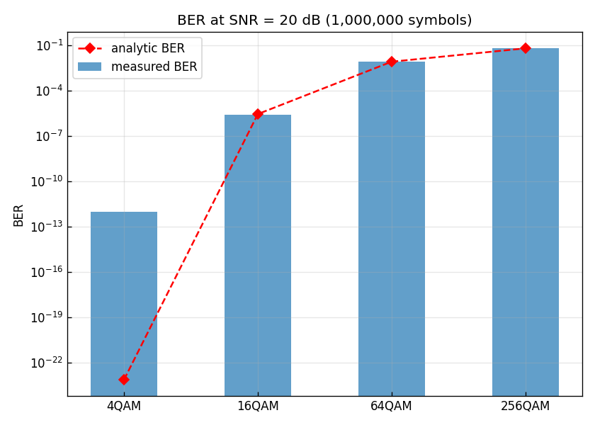

# 問題1-6: ビット誤り率(BER)の測定と処理時間の計測

## 問題

復号ビット系列と送信ビット系列を比較して **誤りビット数** を求め、**ビット誤り率(BER)** を計算する。
さらに `time` ライブラリの `time` 関数で **処理時間** を測定する(波形プロットは計測対象に含めない)。

## 実行結果(出力)

```
シンボル数=1000000, SNR=20.0 dB

     方式       誤りビット数        総ビット数      BER(実測)     BER(解析解)      SER/k
    4QAM            0      2000000    0.000e+00    7.620e-24  0.000e+00
   16QAM           11      4000000    2.750e-06    2.904e-06  2.750e-06
   64QAM        50564      6000000    8.427e-03    8.486e-03  8.320e-03
  256QAM       523745      8000000    6.547e-02    6.517e-02  5.671e-02

Required time for programming: 0.795 s (波形プロットを除く)
```



> **図の読み方** — 棒が実測 BER、赤い◇が解析解。対数軸で見ると、QAM次数が上がるほど
> BER が桁で悪化していく(4QAM はほぼゼロなので棒が出ない)。実測と解析解がよく一致している。

---

## 1. 送受信チェーンの全体像

問1-2〜1-5 を1本につないだものが、この問題の処理:

```
PRBS生成 ─→ QAMマッピング ─→ AWGN付加 ─→ 判定 ─→ QAMデマッピング ─→ 誤り計数
 (問1-1)     (問1-2)         (問1-3)    (問1-4)   (問1-5)          (問1-6)
```

送信ビット `tx_bits` と、受信して復号したビット `rx_bits` を1ビットずつ比べ、
食い違った数が **誤りビット数**。それを総ビット数で割ったものが

$$ \mathrm{BER} = \frac{\text{誤りビット数}}{\text{総ビット数}}. $$

総ビット数は (シンボル数) × (1シンボルのビット数 $k$) なので、方式ごとに
$10^6\times k$ = 2M / 4M / 6M / 8M ビットになる。

## 2. 実測 BER と解析解の一致

解析解(グレイ符号化 方形QAM、近似式)は

$$ \mathrm{BER} \approx \frac{4}{k}\left(1-\frac{1}{\sqrt M}\right) Q\!\left(\sqrt{\frac{3}{M-1}\,\gamma_s}\right),\qquad
\gamma_s = 10^{\mathrm{SNR[dB]}/10}, \quad Q(x)=\tfrac12\mathrm{erfc}\!\left(\tfrac{x}{\sqrt2}\right) $$

で、共通ライブラリ `comm.ber_theory_qam` が計算する。SNR = 20 dB($\gamma_s=100$)での比較:

| 方式 | 実測 BER | 解析解 BER | 比 |
| ---- | --- | --- | --- |
| 4QAM | 0(誤り0) | $7.6\times10^{-24}$ | — |
| 16QAM | $2.75\times10^{-6}$ | $2.90\times10^{-6}$ | 0.95 |
| 64QAM | $8.43\times10^{-3}$ | $8.49\times10^{-3}$ | 0.99 |
| 256QAM | $6.55\times10^{-2}$ | $6.52\times10^{-2}$ | 1.00 |

実測とよく一致しており、送受信チェーン全体が正しく動いていることの強い裏付けになる。

> **4QAM で誤り0なのは当然か** — 解析解は $\sim10^{-23}$。これは「$10^6$ ビット送っても
> 平均 $10^{-17}$ 個しか誤らない」という意味で、実際に誤り0になるのが正しい。
> 逆に言うと $10^6$ サンプルでは $10^{-6}$ 程度より小さい BER は測定できない(誤りが1個も出ない)。

## 3. BER と SER の関係(グレイ符号の効果の確認)

出力の `SER/k` 列(シンボル誤り率を $k$ で割った値)が、実測 BER とほぼ一致している:

- 64QAM: BER $=8.43\times10^{-3}$、SER/k $=8.32\times10^{-3}$

これは問1-5 で述べた

$$ \mathrm{BER} \approx \frac{\mathrm{SER}}{k} $$

の確認。グレイ符号により「シンボル誤り1個 ≒ ビット誤り1個」になっているので、
ビット誤り率はシンボル誤り率を $k$ で割っただけの値に近づく。256QAM でわずかにずれるのは、
誤り率が高くなると「2つ隣以上への誤り(複数ビット誤り)」が増えてくるため。

## 4. 処理時間の計測

```python
import time
t_start = time.time()
# ... 送受信チェーン (4方式ぶん) ...
t_end = time.time()
print(f"Required time for programming: {t_end - t_start:.3f} s")
```

`time.time()` は現在時刻を秒で返す。処理の前後で呼び、差をとれば所要時間が得られる。
**ポイントは、計測区間に `matplotlib` の描画を含めないこと**(問題文の指示)。
描画は I/O が絡んで遅く、アルゴリズム本体の速さを正しく測れなくなるため、
プロットは計測区間の外に置いている。

今回は4方式 × $10^6$ シンボルで約 0.8 秒。NumPy でベクトル化されているため、
PRBS生成のループ(問1-1の $O(N)$)を含めても高速に処理できている。

## 5. コードのポイント

- `run_chain(M, rng)` — 1方式ぶんの送受信チェーンをまとめた関数。
  送信ビットは `symbols_to_bits(tx_sym, M)` で「マッピングに用いたシンボルから逆算」して用意し、
  受信側と同じデマッピング規則で基準ビットを作ることで、規則の食い違いによる見かけの誤りを防いでいる。
- `comm.count_bit_errors(tx_bits, rx_bits)` — 不一致ビット数を数える。
- BER 図は対数軸(`set_yscale("log")`)。BER は桁で変化するので対数表示が必須。

### 実行

```bash
python solution.py
```

## 6. 第1週のまとめ

第1週で、**光ディジタルコヒーレント通信の最小構成**(送信ビット → QAM変調 → 雑音のある伝送路 →
判定・復調 → BER評価)を一通り実装した。重要な結論:

- 平均電力を揃えると、**高次QAMほど点が密集して雑音に弱く、BER が悪化する**。
- グレイ符号により **BER ≈ SER/k** となり、ビット誤りを最小化できる。
- 実測 BER は解析解とよく一致し、シミュレーションの正しさが確認できる。

第2週では、この BER の **SNR 依存性カーブ**を描き、さらに実際の伝送波形に近づけるための
**レイズドコサイン パルス整形** を導入していく。
