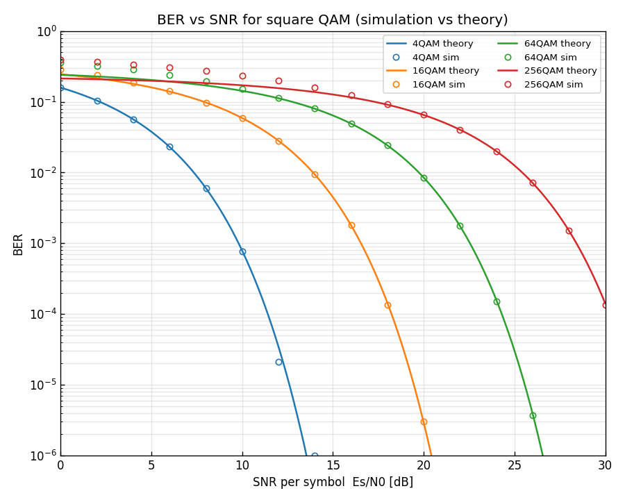
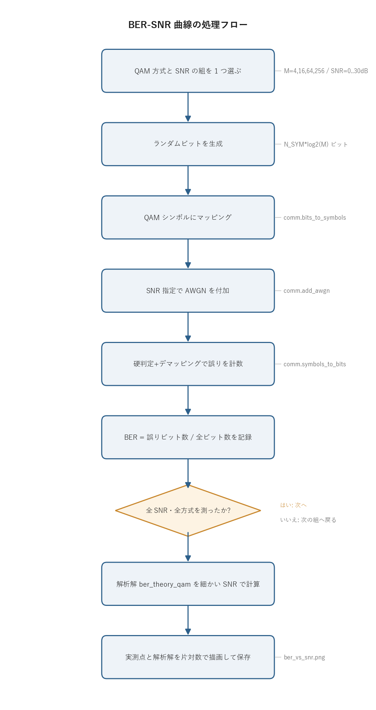

# 問題2-1: BER の SNR 依存性と解析解との比較

## 問題

4QAM / 16QAM / 64QAM / 256QAM における BER の SNR 依存性を計算し、グラフにする。
横軸は SNR [dB]、縦軸は BER(対数表示)。得られた計算結果を解析解(近似式でもよい)と比較する。

ここで BER (bit error rate, ビット誤り率) は「送ったビットのうち、受信側で取り違えたビットの割合」。
SNR (signal-to-noise ratio, 信号対雑音比) は信号電力と雑音電力の比で、ここでは 1 シンボルあたりの値 $E_s/N_0$ を使う。
雑音が強い(SNR が低い)ほど誤りやすく、BER は大きくなる。その関係を方式ごとに調べるのがこの問題になる。

## 実行結果(出力)

```
シンボル数/点 = 500000

  4QAM: 測定できた最小BER = 1.00e-06 (SNR=14 dB)
 16QAM: 測定できた最小BER = 3.00e-06 (SNR=20 dB)
 64QAM: 測定できた最小BER = 3.67e-06 (SNR=26 dB)
256QAM: 測定できた最小BER = 1.35e-04 (SNR=30 dB)
```



> **図の読み方**
> - 実線が解析解、○ が実測(モンテカルロ)。
> - 4 本の曲線が右へずれていくのは、同じ BER を得るのに高次 QAM ほど高い SNR が要ることを表す。
> - 実測の○が解析解の線によく乗っており、シミュレーションが正しく動いていると確認できる。
> - 各曲線が途中で途切れているのは、その SNR では誤りが 1 個も出ず BER を測れなかったため(後述の測定下限)。

---

## 0. 処理の流れ

`solution.py` を実行すると、次の順で処理が進む。



外側に「QAM 方式 × SNR」の二重ループがあり、その内側で 1 点ぶんの送受信チェーン
(ビット生成 → マッピング → AWGN → 判定 → 誤り計数)を回して BER を 1 つ測る。
全部の点を測り終えたら、別に細かい SNR 軸で解析解を計算し、実測点と重ねて 1 枚の図にする。
分岐はループの終了判定の 1 箇所だけで、あとは一本道になっている。

---

## 1. モンテカルロ法による BER 測定

BER の SNR 依存性は、各 SNR について「実際にビットを大量に送って誤りを数える」ことで得る。
乱数で大量の試行を回して確率を見積もる、この素朴なやり方を **モンテカルロ法** と呼ぶ。
1 点の手順は問1-6 と同じ送受信チェーンになる。

```
ランダムビット ─→ QAMマッピング ─→ SNR指定でAWGN付加 ─→ 判定+デマッピング ─→ 誤り計数
```

これを SNR = 0, 2, 4, …, 30 dB について繰り返し、(SNR, BER) の点を並べれば曲線になる。

### 測定下限について

1 点あたり $N = 5 \times 10^5$ シンボル。1 シンボルは $k = \log_2 M$ ビットなので、送るビットは全部で $Nk$ 個ある。
誤りが平均で 1 個出るかどうかの境目は BER がおよそ $1/(Nk)$ のあたりで、これより BER が小さくなると
誤りが 1 個も出ず、測定値が 0 になってしまう。対数軸には 0 を置けないので、コードは誤りが出た点だけをプロットする。
出力の「測定できた最小 BER」が方式ごとに $10^{-6}$ 付近で止まっているのはこの下限のためで、
さらに小さい BER まで測るにはシンボル数を増やすしかない。試行回数で精度が決まるのがモンテカルロ法の宿命で、だからこそ解析解が要る。

---

## 2. 解析解(近似式)

グレイ符号化した方形 $M$-QAM の AWGN 通信路における BER は、よく使われる近似式

$$ \mathrm{BER} \approx \frac{4}{\log_2 M}\left(1-\frac{1}{\sqrt M}\right)
Q\!\left(\sqrt{\frac{3}{M-1}\,\gamma_s}\right),
\qquad \gamma_s = \frac{E_s}{N_0} = 10^{\mathrm{SNR[dB]}/10} $$

で与えられる。ここで $Q(x)=\tfrac12\,\mathrm{erfc}(x/\sqrt2)$ は標準正規分布の上側確率
(平均 0・分散 1 のガウス雑音が $x$ より大きくなる確率)。
雑音がしきい値を越えて隣のレベルに飛び込む確率を表していて、$x$ が大きいほど急激に小さくなる。

この式は「方形 QAM = I 軸と Q 軸の独立な 2 つの $\sqrt M$ 値 PAM」という分解から導かれる。
PAM (pulse amplitude modulation) は振幅だけで値を表す変調で、方形 QAM は実部・虚部それぞれが $\sqrt M$ 段の PAM になっている。導出の流れは次の 3 段。

- 1 軸($\sqrt M$ 値 PAM)のシンボル誤り確率: $\;p = 2\!\left(1-\tfrac{1}{\sqrt M}\right)Q\!\left(\sqrt{\tfrac{3\gamma_s}{M-1}}\right)$。
  係数 $2(1-1/\sqrt M)$ は、端のレベルは片側にしか隣がないことを平均した補正にあたる。
- 誤りはほとんど隣のレベルへ起こる。グレイ符号では隣り合うレベルのビット列が 1 ビットしか違わないので、隣への誤り = 1 ビット誤りになる。
- 1 シンボル $k = \log_2 M$ ビットに、I 軸と Q 軸あわせて約 $2p$ の誤りが乗るので、BER $\approx 2p/k$。

これを整理すると上式になる。共通ライブラリの `comm.ber_theory_qam` がこの計算をしている。
4QAM(=QPSK)では $\sqrt M = 2$、$M-1 = 3$ を代入すると $\mathrm{BER} = Q(\sqrt{\gamma_s})$ となり、近似でなく厳密解に一致する。

---

## 3. QAM 次数を上げるほど SNR ペナルティが要る

図の各曲線は、ほぼ平行に右へずれている。同じ BER を達成するのに必要な SNR は、高次になるほど大きい。
目安として BER $= 10^{-3}$ を達成するのに必要な SNR を並べる。

| 方式 | 必要 SNR($E_s/N_0$)の目安 | 隣方式とのペナルティ |
| ---- | --- | --- |
| 4QAM (QPSK) | 約 10 dB | — |
| 16QAM | 約 17 dB | +7 dB |
| 64QAM | 約 23 dB | +6 dB |
| 256QAM | 約 29 dB | +6 dB |

このトレードオフが QAM 設計の要になる。高次 QAM は 1 シンボルで多くのビットを運べる(周波数利用効率が高い)が、
そのぶん高い SNR を要求する。実際の光通信では、使える SNR に応じて最適な QAM 次数を選ぶ。

ペナルティが約 6 dB ずつ並ぶのには理由がある。$M$ を 4 倍(各軸のレベル数を 2 倍)するごとに、
平均電力を 1 に保ったままだと隣のシンボルとの最小距離 $d_\min$ が約半分になる($d_\min \propto 1/\sqrt{M-1}$)。
誤り確率は $d_\min$ で決まり、同じ $d_\min$ を保つには電力を距離の 2 乗ぶん増やす必要がある。
$M$ を 4 倍にすると距離が半分、電力は約 4 倍、デシベルでは $10\log_{10}4 \approx 6$ dB の増加になる。上表のペナルティが約 6 dB ずつなのはこのため。

---

## 4. 関数ごとの詳細

`solution.py` には 1 点ぶんの測定をする `measure_ber` と、全体をつなぐ `main` がある。

### `measure_ber(M, snr_db, rng)`

指定した QAM 方式と SNR で、ランダムビットを送受信して BER を測る関数。

| 項目 | 内容 |
| ---- | ---- |
| 引数 | `M`: QAM 多値数(4/16/64/256)。`snr_db`: SNR [dB]。`rng`: 乱数生成器(再現性のため共有)。 |
| 戻り値 | この 1 点の BER(誤りビット数 ÷ 全ビット数、`float`)。 |

内部の流れ。

1. `k = int(np.log2(M))` で 1 シンボルのビット数を出す(4→2, 16→4, 64→6, 256→8)。
2. `bits = rng.integers(0, 2, size=N_SYM * k)` で `N_SYM` シンボルぶんのランダムな 0/1 を作る。
3. `tx = comm.bits_to_symbols(bits, M)` でビット列を規格化した複素 QAM シンボルに変換する(送信)。
4. `rx = comm.add_awgn(tx, snr_db, signal_power=1.0, rng=rng)` で SNR を指定して白色ガウス雑音を加える(伝送)。
5. `rx_bits = comm.symbols_to_bits(rx, M)` で受信シンボルを最近傍判定し、ビット列に戻す(受信・復調)。
6. `comm.count_bit_errors(bits, rx_bits) / len(bits)` で送信ビットと受信ビットの不一致数を数え、全ビット数で割って BER にする。

`signal_power=1.0` を明示しているのが効いている。`comm.bits_to_symbols` は平均シンボル電力を 1 に規格化して
シンボルを作るので、受信側で電力を測り直さず固定値 1 を渡せる。これで `snr_db` の意味が
「規格化された信号電力 1 に対する SNR」= $E_s/N_0$ にきっちり揃う。

### `main()`

全方式・全 SNR を回して図にする関数。

1. `rng = np.random.default_rng(SEED)` で乱数を初期化する。`SEED=2` 固定なので、何度実行しても同じ結果になる。
2. `snr_fine = np.linspace(0, 30, 300)` で解析解用の細かい SNR 軸(300 点)を作る。実線を滑らかに描くため。
3. 4 つの QAM 方式についてループする。各方式で次をやる。
   - `comm.ber_theory_qam(M, snr_fine)` で解析解の曲線を計算し、実線でプロットする。
   - 測定用 SNR(`SNR_LIST = 0,2,…,30`)を順に回し、各点で `measure_ber` を呼ぶ。`ber > 0` の点だけ
     `meas_snr` `meas_ber` に貯める(BER=0 は対数軸に置けないため捨てる)。
   - 貯めた実測点を○マーカーでプロットし、測定できた最小 BER を表示する。
4. `ax.set_yscale("log")` で縦軸を対数にする。BER は数桁にわたって変化するので対数表示が必須。
5. 軸範囲・ラベル・凡例を整え、`ber_vs_snr.png` に保存する。

---

## 5. コードのポイント

- 実測は誤りが出た点だけプロットする(`if ber > 0`)。誤り 0 の点は対数軸に置けない。
- 解析解は細かい SNR 軸(`linspace(0,30,300)`)で滑らかな曲線として描く。
- `set_yscale("log")` で縦軸を対数に。BER は数桁にわたって変化するので必須。
- 乱数シード固定(`SEED=2`)で結果が再現する。実測点が毎回ぶれないので、解析解との一致を安定して確認できる。

### 実行

```bash
python solution.py
```

標準出力は冒頭の「実行結果(出力)」、生成図は `ber_vs_snr.png` を参照。
処理フロー図 `flow.png` は `python make_flow.py` で作り直せる。

---

## 6. この問題のつながり

ここまでは 1 シンボル = 1 サンプル(1 sample/symbol)の理想的な離散信号を扱ってきた。
次の問2-2 からは、実際の光信号に近づけるためにレイズドコサインによるパルス整形を導入し、
連続波形(オーバーサンプリング)で同じ伝送・BER 評価を行う。
