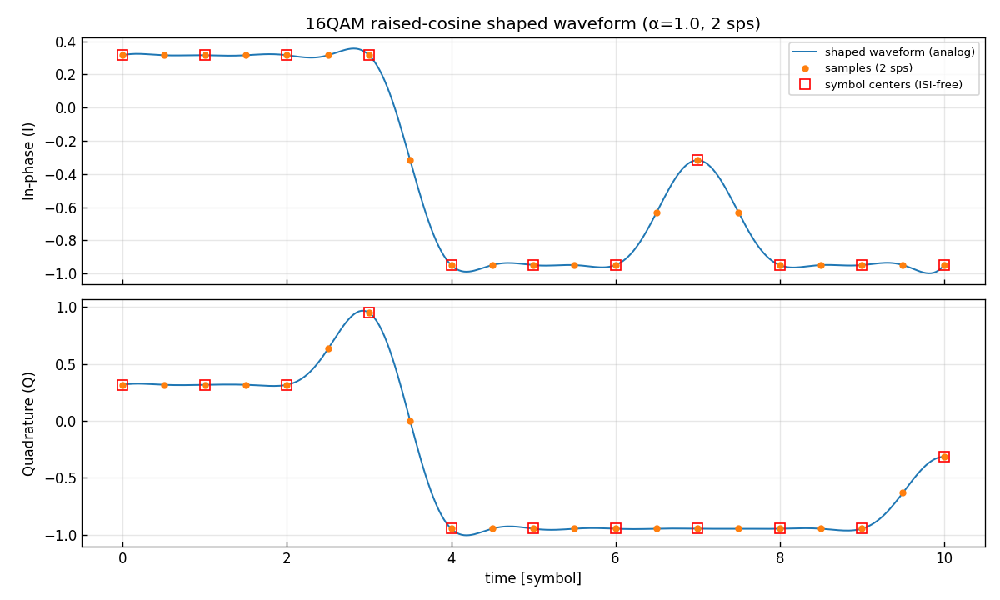
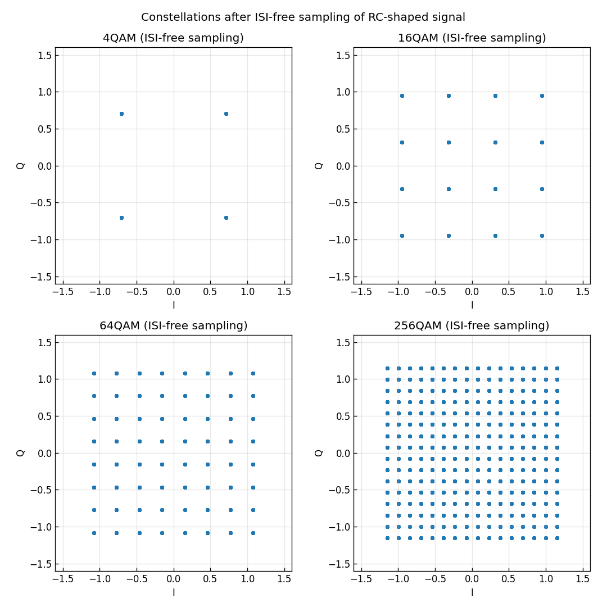
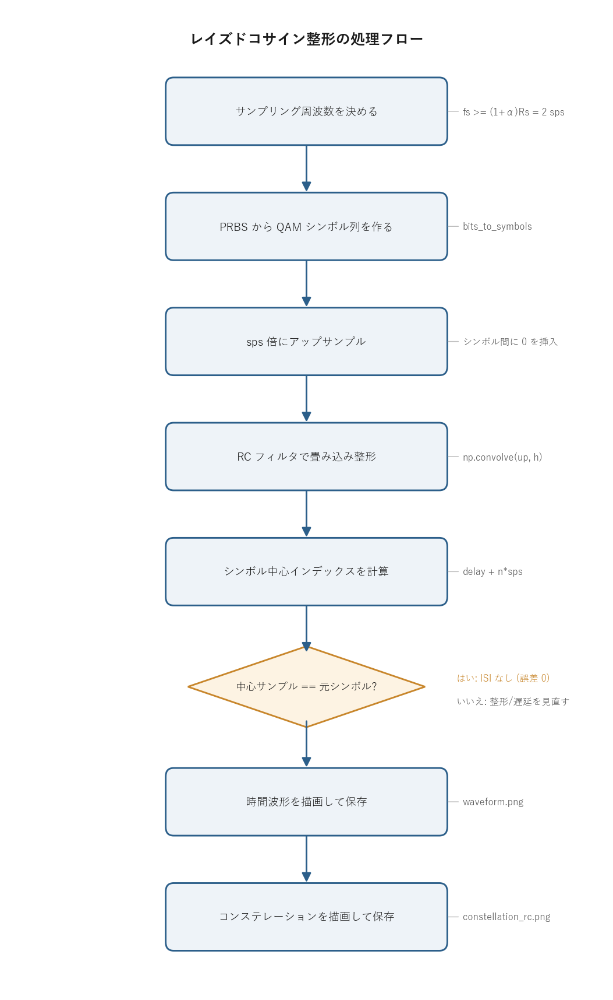

# 問題2-2: レイズドコサイン(raised cosine)スペクトル整形

## 問題

符号速度 $R_s = 50$ Gbaud、ロールオフ係数 $\alpha = 1$ の raised cosine でスペクトル整形した
QAM サンプル列を生成する。

1. このスペクトル整形に必要な **サンプリング周波数** を考える(50 Gsample/s ではサンプリング定理を満たさない)。
2. 整形の **入力に使う系列** が何であるべきかを考える。
3. 整形サンプル列を生成し、**最初の10シンボル時間の時間波形**を図示する。
4. **ISI が生じないタイミングでサンプル抽出**したシンボル列のコンステレーションを図示する。

## 実行結果(出力)

```
シンボルレート Rs = 50.0 Gbaud, ロールオフ α = 1.0
必要サンプリング周波数 fs >= (1+α)Rs = 100 Gsample/s = 2 sample/symbol 以上
(1 sample/symbol = 50.0 Gsample/s ではサンプリング定理を満たさない)

ISI確認 (16QAM): シンボル中心サンプルと元シンボルの最大誤差 = 0.00e+00
```





> **時間波形の読み方**
> - 青い実線が整形後の(アナログの)連続波形。
> - 赤い□が各シンボル中心の値で、ちょうど整形前のシンボル値に一致している(他のシンボルからの干渉ゼロ)。
> - オレンジの点が実際に保持する 2 sample/symbol のサンプル。
> - 赤□が波形の上にぴったり乗っているのが Nyquist パルスの証拠。

---

## 0. 処理の流れ

`solution.py` を実行すると、次の順で処理が進む。



前半はサンプリング周波数の決定とシンボル列の用意、中盤がアップサンプルと RC フィルタによる整形、
後半が時間波形とコンステレーションの描画にあたる。整形はすべて畳み込み一本で進み、
分岐は「シンボル中心でサンプルした値が元のシンボルに戻るか(ISI が無いか)」を確かめる 1 箇所だけになる。
この問題ではその誤差が 0 になり、Nyquist パルスとしての性質を実測で確認している。

---

## 1. 1 sample/symbol では足りない理由(サンプリング周波数)

第1週までは 1 シンボルを 1 サンプルで表す **1 sample/symbol** だった。
$R_s = 50$ Gbaud なら $f_s = 50$ Gsample/s になる。これは「シンボルが点(インパルス)」という理想化で、
実際に光ファイバを伝わる連続波形はまだ表せていない。

$\alpha = 1$ の raised cosine で整形すると、信号の占有帯域(複素ベースバンドの両側)は次のようになる。

$$ B = (1+\alpha)R_s = (1+1)\times 50 = 100\ \text{GHz}. $$

複素ベースバンド信号をエイリアスなく標本化するには、サンプリング周波数が占有帯域以上でなければならない
(複素信号のサンプリング定理)。

$$ f_s \ge B = (1+\alpha)R_s = 100\ \text{Gsample/s} \;\Longrightarrow\; \frac{f_s}{R_s} \ge 2. $$

最低でも **2 sample/symbol** 必要になる。$f_s = 50$ Gsample/s(1 sps)では帯域 100 GHz を
50 Gsample/s で標本化することになり、$f_s \ge B$ を満たさずエイリアシングが起きる。
ここでは最小の 2 sample/symbol(`SPS = 2`)を採用する。

実信号(片側スペクトルだけを持つ通常の信号)なら、サンプリング定理は「最高周波数の 2 倍」を要求する。
複素ベースバンド信号は正負両方の周波数に独立な成分を持つので、要求は「占有帯域そのもの以上」に変わる。
ここで $f_s$ と帯域 $B$ が同じ 100 という数字で結びつくのはこのため。

## 2. 整形の入力に使う系列(0挿入アップサンプリング)

スペクトル整形を行う入力サンプル列として正しいのは、
**QAMシンボル列を $sps$ 倍にアップサンプル(シンボルとシンボルの間に $sps-1$ 個の 0 を挿入)した列**である。

```python
up = np.zeros(len(sym) * sps, dtype=complex)
up[::sps] = sym          # シンボルを sps 間隔に置き、間は 0
shaped = np.convolve(up, h)   # RCフィルタ h で整形
```

0 を挿入する理由は、連続信号の作り方をそのまま離散に写したいからである。
送りたい連続波形は、シンボルを $T$ 間隔のインパルス列にしてパルス $h$ を畳み込んだもの

$$ x(t)=\sum_n s[n]\,h(t-nT) $$

であり、これを標本化したものが整形サンプル列にあたる。インパルス列を $T = sps$ サンプル間隔で並べる操作が
「$sps$ 間隔に 0 を挟む」アップサンプル、パルス $h$ との畳み込みがフィルタ係数との `np.convolve` に対応する。
シンボルを単純に繰り返す(`np.repeat`)と矩形パルスを掛けたことになり、線形補間すると三角パルスを掛けたことになる。
どちらもスペクトルが変わってしまうので、整形の入力としては誤りになる。

## 3. raised cosine とゼロ ISI(Nyquist 条件)

raised cosine パルスの時間波形は次の形をしている。

$$ h(t) = \underbrace{\frac{\sin(\pi t/T)}{\pi t/T}}_{\text{sinc}}\cdot
\frac{\cos(\pi\alpha t/T)}{1-(2\alpha t/T)^2}. $$

第1因子の sinc がシンボル間隔ごとにゼロを通る土台を作り、第2因子の
$\cos / (1-(2\alpha t/T)^2)$ がそのゼロ点を保ったまま時間応答の裾を速く減衰させる窓として効く。
肝心の性質が **Nyquist 条件**である。

$$ h(0)=1,\qquad h(mT)=0\quad(m=\pm1,\pm2,\dots). $$

自分のシンボル中心では値 1、他のシンボル中心では値 0 になる。だから整形波形を
シンボル中心 $t=nT$ でサンプルすると、隣のシンボルからの寄与がすべて 0 になり、元のシンボル $s[n]$ がそのまま得られる。
これが **ISI(符号間干渉, Inter-Symbol Interference)が生じないタイミング**である。

出力の「最大誤差 = 0.00e+00」は、シンボル中心サンプルが元シンボルと完全に一致したことの確認になる。
雑音が無ければ、ISI-free サンプリング後のコンステレーション(下図)は整形前と同じ完全な格子に戻る。

> **ロールオフ α の意味**
> $\alpha$ は sinc にどれだけ余分な帯域を足して時間応答の裾を速く減衰させるかを決める。
> $\alpha = 0$ は帯域最小($B=R_s$)だが裾が長く、サンプリング点が少しずれただけで ISI が出る。
> $\alpha = 1$ は帯域が倍($B=2R_s$)になる代わりに裾の減衰が速く、タイミング誤差に強い。本問は $\alpha = 1$。

## 4. 関数ごとの詳細

`solution.py` には連続波形用の `rc_pulse`、整形本体の `pulse_shape`、全体をつなぐ `main` がある。
RC フィルタ係数そのものは共通モジュール `comm.rc_filter` が作る。順に見ていく。

### `rc_filter(beta, sps, span)`(`comm.py`)

raised cosine の FIR 係数を作る関数。`solution.py` からは `pulse_shape` 経由で呼ばれる。

| 項目 | 内容 |
| ---- | ---- |
| 引数 | `beta`: ロールオフ係数 $\alpha$。`sps`: 1 シンボルあたりサンプル数。`span`: フィルタ長[シンボル]。 |
| 戻り値 | ピークが 1 に規格化された対称 FIR 係数(長さ `span*sps+1`)。 |

内部の流れ。

1. `n = arange(-span*sps/2, span*sps/2+1)` でサンプル番号を作り、`t = n/sps` でシンボル時間単位に直す。
2. `sinc = np.sinc(t)` と `cos = cos(πβt)/(1-(2βt)^2)` を計算し、`h = sinc * cos` を返す。
3. 分母 $1-(2\alpha t/T)^2$ が 0 になる点($|2\beta t|=1$)は値が発散するので、極限値 $\pi/4$ で埋める。
   この置き換えを忘れると係数に `nan` が入り、整形波形が壊れる。

### `rc_pulse(t, beta)`

連続時間の raised cosine パルス $h(t)$ を、任意の時刻 `t`(シンボル時間単位)で評価する関数。
表示用の滑らかな曲線を引くためだけに使い、実処理(2 sps)とは別物。

| 項目 | 内容 |
| ---- | ---- |
| 引数 | `t`: 時刻の配列(シンボル時間単位)。`beta`: ロールオフ係数 $\alpha$。 |
| 戻り値 | 各時刻でのパルス値 $h(t)$ の配列。 |

中身は `rc_filter` と同じ式だが、離散サンプル点ではなく連続的な `t` を受け取る点が違う。
特異点($|2\beta t|=1$)を $\pi/4$ で埋める処理も同じ。`main` では各シンボルについて
`sym[n] * rc_pulse(t_fine - n, BETA)` を足し合わせ、$x(t)=\sum_n s[n]h(t-nT)$ を高分解能で再構成する。

### `pulse_shape(sym, sps, beta, span)`

シンボル列を RC 整形する本体。0 挿入アップサンプルとフィルタ畳み込みをまとめる。

| 項目 | 内容 |
| ---- | ---- |
| 引数 | `sym`: QAM シンボル列。`sps`: 1 シンボルあたりサンプル数。`beta`: $\alpha$。`span`: フィルタ長[シンボル]。 |
| 戻り値 | `(shaped, delay, h)`。`shaped` は整形サンプル列、`delay` は群遅延[サンプル]、`h` はフィルタ係数。 |

内部の流れ。

1. `h = comm.rc_filter(beta, sps, span)` でフィルタ係数を取る。
2. `up = np.zeros(len(sym)*sps, dtype=complex)` を確保し、`up[::sps] = sym` でシンボルを $sps$ 間隔に置く。
   間のサンプルは 0 のまま(これがアップサンプル)。
3. `shaped = np.convolve(up, h)` で整形する。
4. `delay = (len(h)-1)//2` を群遅延として返す。

`up[::sps] = sym` の 1 行が、第2節の「シンボルを $T=sps$ 間隔のインパルス列にする」を実現している。
畳み込みは対称フィルタ全体を通すぶん、出力が左右に `(len(h)-1)/2` サンプルずれる。
そのずれが `delay` で、`shaped[delay + n*sps]` がちょうど $n$ 番目のシンボル中心(ISI が無いタイミング)になる。

### `main()`

全体をつなぐ関数。

1. `fs = (1+BETA)*RS_GBD` を計算し、必要サンプリング周波数(2 sps 以上)を表示する。
2. 16QAM で `comm.generate_prbs(15)` から `bits_to_symbols` でシンボル列を作り、`pulse_shape` で整形する。
3. `centers = delay + arange(len(sym))*SPS` でシンボル中心を抜き出し、`sampled - sym` の最大誤差を表示する。
   これが ISI が無いことの確認(誤差 0)。
4. `rc_pulse` で 32 倍分解能の連続波形 `x_fine` を再構成し、I・Q それぞれに連続波形・2 sps サンプル・
   シンボル中心を重ねて `waveform.png` に保存する。
5. 4 方式(4/16/64/256QAM)について整形 → ISI-free 抽出 → 散布図を描き、`constellation_rc.png` に保存する。
   図のラベルは日本語フォントに依存しないよう英語にしている。

## 5. 時間波形の見どころ

図(16QAM, I・Q)を見るとこうなる。

- 青い連続波形は滑らかに繋がっている(これが実際に光ファイバを伝わる電界の包絡線)。
- 赤い□(シンボル中心)は必ず波形の上に乗り、整形前のシンボル値(16QAM の格子値 ±0.32, ±0.95 など)に一致する。
- オレンジ点(2 sps サンプル)もすべて連続波形の上にある。2 sps というぎりぎりの密度でもこの帯域の波形を
  エイリアスなく表現できていて、サンプリング定理を満たしている。

赤□がシンボル中心で値 1 のパルスだけを拾い、隣のパルスがちょうど 0 を通っている様子が、
第3節の Nyquist 条件をそのまま絵にしたものになる。

## 6. 実行

```bash
python solution.py
```

標準出力は冒頭の「実行結果(出力)」、生成図は `waveform.png` と `constellation_rc.png` を参照。
処理フロー図 `flow.png` は `python make_flow.py` で作り直せる。

## 7. この問題のつながり

これで「1 sample/symbol の理想点」から「実際の連続波形(2 sps の整形サンプル列)」へ移行した。
次の **問2-3** では、この整形サンプル列に複素 AWGN を加え、**問2-4** で ISI-free タイミングで
ダウンサンプリングして復調し BER を評価する。**問2-5** で BER の SNR 依存性を描き、
**問2-6** では波形を時間遅延させたときの変化を見る。
