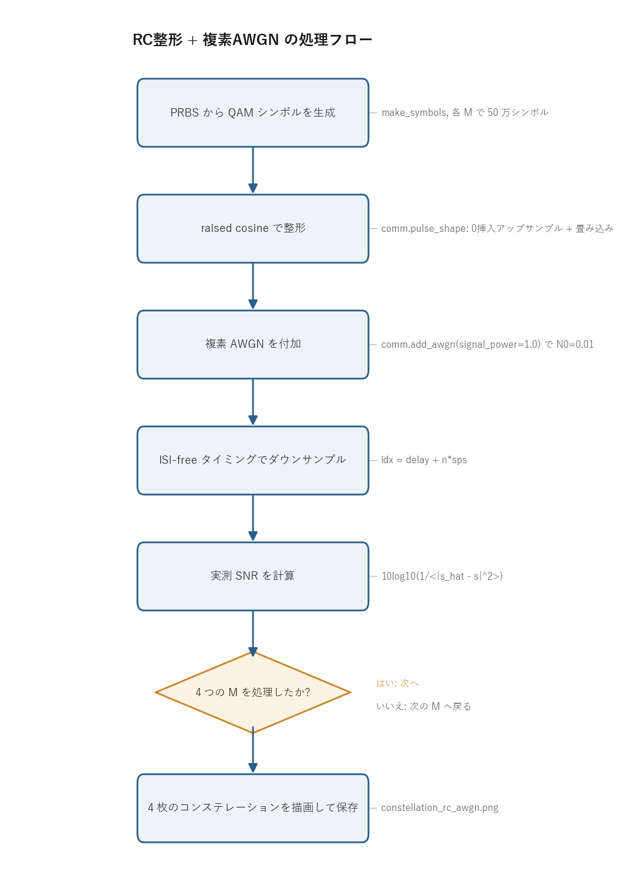

# 問題2-3: スペクトル整形 QAM サンプル列への複素 AWGN 付加

## 問題

α=1 raised cosine で整形した QAM サンプル列に、**SNR = 20 dB に相当する複素 AWGN** を付加する。
**サンプル数は $10^6$**。ISI が生じないタイミングでサンプル抽出したシンボル列のコンステレーションを図示する。

4QAM, 16QAM, 64QAM, 256QAM の 4 種類について同じ処理を行い、整形後でも判定点では第1週(1 sps)と同じ結果になることを確かめる。

## 実行結果(出力)

```
サンプル数=1000000 (2 sps -> 500000 シンボル), SNR=20.0 dB

  4QAM: ダウンサンプル後 実測SNR = 20.00 dB
 16QAM: ダウンサンプル後 実測SNR = 20.00 dB
 64QAM: ダウンサンプル後 実測SNR = 20.01 dB
256QAM: ダウンサンプル後 実測SNR = 20.00 dB
```


> **図の読み方**
> - 4 枚とも、問1-3(1 sample/symbol)とほぼ同じ見た目になる。raised cosine が Nyquist パルスなので、ISI-free タイミングでサンプルすれば、整形してもしなくても判定点での信号・雑音が同じになるため。
> - 多値数が上がるほど点と点の間隔が狭くなり、SNR=20 dB の雑音雲が隣の点へ届きやすくなる。256QAM だけ雲が大きく重なって見えるのはこのため。

---

## 0. 処理の流れ

`solution.py` を実行すると、次の順で処理が進む。



QAM シンボルの生成、raised cosine による整形、複素 AWGN の付加、ISI-free ダウンサンプリング、SNR の確認という一本道で、これを 4 つの多値数 M について繰り返す。前半(シンボル生成から整形まで)が送信側、AWGN 付加が伝送路、ダウンサンプリング以降が受信側の処理にあたる。分岐は「4 つの M を処理したか」の繰り返し判定の 1 箇所だけになる。

---

## 1. サンプル数とシンボル数の関係

$2$ sample/symbol なので、**サンプル数 $10^6$ = シンボル数 $5\times10^5$**。
第1週は 1 sps だったので「サンプル数=シンボル数」だったが、整形後はサンプルのほうが多い。
コードでは総サンプル数 `N_SAMPLE = 10**6` を先に決め、`N_SYM = N_SAMPLE // SPS` でシンボル数を逆算している。整形時にフィルタ長ぶんだけ末尾が伸びるので、最終的なサンプル列はこれより少し長くなる。

## 2. 複素 AWGN を「どの電力基準で」加えるか

ここが整形信号で一番まちがえやすいところ。整形後の連続波形は、パルスの裾の重なりで
**サンプルごとに振幅が大きく変動**し、その平均電力はシンボル電力(=1)とは一致しない。

SNR はシンボル判定点(ISI-free タイミング)での比で定義する。
そこでは Nyquist 性により信号は元のシンボルそのもの(電力 1)になる。判定点で SNR = 20 dB にするには、各サンプルに加える複素雑音の電力を

$$ N_0 = \frac{P_\text{symbol}}{\mathrm{SNR_{lin}}} = \frac{1}{10^{20/10}} = 0.01 $$

とすればよい。コードでは `signal_power=1.0`(シンボル電力)を明示して `comm.add_awgn` を呼ぶ。

```python
rx = comm.add_awgn(shaped, SNR_DB, signal_power=1.0, rng=rng)   # 各サンプルに N0=0.01 の複素雑音
```

`signal_power` を省略すると `add_awgn` は整形波形の実測平均電力から雑音を決めてしまい、判定点 SNR が狙いとずれる。ここで明示的に `1.0` を渡すのがこの問題の肝になる。

AWGN は白色(各サンプル独立)なので、後でダウンサンプリングしても、残った各サンプルの雑音電力は 0.01 のまま変わらない。
出力の「ダウンサンプル後 実測SNR = 20.00 dB」は、判定点で狙いどおり 20 dB になったことの確認になる。

> **なぜシンボル電力基準で正しいのか**
> 本問は送信側に raised cosine 全体をかけ、受信側では整合フィルタを使わずシンボル中心を直接サンプルする構成にしている。判定点の信号は元シンボル(電力 1)、雑音は各サンプルの生の AWGN(電力 0.01)。だから判定点 SNR = 1/0.01 = 20 dB が厳密に成り立ち、第1週の理論・結果とそのまま比較できる。

## 3. ISI-free ダウンサンプリング

雑音付加後、シンボル中心(群遅延 + $n\cdot sps$)のサンプルだけを取り出す
(共通ライブラリ `comm.downsample_isi_free`)。これで「1 シンボル 1 サンプル」の受信シンボル列に戻る。

```python
rx_sym = comm.downsample_isi_free(rx, delay, SPS, N_SYM)   # idx = delay + n*sps
```

`delay`(群遅延)は `pulse_shape` が返す値で、フィルタ長から `(len(h)-1)//2` で決まる。シンボル中心はこの遅延ぶん後ろにずれた位置にあるので、そこから `sps` 刻みで拾えば各シンボルの中心が取れる。

raised cosine が Nyquist 条件 $h(mT)=\delta_{m0}$ を満たすので、雑音が無ければこの抽出で
元シンボルが完全に戻る(問2-2 で確認済み)。雑音があっても、得られる受信シンボルは
「元シンボル + 電力 0.01 の複素ガウス雑音」となり、第1週の 1 sps の受信シンボルと統計的に同じになる。
だからコンステレーションも問1-3 とそっくりになる。

---

## 4. 関数ごとの詳細

`solution.py` には `make_symbols` と `main` の 2 つがあり、信号処理の中身は共通ライブラリ `comm.py` に置いている。ここでは両方を順に見ていく。

### `make_symbols(M, n_sym)`

PRBS から QAM シンボル列を作って、指定したシンボル数まで並べる関数。

| 項目 | 内容 |
| ---- | ---- |
| 引数 | `M`: QAM の多値数(4/16/64/256)。`n_sym`: 必要なシンボル数。 |
| 戻り値 | 長さ `n_sym` の規格化済み複素 QAM シンボル列(ndarray)。 |

内部の流れ。

1. `prbs = comm.generate_prbs(15)` で長さ 32767 の PRBS を 1 周期生成する。
2. `k = int(np.log2(M))` で 1 シンボルあたりのビット数を求める(4QAM なら 2、256QAM なら 8)。
3. `np.tile(prbs, k)` で PRBS を `k` 周期ぶんつなぎ、`comm.bits_to_symbols(..., M)` で QAM シンボルにマップして 1 ブロック `block` を作る。
4. `reps = int(np.ceil(n_sym / len(block)))` で必要な繰り返し回数を計算し、`np.tile(block, reps)[:n_sym]` で `n_sym` 個ちょうどに切り出して返す。

PRBS を `k` 倍してから一括でマッピングしているので、ビット長がちょうど `k` の倍数になり `bits_to_symbols` の長さ制約を満たす。ブロックを並べて足りない長さを埋め、最後にスライスで切りそろえるという作りになっている。

### `main()`

全体をつなぐ関数。4 つの多値数について同じ処理を繰り返す。

1. `rng = np.random.default_rng(SEED)` で乱数生成器を作る(`SEED=3` で再現性を確保)。
2. `2x2` のサブプロットを用意し、`QAM_ORDERS = [4, 16, 64, 256]` を 1 枚ずつ割り当てる。
3. 各 M について次をやる。
   - `tx_sym = make_symbols(M, N_SYM)` で送信シンボルを生成する。
   - `shaped, delay = comm.pulse_shape(tx_sym, SPS, BETA, SPAN)` で raised cosine 整形する。`delay` は群遅延。
   - `rx = comm.add_awgn(shaped, SNR_DB, signal_power=1.0, rng=rng)` で判定点 SNR=20 dB になるよう雑音を付加する。
   - `rx_sym = comm.downsample_isi_free(rx, delay, SPS, N_SYM)` でシンボル中心を抽出する。
   - `snr_meas = 10*np.log10(1.0/np.mean(np.abs(rx_sym - tx_sym[:len(rx_sym)])**2))` で実測 SNR を計算して表示する。
4. 先頭 4000 シンボルを `ax.scatter` で散布図にし、I-Q 平面のコンステレーションを描く。`alpha=0.15` で点の重なり具合(雑音雲の濃さ)が見えるようにしている。
5. 4 枚をまとめて `constellation_rc_awgn.png` に保存する。

実測 SNR の式 $10\log_{10}\!\big(1/\langle|\hat s-s|^2\rangle\big)$ は、受信シンボル `rx_sym` と送信シンボル `tx_sym` の差(=残った雑音)の平均電力を分母に置いたもの。信号電力 1 をこの雑音電力で割って dB に直している。これが 20 dB に乗れば、整形・雑音・抽出の一連の処理が狙いどおり動いていることになる。

---

## 5. 使っている共通ライブラリ関数

`solution.py` が呼ぶ `comm.py` の関数を、引数と役割でまとめておく。

| 関数 | 役割 |
| ---- | ---- |
| `comm.generate_prbs(15)` | LFSR で長さ 32767 の PRBS を 1 周期生成(問1 と同じ)。 |
| `comm.bits_to_symbols(bits, M)` | ビット列をグレイ符号化した規格化複素 QAM シンボルにマップ。 |
| `comm.pulse_shape(sym, sps, beta, span)` | 0 挿入アップサンプル + RC 畳み込み。`(shaped, delay)` を返す。 |
| `comm.add_awgn(shaped, snr_db, signal_power=1.0)` | 指定電力基準で複素 AWGN を付加。判定点 SNR を 20 dB にする。 |
| `comm.downsample_isi_free(rx, delay, sps, n_sym)` | `idx = delay + n*sps` でシンボル中心を抽出。 |

`pulse_shape` の中身は、`up[::sps] = sym` で `sps` サンプルおきにシンボルを置いた配列を作り、`rc_filter` で得た RC インパルス応答 `h` と `np.convolve` で畳み込むという 2 段構成。群遅延は `(len(h)-1)//2` で、これが `delay` として返ってくる。

`add_awgn` は信号電力 `signal_power` を `snr_lin = 10**(snr_db/10)` で割って複素雑音の総電力 `N0` を求め、実部・虚部に半分ずつ($\sigma=\sqrt{N_0/2}$)分配して足す。複素ガウス雑音なので 1 軸あたりの分散は全体の半分になる。

### 実行

```bash
python solution.py
```

標準出力は冒頭の「実行結果(出力)」、生成図は `constellation_rc_awgn.png` を参照。処理フロー図 `flow.png` は `python make_flow.py` で作り直せる。

---

## 6. この問題のつながり

整形・雑音・ダウンサンプリングまでが揃った。次の **問2-4** では、ここで得た受信シンボルを
復調・デマッピングして **BER** を求め、**問2-5** でその **SNR 依存性**を描く。
整形しても判定点では第1週と同じになるので、BER も第1週・問2-1 と一致するはずである。
