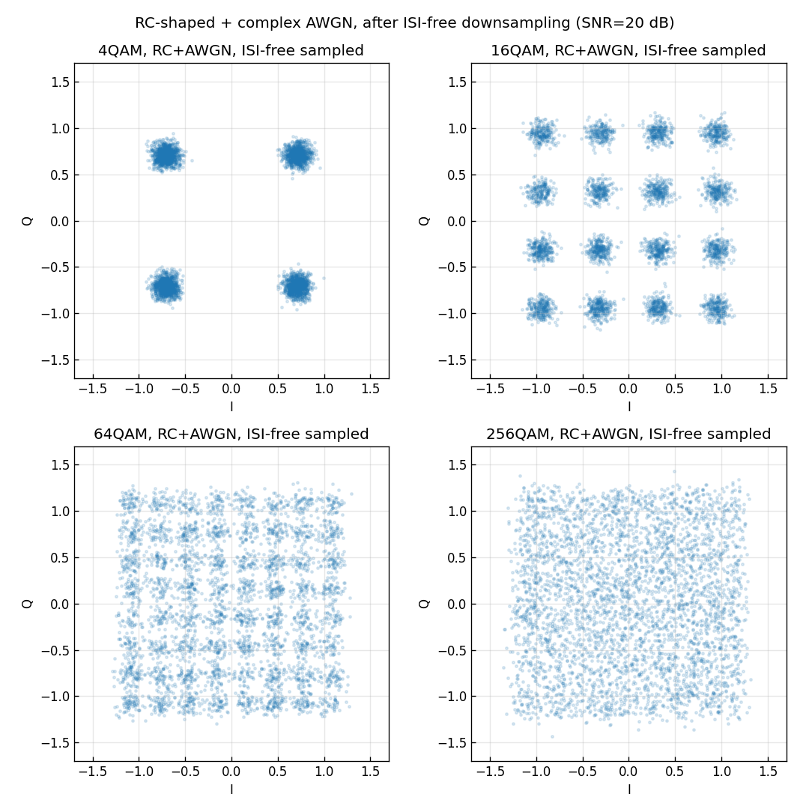

# 問題2-3: スペクトル整形 QAM サンプル列への複素 AWGN 付加

## 問題

α=1 raised cosine で整形した QAM サンプル列に、**SNR = 20 dB に相当する複素 AWGN** を付加する。
**サンプル数は $10^6$**。ISI が生じないタイミングでサンプル抽出したシンボル列のコンステレーションを図示する。

## 実行結果(出力)

```
サンプル数=1000000 (2 sps -> 500000 シンボル), SNR=20.0 dB

  4QAM: ダウンサンプル後 実測SNR = 20.00 dB
 16QAM: ダウンサンプル後 実測SNR = 20.00 dB
 64QAM: ダウンサンプル後 実測SNR = 20.01 dB
256QAM: ダウンサンプル後 実測SNR = 20.00 dB
```



> **図の読み方** — 問1-3(1 sample/symbol)とほぼ同じ見た目になっている。これは、
> raised cosine が Nyquist パルスなので **ISI-free タイミングでサンプルすれば、整形してもしなくても
> 判定点での信号・雑音は同じ**になるため。256QAM だけ雲が大きく重なるのも同じ。

---

## 1. サンプル数とシンボル数の関係

$2$ sample/symbol なので、**サンプル数 $10^6$ = シンボル数 $5\times10^5$**。
第1週は 1 sps だったので「サンプル数=シンボル数」だったが、整形後はサンプルのほうが多い点に注意。

## 2. 複素 AWGN を「どの電力基準で」加えるか

ここが整形信号で一番まちがえやすいところ。整形後の連続波形は、パルスの裾の重なりで
**サンプルごとに振幅が大きく変動**し、その平均電力はシンボル電力(=1)とは一致しない。

しかし **SNR はシンボル判定点(ISI-free タイミング)での比で定義する**のが自然で、
そこでは Nyquist 性により信号は元のシンボルそのもの(電力 1)。したがって、
判定点で SNR = 20 dB にするには、各サンプルに加える複素雑音の電力を

$$ N_0 = \frac{P_\text{symbol}}{\mathrm{SNR_{lin}}} = \frac{1}{10^{20/10}} = 0.01 $$

とすればよい。コードでは `signal_power=1.0`(シンボル電力)を明示して `comm.add_awgn` を呼ぶ:

```python
rx = comm.add_awgn(shaped, SNR_DB, signal_power=1.0, rng=rng)   # 各サンプルに N0=0.01 の複素雑音
```

AWGN は白色(各サンプル独立)なので、後でダウンサンプリングしても、残った各サンプルの雑音電力は 0.01 のまま。
出力の「ダウンサンプル後 実測SNR = 20.00 dB」は、判定点で狙いどおり 20 dB になったことの確認。

> **なぜシンボル電力基準で正しいのか** — 本問は送信側に raised cosine 全体をかけ、受信側では
> 整合フィルタを使わずシンボル中心を直接サンプルする構成。判定点の信号は元シンボル(電力1)、
> 雑音は各サンプルの生の AWGN(電力 0.01)。だから判定点 SNR = 1/0.01 = 20 dB が厳密に成り立ち、
> 第1週の理論・結果とそのまま比較できる。

## 3. ISI-free ダウンサンプリング

雑音付加後、シンボル中心(群遅延 + $n\cdot sps$)のサンプルだけを取り出す
(共通ライブラリ `comm.downsample_isi_free`)。これで「1シンボル1サンプル」の受信シンボル列に戻る。

```python
rx_sym = comm.downsample_isi_free(rx, delay, SPS, N_SYM)   # idx = delay + n*sps
```

raised cosine が Nyquist 条件 $h(mT)=\delta_{m0}$ を満たすので、雑音が無ければこの抽出で
元シンボルが完全に戻る(問2-2 で確認済み)。雑音があっても、得られる受信シンボルは
「元シンボル + 電力 0.01 の複素ガウス雑音」となり、**第1週の 1 sps の受信シンボルと統計的に同じ**。
だからコンステレーションも問1-3 とそっくりになる。

## 4. コードのポイント

- `comm.pulse_shape(sym, SPS, BETA, SPAN)` — 0挿入アップサンプル + RC畳み込み(問2-2の共通化版)。
- `comm.add_awgn(shaped, SNR_DB, signal_power=1.0)` — 判定点 SNR が 20 dB になるよう雑音付加。
- `comm.downsample_isi_free(rx, delay, SPS, N_SYM)` — ISI-free タイミングでシンボル抽出。
- 実測 SNR は $10\log_{10}(1/\langle|\hat s-s|^2\rangle)$ で、ダウンサンプル後に確認している。

### 実行

```bash
python solution.py
```

## 5. この問題のつながり

整形・雑音・ダウンサンプリングまでが揃った。次の **問2-4** では、ここで得た受信シンボルを
復調・デマッピングして **BER** を求め、**問2-5** でその **SNR 依存性**を描く。
整形しても判定点では第1週と同じになるので、BER も第1週・問2-1 と一致するはずである。
