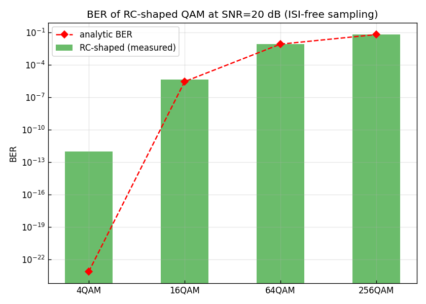
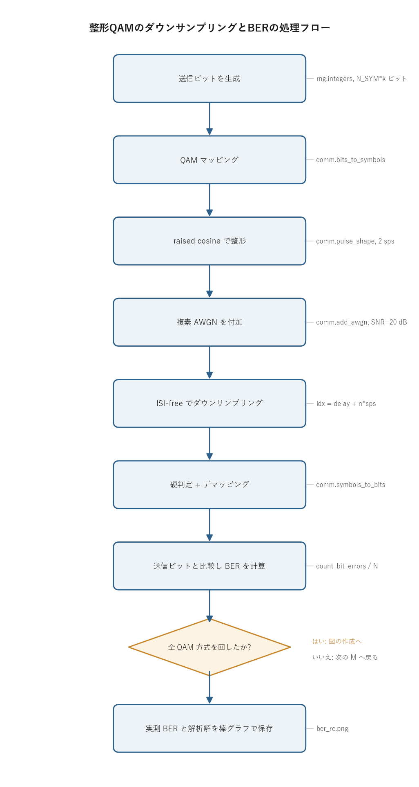

# 問題2-4: ダウンサンプリング・QAM復調・デマッピングと BER

## 問題

複素 AWGN が付加されたスペクトル整形 QAM サンプル列を、ISI が生じないタイミングでサンプル抽出
(ダウンサンプリング)する。得られたサンプル列に QAM 復調(判定)+ QAMデマッピングを行って
復調ビット系列を求め、ビット誤り率(BER)を計算する。

入力にあたるサンプル列は問2-3 までで作ったもので、送信シンボルを 2 sample/symbol の raised cosine で
整形し、そこに複素 AWGN を載せたものになる。raised cosine は Nyquist パルスなので、判定点では整形なし
(第1週)と同じ受信シンボルになり、BER も第1週・解析解と一致するはずである。この問題は、その一致を
実際の送受信チェーンで確かめるところにある。

## 実行結果(出力)

```
α=1.0, 2 sps, シンボル数=500000, SNR=20.0 dB

     方式       誤りビット数       BER(整形,実測)       BER(解析解)
    4QAM            0        0.000e+00      7.620e-24
   16QAM            9        4.500e-06      2.904e-06
   64QAM        25025        8.342e-03      8.486e-03
  256QAM       262072        6.552e-02      6.517e-02
```



> **図の読み方**
> - 緑の棒が raised cosine 整形ありの実測 BER、赤◇が解析解。
> - 縦軸は対数(BER は小さい桁まで動くため)。横軸は 4 つの QAM 方式。
> - どの方式でも実測と解析解が重なる。整形しても判定点では理想点(1 sps)と同じ受信シンボルになるので、この結果になる。

---

## 0. 処理の流れ

`solution.py` を実行すると、4 つの QAM 方式(4/16/64/256)それぞれについて次の順で処理が進む。



前半(ビット生成からダウンサンプリングまで)が送受信チェーンの再現、後半(硬判定から BER)が
復調と評価にあたる。送信ビットをそのまま手元に残しておき、復元したビットと突き合わせて誤り数を数える。
分岐は「全 QAM 方式を回したか」の 1 箇所だけで、4 方式ぶんの BER がそろったら最後にまとめて棒グラフにする。

---

## 1. ダウンサンプリング(ISI-free 抽出)

「ダウンサンプリング」とは、2 sample/symbol の整形サンプル列から、シンボル中心(ISI が生じないタイミング)
だけを取り出して 1 sample/symbol に戻すことである。

```python
rx_sym = comm.downsample_isi_free(rx, delay, SPS, N_SYM)   # idx = delay + n*sps
```

整形サンプル列は、各シンボルを `sps` 倍にアップサンプル(間に 0 を挿入)してから raised cosine と
畳み込んで作る。畳み込みでフィルタの群遅延 `delay = (len(h)-1)/2` ぶんだけ全体が後ろにずれるので、
n 番目のシンボル中心は `delay + n*sps` の位置に来る。ここを 1 サンプルおき(`sps` 間隔)に拾えば、
シンボルレートの 1 sample/symbol 列に戻る。

> **数値例(間引き位置とシンボル復元)**
>
> 仕組みを小さい配列で追う。`sps=2`、`span=2` の RC フィルタは全長 `span*sps+1 = 5` 点で、係数は
>
> $$h = [\,0,\ 0.5,\ 1,\ 0.5,\ 0\,], \qquad \texttt{delay} = (5-1)/2 = 2$$
>
> となる(`h[2]=1` がピーク、両隣の中心 `h[0]=h[4]=0` が Nyquist のゼロ点)。送信シンボルを `[1, -1, 1]`
> とすると、`up[::sps]=sym` で 0 を挟んで `up = [1, 0, -1, 0, 1, 0]`、これを `h` と畳み込んだ整形列は
>
> | index | 0 | 1 | **2** | 3 | **4** | 5 | **6** | 7 | 8 | 9 |
> | ----- | - | - | --- | - | --- | - | --- | - | - | - |
> | shaped | 0 | 0.5 | **1** | 0 | **−1** | 0 | **1** | 0.5 | 0 | 0 |
>
> になる。`idx = delay + n*sps = [2, 4, 6]`(太字)を拾うと `shaped[idx] = [1, -1, 1]` で、送信シンボルが
> そのまま戻る。間の `index 3, 5` がちょうど 0 なのは、隣り合うパルスがその点で打ち消し合うため
> (例えば index 3 は、シンボル +1 の裾 `0.5` とシンボル −1 の裾 `-0.5` の和で 0)。`delay` を足し忘れて
> `idx = [0, 2, 4]` を拾うと `[0, 1, -1]` となり、中心からずれて値が壊れる。実際の本問は `span=12` なので
> `len(h)=25`、`delay=12`、間引き位置は `idx = 12 + n*2` になる。

### なぜシンボル中心では干渉が消えるのか

raised cosine は Nyquist の第一基準を満たすパルスで、インパルス応答 $h(t)$ が

$$h(0)=1, \qquad h(nT)=0 \quad (n=\pm1,\pm2,\dots)$$

という形をしている($T$ はシンボル周期)。自分のシンボル中心では値が 1、ほかのシンボル中心では
ちょうど 0 を通る。複数のシンボルを重ねて送っても、ある中心時刻で値を読むと、他シンボルのパルスは
そこで 0 になっているので寄与しない。残るのは自分のシンボルだけになる。これが符号間干渉
(ISI, inter-symbol interference)がゼロになる仕組みで、判定点での受信値は「元シンボル + 雑音」という
きれいな形になる。

ロールオフ係数 $\alpha$(コードの `BETA=1.0`)は、このゼロ点を保ったまま帯域を広げて時間応答の裾を
速く減衰させるためのパラメータで、ゼロ点の位置そのものは $\alpha$ に依らず $nT$ のままになる。だから
$\alpha$ を変えても ISI-free のタイミングは変わらない。

---

## 2. 復調(QAM復調)+ デマッピング

ダウンサンプル後は第1週とまったく同じ処理になる。

- **QAM復調(硬判定)**: 各受信シンボルを最近傍コンステレーション点へ丸める(問1-4)。
- **QAMデマッピング**: 判定したシンボルをグレイ符号の逆変換でビットに戻す(問1-5)。

共通ライブラリでは `comm.symbols_to_bits` がこの 2 つをまとめて行う。方形 QAM は I 軸(実部)と
Q 軸(虚部)が独立な $\sqrt{M}$ 値 PAM なので、判定は各軸で「最も近い振幅レベルはどれか」を求めるだけになる。
得られたビットを送信ビットと比べて BER を計算する。

> **数値例(1 シンボルの判定 → ビット復元)**
>
> 16QAM($L=\sqrt{16}=4$、`qam_norm(16)`$=\sqrt{2\cdot15/3}=\sqrt{10}\approx3.162$)で 1 シンボルを追う。送信ビット
> `0 0 | 1 0`(前半 `00` が I 軸、後半 `10` が Q 軸)をマッピングすると、振幅は I=−3、Q=+3、規格化後の
> 送信シンボルは $(-3+3j)/\sqrt{10}\approx -0.949+0.949j$ になる。
>
> ここに雑音が載って、規格化を戻したスケール($\times\sqrt{10}$)で受信値が $-2.4 + 2.5j$ になったとする。
> 判定は各軸で $\mathrm{idx} = \mathrm{clip}(\mathrm{round}((x+(L-1))/2),\,0,\,L-1)$、振幅 $=2\cdot\mathrm{idx}-(L-1)$ を求める。
>
> | 軸 | 受信(scaled) | $\mathrm{round}((x+3)/2)$ | レベル idx | 判定振幅 |
> | -- | --- | --- | --- | --- |
> | I | $-2.4$ | $\mathrm{round}(0.3)=0$ | 0 | $-3$ |
> | Q | $+2.5$ | $\mathrm{round}(2.75)=3$ | 3 | $+3$ |
>
> 判定振幅 $(-3,+3)$ は送信どおりなので、グレイ符号を逆変換した復元ビットは `0 0 1 0` で送信ビットと一致し、
> このシンボルの誤りは 0。雑音で受信点が $-2.4$ まで動いても、レベル −3 と −1 の判定境界(scaled で $-2$)を
> 越えていないので判定は変わらない、という様子が数値で確認できる。

---

## 3. なぜ整形しても BER が変わらないのか

これがこの問題の最重要点になる。結果を見ると、整形あり(本問)の BER は、整形なし(第1週・問1-6)や
解析解とほぼ一致している。理由は 2 つの性質の組み合わせにある。

1. **Nyquist 性(ゼロ ISI)**: シンボル中心では信号は元シンボルそのもの(電力 1)。整形による干渉が無い。
2. **白色雑音**: AWGN は各サンプル独立で、どの周波数にも一様にエネルギーを持つ。ダウンサンプリングで
   一部のサンプルを捨てても、残った各サンプルの雑音電力は変わらず $N_0$(SNR=20 dB なら 0.01)のままになる。

したがって判定点での受信シンボルは「元シンボル + 電力 0.01 の複素ガウス雑音」で、1 sps のときと統計的に
同一になる。判定の前段(整形と中心抽出)が信号も雑音もそのまま素通しさせるので、誤りの起きやすさは
変わらず、BER も同じになる。

> **数値例(SNR=20 dB の雑音と判定マージン)**
>
> SNR=20 dB は真数で $10^{20/10}=100$、複素雑音の総電力は $N_0 = 1/100 = 0.01$、1 軸あたりの標準偏差は
> $\sigma = \sqrt{N_0/2} = \sqrt{0.005} \approx 0.0707$ になる。これは整形あり・なしのどちらでも同じ値で、
> ダウンサンプリングで残った各サンプルに同じ $\sigma$ の独立雑音が載る。
>
> 上の 16QAM の例(scaled で送信 I=−3、判定境界は −2)で誤りが起きるのは、雑音が判定境界を越えるとき、
> すなわち scaled 軸で振幅が $-2$ を上回る($+1$ 以上の正方向ずれ)場合になる。scaled は規格化値を
> $\sqrt{10}$ 倍した軸なので、規格化スケールでのずれ $0.0707$ に対し境界までの距離は $1/\sqrt{10}\approx0.316$、
> 比にすると $0.316/0.0707\approx4.47\sigma$ 離れている。境界を越える確率は $Q(4.47)\approx4\times10^{-6}$ 程度で、
> これが 16QAM の BER が $10^{-6}$ オーダーになることと整合する(本問の実測 $4.5\times10^{-6}$、解析解 $2.9\times10^{-6}$)。
> 整形してもこの $\sigma$ と境界距離が変わらないので、誤りの起きやすさ、すなわち BER も変わらない。

| 方式 | BER(整形あり, 本問) | BER(整形なし, 問1-6) | 解析解 |
| ---- | --- | --- | --- |
| 16QAM | $4.5\times10^{-6}$ | $2.8\times10^{-6}$ | $2.9\times10^{-6}$ |
| 64QAM | $8.34\times10^{-3}$ | $8.43\times10^{-3}$ | $8.49\times10^{-3}$ |
| 256QAM | $6.55\times10^{-2}$ | $6.55\times10^{-2}$ | $6.52\times10^{-2}$ |

16QAM の実測がばらつくのは、BER が小さく誤り数が一桁(9 個)なので統計的に揺らぐためである。誤り数が
小さいほど、母数(送信ビット数)に対する比率の相対誤差は大きくなる。4QAM は SNR=20 dB では理論 BER が
$10^{-24}$ 台で、50 万シンボルでは 1 個も誤りが出ない(実測 0)。

整形の意味は波形にある。整形は BER を改善するためではなく、実際に送れる帯域内に信号を収め、
隣接チャネルへの漏れを抑え、サンプリング定理を満たす連続波形を作るためにある。理想条件下では BER は
変わらないが、帯域制限のある実システムでは整形が必須になる。

---

## 4. 関数ごとの詳細

`solution.py` は `main()` 1 つで、送受信の各段を `comm` の関数呼び出しでつないでいる。チェーンの順に、
使っている共通関数を引数・戻り値・内部処理で見ていく。

### `comm.bits_to_symbols(bits, M)`

ビット列を規格化複素 QAM シンボル列に変換する(QAMマッピング)。

| 項目 | 内容 |
| ---- | ---- |
| 引数 | `bits`: 0/1 のビット列。長さは $\log_2 M$ の倍数。`M`: QAM 多値数(4/16/64/256)。 |
| 戻り値 | 長さ `len(bits)/k` の規格化複素シンボル列(平均電力 1)。 |

内部の流れ。

1. `qam_params(M)` で 1 シンボルのビット数 $k=\log_2 M$、軸あたりレベル数 $L=\sqrt{M}$、軸あたりビット数 $kk=k/2$ を求める。
2. ビット列を `(-1, k)` 行列に並べ替え、前半 $kk$ ビットを I 軸、後半 $kk$ ビットを Q 軸のグレイ符号として読む。
3. グレイ符号を `_gray_decode` で振幅順のレベル番号 $0..L-1$ に戻す。
4. レベル番号を振幅 $2\cdot\text{idx}-(L-1)$($\{-(L-1),\dots,L-1\}$ の奇数列)に変換し、`qam_norm(M)` で割って平均電力を 1 に規格化する。

`qam_norm(M)` が $\sqrt{2(M-1)/3}$ なのは、レベル $\{\pm1,\pm3,\dots\}$ の方形 QAM の平均電力が
$2(M-1)/3$ だからで、この値で割ると平均 $|s|^2=1$ になる。

### `comm.pulse_shape(sym, sps, beta, span)`

シンボル列を raised cosine で整形する。

| 項目 | 内容 |
| ---- | ---- |
| 引数 | `sym`: シンボル列。`sps`: 1 シンボルあたりサンプル数(2)。`beta`: ロールオフ $\alpha$(1.0)。`span`: フィルタ長(シンボル数, 12)。 |
| 戻り値 | `(shaped, delay)`。`shaped` は整形サンプル列、`delay` は群遅延 [サンプル]。 |

内部の流れ。

1. `rc_filter(beta, sps, span)` で raised cosine の FIR 係数 $h$ を作る。全長は `span*sps+1` 点。
2. `up = np.zeros(len(sym)*sps)` を用意し、`up[::sps] = sym` で `sps` サンプルおきにシンボルを置く(間は 0)。これがアップサンプリング。
3. `shaped = np.convolve(up, h)` で畳み込み、各シンボルにパルス波形を載せる。
4. `delay = (len(h)-1)//2` を群遅延として返す。`shaped[delay + n*sps]` が n 番目のシンボル中心になる。

`up[::sps] = sym` の 1 行が「シンボルレートからサンプルレートへの引き伸ばし」を担う。間に 0 を挟むことで、
畳み込み後に各シンボルがちょうど `sps` サンプル間隔で並ぶ。

### `comm.add_awgn(sym, snr_db, signal_power=1.0, rng=rng)`

複素 AWGN(白色ガウス雑音)を SNR [dB] 指定で付加する。

| 項目 | 内容 |
| ---- | ---- |
| 引数 | `sym`: 複素信号。`snr_db`: 信号電力対雑音電力比 [dB]。`signal_power`: 信号電力(本問は 1.0 を明示)。`rng`: 乱数生成器。 |
| 戻り値 | 雑音付加後の複素信号(同じ長さ)。 |

内部の流れ。

1. `snr_lin = 10**(snr_db/10)` で dB を真数に直す。
2. `noise_power = signal_power / snr_lin` が複素雑音の総電力 $N_0$(SNR=20 dB なら 0.01)。
3. `sigma = sqrt(noise_power/2)` を 1 軸あたりの標準偏差にし、実部・虚部に独立な正規乱数を生成して加える。

総電力を実部・虚部に半分ずつ分けるのは、複素雑音 $n=n_I+jn_Q$ の電力が $E[|n|^2]=\sigma_I^2+\sigma_Q^2$ で、
これを $N_0$ にそろえるためである。`signal_power=1.0` を渡しているのは、整形後のサンプル列から実測すると
アップサンプルの 0 が混じって平均電力が下がるので、規格化済みのシンボル電力 1 を基準に SNR を定義するためになる。

### `comm.downsample_isi_free(shaped, delay, sps, n_sym)`

整形サンプル列から ISI の生じないシンボル中心だけを抜き出す。

| 項目 | 内容 |
| ---- | ---- |
| 引数 | `shaped`: 整形サンプル列。`delay`: 群遅延。`sps`: サンプル/シンボル。`n_sym`: 取り出すシンボル数。 |
| 戻り値 | 長さ最大 `n_sym` の 1 sample/symbol シンボル列。 |

処理は 2 行。`idx = delay + np.arange(n_sym)*sps` でシンボル中心のインデックスを作り、配列範囲を
超えるものを `idx[idx < len(shaped)]` で落としてから `shaped[idx]` を返す。`delay` の足し込みが
畳み込みでずれたぶんの補正で、これを忘れると中心からずれた点を拾って ISI が混入する。

### `comm.symbols_to_bits(sym, M)`

受信シンボル列を硬判定してビット列に戻す(復調 + デマッピング)。

| 項目 | 内容 |
| ---- | ---- |
| 引数 | `sym`: 受信シンボル列(雑音を含んでよい)。`M`: QAM 多値数。 |
| 戻り値 | 0/1 のビット列(長さ `len(sym)*k`)。 |

内部の流れ。

1. `_slice_indices` でシンボルを `qam_norm(M)` 倍して整数振幅スケールに戻し、各軸で最近傍レベル番号 $0..L-1$ に丸める(`np.rint` + `np.clip` で端をはみ出さないよう抑える)。これが硬判定。
2. レベル番号を `_gray_encode` でグレイ符号に直し、`_int_to_bits` で MSB first のビットに展開する。
3. I 軸ビットと Q 軸ビットを連結して 1 シンボルぶんのビット列にし、全体を 1 次元に並べて返す。

判定が「最近傍レベルへの丸め」で済むのは、方形 QAM の I/Q が独立な等間隔 PAM だからで、2 次元の最近傍探索を
2 つの 1 次元の丸めに分解できる。

### `comm.count_bit_errors(tx_bits, rx_bits)` と `comm.ber_theory_qam(M, snr_db)`

`count_bit_errors` は送信・受信ビットの不一致数を `np.count_nonzero(tx != rx)` で数える。BER は
これを比較したビット数で割った値になる。

`ber_theory_qam` はグレイ符号化方形 M-QAM の BER 解析解(近似式)

$$\mathrm{BER}\approx\frac{4}{k}\left(1-\frac{1}{\sqrt{M}}\right)Q\!\left(\sqrt{\frac{3}{M-1}\gamma_s}\right)$$

を返す。$\gamma_s$ は 1 シンボルあたりの SNR($E_s/N_0$)、$Q(x)=\tfrac12\,\mathrm{erfc}(x/\sqrt2)$。実測と
この式を並べて、整形ありでも解析解どおりになることを確認している。

### `main()`

全体をつなぐ関数。

1. 乱数シードを固定し、ヘッダを表示する。
2. 4 つの QAM 方式について、ビット生成 → マッピング → 整形 → AWGN → ダウンサンプリング → 判定 + デマッピング → BER の順に処理し、実測 BER と解析解を `results` に貯める。
3. 全方式の結果を対数軸の棒グラフ(実測)+ 折れ線(解析解)にし、`ber_rc.png` に保存する。図のラベルは日本語フォントに依存しないよう英語にしている。

---

## 5. コードのポイント

- 送受信チェーン: `bits → bits_to_symbols → pulse_shape → add_awgn → downsample_isi_free → symbols_to_bits`。
- 送信ビットを基準に BER を計算(`comm.count_bit_errors`)。長さがずれても短い方に合わせる。
- BER は対数軸の棒グラフで解析解と比較。棒の最小値を `1e-12` で下限クリップしているのは、実測 0(4QAM)でも対数軸に描けるようにするため。

### 実行

```bash
python solution.py
```

標準出力は冒頭の「実行結果(出力)」、生成図は `ber_rc.png` を参照。処理フロー図 `flow.png` は
`python make_flow.py` で作り直せる。

---

## 6. この問題のつながり

次の問2-5 では、この整形ありのチェーンで BER の SNR 依存性(問2-1 と同じ曲線)を描き、整形しても
解析解どおりの曲線になることを確認する。本問が「ある 1 点の SNR での一致」を示したのに対し、問2-5 は
それを SNR を振った曲線全体に広げたものにあたる。
