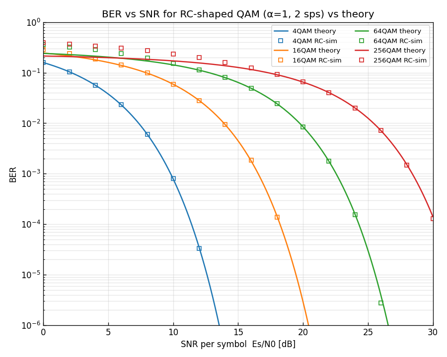
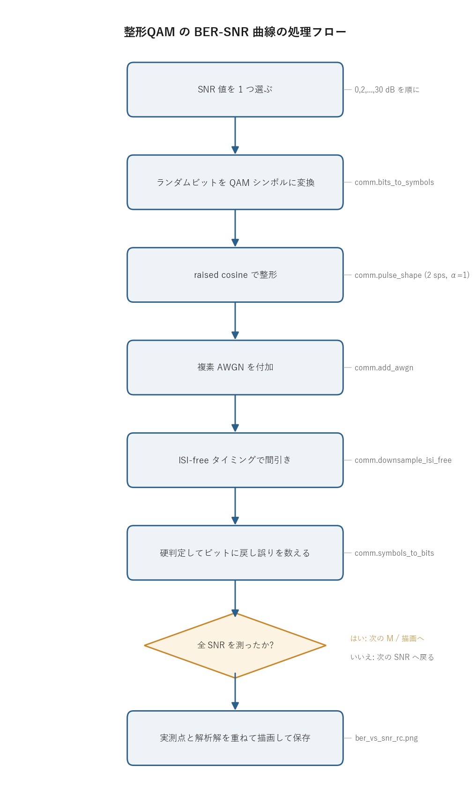

# 問題2-5: スペクトル整形 QAM の BER の SNR 依存性

## 問題

スペクトル整形(α=1 の raised cosine、2 sample/symbol)をかけた QAM サンプル列に対して、
**BER の SNR 依存性**を測ってグラフにし、解析解(近似式)と比較する。横軸は 1 シンボル
あたりの SNR `Es/N0` [dB]、縦軸は BER の対数表示。送受信チェーンに整形(畳み込み)と
ダウンサンプリングが加わる点が、整形なしで測った 問2-1 との違いになる。

raised cosine は Nyquist パルスなので、正しいタイミングで間引けば符号間干渉(ISI)が出ない。
そのため整形ありで測った曲線は、整形なしの曲線とほぼ重なるはず、という見込みを確認する。

## 実行結果(出力)

```
α=1.0, 2 sps, シンボル数/点=300000

  4QAM: 測定できた最小BER = 3.33e-05
 16QAM: 測定できた最小BER = 8.33e-07
 64QAM: 測定できた最小BER = 2.78e-06
256QAM: 測定できた最小BER = 1.28e-04
```



> **図の読み方**
> - □(中抜きの四角)が「raised cosine 整形 + ISI-free ダウンサンプリング」のチェーンでの実測点。
> - 実線が解析解(近似式)。色が QAM の多値数(青=4, 橙=16, 緑=64, 赤=256)に対応する。
> - 実測点が解析解の実線にきれいに乗る。整形しても判定点での SNR が変わらないため、整形なしの 問2-1 と同じ曲線になる。
> - BER がゼロになった SNR は対数軸に置けないので、図には測れた点(BER > 0)だけを打っている。

---

## 0. 処理の流れ

`solution.py` を実行すると、次の順で処理が進む。



外側に QAM の多値数 `M`(4, 16, 64, 256)のループ、その内側に SNR(0〜30 dB を 2 dB 刻み)の
ループがある。内側 1 回で送受信チェーンを丸ごと 1 回まわして BER を 1 点測り、SNR を変えながら
点を並べると 1 本の曲線になる。分岐は「指定した SNR をすべて測り終えたか」の判定 1 箇所で、
測り終えたら解析解と重ねて描画に進む。

---

## 1. 整形ありチェーンでの BER 測定

各 SNR について、整形を含む送受信チェーンを 1 回まわして BER を測る。流れは次のとおり。

```
ランダムビット → QAMマッピング → RC整形 → 複素AWGN → ISI-freeダウンサンプリング
              → 硬判定 + デマッピング → 誤りビット計数
```

整形なしの 問2-1 のチェーンに、送信側の **RC 整形**と受信側の **ISI-free ダウンサンプリング**の
2 段が挿し込まれた形になっている。整形は各シンボルを 2 サンプルに広げて隣のシンボルと重ね合わせ、
帯域を制限した連続波形を作る。ダウンサンプリングは、その重なりがちょうど 0 になるシンボル中心の
タイミングだけを抜き出して、1 シンボル 1 サンプルに戻す。この 2 段が打ち消し合うので、判定に入る
シンボルは整形前と統計的に同じになる。

各 SNR で得た BER を `(SNR, BER)` の組として並べ、SNR を変えて繰り返すと曲線になる。

---

## 2. 整形なし(問2-1)と同じ曲線になる理由

raised cosine は **Nyquist パルス**である。Nyquist パルスとは、自分のシンボル中心では振幅が 1、
他のシンボル中心(シンボル間隔の整数倍ずれた点)では振幅がちょうど 0 になるパルスのこと。
だから ISI-free のタイミング(シンボル中心)で受信波形を間引くと、隣のシンボルからの染み出し
(符号間干渉)が乗らず、抜き出したサンプルは

```
受信シンボル = 元シンボル + 電力 N0 の複素ガウス雑音
```

という形になる。これは整形をかけずに 1 sample/symbol で送ったとき(問2-1)とまったく同じ統計に
なる。雑音電力 `N0` も SNR から決まる同じ値で、整形による帯域制限は雑音の分散を変えない。

判定点での信号と雑音の関係が同じなら、BER も同じになる。したがって BER-SNR 曲線は 問2-1 と
重なり、解析解

$$ \mathrm{BER} \approx \frac{4}{\log_2 M}\left(1-\frac{1}{\sqrt M}\right)
Q\!\left(\sqrt{\frac{3}{M-1}\,\gamma_s}\right) $$

によく一致する。ここで $\gamma_s = 10^{\mathrm{SNR/10}}$ は 1 シンボルあたりの SNR、$Q(\cdot)$ は
標準正規分布の上側確率 $Q(x)=\tfrac12\,\mathrm{erfc}(x/\sqrt2)$ で、判定境界を越えて誤る確率を表す。
平方根の中の $\frac{3}{M-1}\gamma_s$ は「規格化したコンステレーションで隣の点までの距離の半分」を
雑音の標準偏差で割った量の 2 乗にあたり、多値数 `M` が増えるほど点が密になって小さくなる。だから
同じ SNR でも `M` が大きいほど BER が悪化し、図でも青(4QAM)から赤(256QAM)へ向かって曲線が
右に寄る。

---

## 3. この結果が意味すること

「パルス整形は BER を悪化させない(理想条件では)」という結論が得られる。整形の目的は
**帯域を制限して、実際に伝送できる連続波形を作る**ことであって、性能を犠牲にすることではない。
正しく Nyquist パルス(raised cosine)を使い、正しいタイミング(ISI-free)でサンプルすれば、
符号間干渉のペナルティなしに整形なしと同じ性能が出る。

逆に、サンプリングのタイミングがずれたり、Nyquist でないパルスを使うと、隣のシンボルの染み出しが
判定に乗って ISI 劣化が現れ、曲線は解析解より上(BER が悪い方)へずれる。整形とタイミングが
そろって初めて理想性能になる、という点がここでの要点になる。

---

## 4. 関数ごとの詳細

`solution.py` には BER を 1 点測る `measure_ber_shaped` と、全体をまわす `main` の 2 つがある。
重い計算は `comm.py` の関数が担い、ここではそれらを正しい順序でつなぐ役目になる。

### `measure_ber_shaped(M, snr_db, rng)`

整形ありチェーンを 1 回まわして、1 つの `(M, SNR)` に対する BER を返す。

| 項目 | 内容 |
| ---- | ---- |
| 引数 | `M`: QAM 多値数(4/16/64/256)。`snr_db`: SNR [dB]。`rng`: 乱数生成器(再現性のため `main` から共有)。 |
| 戻り値 | `float`。誤りビット数 ÷ 比較ビット数 = BER。 |

内部の流れ。

1. `k = int(np.log2(M))` で 1 シンボルのビット数を求める。`N_SYM` シンボル分なので `N_SYM * k` ビットを `rng.integers` でランダムに作る。
2. `comm.bits_to_symbols(bits, M)` でビット列を規格化した複素 QAM シンボル列 `tx` に変換する(グレイ符号、平均電力 1)。
3. `comm.pulse_shape(tx, SPS, BETA, SPAN)` で raised cosine 整形する。返り値 `shaped` は整形後のサンプル列、`delay` は整形フィルタの群遅延(サンプル数)。`delay` が後でシンボル中心の位置を決める鍵になる。
4. `comm.add_awgn(rx を作る, snr_db, signal_power=1.0, rng=rng)` で複素 AWGN を付加する。`signal_power=1.0` と明示しているのは、整形後は波形が連続的で振幅が広がり、サンプルから測った平均電力がシンボル電力 1 とずれるため。SNR の基準を「シンボル電力 1」に固定するために実測値ではなく 1 を渡す。
5. `comm.downsample_isi_free(rx, delay, SPS, N_SYM)` で、`delay + n*SPS`(n = 0,1,2,...)のインデックス、つまり ISI が 0 になるシンボル中心だけを抜き出して `rx_sym` にする。
6. `comm.symbols_to_bits(rx_sym, M)` で硬判定(最近傍点へ丸め)してビットに戻す。
7. `n = min(len(bits), len(rx_bits))` で長さを合わせ、`comm.count_bit_errors` で送信ビットと受信ビットの不一致数を数え、`n` で割って BER を返す。

`signal_power=1.0` の指定が地味だが重要で、ここを省くと整形後の実測電力で SNR を測ってしまい、
横軸の基準がずれて解析解と合わなくなる。

### `main()`

QAM 多値数と SNR の二重ループをまわし、結果を図にする。

1. `rng = np.random.default_rng(SEED)` で乱数生成器を 1 つ作り、全測定で共有する(`SEED=5` で再現性を確保)。
2. `snr_fine = np.linspace(0, 30, 300)` で、解析解を滑らかに描くための細かい SNR 軸を用意する。
3. `M`(4, 16, 64, 256)ごとに次をやる。
   - `comm.ber_theory_qam(M, snr_fine)` を実線でプロットする(解析解の曲線)。
   - `SNR_LIST`(0〜30 dB を 2 dB 刻み)の各点で `measure_ber_shaped` を呼び、`ber > 0` の点だけを `ms`(SNR)と `mb`(BER)に集める。BER = 0 は対数軸に置けないため除く。
   - 集めた実測点を中抜きの四角(`"s"`, `mfc="none"`)でプロットする。
   - その `M` で測れた最小 BER を表示する。
4. 縦軸を対数(`1e-6`〜`1`)、横軸を 0〜30 dB に設定し、グリッド・凡例・タイトルを付けて `ber_vs_snr_rc.png` に保存する。

定数は冒頭にまとめてある。`BETA=1.0`(ロールオフ α)、`SPS=2`(2 サンプル/シンボル)、
`SPAN=12`(整形フィルタ長、シンボル数)、`N_SYM=300_000`(1 点あたりのシンボル数)。

---

## 5. シンボル数を 30 万にした理由

1 点あたりのシンボル数 `N_SYM = 300_000` は、整形なしの 問2-1(50 万)より少ない。整形が
畳み込みを伴うぶん 1 点の計算が重くなるので、点数を抑えて全体の実行時間を抑えている。

測定できる BER の下限は、おおよそ「1 誤り ÷ 全ビット数」で決まる。30 万シンボル × 各 QAM の
ビット数なので、測定下限はおよそ $10^{-5}$ 前後になる。出力の「測定できた最小 BER」が QAM ごとに
ばらつくのは、全ビット数(= シンボル数 × `log2 M`)が `M` で変わることと、誤りが出た最小 SNR が
QAM ごとに違うため。これより低い BER の領域は、誤りが 1 個も出ず BER = 0 になって対数軸に置けない
ので、図には現れない。

---

## 6. 実行

```bash
python solution.py
```

標準出力は冒頭の「実行結果(出力)」、生成図は `ber_vs_snr_rc.png` を参照。処理フロー図 `flow.png`
は `python make_flow.py` で作り直せる。

---

## 7. 計算量

- 1 点の測定: シンボル数を `N`、整形フィルタ長を `Lh = SPAN*SPS+1` とすると、整形の畳み込みが `O(N·SPS·Lh)`、AWGN とマッピング・判定が `O(N·SPS)`。フィルタ長が定数なので実質 `O(N)` だが、整形なしより係数が大きい。
- 全体: `(QAM の数) × (SNR 点数) × (1 点の測定)`。本問では 4 × 16 点ぶん回す。

---

## 8. この問題のつながり

BER 評価はここで一段落する。次の **問2-6** では、整形した波形を**時間遅延**させたときに時間波形が
どう変わるかを見て、伝送路の遅延・タイミングずれの基礎を押さえる。第3週では、この遅延に加えて
偏波や位相雑音を本格的に扱っていく。
