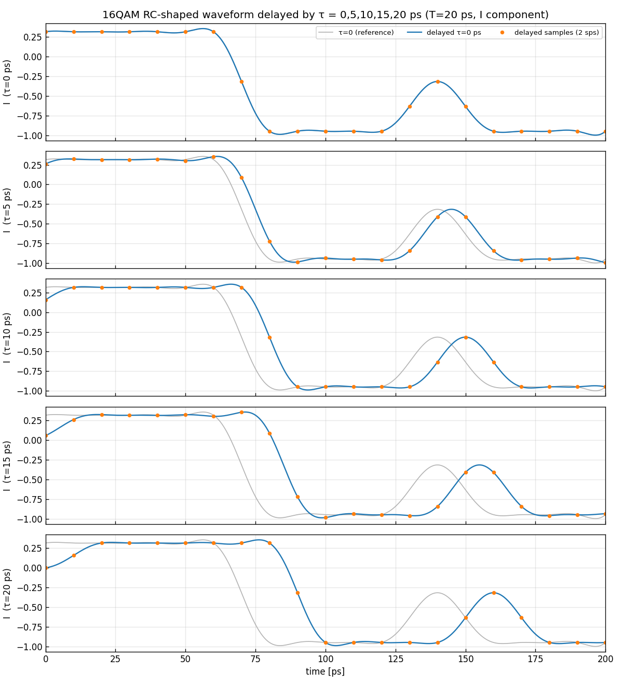
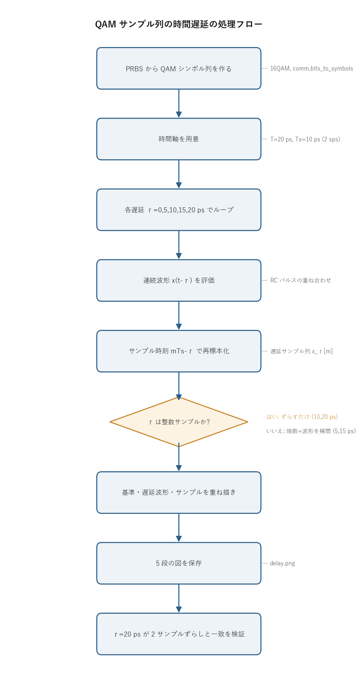

# 問題2-6: スペクトル整形 QAM サンプル列の時間遅延

## 問題

50 Gbaud のスペクトル整形 QAM サンプル列を、$\tau = 5, 10, 15, 20$ ps だけ遅延させた
サンプル列を生成し、それぞれの時間波形を図示する(最初の10シンボル時間の範囲のみ)。

整数サンプルぶんの遅延なら配列をずらすだけで済むが、ここには $T_s$ の半分という
端数の遅延が混じる。半サンプルずれた波形を、サンプル列だけからどう正確に作るかが要点になる。

## 実行結果(出力)

```
Rs=50.0 Gbaud -> T=20 ps, 2 sps -> Ts=10 ps
遅延 τ とサンプル換算:
  τ= 0 ps = 0.00 シンボル = 0.0 サンプル
  τ= 5 ps = 0.25 シンボル = 0.5 サンプル
  τ=10 ps = 0.50 シンボル = 1.0 サンプル
  τ=15 ps = 0.75 シンボル = 1.5 サンプル
  τ=20 ps = 1.00 シンボル = 2.0 サンプル

τ=20 ps の遅延サンプル列 vs 元サンプルを2サンプルずらした列: 最大誤差=0.00e+00
```



> **図の読み方**
> - 各段が遅延量 τ ごとの I 成分波形。上から τ = 0, 5, 10, 15, 20 ps の順。
> - 灰色が τ=0 の基準波形、青が遅延後の連続波形、オレンジ点が遅延後の 2 sps サンプル。
> - 下の段ほど波形が右へずれる。τ=20 ps(最下段)ではちょうど1シンボルぶん右にシフトし、
>   灰色の山が青で1シンボル右に来ている。

---

## 0. 処理の流れ

`solution.py` を実行すると、次の順で処理が進む。



前半でテスト用のシンボル列と時間軸を用意し、後半で 5 つの遅延量それぞれについて
「連続波形を作る → 遅らせた時刻で標本化する」を繰り返す。分岐は「その遅延が整数サンプルか
端数か」の 1 箇所だが、コードはどちらも同じ式で扱うので、実際の処理は一本道で進む。
最後に τ=20 ps が 2 サンプルずらしと一致することを数値で確かめる。

---

## 1. 時間スケールの確認

$R_s = 50$ Gbaud なので **シンボル周期 $T = 1/R_s = 20$ ps**。2 sample/symbol で標本化するので
**サンプル周期 $T_s = T/2 = 10$ ps**。与えられた遅延をシンボル単位・サンプル単位に換算すると次のようになる。

| τ [ps] | シンボル単位 | サンプル単位 |
| --- | --- | --- |
| 5 | $T/4$ | 0.5 サンプル |
| 10 | $T/2$ | 1 サンプル |
| 15 | $3T/4$ | 1.5 サンプル |
| 20 | $T$ | 2 サンプル(=1シンボル) |

10 ps と 20 ps は **整数サンプル**の遅延なので、サンプル列を $T_s$ 単位でずらすだけで作れる。
一方 5 ps と 15 ps は **半サンプル**の端数遅延で、サンプル列を整数個ずらすだけでは作れない。
2 sps の格子の「間」に落ちる時刻の値が要るからだ。

## 2. 端数(フラクショナル)遅延の作り方

帯域制限信号、つまりサンプリング定理を満たす信号は、サンプル列から **元の連続波形が一意に復元できる**。
復元の式は標本点に sinc(または整形パルス)を重ねたものになる。連続波形がいったん手に入れば、
任意の時刻で値を読めるので、$\tau$ だけ遅らせた時刻 $mT_s - \tau$ で改めて標本化すればよい。
これで整数・端数を問わず正確な遅延サンプル列が作れる。

本問では raised cosine 整形なので、連続波形は

$$ x(t) = \sum_n s[n]\, h\!\left(\frac{t}{T}-n\right) $$

と書ける($h$ は raised cosine パルス、$s[n]$ は QAM シンボル)。シンボル時刻に置いた
インパルスを $h$ で整形して足し合わせたものが連続波形にあたる。遅延後の波形は $x(t-\tau)$ で、
その 2 sps サンプル列は時刻 $t = mT_s$ で読むので

$$ x_\tau[m] = x(m T_s - \tau) = \sum_n s[n]\, h\!\left(\frac{m T_s - \tau}{T}-n\right). $$

これが求める **遅延サンプル列**。コードの `analog_waveform(sym, t_samp - tau)` がこの式そのものになっている。
整数サンプル遅延(10, 20 ps)はこの式で $\tau$ が $T_s$ の整数倍になった特別な場合で、
出力の「τ=20 ps … 最大誤差=0.00e+00」が **1シンボル遅延 = 2サンプルずらし**と完全一致することの確認になる。

> **別解**: FFT で位相回転 $X(f)\to X(f)e^{-j2\pi f\tau}$ を掛けて逆変換しても同じ端数遅延が作れる
> (周波数領域の遅延定理)。ここではパルスの式を直接使う、より見通しのよい方法を採った。

## 3. なぜ遅延が重要か

時間遅延は光通信のいたるところに現れる。

- **伝搬遅延**: ファイバを伝わる時間そのもの。
- **タイミング同期**: 受信側のサンプリング時刻がシンボル中心からずれると、ISI が増えて BER が劣化する
  (問2-4 の「ISI-free タイミング」がずれることに相当)。半サンプルずれただけで性能は大きく変わる。
- **偏波モード分散・スキュー**: 2偏波や I/Q 間の微小な遅延差。第3週で偏波を扱うときの下地になる。

この問題は遅延を端数も含めてサンプル列として正しく表現する基礎技術を確認するものになっている。

---

## 4. 関数ごとの詳細

`solution.py` には連続波形を組み立てる 2 つの関数と `main` がある。順に見ていく。

### `rc_pulse(t, beta)`

連続の raised cosine パルス $h(t)$ を、シンボル時間を単位とした時刻 `t` で評価する。

| 項目 | 内容 |
| --- | --- |
| 引数 | `t`: 時刻(シンボル周期 T を 1 とした単位)の ndarray。`beta`: ロールオフ係数 α。 |
| 戻り値 | 各時刻でのパルス値(実数 ndarray)。 |

内部の流れ。

1. `sinc = np.sinc(t)` で sinc 部分を計算する。`np.sinc(t)` は $\sin(\pi t)/(\pi t)$ の定義なので、
   そのままシンボル中心 $t=\pm1,\pm2,\dots$ でゼロになり、Nyquist 条件(他シンボルへの ISI ゼロ)を満たす。
2. `denom = 1 - (2βt)^2` を計算し、`cos(πβt)/denom` でロールオフによる余弦成分をかける。
3. `denom = 0` になる時刻 $|2\beta t| = 1$ ではゼロ割りになるので、`np.isclose` でその点を見つけ、
   極限値 $\pi/4$ を直接代入する(`np.errstate` で一時的に警告を止めている)。
4. `sinc * cos` を返す。

raised cosine は周波数領域では帯域 $(1+\alpha)R_s/2$ に収まる台形状のスペクトルを持つ。
時間領域でこの式になるのはそのフーリエ逆変換だからで、α=1 だと裾が最も速く減衰する。

### `analog_waveform(sym, t_ps)`

シンボル列から連続波形 $x(t)=\sum_n s[n]\,h(t/T-n)$ を、指定した時刻 `t_ps` [ps] で評価する。
この関数が遅延の中心になる。

| 項目 | 内容 |
| --- | --- |
| 引数 | `sym`: 複素 QAM シンボル列。`t_ps`: 評価したい時刻 [ps] の ndarray。 |
| 戻り値 | 各時刻での複素波形値 `x`(ndarray)。 |

内部の流れ。

1. `x = np.zeros_like(t_ps, dtype=complex)` で出力を 0 で初期化する。
2. シンボルごとにループし、`x += sym[n] * rc_pulse(t_ps / T_PS - n, BETA)` を足し込む。
   `t_ps / T_PS` で ps をシンボル時間単位に直し、`- n` で n 番目のシンボルの位置を中心に合わせる。
3. 重ね合わせた `x` を返す。

`x += sym[n] * rc_pulse(t_ps / T_PS - n, BETA)` の 1 行が連続波形の定義式そのもので、
ここに渡す時刻を変えるだけで遅延が表現できる。`t_samp - tau` を渡せば遅延サンプル列、
`t_fine - tau` を渡せば表示用の滑らかな遅延波形になる。同じ関数で両方を作っているので、
遅延サンプルが連続波形の上に正しく乗っていることを図でそのまま確認できる。

### `main()`

全体をつなぐ関数。

1. `comm.generate_prbs(15)` で PRBS を作り、`comm.bits_to_symbols` で 16QAM シンボル列に直す。
   表示に使う 10 シンボルより少し多め(`N_SHOW + 6`)に取り、波形の両端でパルスの裾が欠けないようにしている。
2. 時間スケール($T$, $T_s$)と、各 τ のシンボル換算・サンプル換算を表示する。
3. 表示用の細かい時刻 `t_fine`(1シンボルを64分割)と、2 sps のサンプル時刻 `t_samp` を作る。
4. τ=0,5,10,15,20 ps でループし、各段に次の 3 本を重ねて描く。
   - 灰色: 遅延なしの連続波形 `analog_waveform(sym, t_fine)`(基準)。
   - 青: 遅延後の連続波形 `analog_waveform(sym, t_fine - tau)`。
   - オレンジ点: 遅延後のサンプル列 `analog_waveform(sym, t_samp - tau)`(これが成果物)。
5. 図を `delay.png` に保存する。
6. τ=20 ps の遅延サンプル列と、元サンプルを 2 サンプルずらした列の最大誤差を計算し、0 になることを確かめる。

ステップ 6 の検算は、`x0_samp` の先頭に `np.nan` を 2 個足してから 2 個ぶん後ろへずらし、
`x20_samp` と差を取っている。`nan` を入れた先頭 2 点は比較から外し(`valid` マスク)、
残りで `np.nanmax` を取って最大誤差を出す。整数サンプル遅延が単なる配列シフトと同じになることの確認になる。

---

## 5. 実行

```bash
python solution.py
```

標準出力は冒頭の「実行結果(出力)」、生成図は `delay.png` を参照。処理フロー図 `flow.png` は
`python make_flow.py` で作り直せる。

---

## 6. 第2週のまとめ

第2週でやったことを並べると次のようになる。

- **BER の SNR 依存性**を測定し、解析解とよく一致することを確認(問2-1, 2-5)。
- 理想点(1 sps)から **raised cosine による連続波形(2 sps)** へ移行(問2-2)。サンプリング定理から
  $f_s \ge (1+\alpha)R_s = 100$ Gsample/s が必要。
- Nyquist パルスのおかげで、**ISI-free タイミングでサンプルすれば整形しても BER は変わらない**ことを確認(問2-3, 2-4)。
- **時間遅延**(端数遅延を含む)をサンプル列として正しく生成する方法を確認(問2-6)。

第3週では、レーザの **位相雑音**、**偏波多重**、**MIMO 適応等化**という、コヒーレント光通信の中核技術へ進む。
