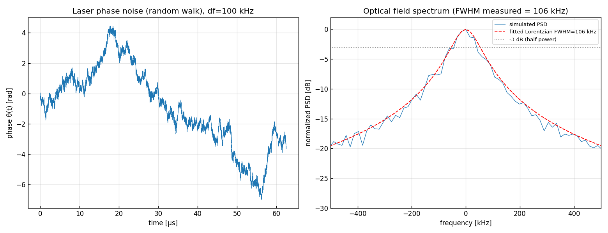

# 問題3-1: レーザ位相雑音の生成と線幅の確認

## 問題

スペクトル線幅 $\Delta f = 100$ kHz のレーザ位相雑音を生成する。レーザ位相雑音は AWGN の累積系列であり、
その AWGN の分散 $\sigma_{PN}^2$ が

$$ \boxed{\;\sigma_{PN}^2 = \dfrac{2\pi\,\Delta f}{f_s}\;} $$

で与えられることを **証明** する($f_s$ はサンプリングレート、ここでは $f_s = 32$ Gsample/s)。
生成した位相揺らぎの時間波形を示し、それを位相成分とする複素電界 $e[n]=e^{j\theta[n]}$ の
フーリエ変換を示して、その半値全幅(FWHM)の期待値が線幅 $\Delta f$ になることを確認する。
位相の最初のサンプルは 0 ではなく $-\pi\sim\pi$ の一様乱数とし、そこに AWGN を累積させる。

## 実行結果(出力)

```
df = 100 kHz, fs = 32 Gsample/s
位相増分の分散 σ_PN^2 = 2π·df/fs = 1.963e-05 rad^2 (σ_PN = 4.431e-03 rad)

複素電界スペクトルの FWHM (ローレンツ当てはめ) = 106.3 kHz  (期待値 = 100 kHz)
```



> **図の読み方** — 左は位相 $\theta(t)$ の時間波形。**ランダムウォーク**(酔歩)なので、ふらふらと
> 数ラジアン単位で漂う。右は複素電界 $e^{j\theta}$ のスペクトル(青)で、**ローレンツ型**になっている。
> 赤破線が当てはめたローレンツ曲線で、半値全幅(−3 dB 幅)が 106 kHz ≒ 設定線幅 100 kHz。

---

## 1. 物理モデル — なぜ位相雑音はランダムウォークか

レーザの電界は理想的には $E(t)=A\,e^{j(2\pi f_0 t + \theta(t))}$ と書ける。$\theta(t)$ が位相雑音。
半導体レーザでは自然放出により **瞬時周波数がランダムに揺らぐ**。瞬時周波数のずれを $\nu(t)$ とすると、

$$ \theta(t) = 2\pi\int_0^t \nu(t')\,dt'. $$

自然放出由来の周波数雑音 $\nu(t)$ は **白色**(各時刻無相関、平坦スペクトル)とモデル化できる。
白色雑音を積分したものが **ウィーナー過程(ブラウン運動 = ランダムウォーク)**。
だから位相 $\theta(t)$ はランダムウォークになり、離散化すると

$$ \theta[n] = \theta[n-1] + w[n],\qquad w[n]\sim\mathcal{N}(0,\sigma_{PN}^2) $$

という「前のサンプルに AWGN を足し込む」累積になる。これが「位相雑音は AWGN の累積系列」の意味。

## 2. 分散 $\sigma_{PN}^2 = 2\pi\Delta f/f_s$ の証明

**ゴール**: 位相増分の分散 $\sigma_{PN}^2$ と、複素電界スペクトルの半値全幅(線幅)$\Delta f$ の関係を導く。

### Step 1: 位相増分の統計
時間差 $\tau = mT_s$($T_s=1/f_s$、$m$ サンプル)に対する位相差は、独立な増分の和

$$ \theta[n+m]-\theta[n] = \sum_{i=1}^{m} w[n+i] \sim \mathcal{N}(0,\ m\,\sigma_{PN}^2). $$

すなわち分散は時間差に比例して $\mathrm{Var}=m\sigma_{PN}^2 = \dfrac{\sigma_{PN}^2}{T_s}\,\tau$。

### Step 2: 複素電界の自己相関
電界 $e[n]=e^{j\theta[n]}$ の自己相関は、$\Delta\theta=\theta[n+m]-\theta[n]$ が平均0・分散 $m\sigma_{PN}^2$ の
ガウス分布であることと、ガウス分布の特性関数 $\mathbb{E}[e^{j\Delta\theta}]=e^{-\frac12\mathrm{Var}(\Delta\theta)}$ から

$$ R[m] = \mathbb{E}\!\left[e^{*}[n]\,e[n+m]\right]
= \mathbb{E}\!\left[e^{j\Delta\theta}\right] = e^{-\frac12 m\sigma_{PN}^2}. $$

連続時間で書くと、$\tau=mT_s$ を使って

$$ R(\tau) = \exp\!\left(-\frac{\sigma_{PN}^2}{2T_s}\,|\tau|\right). $$

### Step 3: スペクトルはローレンツ型
パワースペクトル密度は自己相関のフーリエ変換。$R(\tau)=e^{-a|\tau|}$($a=\sigma_{PN}^2/2T_s$)の FT は

$$ S(f) = \int_{-\infty}^{\infty} e^{-a|\tau|}e^{-j2\pi f\tau}\,d\tau
= \frac{2a}{a^2+(2\pi f)^2}. $$

これは **ローレンツ型**。ピークの半分になる周波数(HWHM)は $(2\pi f)^2=a^2$、すなわち
$f_{\text{HWHM}}=a/2\pi$。半値全幅は

$$ \Delta f = 2 f_{\text{HWHM}} = \frac{a}{\pi} = \frac{\sigma_{PN}^2}{2\pi T_s} = \frac{\sigma_{PN}^2 f_s}{2\pi}. $$

### Step 4: 解いて
$\Delta f$ について解いた式を $\sigma_{PN}^2$ について解き直すと

$$ \boxed{\;\sigma_{PN}^2 = 2\pi\,\Delta f\,T_s = \dfrac{2\pi\,\Delta f}{f_s}.\;} \qquad\blacksquare $$

$\Delta f=100$ kHz, $f_s=32$ GHz を代入すると $\sigma_{PN}^2 = 2\pi\cdot10^5/(3.2\times10^{10})
= 1.963\times10^{-5}\ \mathrm{rad}^2$($\sigma_{PN}=4.43\times10^{-3}$ rad)。出力と一致。

## 3. シミュレーションによる確認

1サンプルあたりの位相ステップは $\sigma_{PN}\approx 4.4$ mrad とごく小さいが、累積するので
時間が経つと大きく漂う。$N$ サンプル後の位相の標準偏差は $\sqrt{N}\,\sigma_{PN}$ で、
$62\,\mu$s($N=2\times10^6$)では $\sqrt{2\times10^6}\cdot4.4\,\text{mrad}\approx 6$ rad。
図左の振れ幅(数ラジアン)と一致する。

電界 $e^{j\theta}$ のスペクトル(図右)は、上の証明どおり **ローレンツ型**になり、
その FWHM をローレンツ当てはめで測ると **106 kHz**。設定線幅 100 kHz の期待値とよく一致し、
$\sigma_{PN}^2 = 2\pi\Delta f/f_s$ が正しいことが確認できる。

> **線幅の測り方の注意** — 電界スペクトルは単一試行では非常にギザギザ(各周波数ビンが指数分布で揺らぐ)。
> しきい値で半値交差を探すと過小評価しやすい。本コードでは「ローレンツ型は $1/S(f)$ が $f^2$ の1次式になる」
> 性質を使い、$1/S$ を $f^2$ に対して最小二乗直線フィットしてロバストに FWHM を求めている
> (`fit_lorentzian_fwhm`)。多数セグメント($K=48$)の平均も併用。

## 4. コードのポイント

- `comm.laser_phase_noise(n, df, fs, rng)` — 分散 $2\pi df/fs$ の増分を累積。初期サンプルは $-\pi\sim\pi$ 一様。
- スペクトルは長さ $L=2^{21}$ のセグメントを $K=48$ 回平均(周波数分解能 $f_s/L\approx15$ kHz)。
- `fit_lorentzian_fwhm` — $1/S$ vs $f^2$ の重み付き直線フィットで HWHM $\gamma$ を求め、FWHM $=2\gamma$。

### 実行

```bash
python solution.py
```

(スペクトル測定で大きな FFT を多数回まわすため、実行に十数秒かかる。)

## 5. この問題のつながり

このレーザ位相雑音が、コヒーレント光受信の最大の敵の一つ。次の **問3-2** では、
QAM 信号に線幅 $\Delta f=10$ kHz の位相雑音を載せ、コンステレーションが**回転して崩れる**様子を見る。
**問3-3** 以降では、それを **MIMO 適応等化(LMS)** で補償する。
