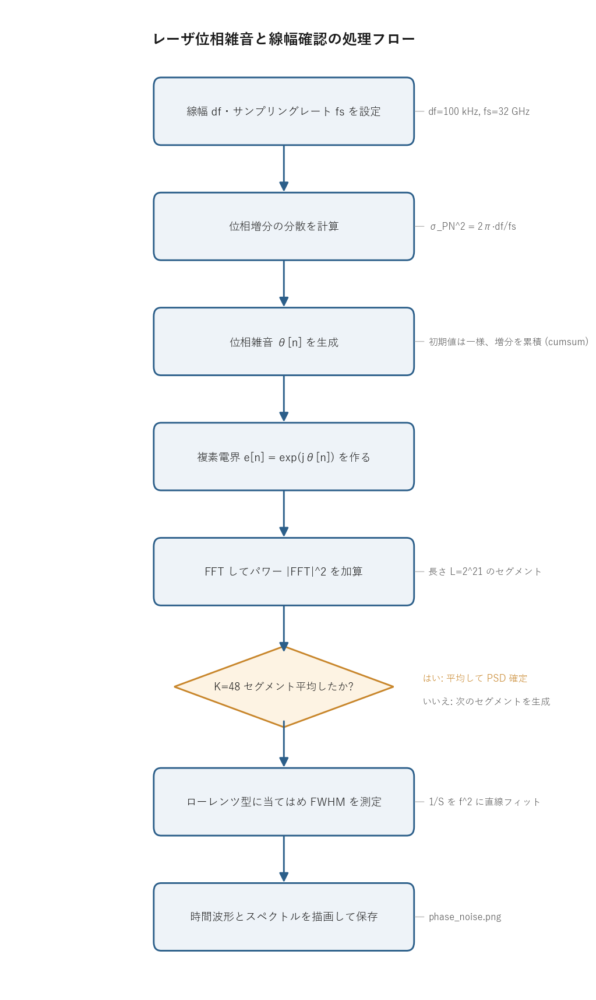

# 問題3-1: レーザ位相雑音の生成と線幅の確認

## 問題

スペクトル線幅 $\Delta f = 100$ kHz のレーザ位相雑音を生成する。レーザ位相雑音は AWGN の累積系列であり、
その AWGN の分散 $\sigma_{PN}^2$ が

$$ \boxed{\;\sigma_{PN}^2 = \dfrac{2\pi\,\Delta f}{f_s}\;} $$

で与えられることを **証明** する($f_s$ はサンプリングレート、ここでは $f_s = 32$ Gsample/s)。
生成した位相揺らぎの時間波形を示し、それを位相成分とする複素電界 $e[n]=e^{j\theta[n]}$ の
フーリエ変換を示して、その半値全幅(FWHM)の期待値が線幅 $\Delta f$ になることを確認する。
位相の最初のサンプルは 0 ではなく $-\pi\sim\pi$ の一様乱数とし、そこに AWGN を累積させる。

## 実行結果(出力)

```
df = 100 kHz, fs = 32 Gsample/s
位相増分の分散 σ_PN^2 = 2π·df/fs = 1.963e-05 rad^2 (σ_PN = 4.431e-03 rad)

複素電界スペクトルの FWHM (ローレンツ当てはめ) = 106.3 kHz  (期待値 = 100 kHz)
```


> **図の読み方**
> - **左**: 位相 $\theta(t)$ の時間波形。ランダムウォーク(酔歩)なので、ふらふらと数ラジアン単位で漂う。
> - **右**: 複素電界 $e^{j\theta}$ のスペクトル(青)。ローレンツ型になっている。赤破線が当てはめたローレンツ曲線で、半値全幅(−3 dB 幅)が 106 kHz で設定線幅 100 kHz とほぼ一致する。

---

## 0. 処理の流れ

`solution.py` を実行すると、次の順で処理が進む。



前半が位相雑音 $\theta[n]$ の生成(分散を決めて増分を累積する)、後半が複素電界スペクトルの測定と
線幅(FWHM)の当てはめにあたる。分岐は「$K=48$ セグメントぶん平均し終えたか」を確認する 1 箇所だけで、
ここはスペクトルを滑らかにするために同じ生成と FFT を繰り返すループになっている。

---

## 1. 物理モデル: 位相雑音がランダムウォークになる理由

レーザの電界は理想的には $E(t)=A\,e^{j(2\pi f_0 t + \theta(t))}$ と書ける。$\theta(t)$ が位相雑音にあたる。
半導体レーザでは自然放出のたびに瞬時周波数がわずかにずれる。この瞬時周波数のずれを $\nu(t)$ とすると、
位相は周波数の積分なので

$$ \theta(t) = 2\pi\int_0^t \nu(t')\,dt'. $$

自然放出由来の周波数雑音 $\nu(t)$ は白色雑音(各時刻が無相関で、スペクトルが平坦)とモデル化できる。
白色雑音を時間積分したものがウィーナー過程、すなわちブラウン運動でありランダムウォークになる。
だから位相 $\theta(t)$ はランダムウォークになり、これを離散化すると

$$ \theta[n] = \theta[n-1] + w[n],\qquad w[n]\sim\mathcal{N}(0,\sigma_{PN}^2) $$

という「前のサンプルに AWGN を 1 つ足し込む」累積になる。これが「位相雑音は AWGN の累積系列」という言い方の意味になる。
1 サンプルあたりの増分 $w[n]$ は平均 0 のガウス雑音で、その分散 $\sigma_{PN}^2$ が線幅を決める。

## 2. 分散 $\sigma_{PN}^2 = 2\pi\Delta f/f_s$ の証明

ゴールは、位相増分の分散 $\sigma_{PN}^2$ と複素電界スペクトルの半値全幅(線幅)$\Delta f$ の関係を導くこと。
増分の分散から出発して自己相関、スペクトル、線幅の順にたどると、上の式が出てくる。

### Step 1: 位相増分の統計
時間差 $\tau = mT_s$($T_s=1/f_s$、$m$ サンプルぶん)に対する位相差は、独立な増分の和になる。

$$ \theta[n+m]-\theta[n] = \sum_{i=1}^{m} w[n+i] \sim \mathcal{N}(0,\ m\,\sigma_{PN}^2). $$

独立なガウス増分を $m$ 個足すと分散は $m$ 倍になるので、分散は時間差に比例して
$\mathrm{Var}=m\sigma_{PN}^2 = \dfrac{\sigma_{PN}^2}{T_s}\,\tau$ となる。これが拡散(ブラウン運動)の特徴で、
時間が経つほど位相のばらつきが線形に広がる。

> **数値例: 位相分散が時間に線形増加する(ランダムウォーク確認)**
> $\Delta f=100$ kHz, $f_s=32$ GHz なので $T_s=1/f_s=31.25$ ps、1 ステップの増分分散は
> $\sigma_{PN}^2 = 2\pi\Delta f/f_s = 1.963\times10^{-5}\ \mathrm{rad}^2$($\sigma_{PN}=4.43$ mrad)。
> ここから $m$ ステップ後の位相差の分散は $m\sigma_{PN}^2$、標準偏差は $\sqrt{m}\,\sigma_{PN}$ になる。
> 実際に数点を手で出すと:
>
> | $m$ [サンプル] | 経過時間 $mT_s$ | 分散 $m\sigma_{PN}^2$ [rad²] | 標準偏差 $\sqrt{m}\,\sigma_{PN}$ [rad] |
> | ---: | ---: | ---: | ---: |
> | 1 | 31.25 ps | $1.96\times10^{-5}$ | $0.0044$ |
> | 100 | 3.13 ns | $1.96\times10^{-3}$ | $0.044$ |
> | $10^4$ | 0.31 µs | $0.196$ | $0.443$ |
> | $10^6$ | 31.25 µs | $19.6$ | $4.43$ |
>
> 経過時間が 100 倍になると分散も 100 倍(標準偏差は 10 倍)になっており、分散が時間に**線形**で増えるのが読み取れる。
> 例えば最終行は $m=10^6$ で $\sqrt{10^6}\times4.43\,\mathrm{mrad}=4.43$ rad。$N=2\times10^6$($62.5$ µs)なら
> $\sqrt{2}\times4.43\approx6.3$ rad で、図左の振れ幅(数ラジアン)と整合する。

### Step 2: 複素電界の自己相関
電界 $e[n]=e^{j\theta[n]}$ の自己相関を計算する。$\Delta\theta=\theta[n+m]-\theta[n]$ は平均 0、分散 $m\sigma_{PN}^2$ の
ガウス分布なので、ガウス分布の特性関数 $\mathbb{E}[e^{j\Delta\theta}]=e^{-\frac12\mathrm{Var}(\Delta\theta)}$ を使うと

$$ R[m] = \mathbb{E}\!\left[e^{*}[n]\,e[n+m]\right]
= \mathbb{E}\!\left[e^{j\Delta\theta}\right] = e^{-\frac12 m\sigma_{PN}^2}. $$

連続時間で書くと、$\tau=mT_s$ を代入して

$$ R(\tau) = \exp\!\left(-\frac{\sigma_{PN}^2}{2T_s}\,|\tau|\right). $$

自己相関がラグ $\tau$ に対して指数関数で減衰する。位相が時間とともに無相関化していく速さが、
そのまま減衰の速さ $a=\sigma_{PN}^2/2T_s$ に現れる。

> **数値例: 自己相関の減衰を数で見る**
> 上の値で減衰率は $a=\sigma_{PN}^2/2T_s = 1.963\times10^{-5}/(2\times31.25\times10^{-12}) = 3.14\times10^{5}\ \mathrm{s^{-1}}$。
> $R(\tau)=e^{-a|\tau|}$ にラグを入れると次のようになる。
>
> | ラグ $\tau$ | $a\tau$ | $R(\tau)=e^{-a\tau}$ |
> | ---: | ---: | ---: |
> | $0.31$ µs | $0.098$ | $0.906$ |
> | $2.21$ µs | $0.693$ | $0.500$ |
> | $3.18$ µs | $1.000$ | $0.368$ |
>
> 電界の相関が半分($R=0.5$)に落ちるのは $\tau=\ln2/a\approx2.2$ µs、$1/e$ になるのは $\tau=1/a\approx3.2$ µs。
> この $1/a = 1/(\pi\Delta f)\approx3.18$ µs がいわゆるコヒーレンス時間にあたる。次の Step 3 で見るように、
> この減衰率 $a$ が $\Delta f = a/\pi$ を通じて線幅そのものを決める。

### Step 3: スペクトルはローレンツ型
パワースペクトル密度は自己相関のフーリエ変換(ウィーナー=ヒンチンの定理)。
$R(\tau)=e^{-a|\tau|}$($a=\sigma_{PN}^2/2T_s$)のフーリエ変換は

$$ S(f) = \int_{-\infty}^{\infty} e^{-a|\tau|}e^{-j2\pi f\tau}\,d\tau
= \frac{2a}{a^2+(2\pi f)^2}. $$

両側指数関数の変換なのでローレンツ型になる。ピークの半分の高さになる周波数(HWHM)は
$(2\pi f)^2=a^2$ を解いて $f_{\text{HWHM}}=a/2\pi$。半値全幅はその 2 倍で

$$ \Delta f = 2 f_{\text{HWHM}} = \frac{a}{\pi} = \frac{\sigma_{PN}^2}{2\pi T_s} = \frac{\sigma_{PN}^2 f_s}{2\pi}. $$

### Step 4: $\sigma_{PN}^2$ について解く
上で得た $\Delta f$ の式を $\sigma_{PN}^2$ について解き直すと、目標の式が出る。

$$ \boxed{\;\sigma_{PN}^2 = 2\pi\,\Delta f\,T_s = \dfrac{2\pi\,\Delta f}{f_s}.\;} \qquad\blacksquare $$

$\Delta f=100$ kHz, $f_s=32$ GHz を代入すると
$\sigma_{PN}^2 = 2\pi\cdot10^5/(3.2\times10^{10}) = 1.963\times10^{-5}\ \mathrm{rad}^2$
($\sigma_{PN}=4.43\times10^{-3}$ rad)で、出力の値と一致する。

## 3. シミュレーションによる確認

1 サンプルあたりの位相ステップは $\sigma_{PN}\approx 4.4$ mrad とごく小さい。だが累積するので、
時間が経つと大きく漂う。$N$ サンプル後の位相の標準偏差は $\sqrt{N}\,\sigma_{PN}$ で、
$62\,\mu$s($N=2\times10^6$)では $\sqrt{2\times10^6}\cdot4.4\,\text{mrad}\approx 6$ rad になる。
図左の振れ幅(数ラジアン)と合う。

電界 $e^{j\theta}$ のスペクトル(図右)は、Step 3 の証明どおりローレンツ型になる。
その FWHM をローレンツ当てはめで測ると 106 kHz で、設定線幅 100 kHz の期待値とよく一致する。
これで $\sigma_{PN}^2 = 2\pi\Delta f/f_s$ が正しいことが確認できる。
残差の数%は、有限のセグメント長による周波数分解能($f_s/L\approx15$ kHz)とフィットの揺らぎによるもの。

> **線幅の測り方の注意**
> 電界スペクトルは単一試行ではギザギザになる(各周波数ビンが指数分布で揺らぐ)。
> しきい値で半値交差を探すと過小評価しやすい。このコードでは「ローレンツ型は $1/S(f)$ が $f^2$ の 1 次式になる」
> 性質を使い、$1/S$ を $f^2$ に対して最小二乗の直線フィットでロバストに FWHM を求めている
> (`fit_lorentzian_fwhm`)。さらに多数セグメント($K=48$)の平均を併用して、ばらつきを抑えている。

---

## 4. 関数ごとの詳細

`solution.py` には位相雑音生成(共通モジュール `comm.laser_phase_noise`)、線幅フィット
`fit_lorentzian_fwhm`、全体をつなぐ `main` がある。順に内部処理を見ていく。

### `comm.laser_phase_noise(n, df, fs, rng=None)`

ランダムウォーク型のレーザ位相雑音 $\theta[n]$ を生成する関数(`_common/comm.py` にある共通部品)。

| 項目 | 内容 |
| ---- | ---- |
| 引数 | `n`: サンプル数。`df`: 線幅 (FWHM) [Hz]。`fs`: サンプリングレート [Hz]。`rng`: 乱数生成器(省略時は新規作成)。 |
| 戻り値 | 長さ `n` の位相系列 `θ[rad]`(`ndarray`)。 |

内部の流れ。

1. `var = 2π·df/fs` で位相増分の分散 $\sigma_{PN}^2$ を計算する(Step 4 で証明した式そのもの)。
2. `incr = rng.standard_normal(n) * sqrt(var)` で、分散 `var` のガウス増分を `n` 個作る。標準正規乱数に標準偏差を掛けている。
3. `incr[0] = rng.uniform(-π, π)` で先頭だけ差し替える。初期位相は無相関にしたいので、$-\pi\sim\pi$ の一様乱数にする。
4. `return np.cumsum(incr)` で累積和を返す。

`np.cumsum(incr)` の 1 行が漸化式 $\theta[n]=\theta[n-1]+w[n]$ を表す。累積和の第 $n$ 項は増分 $0..n$ の総和で、
これがランダムウォークの定義そのものになる。初期値だけ一様乱数にしているので、$\theta[0]$ から拡散が始まる。

### `fit_lorentzian_fwhm(psd, freq, fmax=300e3)`

測定した PSD にローレンツ型を当てはめ、半値全幅(FWHM)[Hz] を返す関数。

| 項目 | 内容 |
| ---- | ---- |
| 引数 | `psd`: 測定パワースペクトル密度。`freq`: 周波数軸 [Hz]。`fmax`: フィットに使う中心付近の帯域(既定 300 kHz)。 |
| 戻り値 | `(fwhm, gamma)`。`fwhm` は半値全幅 [Hz]、`gamma` は HWHM(半値半幅)。 |

処理の流れ。

1. `psd = psd / psd.max()` でピークを 1 に正規化する。
2. `m = |freq| < fmax` で中心付近だけ取り出す。裾(ノイズが支配的)を捨てて、フィットを安定させる。
3. ローレンツ型 $S(f)=A\gamma/(\gamma^2+f^2)$ は逆数を取ると $1/S = \gamma/A + f^2/(A\gamma)$ となり、
   $1/S$ が $f^2$ の 1 次式になる。そこで `x = f^2`、`y = 1/S` を作る。
4. `w = S^2` を重みにして `np.polyfit(x, y, 1, w=w)` で直線 `y = b1·x + b0` をフィットする。
   重みを $S^2$ にすると、$S$ が大きい(信頼できる)中心部を重視できる。
5. 切片 `b0` と傾き `b1` から `gamma = sqrt(b0/b1)`(HWHM)を求め、`fwhm = 2·gamma` を返す。

直線フィットにする狙いは、1 点ごとの統計揺らぎに強いロバストな線幅推定をすること。
半値交差を直接探す方法より、雑音に対して安定する。

### `main()`

全体をつなぐ関数。

1. `rng = np.random.default_rng(SEED)` で乱数を固定し、`sigma2 = 2π·DF/FS` を計算して出力する。
2. **時間波形**: `comm.laser_phase_noise` で $N=2{,}000{,}000$ サンプル(約 62.5 µs)の位相系列を生成する。
3. **スペクトル測定**: 長さ $L=2^{21}$ のセグメントを $K=48$ 回作る。各回で位相を生成し、電界 $e=\exp(j\theta)$ の
   FFT パワー $|\text{FFT}|^2$ を `psd` に足し込む。ループ後に `K` で割って周期グラム平均にする。
4. `fit_lorentzian_fwhm(psd, freq)` で FWHM を測定し、期待値 100 kHz と比べて出力する。
5. 当てはめたローレンツ曲線 `lor = γ/(γ^2 + freq^2)` を作り、ピークを測定 PSD に合わせる。
6. matplotlib で 2 枚(左: 位相の時間波形、右: 中心 ±500 kHz を対数表示したスペクトルとフィット曲線)の図を作り、
   `phase_noise.png` に保存する。図のラベルは日本語フォントに依存しないよう英語にしている。

`psd += |fft.fftshift(fft.fft(e))|^2` の行が周期グラムの加算で、`fftshift` で直流を中心に移している。
セグメントを多く平均するほどローレンツ型の裾が滑らかになり、フィットが正確になる。

---

## 5. 実行

```bash
python solution.py
```

標準出力は冒頭の「実行結果(出力)」、生成図は `phase_noise.png` を参照。処理フロー図 `flow.png` は
`python make_flow.py` で作り直せる。スペクトル測定で大きな FFT を多数回まわすため、実行には十数秒かかる。

---

## 6. この問題のつながり

このレーザ位相雑音が、コヒーレント光受信の最大の敵の一つになる。次の問3-2 では、
QAM 信号に線幅 $\Delta f=10$ kHz の位相雑音を載せ、コンステレーションが回転して崩れる様子を見る。
問3-3 以降では、それを MIMO 適応等化(LMS)で補償する。
