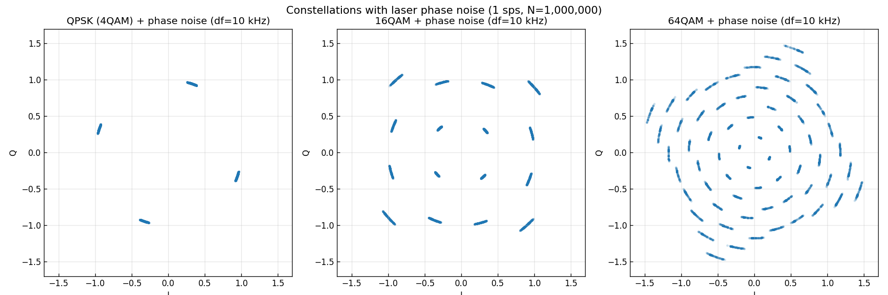
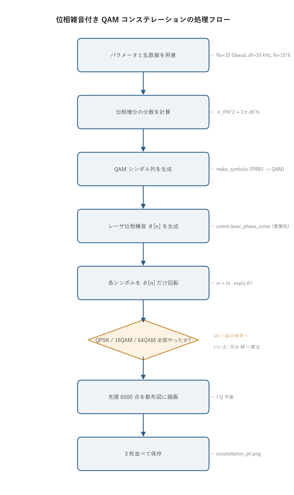

# 問題3-2: レーザ位相雑音を付加した QAM のコンステレーション

## 問題

**1 sample/symbol**、符号速度 32 Gbaud で QAM(QPSK / 16QAM / 64QAM)シンボル列を生成する
(シンボル数 $10^6$)。コヒーレント受信を考え、線幅 $\Delta f = 10$ kHz(前問の 100 kHz とは別の値)の
レーザ位相雑音を付加し、コンステレーションを示す。

## 実行結果(出力)

```
符号速度 Rs = fs = 32 Gbaud, 線幅 df = 10 kHz, シンボル数 = 1000000
位相増分の分散 σ_PN^2 = 1.96e-06 rad^2
系列全体での位相のばらつき ≈ √(N)·σ_PN = 1.40 rad

QPSK (4QAM)   : 位相 θ の範囲 = [-2.84, -1.40] rad
16QAM         : 位相 θ の範囲 = [-3.68, 0.40] rad
64QAM         : 位相 θ の範囲 = [1.65, 2.90] rad
```



> **図の読み方**
> - 各点が円弧状に伸びている。位相雑音は振幅を変えず位相だけを回すので、点は原点を中心とする円周に沿って広がる。
> - 外側の点ほど弧が長い(弧長 = 半径 × 角度の広がり)。
> - 64QAM では外周の弧が伸びて隣のリングと混ざり、ほとんど同心円状につぶれている。

---

## 0. 処理の流れ

`solution.py` を実行すると、次の順で処理が進む。



最初にパラメータ(符号速度・線幅・シンボル数)と乱数器を用意し、位相増分の分散を計算する。
そのあと M = 4, 16, 64 の 3 通りについて、QAM シンボル列の生成、位相雑音 $\theta[n]$ の生成、
位相回転の付加、散布図の描画を順に行う。分岐は「3 種類の QAM を全部処理したか」の 1 箇所だけで、
あとは一本道になっている。最後に 3 枚のコンステレーションを 1 枚の図にまとめて保存する。

---

## 1. コヒーレント受信と位相雑音

コヒーレント受信では、受信した光信号を局部発振レーザ(LO)と干渉させて複素振幅(I/Q)を取り出す。
このとき送信レーザと LO レーザの位相揺らぎが受信信号に乗る。両者を合わせた **レーザ位相雑音** $\theta[n]$ は、
問3-1 と同じランダムウォークで、受信シンボルは

$$ r[n] = s[n]\cdot e^{j\theta[n]} $$

となる。$e^{j\theta}$ は複素平面上での回転を表す。絶対値が 1 なので、シンボルにこれを掛けても
**振幅(原点からの距離)は変わらず、偏角だけが $\theta[n]$ だけずれる**。これが位相雑音の効き方の核心になる。

```python
theta = comm.laser_phase_noise(N_SYM, DF, RS, rng)   # 1 sps なので fs = 符号速度
rx = tx * np.exp(1j * theta)
```

### 位相雑音がランダムウォークになる理由

レーザの出力は理想的には単一周波数の正弦波だが、自然放出などの揺らぎで瞬時周波数が
微小にふらつく。瞬時周波数のずれを時間積分したものが位相のずれなので、周波数揺らぎが
白色雑音(各時刻で無相関)なら、その積分である位相は **ランダムウォーク**(累積和)になる。
1 ステップごとの位相増分 $w[n]$ は平均 0・分散

$$ \sigma_{PN}^2 = \frac{2\pi\,\Delta f}{f_s} $$

の正規分布で、$\theta[n] = \theta[n-1] + w[n]$ と積み上がる。線幅 $\Delta f$ が広いレーザほど
1 ステップの揺らぎが大きく、速く漂う。本問では $\Delta f = 10$ kHz、$f_s = 32$ GHz なので
$\sigma_{PN}^2 = 2\pi\times10^4/(32\times10^9) \approx 1.96\times10^{-6}\ \text{rad}^2$、
1 ステップの標準偏差は $\sigma_{PN}\approx 1.4$ mrad となり、出力と一致する。

## 2. なぜ円弧に広がるのか

$\theta[n]$ はゆっくりしたランダムウォークなので、隣り合うシンボルの位相はほとんど同じだが、
時間が経つにつれて少しずつずれていく。1 ステップの揺らぎは $\sigma_{PN}\approx 1.4$ mrad とごく小さいが、
ランダムウォークの累積では分散が足し算になる($N$ ステップ後の分散は $N\sigma_{PN}^2$)。したがって
$10^6$ サンプルかけて累積すると、系列全体での位相のばらつきは標準偏差にして

$$ \sqrt{N}\,\sigma_{PN} = \sqrt{10^6}\times1.4\,\text{mrad} \approx 1.4\ \text{rad} $$

に達する(出力と一致)。約 80 度ぶん漂う計算になる。

コンステレーション図は全シンボルを重ねて描くので、同じ格子点(理想シンボル)を取った
サンプルが、それぞれ別のタイミングで別の $\theta$ だけ回された跡として現れる。回転は原点まわりなので、
1 つの格子点は半径一定の円弧に沿って散らばる。半径 $\rho$ の点が角度 $\Delta\theta$ ぶん広がると
弧長は $\rho\,\Delta\theta$ になるので、外側の点ほど同じ角度でも長く伸びる。これが図で外周ほど大きく崩れる理由。

## 3. 位相雑音が QAM に効く度合い

QPSK は位相だけで情報を運び、判定境界(象限の境)まで 45 度の余裕がある。
1.4 rad(約 80 度)も漂うと象限をまたいで誤りが出るが、振幅情報を使わないぶん比較的頑健に残る。

高次 QAM(16/64QAM)は振幅にも情報を持ち、内側と外側のリング間隔が狭い。わずかな回転でも
外周の点が隣のリングや隣の点の領域に入り込み、判定できなくなる。図で 64QAM が同心円状に
つぶれているのは、このままでは復調できない状態を示す。

したがって、コヒーレント受信では位相雑音を **補償**(キャリア位相回復, carrier phase recovery)
しなければならない。その代表的手法が次問の **適応等化(LMS を用いた MIMO)** で、位相回転を
逐次追従して打ち消す。

> **線幅 10 kHz と 100 kHz の違い**: 前問は 100 kHz、本問は 10 kHz。線幅が小さいほど位相は
> ゆっくり漂う($\sigma_{PN}$ が小さい)ので補償しやすい。実際のコヒーレント用狭線幅レーザは
> 数 kHz から数十 kHz 級。

---

## 4. 関数ごとの詳細

`solution.py` には `make_symbols` と `main` の 2 つの関数がある。シンボル生成と位相雑音生成の
中身は共通モジュール `_common/comm.py` の関数を使う。

### `make_symbols(M, n_sym)`

PRBS から QAM シンボル列を作り、必要なシンボル数まで繰り返して返す。

| 項目 | 内容 |
| ---- | ---- |
| 引数 | `M`: QAM の多値数(4 / 16 / 64)。`n_sym`: 必要なシンボル数。 |
| 戻り値 | 長さ `n_sym` の複素 QAM シンボル列(ndarray)。 |

内部の流れ。

1. `prbs = comm.generate_prbs(15)` で 1 周期分(長さ 32767)の PRBS ビット列を作る。
2. `k = int(np.log2(M))` で 1 シンボルあたりのビット数を求める(4QAM なら 2、64QAM なら 6)。
3. `comm.bits_to_symbols(np.tile(prbs, k), M)` で QAM シンボルの 1 ブロックを作る。
   PRBS を `k` 回タイル(連結)してビット数を `k` の倍数にそろえてから、`bits_to_symbols` で
   グレイ符号マッピングして複素シンボルに変換している。
4. `reps = int(np.ceil(n_sym / len(block)))` で必要な繰り返し回数を求め、`np.tile(block, reps)` で
   ブロックを並べ、先頭 `n_sym` 個に切り詰めて返す。

`np.tile(prbs, k)` の意味は、長さ 32767 のビット列を `k` 本つなげて 1 シンボル `k` ビットの
入力をそろえること。シンボル列そのものは決定的(乱数を使わない)で、位相雑音だけが
乱数器から来る。

### `main()`

全体をつなぐ関数。

1. `rng = np.random.default_rng(SEED)` で乱数器を作る(`SEED = 8` で再現性を確保)。
2. `sigma2 = 2 * np.pi * DF / RS` で位相増分の分散 $\sigma_{PN}^2$ を計算し、系列全体の位相ばらつき
   $\sqrt{N}\,\sigma_{PN}$ の目安とあわせて表示する。
3. `M = 4, 16, 64` についてループする。各回で次をやる。
   - `tx = make_symbols(M, N_SYM)` で送信シンボル列を作る。
   - `theta = comm.laser_phase_noise(N_SYM, DF, RS, rng)` で位相雑音を生成する。
   - `rx = tx * np.exp(1j * theta)` で各シンボルを $\theta[n]$ だけ回す。
   - $\theta$ の最小・最大を表示する。
   - 先頭 6000 点を散布図に描く(全 $10^6$ 点だと真っ黒になるため間引く)。
4. 3 枚の図を 1 つの figure にまとめ、`constellation_pn.png` に保存する。

`rx = tx * np.exp(1j * theta)` の 1 行が本問の主役。`np.exp(1j * theta)` は各サンプルで
絶対値 1・偏角 $\theta[n]$ の複素数なので、これを掛けると振幅を保ったまま位相だけが回る。

### 使っている共通関数

| 関数 | 役割 |
| ---- | ---- |
| `comm.generate_prbs(15)` | LFSR で長さ 32767 の PRBS を生成(問1 で詳説)。 |
| `comm.bits_to_symbols(bits, M)` | ビット列をグレイ符号マッピングで複素 QAM シンボルに変換。 |
| `comm.laser_phase_noise(n, df, fs, rng)` | 分散 $2\pi\,df/f_s$ の位相増分を累積和して位相雑音 $\theta[n]$ を生成。初期位相は $[-\pi,\pi]$ の一様乱数。 |

---

## 5. コードのポイント

- 1 sample/symbol なので、サンプリングレート $f_s$ は符号速度 32 Gbaud に等しい。
  `comm.laser_phase_noise(N_SYM, DF, RS, rng)` の `fs` に符号速度 `RS` を渡している。
- AWGN は本問では加えていない。位相雑音単独の効果を見るため、振幅方向の雑音は外してある。
- 図は先頭 6000 点だけを描く。全 $10^6$ 点を散布図にすると点が重なって真っ黒になり、
  円弧の構造が見えなくなる。
- 3 つの QAM で同じ乱数器 `rng` を共有しているので、出力の $\theta$ の範囲は M ごとに異なる
  (位相系列を順に消費していくため)。

### 実行

```bash
python solution.py
```

処理フロー図 `flow.png` は `python make_flow.py` で作り直せる。

---

## 6. この問題のつながり

崩れたコンステレーションを、次の **問3-3** で **単一タップ MIMO + LMS アルゴリズム** により
適応等化し、位相回転を追従除去して復元する。
