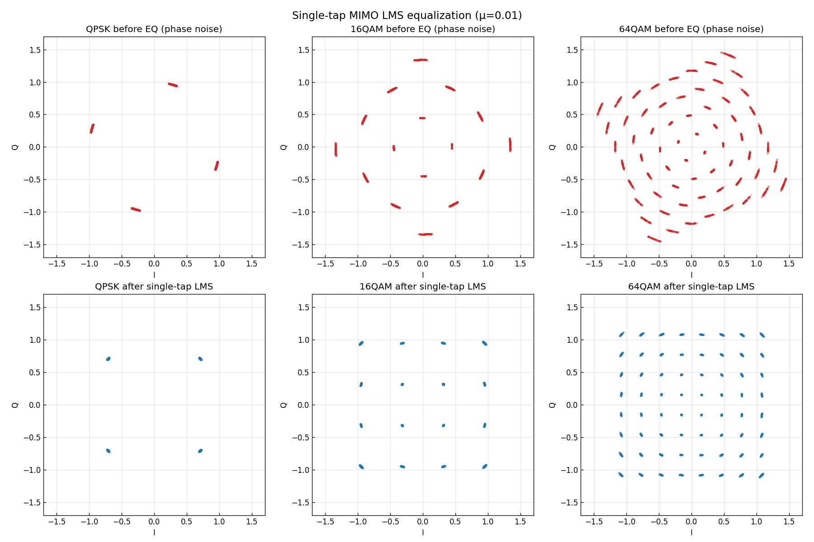
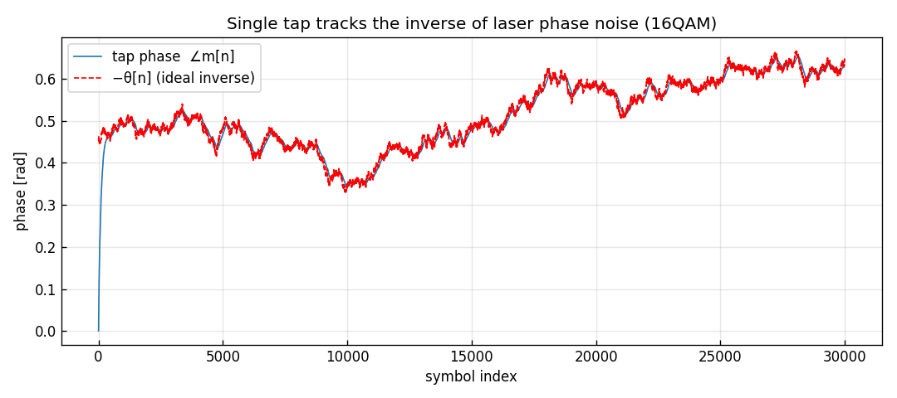
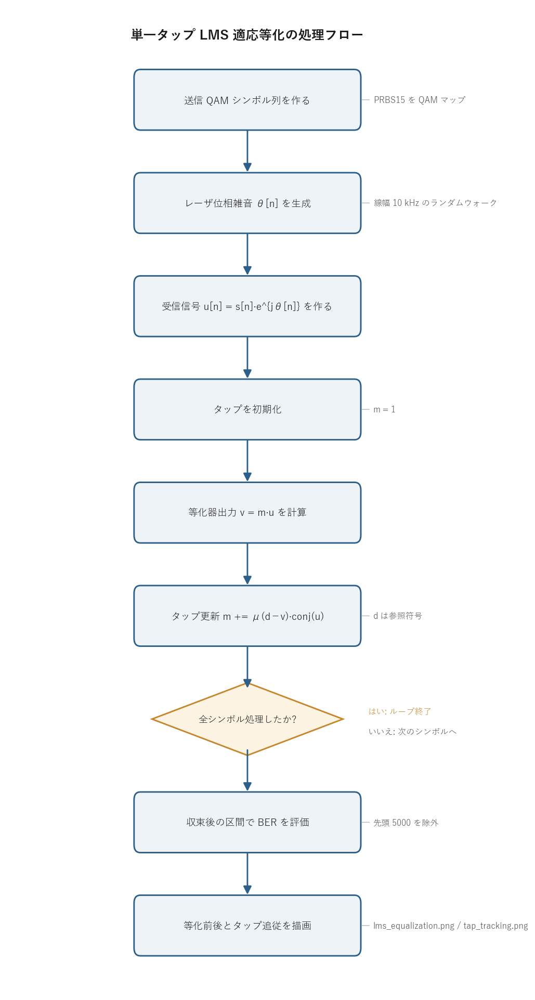

# 問題3-3: 単一タップ MIMO + LMS による適応等化

## 問題

問3-2 で生成した「レーザ位相雑音が付加された受信 QAM サンプル」に対し、単一タップ MIMO を使い LMS アルゴリズムで適応等化し、等化後のコンステレーションを示す。単一タップ $m$ の更新式は

```
v = m * u                      # 単一タップMIMO出力(等化符号)
m = m + mu*(d - v)*u.conj()    # LMS更新
```

($\mu$: ステップサイズ、$d$: 参照符号、$v$: 等化器出力、$u$: 入力符号)。

## 実行結果(出力)

```
符号速度 32 Gbaud, 線幅 10 kHz, μ=0.01, シンボル数 200000

QPSK  : 等化後 BER (収束後) = 0.00e+00
16QAM : 等化後 BER (収束後) = 0.00e+00
64QAM : 等化後 BER (収束後) = 0.00e+00
```





> **図の読み方**
> - 上段(赤)が等化前の円弧状コンステレーション、下段(青)が単一タップ LMS 等化後。円弧が格子へ戻っている(各点に残る小さな尾は追従の遅れ)。
> - 2 枚目は、タップの位相 $\angle m[n]$ が位相雑音の逆 $-\theta[n]$ をほぼ完璧に追っているところ。これがキャリア位相回復にあたる。

---

## 0. 処理の流れ

`solution.py` を実行すると、次の順で処理が進む。



前半で送信シンボル列とレーザ位相雑音を用意し、両者を掛けて受信信号を作る。後半が LMS のループで、1 シンボルごとに「等化器出力を出す → タップを少し更新する」を繰り返す。分岐はループ終了判定の 1 箇所だけで、あとは一本道になる。3 種類の QAM(QPSK / 16QAM / 64QAM)で同じ処理を回し、最後にコンステレーションとタップ追従の図を保存する。

---

## 1. 単一タップ等化器

等化器は受信サンプル $u[n]$ に複素係数(タップ)$m$ を掛けるだけ。

$$ v[n] = m[n]\cdot u[n]. $$

受信が $u[n]=s[n]e^{j\theta[n]}$(位相雑音のみ)なら、$m[n]=e^{-j\theta[n]}$ にすれば $v[n]=s[n]$ と完全に復元できる。難しいのは $\theta[n]$ が未知で、しかもゆっくり変化することにある。固定値の $m$ では追えないので、$m$ を毎シンボル少しずつ更新して動く位相に追従させる。これが適応等化。

> **なぜ MIMO と呼ぶか**
> 一般には入力・出力が複数(偏波多重では 2 入力 2 出力)の行列フィルタを使う。この問題はその最小構成(1 入力 1 出力・1 タップ)で、行列が $1\times1$ のスカラ $m$ に縮約されている。問3-6/3-7 で本来の $2\times2$ MIMO に拡張する。

## 2. LMS アルゴリズムの導出

LMS (Least Mean Squares) は、誤差の 2 乗 $|e[n]|^2 = |d[n]-v[n]|^2$ を最小化するようにタップを勾配降下で更新する。

誤差は $e = d - v = d - m u$ である。複素数の最急降下では $|e|^2$ を $m$ の共役 $m^{*}$ で微分した方向に動かす。$|e|^2 = (d-mu)(d-mu)^{*}$ を $m^{*}$ で偏微分すると

$$ \frac{\partial |e|^2}{\partial m^{*}} = -(d - mu)\,u^{*} = -e\,u^{*} $$

となる。勾配の逆向きへ歩幅 $\mu$ だけ進めると

$$ m \leftarrow m - \mu\frac{\partial |e|^2}{\partial m^{*}} = m + \mu\,(d-v)\,u^{*}. $$

これが問題で与えられた更新式そのものになる。各項の意味は次のとおり。

- $d-v$: 今の出力が参照符号からどれだけずれているか(誤差)。これがゼロに近づけば更新は止まる。
- $u^{*}$: 入力の共役。誤差を入力方向へ投影し、タップをどちらへ動かすかを決める。$u$ の位相を打ち消す向きに $m$ が回る。
- $\mu$: 1 回の更新量。大きいと速く追従するが雑音に過敏、小さいと安定だが追従が遅い。

参照符号 $d$ に既知の送信シンボルを使う方式をデータ援用(training)、判定値 $\hat v$ を使う方式を判定指向(decision-directed)と呼ぶ。この問題はデータ援用で、送信シンボル `tx` をそのまま $d$ に渡している。

### 数値例: 更新を 1 ステップ手で追う

抽象式のままだと動きが見えないので、具体的な数字で 1 ステップ計算してみる。送信シンボルを QPSK の $s=d=\tfrac{1+j}{\sqrt2}=0.70711+0.70711j$($|s|=1$、位相 $45^\circ$)とし、位相雑音 $\theta=30^\circ$ が掛かった受信を

$$ u = s\,e^{j\theta} = 0.25882 + 0.96593j \qquad(|u|=1,\ \text{位相}\ 75^\circ) $$

とする。タップは初期値 $m=1$ から始め、歩幅は分かりやすく大きめの $\mu=0.3$ を使う。

**① 等化器出力** $v = m\,u = 1\cdot u = 0.25882 + 0.96593j$($m=1$ なので入力そのまま、まだ $75^\circ$ ずれている)。

**② 誤差** $e = d - v = (0.70711 - 0.25882) + (0.70711 - 0.96593)j = 0.44829 - 0.25882j$。

**③ 入力共役** $u^{*} = 0.25882 - 0.96593j$。

**④ 更新量** $\mu\,e\,u^{*} = 0.3\,(0.44829 - 0.25882j)(0.25882 - 0.96593j) = -0.04019 - 0.15000j$。

**⑤ 新しいタップ** $m \leftarrow 1 + (-0.04019 - 0.15000j) = 0.95981 - 0.15000j$。

更新後のタップは位相 $-8.9^\circ$。初期の $0^\circ$ から、ねらいの $-30^\circ$(=$-\theta$)へ向かって一歩動いたことが分かる。同じ更新を繰り返すと位相は $0^\circ \to -8.9^\circ \to -15.3^\circ \to -19.8^\circ \to \dots$ と $-30^\circ$ に近づき、誤差の大きさ $|e|$ も $0.518 \to 0.362 \to 0.254 \to \dots$ と縮んでいく。これがタップが「その瞬間の逆回転」へ収束していく過程そのもの。

| ステップ | タップ $m$ | $\angle m$ [deg] | 誤差 $\lvert e\rvert$ |
| --- | --- | --- | --- |
| 0(初期) | $1.00000 + 0.00000j$ | $0.0$ | $0.518$ |
| 1 | $0.95981 - 0.15000j$ | $-8.9$ | $0.362$ |
| 2 | $0.93167 - 0.25500j$ | $-15.3$ | $0.254$ |
| 3 | $0.91198 - 0.32850j$ | $-19.8$ | $0.178$ |

(実際の信号では $\theta$ も毎シンボル少し動くので、タップは止まらず追従し続ける。ここでは $\theta$ を固定して収束の様子だけを取り出している。)

## 3. なぜ単一タップで位相雑音が消えるのか

位相雑音は振幅を変えず位相だけを回す乗算的なひずみで、各シンボルに $e^{j\theta[n]}$ が掛かる。これは単一複素タップの掛け算でちょうど打ち消せる。タップ自身が振幅 1・位相 $-\theta$ の回転になればよいからである。2 枚目の図のとおり $\angle m[n]$ が $-\theta[n]$ を追従し、タップが「その瞬間の逆回転」を実現している。AWGN を加えていないので、追従が間に合っているかぎり等化後 BER はほぼ 0 になる(出力どおり)。

下段の各点に残る小さな尾は、$\theta$ が変化してから $m$ が追いつくまでの追従遅れ(ラグ誤差)。$\mu$ を大きくすると尾は短くなるが、次の節のとおり雑音増幅とのトレードオフになる。

## 4. ステップサイズ μ のトレードオフ

| μ | 追従の速さ | 残留誤差(雑音増幅) |
| --- | --- | --- |
| 大きい | 速い(尾が短い) | 大きい(過剰反応) |
| 小さい | 遅い(尾が長く、速い位相変化に追従できない) | 小さい |

線幅が広い(位相が速く動く)ほど大きい $\mu$ が必要になるが、大きすぎると更新が発散する。この問題では $\mu=0.01$ で安定に追従できている。最適な $\mu$ は線幅・SNR・QAM 次数で変わるので、固定の正解値はない。

### 数値例: μ が大きすぎると発散する

なぜ「大きすぎると発散」なのかは、入力を固定した単純な場合で数値的に見える。前節の数値例のように $\theta$ が一定で入力 $|u|=1$ のとき、誤差は 1 ステップごとに

$$ e_{k+1} = (1 - \mu\,|u|^2)\,e_k = (1-\mu)\,e_k $$

という等比数列になる(タップが正解へ向かう分だけ誤差が縮む)。つまり収縮率は $|1-\mu|$ で決まり、

| $\mu$ | 収縮率 $\lvert 1-\mu\rvert$ | 挙動 |
| --- | --- | --- |
| $0.1$ | $0.90$ | 安定・遅い(毎回 10% しか縮まない) |
| $0.3$ | $0.70$ | 安定・上の表のペース |
| $1.0$ | $0.00$ | 1 ステップで誤差ゼロ(この理想条件での最速) |
| $1.9$ | $0.90$ | まだ安定だが行き過ぎて振動 |
| $2.0$ | $1.00$ | 誤差が縮まらない(臨界) |
| $2.5$ | $1.50$ | 毎回 1.5 倍に拡大 → **発散** |

安定限界は $0 < \mu < 2/|u|^2$。実際に QPSK 列(各 $|u|=1$)を 40 シンボル流すと、$\mu=1.0$ では誤差がほぼ完全に消える一方、$\mu=2.5$ ではタップが $|m|\approx 5.7\times 10^6$ まで膨れ上がって完全に破綻する。本問の $\mu=0.01$ は収縮率 $0.99$ にあたり、1 ステップでは少ししか動かないが、位相雑音のゆっくりした変化(線幅 10 kHz)を追うには十分速く、かつ雑音に過敏にならない安全側の値になっている。

## 5. 関数ごとの詳細

`solution.py` には 2 つの計算関数と `main` がある。順に見ていく。

### `make_symbols(M, n_sym)`

送信 QAM シンボル列を作る関数。

| 項目 | 内容 |
| ---- | ---- |
| 引数 | `M`: QAM の多値数(4 / 16 / 64)。`n_sym`: 必要なシンボル数。 |
| 戻り値 | 長さ `n_sym` の規格化複素 QAM シンボル列(ndarray)。 |

内部の流れ。

1. `comm.generate_prbs(15)` で長さ 32767 の PRBS15 を作る。
2. `k = log2(M)` ビットで 1 シンボルを表すので、PRBS を `k` 本だけ並べた `np.tile(prbs, k)` を `comm.bits_to_symbols(..., M)` に渡してシンボル列 `block` に変換する。
3. `block` を必要なだけ繰り返し(`np.tile`)、先頭 `n_sym` 個を切り出して返す。

決め打ちの乱数列(PRBS)を周期的に並べているので、送信側と受信側で同じ系列を再現できる。これが後段でデータ援用の参照符号 $d$ として使える理由になる。

### `lms_single_tap(rx, ref, mu)`

単一タップ LMS 等化の本体。

| 項目 | 内容 |
| ---- | ---- |
| 引数 | `rx`: 受信シンボル列 $u$。`ref`: 参照符号 $d$(ここでは送信シンボル)。`mu`: ステップサイズ $\mu$。 |
| 戻り値 | `(v_out, m_hist)`。`v_out` は等化出力 $v$ の列、`m_hist` は各時刻のタップ $m$ の履歴。 |

内部の流れ。

1. 出力用配列 `v_out`、タップ履歴 `m_hist` を確保する(どちらも complex)。
2. タップを `m = 1.0 + 0.0j` で初期化する。位相ずれゼロ・ゲイン 1 から始める。
3. 各シンボル `i` について次を順に実行する。
   - `u = rx[i]`(入力)
   - `v = m * u`(等化器出力)を計算して `v_out[i]` に格納
   - `d = ref[i]`(参照符号)
   - `m = m + mu * (d - v) * np.conj(u)`(LMS 更新)
   - `m_hist[i] = m`(更新後のタップを記録)
4. ループ後に `(v_out, m_hist)` を返す。

中心は `m = m + mu * (d - v) * np.conj(u)` の 1 行。これが第 2 節で導いた更新式で、誤差 $d-v$ を入力共役 $u^{*}$ の向きに $\mu$ 倍だけ反映してタップを動かしている。更新は逐次処理(前の `m` に依存)なので、ベクトル化せず素直なループにしている。

### `main()`

全体をつなぐ関数。

1. 乱数生成器を `SEED=9` で固定し、設定値(符号速度・線幅・$\mu$・シンボル数)を表示する。
2. QPSK / 16QAM / 64QAM のそれぞれについて、`make_symbols` で送信列 `tx` を作り、`comm.laser_phase_noise` で位相雑音 `theta` を生成し、`rx = tx * np.exp(1j*theta)` で位相雑音付き受信信号を作る。
3. `lms_single_tap(rx, tx, MU)` で等化する。参照符号に `tx` を渡しているのでデータ援用になる。
4. 収束後の区間(先頭 `WARMUP=5000` シンボルを除外)で送受ビットを比較し、`comm.count_bit_errors` で BER を求めて表示する。
5. 等化前(赤)と等化後(青)のコンステレーションを 2 行 3 列で描き、`lms_equalization.png` に保存する。
6. 16QAM について改めて等化を回し、タップ位相 $\angle m[n]$(unwrap 済み)と $-\theta[n]$ を重ねた図を `tap_tracking.png` に保存する。

判定誤りを収束後の区間だけで測るのは、起動直後はタップがまだ正しい逆回転に届いておらず、過渡的な誤差が BER を押し上げてしまうため。`WARMUP` 個を捨てることで、定常状態の性能を見ている。

---

## 6. 実行

```bash
python solution.py
```

標準出力は冒頭の「実行結果(出力)」、生成図は `lms_equalization.png` と `tap_tracking.png` を参照。処理フロー図 `flow.png` は `python make_flow.py` で作り直せる。

---

## 7. この問題のつながり

ここでは 1 偏波・位相雑音のみを単一タップで補償した。第 3 週後半では次へ進む。

- 問3-4: 2 つの偏波(x/y)に独立データを載せる偏波多重を作る。
- 問3-5: 伝送中の偏波回転($2\times2$ 特殊ユニタリ行列)を加える。
- 問3-6/3-7: それを $2\times2$ MIMO(複数タップ)で等化し、BER を評価する。

単一タップで足りるのは位相回転だけ。偏波混合や符号間干渉が入ると、複数タップ・行列の MIMO が必要になる。
