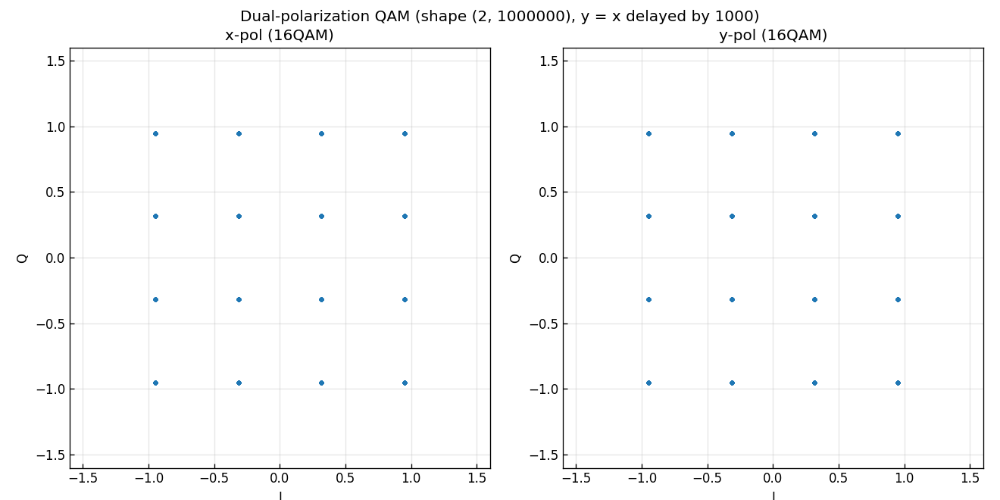
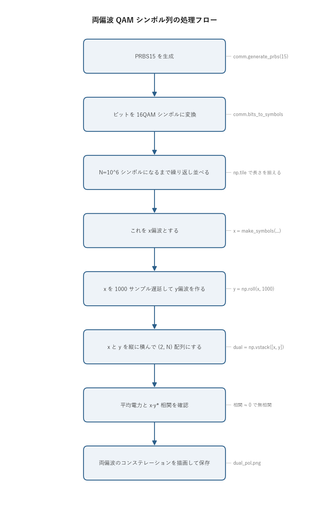

# 問題3-4: 両偏波 QAM シンボル列の生成

## 問題

1 sample/symbol で両偏波 QAM シンボル列を生成する。問3-2 で生成した QAM シンボルを **x偏波** とし、任意の遅延(ここでは 1000 サンプル)を与えたものを **y偏波** として、**2次元 numpy 配列 (2, $10^6$)** の両偏波 QAM シンボル列を作る。

光ファイバは直交する2つの偏波(x, y)に独立な信号を多重できる。これを偏波多重(PDM)といい、同じ波長・同じ帯域で伝送容量がそのまま2倍になる。この問では、2つの偏波に無相関なデータを載せた状況を、別々の系列を作らずに「x の遅延版を y にする」という手で簡単に作る。

## 実行結果(出力)

```
両偏波配列の形状 : (2, 1000000)  (dtype=complex128)
x偏波平均電力     : 1.0000
y偏波平均電力     : 1.0000
x·y* の正規化相関 : 0.0000  (≈0 なら無相関)
y偏波は x偏波の 1000 サンプル遅延版: True
```



> **図の読み方**
> - 左右とも同じ 16QAM の格子(I-Q 平面に 4×4 = 16 点)。
> - 中身は同じ系列だが 1000 シンボルずれているため、時刻ごとに見ると無相関な2つのデータ流として振る舞う。
> - 平均電力をそろえてあるので、両方とも同じ半径の範囲に収まる。

---

## 0. 処理の流れ

`solution.py` を実行すると、次の順で処理が進む。



前半(PRBS 生成からシンボル列の長さ合わせまで)が x偏波の中身を作る部分で、問3-2 とまったく同じ。後半が偏波多重の本体で、`np.roll` で y偏波を作り、`np.vstack` で (2, N) 配列にまとめる。分岐はなく一本道で、最後に確認用の数値を表示してコンステレーション図を保存する。

---

## 1. 偏波多重(PDM)とは

光は電磁波で、進行方向に直交する **2つの偏波(x, y)** を持つ。x方向に振動する電界と y方向に振動する電界は互いに直交するので、**同じ波長・同じ帯域で独立な信号を2つ載せられる**。これが **偏波多重(PDM, Polarization-Division Multiplexing)**で、1本のファイバの伝送容量がそのまま2倍になる。100G/400G のコヒーレント光通信では標準的に使う。

データ構造としては、各時刻のシンボルを **2成分の縦ベクトル**

$$ \mathbf{s}[n] = \begin{bmatrix} s_x[n] \\ s_y[n] \end{bmatrix} $$

で表す。$s_x[n]$ が x偏波に載せる複素 QAM シンボル、$s_y[n]$ が y偏波に載せるシンボル。プログラムでは形状 $(2, N)$ の複素配列にして、1行目を x偏波、2行目を y偏波とする。この縦ベクトル表現にしておくと、後の偏波回転や等化を $2\times2$ 行列の掛け算で書ける。

> **数値例: 1シンボル枠あたりの自由度と電力**
> 各偏波を平均電力1に規格化してあるので、1時刻のベクトル $\mathbf{s}[n]$ が運ぶ量は次のようになる。
>
> - **複素自由度**: x偏波1個 + y偏波1個 = **複素2自由度**(= 実4自由度)。単一偏波の2倍。
> - **平均合成電力**: $\mathbb{E}\big[\,\|\mathbf{s}[n]\|^2\,\big] = \mathbb{E}[|s_x|^2] + \mathbb{E}[|s_y|^2] = 1 + 1 = 2$。
> - **1枠あたりのビット数**(16QAM の場合): $\log_2 16 \times 2 = 4 \times 2 = \mathbf{8}$ ビット。単一偏波の4ビットに対しちょうど2倍で、これが「容量2倍」の正体。
>
> 個々の枠で見ると、合成電力は時刻ごとに揺らぐ。後で出てくる先頭シンボル($n=3$)では
> $|s_x[3]|^2 = 0.3162^2 + 0.9487^2 = 1.0$、$|s_y[3]|^2 = 0.9487^2 + 0.9487^2 = 1.8$ なので合成は $1.0 + 1.8 = 2.8$。平均すると上の $2$ に収束する。

## 2. x偏波の中身: 16QAM シンボル列

x偏波には問3-2 と同じ QAM シンボル列を載せる。中身は次の3段階で作る。

1. `comm.generate_prbs(15)` で擬似ランダムビット列(M系列、周期 $2^{15}-1 = 32767$)を1周期生成する。
2. これを `comm.bits_to_symbols` で 16QAM シンボルにマップする。16QAM は1シンボル $\log_2 16 = 4$ ビットなので、ビット列を4ビットずつ区切って複素点に変換する(グレイ符号、平均電力1に規格化)。
3. 1周期分では $10^6$ シンボルに足りないので、`np.tile` で必要な回数だけ繰り返して長さをそろえ、先頭 $10^6$ 個を取り出す。

QAM は In-phase(実部、I)と Quadrature(虚部、Q)の2軸に振幅を割り当てる変調方式。16QAM なら各軸が4レベル($\pm1, \pm3$ を規格化したもの)で、I-Q 平面に 4×4 の格子点ができる。これが図の格子の正体になる。

> **数値例: 4ビット → 1シンボルのマッピング**
> 16QAM は前半2ビットを I軸グレイ符号、後半2ビットを Q軸グレイ符号として、各軸を $\{-3,-1,+1,+3\}$ の4値 PAM に割り当て、最後に $\sqrt{2(M-1)/3}=\sqrt{10}$ で割って規格化する($M=16$)。実際に `comm.bits_to_symbols` がやる計算をビット単位で追うと次のとおり。
>
> | 4ビット | I: gray→idx→amp | Q: gray→idx→amp | $(I+jQ)/\sqrt{10}$ |
> | ---- | ---- | ---- | ---- |
> | `1111` | $3 \to 2 \to +1$ | $3 \to 2 \to +1$ | $+0.3162+0.3162j$ |
> | `1110` | $3 \to 2 \to +1$ | $2 \to 3 \to +3$ | $+0.3162+0.9487j$ |
> | `0000` | $0 \to 0 \to -3$ | $0 \to 0 \to -3$ | $-0.9487-0.9487j$ |
> | `1001` | $2 \to 3 \to +3$ | $1 \to 1 \to -1$ | $+0.9487-0.3162j$ |
>
> idx は振幅順($0\!\to\!-3,\ 1\!\to\!-1,\ 2\!\to\!+1,\ 3\!\to\!+3$、すなわち $\text{amp}=2\,\text{idx}-3$)。グレイ符号をいったん通常の整数 idx に戻してから振幅にするので、隣り合う格子点のビットは1ビットだけ違う。$0.3162 = 1/\sqrt{10}$、$0.9487 = 3/\sqrt{10}$。

## 3. y偏波を「x の遅延版」にする理由

y偏波は x偏波の 1000 サンプル遅延コピーにする:

```python
x = make_symbols(M, N_SYM)      # x偏波
y = np.roll(x, DELAY)           # y偏波 = x を 1000 サンプル遅延
dual = np.vstack([x, y])        # (2, N)
```

同じ PRBS 由来でも、**1000 シンボルずらせば各時刻では無相関**になる。M系列は自己相関が「ずれ0で大きく、それ以外でほぼ0」という性質を持つので、1000 シンボルもずらせば $x[n]$ と $y[n] = x[n-1000]$ の間に相関がほとんど残らない。出力の「x·y\* の正規化相関 = 0.0000」がその確認になる。

> **数値例: x偏波・y偏波の先頭シンボルと遅延の対応**
> PRBS の初期状態が全1なので x偏波の先頭は同じシンボルが続くが、y偏波は $y[n]=x[n-1000]$ なので先頭から別の値が並ぶ。両者を並べると遅延多重の中身が見える。
>
> | $n$ | x偏波 $x[n]$ | y偏波 $y[n]=x[n-1000]$ | $\|s_x\|^2$ | $\|s_y\|^2$ |
> | ---- | ---- | ---- | ---- | ---- |
> | 0 | $+0.3162+0.3162j$ | $-0.9487-0.9487j$ | 0.2 | 1.8 |
> | 1 | $+0.3162+0.3162j$ | $+0.9487+0.9487j$ | 0.2 | 1.8 |
> | 2 | $+0.3162+0.3162j$ | $-0.9487+0.3162j$ | 0.2 | 1.0 |
> | 3 | $+0.3162+0.9487j$ | $-0.9487-0.9487j$ | 1.0 | 1.8 |
> | 4 | $-0.9487-0.9487j$ | $-0.9487+0.3162j$ | 1.8 | 1.0 |
>
> 同じ $n$ で x と y が無関係な点になっている(例: $n=0$ で x は内側の点、y は外側の角)。$N=10^6$ のうち、ずれ 1000 での相互相関を実測すると
> $\frac{1}{N}\big|\sum_n x^*[n]\,y[n]\big| \approx 2.9\times10^{-5}$ で、出力では `0.0000` と表示される。これが「1000 サンプルずらせば各時刻で無相関」の数値的な裏づけ。
>
> 遅延の整合は $y[1000{:}1005] = x[0{:}5]$ で確認できる(`np.roll` で 1000 だけ後ろにずらしたので、$x$ の先頭が $y$ の 1000 番目に現れる)。一方 $y[0]=x[N-1000]$ は循環シフトで末尾から巻き戻った値で、確かに $-0.9487-0.9487j$ になっている。
>
> 別系列をもう1本用意してもよいが、遅延版なら1行で済むうえ、無相関性が M系列の性質から保証される。これが「便法」として使われる理由。`np.roll` による遅延が正しく入っているかは、`dual[1][1000:1010] == dual[0][:10]`(y の 1000 番目以降が x の先頭に一致するか)で検証している。

> **`np.roll` の循環シフト**: `np.roll` は配列の端を反対側に巻き戻す循環シフト。`np.roll(x, 1000)` だと x の末尾 1000 サンプルが y の先頭に回り込む。本来の「遅延」は先頭を0で埋めるが、$N=10^6$ に対し巻き込む 1000 サンプルはごくわずかなので、統計的性質には影響しない。ここでは簡潔さを優先して `np.roll` を使っている。

---

## 4. 関数ごとの詳細

`solution.py` には `make_symbols` と `main` の2つがある。

### `make_symbols(M, n_sym)`

PRBS から QAM シンボル列を作り、指定長まで伸ばして返す関数。

| 項目 | 内容 |
| ---- | ---- |
| 引数 | `M`: QAM の多値数(ここでは 16)。`n_sym`: 欲しいシンボル数($10^6$)。 |
| 戻り値 | 長さ `n_sym` の複素 QAM シンボル列(`complex128` の ndarray)。 |

内部の流れ。

1. `prbs = comm.generate_prbs(15)` で長さ 32767 のビット列を得る。
2. `k = int(np.log2(M))` で1シンボルあたりのビット数(16QAM なら4)を求める。
3. `block = comm.bits_to_symbols(np.tile(prbs, k), M)` で1ブロック分のシンボルを作る。`np.tile(prbs, k)` で PRBS を $k$ 回つないでビット数を $k$ の倍数にそろえ(`bits_to_symbols` はビット数が $\log_2 M$ の倍数であることを要求する)、それを QAM シンボルにマップする。
4. `reps = int(np.ceil(n_sym / len(block)))` で、`block` を何回繰り返せば `n_sym` に届くかを切り上げで計算する。
5. `np.tile(block, reps)[:n_sym]` で `reps` 回つなぎ、先頭 `n_sym` 個に切り詰めて返す。

`np.tile(prbs, k)` の1行は「PRBS を $k$ 本横に並べる」という意味。32767 はどんな $k$ でも割り切れないことがあるが、`bits_to_symbols` が要求するのは「ビット総数が $k$ の倍数」であり、$k \times 32767$ は必ず $k$ の倍数なので条件を満たす。

### `main()`

両偏波配列を組み立て、確認値を表示し、図を保存する。

1. `x = make_symbols(M, N_SYM)` で x偏波のシンボル列を作る。
2. `y = np.roll(x, DELAY)` で x を 1000 サンプル遅延させ、y偏波とする。
3. `dual = np.vstack([x, y])` で x と y を縦に積み、形状 $(2, N)$ の両偏波配列にする。
4. 配列の形状・dtype と、x偏波・y偏波それぞれの平均電力 $\frac{1}{N}\sum |s|^2$ を表示する。規格化が保たれていれば両方とも 1.0 になる。
5. `corr = np.abs(np.vdot(dual[0], dual[1])) / N_SYM` で x と y の正規化相関を計算する。`np.vdot(a, b)` は $\sum a^* b$(共役内積)で、無相関なら 0 に近づく。
6. `dual[1][1000:1010] == dual[0][:10]` で遅延が正しく入っているか確認する。
7. matplotlib で x偏波・y偏波それぞれのコンステレーション(先頭 5000 サンプルの散布図)を横並びに描き、`dual_pol.png` に保存する。

`corr = np.abs(np.vdot(dual[0], dual[1])) / N_SYM` の1行が無相関性の確認の核心。$\sum_n x^*[n]\,y[n]$ を $N$ で割ると、2つの偏波の正規化された相関(規格化済み信号どうしなので、最大1に対する比)になる。これが 0 に近いほど、各時刻で2偏波が独立に動いていることを意味する。

---

## 5. これから何をするか

この $(2, N)$ 配列が、第3週後半の出発点になる。実際の光ファイバを伝わると、2つの偏波は **混ざり合う(偏波回転)**。受信側ではそれを **2×2 MIMO** でほどく必要がある。

- **問3-5**: この両偏波信号に **偏波回転**(2×2 特殊ユニタリ行列 SU(2))を掛け、2偏波が混合する様子を見る。
- **問3-6/3-7**: 回転・雑音・位相雑音を受けた両偏波信号を **2×2 MIMO + LMS** で等化し、BER を測る。

偏波処理はすべて、この $(2, N)$ 配列に $2\times2$ 行列を掛ける形(`M @ dual`)で書ける。縦ベクトル表現にしておく利点がここで効いてくる。

## 6. 実行

```bash
python solution.py
```

標準出力は冒頭の「実行結果(出力)」、生成図は `dual_pol.png` を参照。処理フロー図 `flow.png` は `python make_flow.py` で作り直せる。

## 7. 計算量

- シンボル生成: $O(P)$($P = 32767$。PRBS 1周期の生成。`bits_to_symbols` と `np.tile` はベクトル化済み)
- 配列の組み立て・相関計算: $O(N)$($N = 10^6$)

メモリは複素配列 $(2, 10^6)$ で約 32 MB(`complex128` は1要素16バイト)。$10^6$ 規模でも一瞬で終わる。
