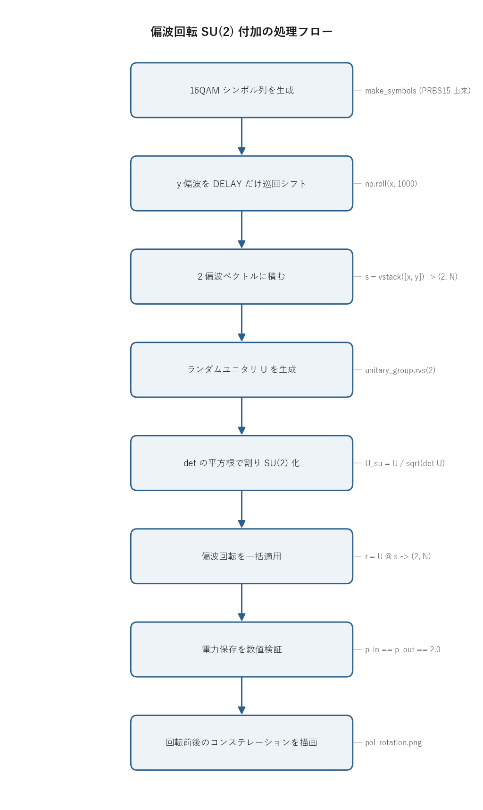

# 問題3-5: 両偏波 QAM 信号への偏波回転(SU(2))の付加

## 問題

光ファイバ伝送では両偏波 QAM 光信号の偏波間に結合が生じる。問3-4 の両偏波シンボル列に
**偏波回転**を付加する。偏波回転は **2×2 の特殊ユニタリ行列(SU(2))** でモデル化できる。
`scipy.stats.unitary_group.rvs(2)` でランダムユニタリ行列を作り、そこから SU(2) 行列を生成して
偏波回転行列として用いる。

## 実行結果(出力)

```
偏波回転行列 U (SU(2)):
[[ 0.02221262-0.92391569j  0.29072829+0.2477165j ]
 [-0.29072829+0.2477165j   0.02221262+0.92391569j]]

ユニタリ性 U·U^H = I : True
行列式 det(U)        : 1.000000+0.000000j  (|det|=1, 実質1)

回転前 2偏波合計平均電力 : 2.0000
回転後 2偏波合計平均電力 : 2.0000  (ユニタリなので不変)
```


> **図の読み方**
> - 上段(回転前): x偏波・y偏波とも素直な 16QAM 格子。
> - 下段(回転後): 各偏波が 256 点の雲になる。これは「x の 16 点」と「y の 16 点」が混ざった $16\times16$ の組み合わせ。
> - 1つの偏波だけ見ても、もう一方が混ざっているので、もう QAM として復調できない。

---

## 0. 処理の流れ

`solution.py` を実行すると、次の順で処理が進む。



前半が信号の準備、すなわち 16QAM シンボル列を作って 2 偏波(x, y)に積み上げる工程。中ほどで
ランダムなユニタリ行列を作り、それを SU(2) に正規化する。後半でその行列を全シンボルへ一括で掛け、
電力が保存されることを確認してから、回転前後のコンステレーションを描画する。分岐はなく一本道で進む。

x 偏波と y 偏波を別々に作らず、y を「x を 1000 シンボルだけずらしたもの」にしている点に注意。
こうすると 2 偏波が無相関に近い別系列になり、混合の効果(片偏波が 256 点の雲になること)が
はっきり見える。

---

## 1. 偏波回転の物理: なぜユニタリ行列か

ファイバ中で 2 偏波は、複屈折などにより互いに混ざり合う。受信した偏波ベクトルは、送信ベクトルを
2×2 行列 $U$ で変換したものになる。

$$ \mathbf{r}[n] = U\,\mathbf{s}[n],\qquad
\mathbf{s}=\begin{bmatrix}s_x\\ s_y\end{bmatrix},\quad U\in\mathbb{C}^{2\times2}. $$

ここで $s_x, s_y$ は時刻 $n$ における x 偏波・y 偏波の複素振幅。行列 $U$ がこの 2 成分を
混ぜ合わせる。

損失や偏波依存損失を無視すれば、この混合はエネルギーを保存する。送信した光のパワーは伝送路で
偏波間を行き来するだけで、合計は変わらないからだ。エネルギー保存を式で書くと、任意の入力ベクトルに対して

$$ \|\mathbf{r}\|^2 = \mathbf{r}^\dagger \mathbf{r} = (U\mathbf{s})^\dagger(U\mathbf{s})
= \mathbf{s}^\dagger U^\dagger U \mathbf{s} = \mathbf{s}^\dagger \mathbf{s} = \|\mathbf{s}\|^2 $$

が成り立つ必要がある。これがすべての $\mathbf{s}$ で成り立つのは $U^\dagger U = I$ のとき、
つまり $U$ が **ユニタリ行列**のときに限る($U^\dagger$ は共役転置)。

コードでは `U @ U.conj().T` が単位行列になることを `np.allclose` で確認し、さらに
「回転後の 2 偏波合計平均電力が 2.0000 のまま不変」であることを数値で示している。後者がまさに
ユニタリ性のエネルギー保存に対応する。16QAM を規格化すると 1 偏波あたりの平均電力が 1 なので、
2 偏波合計で 2 になり、回転後もこの値が変わらない。

## 2. ユニタリ行列から SU(2) へ

`unitary_group.rvs(2)` が返す $U$ はユニタリだが、行列式は $\det U = e^{j\phi}$(絶対値 1 の
任意の位相)になっている。ここから**行列式 1** の特殊ユニタリ行列 SU(2) を取り出すには、
行列式の平方根で全体を割る。

$$ U_{\mathrm{SU}} = \frac{U}{\sqrt{\det U}}, \qquad
\det(U_{\mathrm{SU}}) = \frac{\det U}{(\sqrt{\det U})^2} = \frac{\det U}{\det U} = 1. $$

2 行 2 列のとき、スカラー $c$ で割ると行列式は $c^2$ で割られる($\det(cA)=c^2\det A$)。
だから $c=\sqrt{\det U}$ で割れば行列式がちょうど 1 になる、という計算。

```python
U = unitary_group.rvs(2, random_state=seed)   # ユニタリ
U_su = U / np.sqrt(np.linalg.det(U))           # det=1 -> SU(2)
```

SU(2) 行列は一般に次の形をとる。

$$ U_{\mathrm{SU}} = \begin{bmatrix} a & b \\ -b^{*} & a^{*}\end{bmatrix},\quad |a|^2+|b|^2=1. $$

左上と右下が複素共役の関係、左下が右上の符号反転した共役という、対角線で縛られた構造になっている。
出力の行列を見ると $U_{10}=-U_{01}^{*}$、$U_{11}=U_{00}^{*}$ が成り立っていて、確かにこの形をしている。

全体の位相($\det U$ のぶん)を取り除いた「純粋な回転」が SU(2) にあたる。

> **なぜ SU(2) か**: 全体位相 $e^{j\phi}$ は両偏波に共通の位相回転で、レーザ位相雑音(問3-2)と
> 同じく単一の位相回復で吸収できる。偏波間の混合という回転だけを取り出したのが SU(2) で、これは
> ポアンカレ球上の回転に対応する。

## 3. 偏波混合の結果

回転後、各偏波は 2 つの QAM 格子の線形結合になる。

$$ r_x = a\,s_x + b\,s_y,\qquad r_y = -b^{*}s_x + a^{*}s_y. $$

$s_x$ が 16 通り、$s_y$ が 16 通りの値をとるので、$r_x = a s_x + b s_y$ は
$16\times16 = 256$ 通りの値をとる。これが図(下段)で各偏波が 256 点の雲に見える理由。
$a, b$ が複素数なので、もとの格子は回転・スケールされたうえで重ね合わされ、規則的な格子には戻らない。

1 偏波だけ見ても他方が混ざっていて復調できない。元に戻すには 2 偏波をまとめて逆行列で変換する。
ユニタリ行列の逆行列は共役転置に等しい($U^{-1}=U^\dagger$)ので、

$$ \mathbf{s} = U^{-1}\mathbf{r} = U^\dagger \mathbf{r} $$

で完全に分離できる。ただし受信側では $U$ が未知なので、これを適応的に推定して分離するのが
次問の **2×2 MIMO 等化**になる。

## 4. 関数ごとの詳細

`solution.py` には信号生成・行列生成の 2 つの関数と `main` がある。

### `make_symbols(M, n_sym)`

PRBS15 を種にして 16QAM シンボル列を作る関数。問3-4 までで使ったものと同じ作り方。

| 項目 | 内容 |
| ---- | ---- |
| 引数 | `M`: QAM の点数(ここでは 16)。`n_sym`: 欲しいシンボル数(ここでは $10^6$)。 |
| 戻り値 | 長さ `n_sym` の複素 ndarray(規格化済み 16QAM シンボル列)。 |

内部の流れ。

1. `comm.generate_prbs(15)` で周期 32767 の PRBS を 1 周期分作る。
2. `k = int(np.log2(M))` で 1 シンボルあたりのビット数を求める(16QAM なら 4)。
3. `np.tile(prbs, k)` で PRBS を $k$ 回つなぎ、`comm.bits_to_symbols` で 1 ブロック分のシンボル列 `block` にマップする。
4. `reps = int(np.ceil(n_sym / len(block)))` で必要な繰り返し回数を計算し、`np.tile(block, reps)[:n_sym]` で長さを `n_sym` ちょうどに切り出す。

`np.ceil` で端数を切り上げてから余分を末尾でスライスして捨てるので、`n_sym` が `block` の
長さの倍数でなくても確実に必要数だけ得られる。

### `make_su2(rng_seed)`

ランダムな SU(2) 偏波回転行列を作る関数。

| 項目 | 内容 |
| ---- | ---- |
| 引数 | `rng_seed`: 乱数シード(整数)。同じ値なら毎回同じ行列が出る。 |
| 戻り値 | $(2,2)$ の複素 ndarray。ユニタリかつ行列式 1(SU(2))。 |

処理は 2 行。

1. `U = unitary_group.rvs(2, random_state=rng_seed)` でランダムな 2×2 ユニタリ行列を引く。`random_state` を固定しているので結果は再現する。
2. `U_su = U / np.sqrt(np.linalg.det(U))` で行列式の平方根で割り、行列式を 1 に正規化する。

2 行目が「ユニタリ → SU(2)」の正規化そのもの。$\det U$ は絶対値 1 の複素数なので、その平方根で
割っても各要素の大きさは変わらず、全体位相だけが調整されて行列式が 1 になる。

### `main()`

全体をつなぐ関数。

1. `make_symbols` で x 偏波シンボル列を作り、`y = np.roll(x, DELAY)` で 1000 シンボルずらした列を y 偏波とする。`s = np.vstack([x, y])` で $(2, N)$ の 2 偏波信号に積む。
2. `make_su2(SEED)` で偏波回転行列 $U$ を作り、内容・ユニタリ性・行列式を表示する。
3. `r = U @ s` で全シンボルに偏波回転を一括適用する。$(2,2)$ と $(2,N)$ の行列積なので、各時刻の $(2,1)$ ベクトルに $U$ を掛けたのと同じ結果が一度に出る。
4. 回転前 `s` と回転後 `r` の 2 偏波合計平均電力を計算し、両方 2.0000 になること(電力保存)を確認する。
5. matplotlib で 2×2 の図(上段=回転前 x/y 偏波、下段=回転後 x/y 偏波)を作り、`pol_rotation.png` に保存する。図のラベルは日本語フォントに依存しないよう英語にしている。

`r = U @ s` の 1 行が問題の核心。numpy は $(2,2)$ 行列と $(2,N)$ 配列の積を、列ごとの
行列・ベクトル積として一括処理するので、$10^6$ シンボル全部の偏波回転がループなしで終わる。

## 5. コードのポイント

- `make_su2(seed)`: `unitary_group.rvs` でユニタリ行列を作り、$\sqrt{\det}$ で割って SU(2) 化する。
- `r = U @ s`: $(2,2)$ 行列と $(2,N)$ 配列の積で、全シンボルへ一括で偏波回転を適用する。numpy のブロードキャストで、各時刻の $(2,1)$ ベクトルに $U$ を掛けるのと同じになる。
- ユニタリ性・行列式・電力保存を数値で検証している。理屈どおりに動いていることを実行結果で確かめられる。

### 実行

```bash
python solution.py
```

処理フロー図 `flow.png` は `python make_flow.py` で作り直せる。

## 6. この問題のつながり

次の **問3-6** で、この偏波回転に複素 AWGN とレーザ位相雑音を加えた両偏波信号を、
**2×2 MIMO + LMS** で等化して BER を求める。MIMO はこの $2\times2$ の混合(と位相回転)を
逆行列の形で学習し、2 偏波を分離・復元する。ここで作った「混ざってしまった信号」を、
受信側で $U$ を知らないまま元に戻す処理が次の課題になる。
