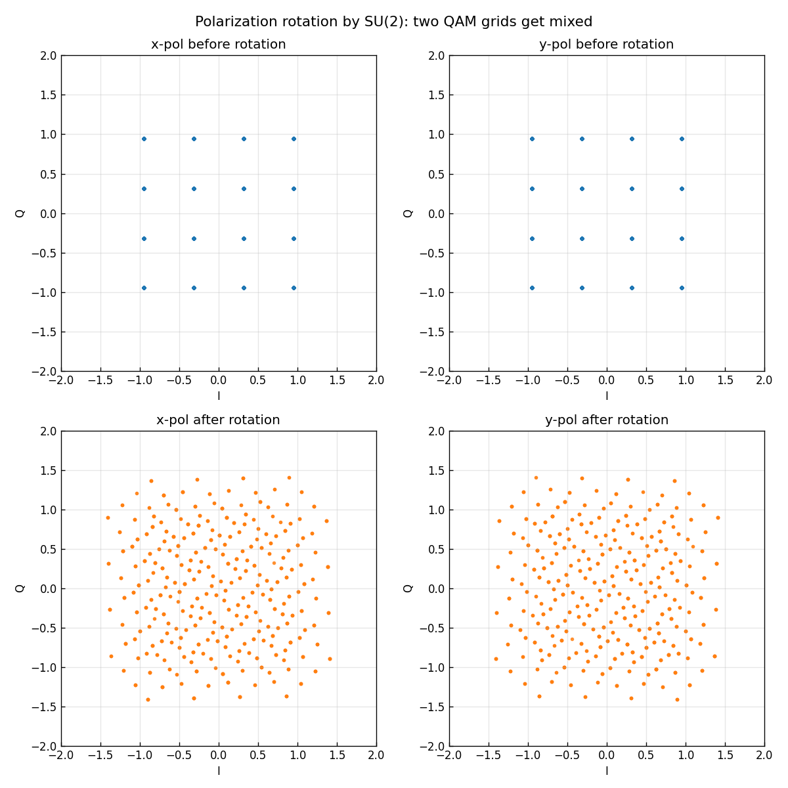

# 問題3-5: 両偏波 QAM 信号への偏波回転(SU(2))の付加

## 問題

光ファイバ伝送では両偏波 QAM 光信号の偏波間に結合が生じる。問3-4 の両偏波シンボル列に
**偏波回転**を付加する。偏波回転は **2×2 の特殊ユニタリ行列(SU(2))** でモデル化できる。
`scipy.stats.unitary_group.rvs(2)` でランダムユニタリ行列を作り、そこから SU(2) 行列を生成して
偏波回転行列として用いる。

## 実行結果(出力)

```
偏波回転行列 U (SU(2)):
[[ 0.02221262-0.92391569j  0.29072829+0.2477165j ]
 [-0.29072829+0.2477165j   0.02221262+0.92391569j]]

ユニタリ性 U·U^H = I : True
行列式 det(U)        : 1.000000+0.000000j  (|det|=1, 実質1)

回転前 2偏波合計平均電力 : 2.0000
回転後 2偏波合計平均電力 : 2.0000  (ユニタリなので不変)
```



> **図の読み方** — 上段(回転前)は x偏波・y偏波とも素直な 16QAM 格子。下段(回転後)は各偏波が
> **256点の雲**になっている。これは「x の 16 点」と「y の 16 点」が混ざり合った $16\times16$ の組み合わせ。
> 1つの偏波だけ見ても、もう一方が混ざっていて**もう QAM として復調できない**。

---

## 1. 偏波回転の物理 — なぜユニタリ行列か

ファイバ中で2偏波は、複屈折などにより**互いに混ざり合う**。受信した偏波ベクトルは、送信ベクトルを
2×2 行列 $U$ で変換したもの:

$$ \mathbf{r}[n] = U\,\mathbf{s}[n],\qquad
\mathbf{s}=\begin{bmatrix}s_x\\ s_y\end{bmatrix},\quad U\in\mathbb{C}^{2\times2}. $$

損失や偏波依存損失を無視すれば、この混合は**エネルギーを保存**する。エネルギー保存
($\|\mathbf{r}\|^2=\|\mathbf{s}\|^2$)を満たす行列が **ユニタリ行列**($U U^\dagger = I$)。
出力の「2偏波合計平均電力が 2.0000 のまま不変」が、まさにユニタリ=エネルギー保存の確認。

## 2. ユニタリ行列から SU(2) へ

`unitary_group.rvs(2)` が返す $U$ は $\det U = e^{j\phi}$(絶対値1の位相)。これを
**行列式1**の特殊ユニタリ行列 SU(2) にするには、行列式の平方根で割る:

$$ U_{\mathrm{SU}} = \frac{U}{\sqrt{\det U}}, \qquad
\det(U_{\mathrm{SU}}) = \frac{\det U}{(\sqrt{\det U})^2} = 1. $$

```python
U = unitary_group.rvs(2, random_state=seed)   # ユニタリ
U_su = U / np.sqrt(np.linalg.det(U))           # det=1 -> SU(2)
```

SU(2) 行列は一般に

$$ U_{\mathrm{SU}} = \begin{bmatrix} a & b \\ -b^{*} & a^{*}\end{bmatrix},\quad |a|^2+|b|^2=1 $$

の形をとる。出力の行列を見ると $U_{10}=-U_{01}^{*}$、$U_{11}=U_{00}^{*}$ になっており、
確かに SU(2) の構造をしている。全体の位相($\det$ のぶん)を取り除いた「純粋な回転」が SU(2)。

> **なぜ SU(2) か** — 全体位相 $e^{j\phi}$ は両偏波共通の位相回転で、レーザ位相雑音(問3-2)と同じく
> 単一の位相回復で吸収できる。偏波間の混合という「本質的な回転」だけを取り出したのが SU(2)。
> ポアンカレ球上の回転に対応する。

## 3. 偏波混合の結果

回転後、各偏波は2つの QAM 格子の線形結合になる:

$$ r_x = a\,s_x + b\,s_y,\qquad r_y = -b^{*}s_x + a^{*}s_y. $$

$s_x$ が 16 通り、$s_y$ が 16 通りなので、$r_x$ は $16\times16=256$ 通りの値をとる → 図の雲。
**1偏波だけでは復調不可能**で、2偏波をまとめて逆行列 $U^{-1}=U^\dagger$ で戻す必要がある。
これを受信側で(行列 $U$ が未知のまま)適応的に行うのが、次問の **2×2 MIMO 等化**。

## 4. コードのポイント

- `make_su2(seed)` — `unitary_group.rvs` でユニタリ行列を作り、$\sqrt{\det}$ で割って SU(2) 化。
- `r = U @ s` — $(2,2)$ 行列と $(2,N)$ 配列の積で、全シンボルへ一括で偏波回転を適用。
  numpy のブロードキャストで、各時刻の $(2,1)$ ベクトルに $U$ を掛けるのと同じ。
- ユニタリ性・行列式・電力保存を数値で検証している。

### 実行

```bash
python solution.py
```

## 5. この問題のつながり

次の **問3-6** で、この偏波回転 + 複素 AWGN + レーザ位相雑音を受けた両偏波信号を
**2×2 MIMO + LMS** で等化し、BER を求める。MIMO はこの $2\times2$ の混合(と位相回転)を
逆行列の形で学習し、2偏波を分離・復元する。
