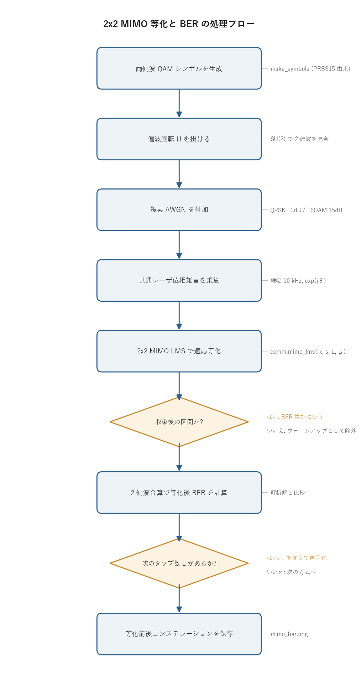

# 問題3-6: 両偏波 QAM の 2×2 MIMO 等化と BER(1 sample/symbol)

## 問題

1 sample/symbol の両偏波 QPSK・16QAM を生成する。伝送路で**偏波回転**が生じ、さらに**複素 AWGN** が
付加される(SNR は QPSK:10 dB、16QAM:15 dB)。コヒーレント受信に伴い、受信ベースバンドシンボルに
**レーザ位相雑音**(線幅 10 kHz)が付加する。これを**単一タップ MIMO** で適応等化し、等化後 BER を求める。
さらに**タップ数 10** の場合も BER を計算する。

## 実行結果(出力)

```
1 sps, 線幅 10 kHz, シンボル数 200000/偏波

    方式   SNR    タップ       等化後BER          解析解
  QPSK   10dB      1    8.264e-04    7.827e-04
  QPSK   10dB     10    8.986e-04    7.827e-04
 16QAM   15dB      1    4.978e-03    4.465e-03
 16QAM   15dB     10    5.302e-03    4.465e-03
```


> **図の読み方**
> - 左列(赤): 等化前の x偏波。偏波混合・位相雑音・AWGN が重なって、点が円環状にぼやけている。
> - 中央列(青): 単一タップ MIMO 後。きれいな格子に戻り、BER は解析解にほぼ一致する。
> - 右列(青): 10 タップ MIMO 後。見た目は単一タップとほぼ同じで、BER はわずかに大きい。

1 sps では単一タップで足りる。タップ数を増やしても良くならず、むしろ少し劣化する。この結論は後述する。

---

## 0. 処理の流れ

`solution.py` を実行すると、次の順で処理が進む。



前半が伝送路の構成(偏波回転 → AWGN → 位相雑音)、後半が MIMO 等化と BER 計算にあたる。
等化はタップ数 1 と 10 の 2 回、それを QPSK と 16QAM の 2 方式について回す二重ループになっている。
分岐は「BER に使う区間か(ウォームアップを除く)」と「次のタップ数があるか」の 2 箇所だけで、
あとは一本道で流れる。

---

## 1. 伝送路モデル(1 sample/symbol)

各時刻のシンボルベクトル $\mathbf{s}[n]=[s_x,s_y]^T$ が受ける変化は次の式で表せる。

$$ \mathbf{r}[n] = e^{j\theta[n]}\,\bigl(U\,\mathbf{s}[n] + \mathbf{w}[n]\bigr) $$

3 つの要素が順に掛かっている。

- $U$: 偏波回転(SU(2)、問3-5)。x偏波と y偏波を混ぜ合わせる $2\times2$ のユニタリ行列。ファイバ中の複屈折で、送信した偏波の向きが受信側でわからなくなる現象を表す。
- $\mathbf{w}[n]$: 各偏波独立の複素 AWGN。受信器の熱雑音や光増幅の自然放出雑音にあたる。
- $e^{j\theta[n]}$: コヒーレント受信時のレーザ位相雑音(両偏波共通、問3-1/3-2)。送信レーザと局発レーザの位相が時間とともにランダムに漂うことを表す。$\theta[n]$ は分散 $2\pi\,\Delta f/f_s$ のランダムウォーク(ウィーナー過程)。

ここで重要なのは、1 sps なので**符号間干渉(ISI)が無い**ことである。1 シンボルを 1 サンプルでしか見ていないので、隣のシンボルが今のサンプルに漏れ込む経路が存在しない。残るひずみは「その時刻だけの偏波混合 $U$」と「その時刻だけの共通位相回転 $e^{j\theta}$」の 2 つに限られ、どちらも前後のシンボルをまたがない。等化器に「過去・未来のサンプルを見る能力(=多タップ)」が要らないのはこのためで、3 節の結論に直結する。

位相雑音 $e^{j\theta}$ が両偏波で**共通**な点も効いてくる。x偏波と y偏波が同じ位相回転を受けるので、これは偏波混合 $U$ と区別なく「2×2 行列にまとめて吸収できる」回転として扱える。

> **数値例: 送信 → チャネル通過 → 等化で元に戻る**
>
> 偏波回転を具体的に
> $$ U=\begin{bmatrix}\cos\alpha & e^{j\phi}\sin\alpha \\ -e^{-j\phi}\sin\alpha & \cos\alpha\end{bmatrix},\quad \alpha=30^\circ,\ \phi=45^\circ \;\Rightarrow\; U=\begin{bmatrix}0.866 & 0.354+0.354j \\ -0.354+0.354j & 0.866\end{bmatrix} $$
> とおく($\det U=1$、$UU^H=I$ なので SU(2))。送信 QPSK シンボルを $s_x=\tfrac{1+j}{\sqrt2}$、$s_y=\tfrac{-1+j}{\sqrt2}$、共通位相雑音を $\theta=20^\circ$ とすると、1 節の式 $\mathbf{r}=e^{j\theta}U\mathbf{s}$ は次のように進む。
>
> | 段階 | x偏波 | y偏波 |
> | ---- | ----- | ----- |
> | 送信 $\mathbf{s}$ | $0.707+0.707j$ | $-0.707+0.707j$ |
> | 偏波混合 $U\mathbf{s}$ | $0.112+0.612j$ | $-1.112+0.612j$ |
> | 位相雑音後 $\mathbf{r}=e^{j20^\circ}U\mathbf{s}$ | $-0.104+0.614j$ | $-1.255+0.195j$ |
>
> 受信 $\mathbf{r}$ は送信格子点からまったくずれた値になっている(振幅すら $0.62,\ 1.27$ と崩れている)。ここに等化器 $W=e^{-j\theta}U^{-1}=e^{-j20^\circ}U^H$ を掛けると
> $$ W=\begin{bmatrix}0.814-0.296j & -0.453-0.211j \\ 0.211-0.453j & 0.814-0.296j\end{bmatrix},\qquad W\mathbf{r}=\begin{bmatrix}0.707+0.707j \\ -0.707+0.707j\end{bmatrix}=\mathbf{s} $$
> となり、送信シンボルが**誤差ゼロで**復元される。LMS はこの $W$ を、参照シンボルとの誤差を頼りに学習しているだけである。

---

## 2. 2×2 MIMO 等化器(バタフライ構成)

受信 2 偏波から送信 2 偏波を復元するのに、**2×2 行列フィルタ**を使う。

$$ \begin{bmatrix} v_x \\ v_y \end{bmatrix}
= \begin{bmatrix} W_{xx} & W_{xy} \\ W_{yx} & W_{yy} \end{bmatrix}
\begin{bmatrix} u_x \\ u_y \end{bmatrix} $$

4 つの要素 $W_{pq}$ がそれぞれ $L$ タップの FIR フィルタになっている。$W_{xx}$ と $W_{yy}$ が「自分の偏波をそのまま通す」経路、$W_{xy}$ と $W_{yx}$ が「相手の偏波から混ざってきた分を引き戻す」経路にあたる。受信 x偏波 $u_x$ と 受信 y偏波 $u_y$ を 4 経路で交差させて足し合わせる構造から、これをバタフライ構成と呼ぶ。

> **数値例: 4 経路がそれぞれ何を補正しているか**
>
> 上の数値例の $W$($\alpha=30^\circ,\phi=45^\circ,\theta=20^\circ$、単一タップ)で $v_x=W_{xx}u_x+W_{xy}u_y$ の中身を分解すると、
>
> | 出力 | 自偏波経路 | 交差(相手偏波)経路 | 合計 = 送信 |
> | ---- | --------- | ------------------- | ---------- |
> | $v_x$ | $W_{xx}u_x=0.097+0.530j$ | $W_{xy}u_y=0.610+0.177j$ | $0.707+0.707j=s_x$ |
> | $v_y$ | $W_{yy}u_y=-0.963+0.530j$ | $W_{yx}u_x=0.256+0.177j$ | $-0.707+0.707j=s_y$ |
>
> 交差経路の寄与は自偏波経路と同程度の大きさを持っており、これを足してはじめて $s_x,s_y$ がぴったり揃う。すなわち $W_{xy},W_{yx}$ が無ければ偏波分離はできない。係数の大きさは $|W_{xx}|=|W_{yy}|=\cos\alpha=0.866$、$|W_{xy}|=|W_{yx}|=\sin\alpha=0.5$ となり、対角=「自偏波の通過率」、非対角=「混ざり込み量 $\sin\alpha$ の引き戻し」という役割がそのまま数字に出ている(回転角 $\alpha$ が大きいほど非対角が育つ)。位相雑音 $e^{-j\theta}$ は 4 成分すべてに共通の位相としてかかり、振幅 $|W_{pq}|$ には影響しない。

係数 $W_{pq}$ は LMS(最小二乗平均)で更新する。問3-3 の単一タップ LMS を、2×2・多タップに拡張したものにあたる。

$$ e_x = d_x - v_x,\quad W_{x\cdot} \mathrel{+}= \mu\,e_x\,\mathbf{u}^{*},\qquad
e_y = d_y - v_y,\quad W_{y\cdot} \mathrel{+}= \mu\,e_y\,\mathbf{u}^{*}. $$

出力 $v$ と参照(送信)シンボル $d$ の誤差 $e$ をとり、誤差に入力の複素共役 $\mathbf{u}^{*}$ を掛けたぶんだけ係数を動かす。$\mu$ はステップサイズ(学習率)で、大きいほど速く追従するが揺らぎも大きくなる。送信シンボルを参照に使うので、これは**データ援用(training)**型の等化になる。

### なぜ単一タップで足りるのか

**単一タップ($L=1$)** なら $W$ は普通の $2\times2$ 複素行列になる。このとき等化器が学習すべき逆変換は

$$ W \;\to\; e^{-j\theta[n]}\,U^{-1} $$

である。スカラの位相回復 $e^{-j\theta}$ は $2\times2$ 行列にそのまま掛け算で吸収できるので、**偏波分離($U^{-1}$)と共通位相回復($e^{-j\theta}$)を 1 つの行列が同時に**こなせる。1 sps で ISI が無い以上、最適な等化はこの「瞬時の 2×2 逆行列」で尽きていて、タップを増やす必要がない。

共通ライブラリ `comm.mimo_lms` が、タップ数 $L$ を引数に取るこのバタフライ LMS を実装している。中心タップを単位行列で初期化し(最初は「何もしない」状態から始める)、参照は中心タップ時刻に合わせて遅延を補正している。

---

## 3. タップ数を増やしても良くならない理由(1 sps)

伝送路がメモリレス(ISI 無し)なので、最適等化器は 1 タップで決まりきっている。タップ数を 10 にすると、
余分な 9 タップは理想的にはゼロに収束すべきだが、LMS は適応中つねに係数が揺らいでいる。
その結果、**本来ゼロでよいタップが雑音を拾い、等化出力に余分なばらつきを足してしまう**。これが BER をわずかに押し上げる(QPSK で $8.3\times10^{-4}\to9.0\times10^{-4}$)。

| 方式 | SNR | L=1 BER | L=10 BER | 解析解 |
| ---- | --- | --- | --- | --- |
| QPSK | 10 dB | $8.3\times10^{-4}$ | $9.0\times10^{-4}$ | $7.8\times10^{-4}$ |
| 16QAM | 15 dB | $5.0\times10^{-3}$ | $5.3\times10^{-3}$ | $4.5\times10^{-3}$ |

L=1 はどちらも解析解にほぼ一致する。残るわずかな差(L=1 でも解析解より少し大きい)は、位相雑音の追従残差と LMS の定常揺らぎによるもので、消しきれない分にあたる。**1 sps では単一タップが最良**で、これが次問への伏線になる。

---

## 4. 関数ごとの詳細

`solution.py` は 4 つの関数で構成される。上流から順に見ていく。

### `make_symbols(M, n_sym)`

PRBS から両偏波で使う QAM シンボル列を作る関数。

| 項目 | 内容 |
| ---- | ---- |
| 引数 | `M`: QAM 多値数(4 or 16)。`n_sym`: 必要シンボル数。 |
| 戻り値 | 長さ `n_sym` の規格化複素シンボル配列。 |

内部の流れ。

1. `comm.generate_prbs(15)` で PRBS15(周期 32767 ビット)を 1 周期生成する。
2. `k = log2(M)` ビットで 1 シンボルを作るので、PRBS を `k` 回タイルしてから `comm.bits_to_symbols` で QAM シンボルへ変換し、1 ブロックを得る。
3. `n_sym` に届くまでブロックを `np.tile` で繰り返し、先頭 `n_sym` 個に切り出して返す。

PRBS を素材にしているので、送受信で同じ既知系列を再現でき、ビット誤りを数えられる。

### `channel(M, snr_db, rng)`

送信両偏波信号と、伝送路通過後の受信両偏波信号を返す関数。1 節の式をコードに落としたもの。

| 項目 | 内容 |
| ---- | ---- |
| 引数 | `M`: QAM 多値数。`snr_db`: AWGN の SNR [dB]。`rng`: 乱数生成器。 |
| 戻り値 | `(s, rx)`。`s` は送信 2 偏波 `(2, N)`、`rx` は受信 2 偏波 `(2, N)`。 |

内部の流れ。

1. `x = make_symbols(M, N_SYM)` を x偏波の送信列にする。
2. `y = np.roll(x, DELAY)` で `x` を `DELAY=1000` シンボルずらしたものを y偏波にする。2 偏波を別系列にして偏波分離が効いているか確かめるための仕掛けで、巡回シフトなので y偏波も同じ PRBS 由来の既知系列になる。
3. `s = np.vstack([x, y])` で送信 2 偏波 `(2, N)` を作る。
4. `U = unitary_group.rvs(2, random_state=SEED)` でランダムな 2×2 ユニタリ行列を引き、`U / sqrt(det(U))` で行列式を 1 に正規化して **SU(2)**(=純粋な偏波回転)にする。`r = U @ s` で 2 偏波を混合する。
5. `r = comm.add_awgn(r, snr_db, signal_power=1.0, rng=rng)` で複素 AWGN を付加する。信号電力を 1.0 に固定して指定 SNR を厳密に与えている。
6. `theta = comm.laser_phase_noise(N_SYM, DF, RS, rng)` で線幅 `DF=10kHz`・シンボルレート `RS=32GHz` のレーザ位相雑音を生成し、`rx = r * np.exp(1j*theta)` で両偏波共通に掛ける。

`U` の乱数だけ `SEED` 固定で、AWGN と位相雑音は渡された `rng` から引いている。偏波回転は毎回同じチャネル、雑音は試行ごとに変わる、という切り分けになっている。

### `ber_after_eq(s, v, valid, M)`

等化後シンボルから 2 偏波合算の BER を計算する関数。

| 項目 | 内容 |
| ---- | ---- |
| 引数 | `s`: 送信 2 偏波。`v`: 等化出力 2 偏波。`valid`: 有効サンプル範囲(slice)。`M`: QAM 多値数。 |
| 戻り値 | BER(誤りビット数 / 総ビット数)の float。 |

内部の流れ。

1. `sl = slice(WARMUP, valid.stop)` で、先頭 `WARMUP=20000` シンボルを捨てる区間を作る。LMS が収束しきる前の出力を BER に含めないための処置。
2. 偏波 `p = 0, 1` それぞれで、送信シンボルと等化出力を `comm.symbols_to_bits` でビット列に戻す(受信側は内部で硬判定してからデマップする)。
3. 短い方の長さ `nn` に揃え、`comm.count_bit_errors` で不一致ビットを数えて累積する。
4. 2 偏波合計の誤りビット数を総ビット数で割って返す。

`sl = slice(WARMUP, valid.stop)` の 1 行が、収束後だけで BER を測るという測定方針を表している。

### `main()`

全体をつなぎ、図を描く関数。

1. `rng = np.random.default_rng(SEED)` で乱数を初期化し、見出し行を表示する。
2. `CASES = [(4, 10dB, "QPSK"), (16, 15dB, "16QAM")]` を `row` でループする。各方式で `channel` を呼んで送受信信号を作り、`comm.ber_theory_qam` で解析解 BER を求める。
3. 等化前の x偏波コンステレーション(赤)を左列に散布図で描く。
4. `TAPS = [1, 10]` を `col` でループし、各タップ数で `comm.mimo_lms(rx, s, L, MU[L])` を呼んで等化する。`MU` はタップ数ごとに変えていて(L=1: `2e-3`、L=10: `1e-3`)、多タップでは安定のため小さめにしている。`ber_after_eq` で BER を出し、結果を表示しつつ等化後コンステレーション(青)を描く。
5. 2 行 3 列の図を `mimo_ber.png` に保存する。

---

## 5. コードのポイント

- `channel` は偏波回転 → AWGN → 位相雑音の順に伝送路を構成する。掛ける順序が 1 節の式と対応している。
- `comm.mimo_lms(rx, s, L, mu)` はタップ数 $L$ の 2×2 バタフライ LMS。参照に送信シンボルを使うデータ援用型。
- 多タップでは LMS の安定のため $\mu$ を小さめにとる(L=1: $2\times10^{-3}$、L=10: $1\times10^{-3}$)。
- BER は収束後(先頭 2 万シンボルを除く)を 2 偏波合算で計算する。

### 実行

```bash
python solution.py
```

標準出力は冒頭の「実行結果」、生成図は `mimo_ber.png` を参照。処理フロー図 `flow.png` は `python make_flow.py` で作り直せる。

---

## 6. この問題のつながり

次の**問3-7**では同じことを **2 sample/symbol**(α=0 のパルス整形あり)で行う。すると
**ISI と半サンプルの偏波スキューが入り、単一タップでは BER が劣化し、タップ数 10 で解析解に近づく**という、
本問とは逆の結論になる。「いつ多タップが必要か」は、この 2 問を並べると見分けがつく。1 sps でメモリレスなら 1 タップ、
2 sps で ISI が出れば多タップ、という対応になっている。
