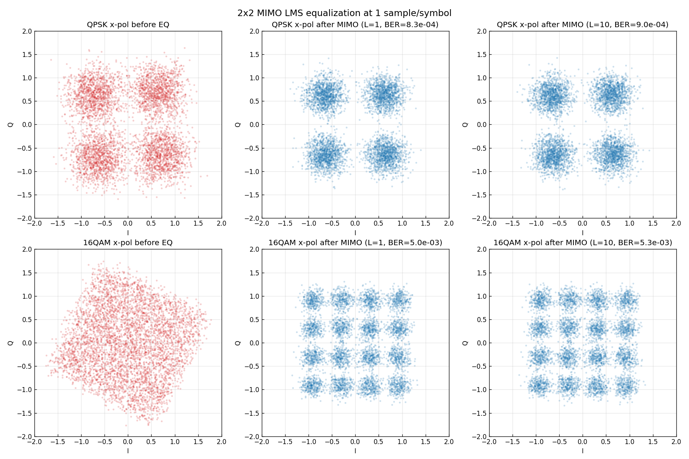

# 問題3-6: 両偏波 QAM の 2×2 MIMO 等化と BER(1 sample/symbol)

## 問題

1 sample/symbol の両偏波 QPSK・16QAM を生成する。伝送路で **偏波回転**が生じ、さらに **複素 AWGN** が
付加される(SNR は QPSK:10 dB、16QAM:15 dB)。コヒーレント受信に伴い、受信ベースバンドシンボルに
**レーザ位相雑音**(線幅 10 kHz)が付加する。これを **単一タップ MIMO** で適応等化し、等化後 BER を求める。
さらに **タップ数 10** の場合も BER を計算する。

## 実行結果(出力)

```
1 sps, 線幅 10 kHz, シンボル数 200000/偏波

    方式   SNR    タップ       等化後BER          解析解
  QPSK   10dB      1    8.264e-04    7.827e-04
  QPSK   10dB     10    8.986e-04    7.827e-04
 16QAM   15dB      1    4.978e-03    4.465e-03
 16QAM   15dB     10    5.302e-03    4.465e-03
```



> **図の読み方** — 左列(赤)が等化前の x偏波(偏波混合 + 位相雑音 + AWGN で崩れている)。
> 中央・右列(青)が単一タップ/10タップ MIMO 後。**どちらもきれいな格子に復元**され、
> BER は解析解にほぼ一致。1 sps では単一タップで十分で、タップ数を増やしてもわずかに劣化する程度。

---

## 1. 伝送路モデル(1 sample/symbol)

各時刻のシンボルベクトル $\mathbf{s}[n]=[s_x,s_y]^T$ が受ける変化:

$$ \mathbf{r}[n] = e^{j\theta[n]}\,\bigl(U\,\mathbf{s}[n] + \mathbf{w}[n]\bigr) $$

- $U$ : 偏波回転(SU(2)、問3-5)。2偏波を混合する。
- $\mathbf{w}[n]$ : 各偏波独立の複素 AWGN。
- $e^{j\theta[n]}$ : コヒーレント受信時のレーザ位相雑音(両偏波共通、問3-1/3-2)。

1 sps なので**符号間干渉(ISI)は無い**。ひずみは「瞬時の偏波混合 $U$」と「共通位相回転 $e^{j\theta}$」だけ。

## 2. 2×2 MIMO 等化器(バタフライ構成)

受信2偏波から送信2偏波を復元する **2×2 行列フィルタ**:

$$ \begin{bmatrix} v_x \\ v_y \end{bmatrix}
= \begin{bmatrix} W_{xx} & W_{xy} \\ W_{yx} & W_{yy} \end{bmatrix}
\begin{bmatrix} u_x \\ u_y \end{bmatrix} $$

各 $W_{pq}$ は $L$ タップの FIR。これを LMS で更新する(問3-3 の単一タップを2×2・多タップに拡張):

$$ e_x = d_x - v_x,\quad W_{x\cdot} \mathrel{+}= \mu\,e_x\,\mathbf{u}^{*},\qquad
e_y = d_y - v_y,\quad W_{y\cdot} \mathrel{+}= \mu\,e_y\,\mathbf{u}^{*}. $$

**単一タップ($L=1$)** なら $W$ は単なる $2\times2$ 複素行列。これは
$W \to e^{-j\theta[n]}\,U^{-1}$ に追従できる($e^{-j\theta}$ はスカラなので $2\times2$ 行列に吸収できる)。
つまり**偏波分離($U^{-1}$)と共通位相回復($e^{-j\theta}$)を1つの行列が同時に**こなす。だから 1 sps では単一タップで十分。

(共通ライブラリ `comm.mimo_lms` が、タップ数 $L$ を引数に取るこのバタフライ LMS を実装している。
中心タップを単位行列で初期化し、参照は中心タップ時刻に合わせている。)

## 3. なぜタップ数を増やしても良くならないのか(1 sps)

伝送路がメモリレス(ISI 無し)なので、最適等化器は**1タップ**。タップ数を 10 にすると、
余分な9タップは理想的にはゼロになるべきだが、LMS は適応中つねに揺らいでいるので、
**余分なタップが雑音を拾い、わずかに BER を悪化**させる(QPSK: $8.3\times10^{-4}\to9.0\times10^{-4}$)。

| 方式 | SNR | L=1 BER | L=10 BER | 解析解 |
| ---- | --- | --- | --- | --- |
| QPSK | 10 dB | $8.3\times10^{-4}$ | $9.0\times10^{-4}$ | $7.8\times10^{-4}$ |
| 16QAM | 15 dB | $5.0\times10^{-3}$ | $5.3\times10^{-3}$ | $4.5\times10^{-3}$ |

いずれも解析解にほぼ一致。**1 sps では単一タップが最良**という、次問への伏線になる結論。

## 4. コードのポイント

- `channel(M, snr, rng)` — 偏波回転 → AWGN → 位相雑音の順に伝送路を構成。
- `comm.mimo_lms(rx, s, L, mu)` — タップ数 $L$ の 2×2 バタフライ LMS。データ援用(参照 = 送信シンボル)。
- 多タップでは安定のため $\mu$ を小さめに(L=1: $2\times10^{-3}$、L=10: $1\times10^{-3}$)。
- BER は収束後(先頭2万シンボルを除く)で2偏波合算して計算。

### 実行

```bash
python solution.py
```

## 5. この問題のつながり

次の **問3-7** では同じことを **2 sample/symbol**(α=0 のパルス整形あり)で行う。すると
**ISI(と半サンプルの偏波スキュー)が入り、単一タップでは BER が劣化、タップ数10で解析解に近づく**
という、本問とは逆の結論になる。「いつ多タップが必要か」がこの2問の対比で理解できる。
