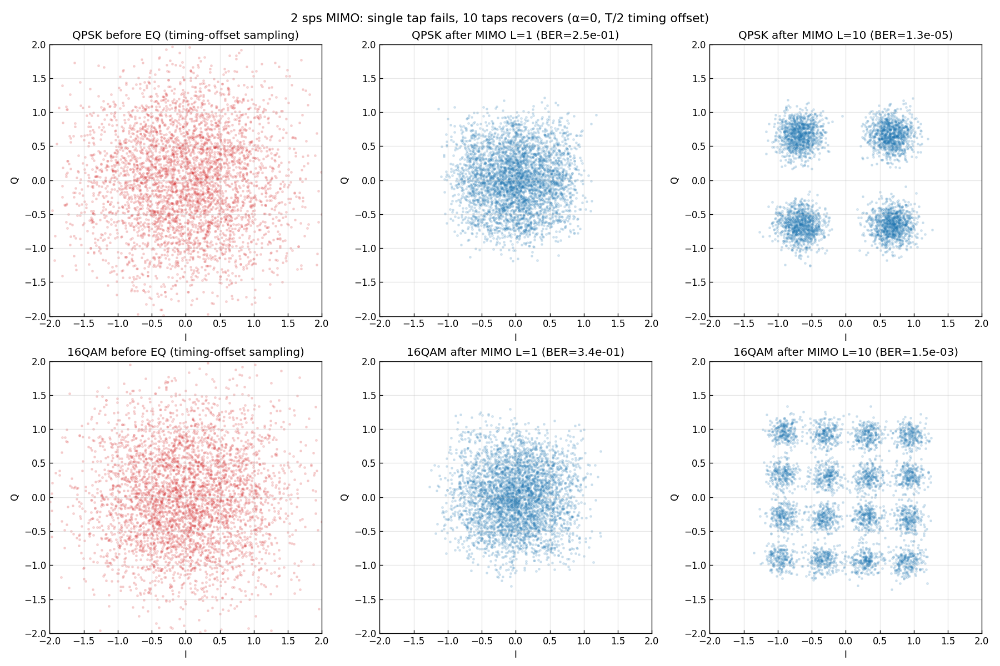
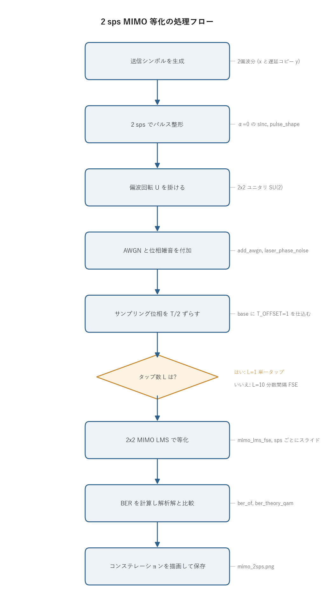

# 問題3-7: 2 sample/symbol での 2×2 MIMO 等化(単一タップ vs 10タップ)

## 問題

問3-6 の計算を **2 sample/symbol** で実行する。パルス整形係数は **α=0**(sinc パルス)。
MIMO 適応等化において、**単一タップでは BER が劣化し、タップ数 10 では BER が解析解に近づく**ことを示す。

## 実行結果(出力)

```
2 sps, α=0.0, サンプリング位相ずれ 1 サンプル(=T/2), 線幅 10 kHz

    方式    SNR    タップ       等化後BER          解析解
  QPSK    10dB      1    2.537e-01    7.827e-04
  QPSK    10dB     10    1.250e-05    7.827e-04
 16QAM    15dB      1    3.371e-01    4.465e-03
 16QAM    15dB     10    1.485e-03    4.465e-03
```



> **図の読み方**
> - 左(赤): 等化前。タイミングがずれた位置でシンボルレート抽出した点。雲状に広がる。
> - 中央: 単一タップ MIMO 後。まだ雲のままで復調不能(BER ≈ 0.25〜0.34)。
> - 右: 10タップ MIMO 後。きれいな格子に回復(BER は解析解レベル)。
>
> 問3-6(1 sps)では単一タップで十分だったのと正反対の結論になる。

---

## 0. 処理の流れ

`solution.py` を実行すると、次の順で処理が進む。



前半が「送信信号を作って伝送路で汚す」部分、後半が「2×2 MIMO で等化して BER を測る」部分にあたる。
1 つの伝送路に対して、タップ数 `L=1` と `L=10` の 2 つの等化器を回し、結果を並べて比較する。
分岐はタップ数の選択 1 箇所だけで、それ以外は QPSK と 16QAM の 2 ケースについて同じ流れを繰り返す。

---

## 1. 1 sps と 2 sps の決定的な違い

問3-6(1 sps)では、伝送路は「瞬時の偏波混合 + 共通位相回転」だけで、符号間干渉(ISI)が無かった。
1 シンボルにつき 1 サンプルしか扱わず、しかもそのサンプルはちょうどシンボル中心(ISI-free 点)を
標本化していた。だから掛け算 1 回(単一タップ)で偏波混合をほどけば済んだ。

2 sps では事情が変わる。実際の受信機は **連続波形を自分のクロックで標本化**するが、その
**サンプリング位相がシンボル中心に合っているとは限らない**。送受で独立にクロックを持つ以上、
タイミング同期が完了するまでは位相がずれているのが普通の状態になる。
ここでは、その位相が半シンボル($T/2$ = 1サンプル)ずれた状況を考える。

α=0 の sinc パルスは裾が $1/t$ でしか減衰しない。レイズドコサインのインパルス応答は
$h(t)=\mathrm{sinc}(t/T)\cdot\dfrac{\cos(\pi\alpha t/T)}{1-(2\alpha t/T)^2}$ で、α=0 だと cos 項が 1 に
なり純粋な sinc に戻る。sinc は整数シンボル時刻でゼロ点を持つ(ナイキスト条件)ので、
ちょうどシンボル中心で標本化すれば隣のシンボルの裾はすべて 0 になり ISI が出ない。
ところが半シンボルずれた点ではゼロ点を外れ、しかも裾が $1/t$ としか減らないので、
前後多数のシンボルからの寄与が一気に足し込まれる。これが 2 sps + α=0 + タイミングずれで
ISI が深刻になる仕組みになる。

## 2. なぜ単一タップは失敗するのか

単一タップは「2サンプル/シンボルのうち 1 つ」を取り出して複素数 1 個を掛けるだけ。
タイミングがずれていると、その 1 サンプルは ISI-free 点ではないので、すでに前後シンボルの裾が
**足し合わさった値**になっている。掛け算は全体を回転・伸縮するだけで、足し合わさった干渉を
成分ごとに引き算することはできない。だからタップ係数を 1 個どう調整しても ISI は残る。
結果、BER は 0.25〜0.34 まで劣化し、ほとんどランダム判定に近いレベルになる。

## 3. なぜ10タップ(分数間隔等化器)は回復するのか

タップを $T/2$ 間隔で 10 個並べた **分数間隔等化器(FSE, Fractionally-Spaced Equalizer)** は、
連続する複数サンプルの重み付き和を作れる。重みを学習で決めることで、1 つの等化器が次を同時に実現する。

1. **整合フィルタ**: パルスの形に合わせて係数を選び、信号エネルギーを最適に集める。
2. **タイミング補償**: 複数サンプルの重み付き和は小数サンプル遅延フィルタとして働き、
   任意のサンプリング位相ずれを吸収する(問2-6 の小数遅延と同じ原理)。
3. **偏波分離**: 2×2 のバタフライ構造で偏波混合 $U^{-1}$ をほどく。
4. **位相回復**: 係数全体の位相を回すことで、共通位相雑音 $e^{-j\theta}$ をゆっくり追従する。

その結果、BER は解析解レベルまで回復する(QPSK $1.3\times10^{-5}$、16QAM $1.5\times10^{-3}$)。

> **解析解より良く見えるのはなぜか**: 10タップ FSE は α=0 パルスのエネルギーを複数サンプルから
> コヒーレントに集める(整合フィルタ利得)。信号は位相をそろえて足すので振幅が比例して増えるが、
> 雑音は各サンプル独立なので電力が足し算、つまり振幅は $\sqrt{}$ でしか増えない。差し引き実効 SNR が
> 上がるため、BER は「中心 1 サンプルだけを使う解析解」をむしろ下回ることがある。
> 着目すべきは **単一タップ(劣化)→ 10タップ(解析解レベルへ回復)** の対比になる。

---

## 4. 関数ごとの詳細

`solution.py` は 4 つの関数で構成される。送信信号生成 → 伝送路 → BER 計測 → 全体制御の順に見ていく。
各関数は `_common/comm.py` の DSP 部品を呼び出す。

### `make_symbols(M, n)`

長さ `n` の送信シンボル列を作る。

| 項目 | 内容 |
| ---- | ---- |
| 引数 | `M`: QAM多値数(4=QPSK, 16=16QAM)。`n`: 必要シンボル数。 |
| 戻り値 | 長さ `n` の複素シンボル配列。 |

内部の流れ。

1. `comm.generate_prbs(15)` で 15 ビット PRBS(周期 32767 の M 系列)を作る。問1と同じ系列源。
2. `k = log2(M)` ビットで 1 シンボルなので、`np.tile(prbs, k)` で PRBS を `k` 本ぶん連結し、
   `comm.bits_to_symbols(..., M)` でグレイ符号の QAM シンボルに写す。
3. PRBS 1 周期では `n` に足りないので、`np.tile(...)[:n]` で必要長まで繰り返して切り出す。

### `channel(M, snr_db, rng)`

送信シンボルを 2 偏波の受信波形に変える。伝送路のモデル化がここに集約されている。

| 項目 | 内容 |
| ---- | ---- |
| 引数 | `M`: 多値数。`snr_db`: SNR [dB]。`rng`: 乱数生成器。 |
| 戻り値 | `(s, rx, delay)`。`s` は送信両偏波シンボル `(2, N)`、`rx` は受信両偏波波形 `(2, Nsamp)`、`delay` はパルス整形の群遅延 [サンプル]。 |

内部の流れ。

1. `x = make_symbols(M, N_SYM)` を生成し、`y = np.roll(x, DELAY)` で同じ系列を `DELAY=1000` シンボル
   ずらしたものを 2 本目の偏波にする。`s = np.vstack([x, y])` で 2 偏波 `(2, N)` にまとめる。
   2 偏波を独立な系列にしておくと、後で偏波が混ざったときに分離できているか確認しやすい。
2. 各偏波を `comm.pulse_shape(s[p], SPS, BETA, SPAN)` で 2 sps・α=0 のパルス整形をする。
   この関数は 0 挿入アップサンプル後にレイズドコサインで畳み込み、サンプル列と群遅延を返す。
3. `U = unitary_group.rvs(2, random_state=SEED)` で 2×2 ランダムユニタリ行列を作り、
   `U = U / sqrt(det(U))` で行列式を 1 に正規化して SU(2)(偏波回転)にする。`r = U @ sh` で 2 偏波を混合する。
4. `comm.add_awgn(r, snr_db, signal_power=1.0, rng=rng)` で複素 AWGN を付加する。
5. `theta = comm.laser_phase_noise(...)` でレーザ位相雑音(ランダムウォーク)を作り、
   `rx = r * np.exp(1j*theta)` で全サンプルに共通の時間変化する位相を掛ける。これが伝送後の受信波形になる。

`U = U / np.sqrt(np.linalg.det(U))` の 1 行が「任意のユニタリを偏波回転 SU(2) に直す」操作で、
電力を保ったまま 2 偏波だけを混ぜる効果がある。

### `ber_of(s, v, kmax, M)`

等化出力 `v` と送信 `s` を突き合わせて BER を出す。

| 項目 | 内容 |
| ---- | ---- |
| 引数 | `s`: 送信シンボル `(2, N)`。`v`: 等化出力 `(2, N)`。`kmax`: 有効な最大シンボル番号。`M`: 多値数。 |
| 戻り値 | ビット誤り率(float)。 |

内部の流れ。

1. `sl = slice(WARMUP, kmax)` で、LMS が収束する前の `WARMUP=20000` シンボルを捨てた区間を選ぶ。
   適応等化は学習初期の係数が暴れるので、定常状態だけで BER を測る。
2. 2 偏波それぞれについて、送信と受信を `comm.symbols_to_bits(..., M)` でビットに戻し、
   `comm.count_bit_errors` で不一致数を数える。
3. 全偏波の誤りビット数の合計を全ビット数で割って BER を返す。

### `main()`

伝送路を 1 つ作り、その上で `L=1` と `L=10` の等化を回して図にする。

1. `rng` を固定シードで作り、条件(2 sps, α=0, タイミングずれ, 線幅)を表示する。
2. ケース `[(QPSK, 10dB), (16QAM, 15dB)]` を行として 2×3 のサブプロットを用意する。
3. 各ケースで `channel(...)` を呼んで受信波形を作り、`comm.ber_theory_qam(M, snr)` で解析解 BER を出す。
4. 等化前の散布図(左列): `idx = delay + T_OFFSET + arange(N_SYM)*SPS` で「ずれた位相」のシンボルレート点を抽出してプロットする。
5. タップ数 `CONFIGS = [(1, 1e-3), (10, 5e-4)]` を回す。`base = delay - L//2 + T_OFFSET` を入力開始位置にして
   `comm.mimo_lms_fse(rx, s, L, mu, SPS, base)` で等化し、`ber_of` で BER を計算して中央・右列に散布図を描く。
6. 全体を `mimo_2sps.png` に保存する。図のラベルは日本語フォント非依存にするため英語にしている。

`base = delay - L//2 + T_OFFSET` の式が肝になる。`delay` がパルス整形の群遅延、`-L//2` が中心タップ基準、
`+T_OFFSET` がサンプリング位相のずれを表す。`T_OFFSET=1`(= $T/2$)を足すことで、わざと半シンボルずれた
位置から窓を切り出し、タイミング同期前の状況を再現している。

---

## 5. MIMO LMS 分数間隔等化器の中身

`comm.mimo_lms_fse(rx, ref, ntaps, mu, sps, base)` が等化の本体になる。

- 出力シンボル `k` は入力窓 `rx[:, k*sps+base : k*sps+base+ntaps]` から作る。`sps=2` サンプルごとに
  窓を 1 シンボルぶんスライドさせるので、入力は 2 sps のまま受けて出力はシンボルレートになる。
- 係数 `W` は `(2, 2, L)` の複素配列(2×2 バタフライ × L タップ)。初期値は中心タップだけ単位行列にする。
- 各シンボルで `vx = W_xx·ux + W_xy·uy`、`vy = W_yx·ux + W_yy·uy` を計算し、誤差 `e = ref - v` で
  `W += mu * e * conj(u)` と LMS 更新する。`ref`(送信シンボル)を教師に使うデータ援用方式。
- `base` にサンプリング位相ずれ(`T_OFFSET`)を仕込むことで、窓の切り出し位置をずらしている。
  `T_OFFSET=0` にすると単一タップでもそこそこ動く(問3-6 と同様)が、実機では位相が未知なので FSE が要る。
- 多タップは係数が多く不安定になりやすいので、`mu` を `1e-3 → 5e-4` と小さめにして安定させている。

---

## 6. まとめ:タップ数の選び方

| 条件 | 必要タップ数 | 理由 |
| ---- | --- | --- |
| 1 sps、ISI 無し(問3-6) | 1タップで十分 | 偏波混合+位相回転のみ。多タップはむしろ雑音増 |
| 2 sps、α=0、タイミングずれ(本問) | 多タップ(FSE)が必須 | 整合フィルタ・タイミング・偏波分離を同時に行う必要 |

実際のコヒーレント受信機が **2 sps + 多タップ MIMO** を採用しているのは、この理由による。
タイミングや偏波・分散の状態が未知でも、多タップ FSE が適応的にすべて補償してくれる。

### 実行

```bash
python solution.py
```

標準出力は冒頭の「実行結果(出力)」、生成図は `mimo_2sps.png` を参照。
処理フロー図 `flow.png` は `python make_flow.py` で作り直せる。

---

## 7. 第3週のまとめ

第3週では、コヒーレント光通信の中核 DSP を一通り実装した。

- **レーザ位相雑音**はランダムウォークで、増分分散 $\sigma_{PN}^2=2\pi\Delta f/f_s$(問3-1、証明付き)。
- 位相雑音はコンステレーションを円弧状に崩す(問3-2)。
- **LMS 適応等化**(問3-3)で位相回転を追従除去。
- **偏波多重**(問3-4)と**偏波回転 SU(2)**(問3-5)で 2 偏波が混合。
- **2×2 MIMO** で偏波分離+位相回復(問3-6)。**2 sps では多タップ FSE が必須**(問3-7)。

第4週では、信号を歪ませる側、すなわち**光ファイバそのものの伝搬**(波長分散・非線形効果・ソリトン・
EDFA 雑音・多中継伝送)をシミュレーションする。
