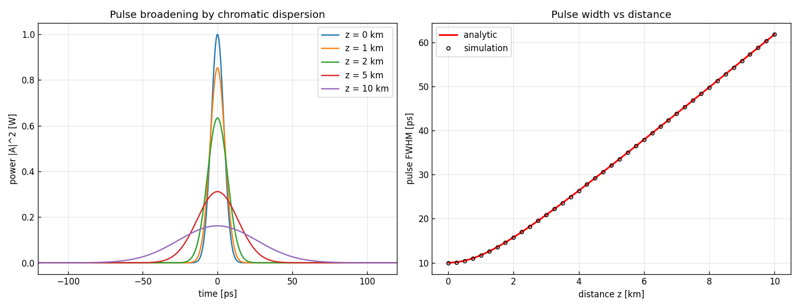

# 問題4-1: 波長分散によるガウスパルスの広がり

## 問題

標準単一モード光ファイバ($\beta_2 = -22\ \mathrm{ps^2/km}$)において、**波長分散のみ**を考えて伝搬させる。
強度ピーク 1 W、強度 FWHM(パルス幅)10 ps のガウスパルスを入力し、**パルス幅の $z$ 依存性**を求める。
さらに **解析解を導出**し、計算結果と比較する。

## 実行結果(出力)

```
β2 = -22.0 ps^2/km, 入力 FWHM = 10.0 ps
T0 = 6.006 ps, 分散長 L_D = T0^2/|β2| = 1.639 km

  z [km]   FWHM(sim) [ps]  FWHM(theory) [ps]
     0.0            10.00              10.00
     1.0            11.71              11.71
     2.0            15.77              15.77
     5.0            32.10              32.10
    10.0            61.81              61.81

数値 vs 解析解 最大相対誤差 = 0.00 %
```



> **図の読み方** — 左:伝搬距離が伸びるほどパルスが**低く・広く**なる(エネルギーは保存)。
> 右:パルス幅の $z$ 依存性。○(数値)が実線(解析解)に完全に乗っている。

---

## 1. 波長分散とは

光ファイバ中では、波長(周波数)ごとに伝搬速度が違う。これを **波長分散(chromatic dispersion)** という。
パルスは多数の周波数成分の重ね合わせなので、各成分がバラバラの速度で進むと、パルスは時間的に広がる。
群速度分散を特徴づけるのが **二次分散 $\beta_2$**(群遅延の周波数微分)。
標準 SMF では $\beta_2\approx-22\ \mathrm{ps^2/km}$(1550 nm 帯、異常分散)。

包絡線 $A(z,T)$($T$ は群速度で動く座標系の時間)は、損失・非線形を無視すると

$$ \frac{\partial A}{\partial z} = -j\,\frac{\beta_2}{2}\,\frac{\partial^2 A}{\partial T^2} $$

に従う。これは**周波数領域で2次位相を掛ける**操作と等価:

$$ \tilde A(z,\omega) = \tilde A(0,\omega)\,\exp\!\left(j\,\frac{\beta_2}{2}\,\omega^2 z\right). $$

これがコードの `dispersion_step`(`fft → ×exp(jβ2ω²z/2) → ifft`)。

## 2. 解析解の導出

入力をチャープ無しガウス $A(0,T)=A_0\exp\!\left(-\dfrac{T^2}{2T_0^2}\right)$ とする。フーリエ変換は

$$ \tilde A(0,\omega) = A_0 T_0\sqrt{2\pi}\,\exp\!\left(-\frac{T_0^2}{2}\omega^2\right). $$

分散の2次位相を掛けると、ガウスの幅パラメータが複素数になる:

$$ \tilde A(z,\omega) = A_0 T_0\sqrt{2\pi}\,
\exp\!\left[-\frac12\Bigl(T_0^2 - j\beta_2 z\Bigr)\omega^2\right]. $$

逆フーリエ変換すると、再びガウス型で、**1/e 半値幅**が

$$ T_1(z) = T_0\sqrt{1+\left(\frac{\beta_2 z}{T_0^2}\right)^2} = T_0\sqrt{1+\left(\frac{z}{L_D}\right)^2},
\qquad L_D \equiv \frac{T_0^2}{|\beta_2|} $$

になる(**分散長 $L_D$**:パルスが目立って広がり始める距離の目安)。強度 FWHM も同じ係数で広がるので

$$ \boxed{\,T_\mathrm{FWHM}(z) = T_\mathrm{FWHM}(0)\sqrt{1+\left(\dfrac{z}{L_D}\right)^2}\,}. $$

### 数値の確認
$T_0 = T_\mathrm{FWHM}/(2\sqrt{\ln2}) = 10/1.6651 = 6.006$ ps、$L_D = T_0^2/|\beta_2| = 36.07/22 = 1.639$ km。
$z=10$ km では $T_\mathrm{FWHM}=10\sqrt{1+(10/1.639)^2}=10\times6.18 = 61.8$ ps。出力と一致。
$z\gg L_D$ では $T_\mathrm{FWHM}\approx T_\mathrm{FWHM}(0)\cdot z/L_D$ と**距離に比例**して広がる。

## 3. 数値解法と一致

数値は「周波数領域で $\exp(j\beta_2\omega^2 z/2)$ を掛けて逆変換 → FWHM 測定」を各 $z$ で行うだけ。
解析解と **相対誤差 0.00%** で一致する。これは、分散が**線形・周波数領域で厳密に解ける**演算であり、
FFT がそれを丸め誤差程度で再現するため。

> **符号について** — パルス幅は $\beta_2$ の符号に依らない($L_D$ に $|\beta_2|$ が入る)。
> 符号が効くのは**チャープの向き**(正常分散か異常分散か)で、幅の広がり方は同じ。
> だから FFT の符号規約も幅の計算には影響しない($\omega^2$ が偶関数)。

## 4. なぜ重要か

波長分散はパルスを広げ、隣のシンボルに食い込ませて **ISI** を生む。これが長距離光通信の主要な劣化要因。
ただし分散は**線形・可逆**なので、受信側で逆の2次位相 $\exp(-j\beta_2\omega^2 z/2)$ を掛ければ**完全に補償**できる
(問4-6 の分散補償)。この「広げて、あとで戻せる」性質がコヒーレント通信の強み。

## 5. コードのポイント

- `fiber.gaussian_pulse` / `fiber.t0_from_fwhm_gauss` — FWHM から $T_0$ を計算してガウスパルスを生成。
- `fiber.dispersion_step(A, β2, z, ω)` — 周波数領域で2次位相を掛ける。
- `fiber.fwhm_of(t, |A|²)` — 強度波形の FWHM を線形補間で測る。
- 時間窓は十分広く(±400 ps)とり、広がったパルスが窓からはみ出さないようにしている。

### 実行

```bash
python solution.py
```

## 6. この問題のつながり

次の **問4-2** では、分散の代わりに **非線形効果(自己位相変調 SPM)**のみを考える。
**問4-3** では分散と非線形を釣り合わせた **ソリトン**(形が崩れないパルス)を扱う。
