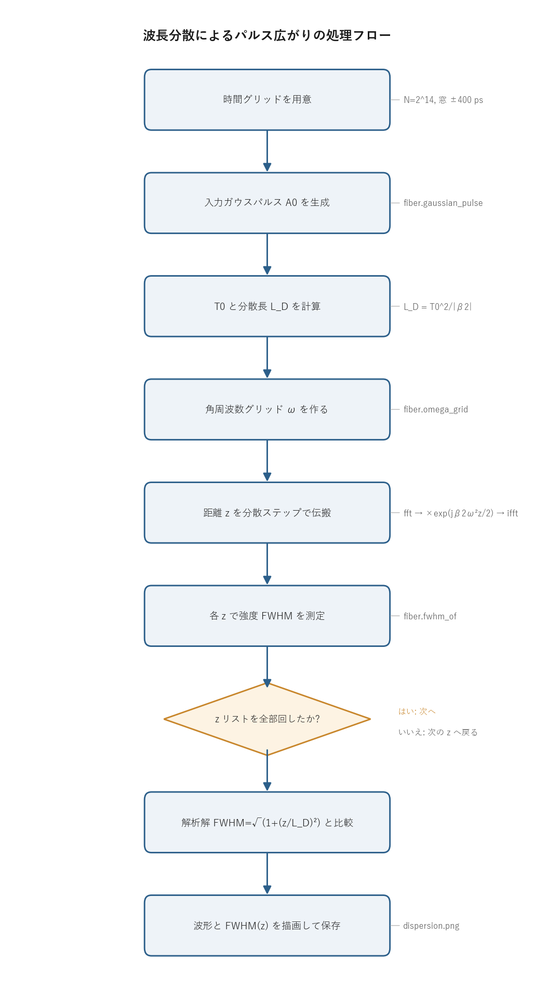

# 問題4-1: 波長分散によるガウスパルスの広がり

## 問題

標準単一モード光ファイバ($\beta_2 = -22\ \mathrm{ps^2/km}$)で、**波長分散だけ**を考えてパルスを伝搬させる。
強度ピーク 1 W、強度 FWHM(パルス幅)10 ps のガウスパルスを入力し、**パルス幅の伝搬距離 $z$ 依存性**を求める。
さらに同じ問題の**解析解を導出**し、数値計算と比較する。損失と非線形効果は無視する。

## 実行結果(出力)

```
β2 = -22.0 ps^2/km, 入力 FWHM = 10.0 ps
T0 = 6.006 ps, 分散長 L_D = T0^2/|β2| = 1.639 km

  z [km]   FWHM(sim) [ps]  FWHM(theory) [ps]
     0.0            10.00              10.00
     1.0            11.71              11.71
     2.0            15.77              15.77
     5.0            32.10              32.10
    10.0            61.81              61.81

数値 vs 解析解 最大相対誤差 = 0.00 %
```


> **図の読み方**
> - 左: いくつかの距離 $z$ での強度波形。距離が伸びるほどパルスが低く・広くなる。面積(エネルギー)は保たれている。
> - 右: パルス幅の $z$ 依存性。○(数値計算)が実線(解析解)にそのまま乗っている。

---

## 0. 処理の流れ

`solution.py` を実行すると、次の順で処理が進む。



前半が入力パルスと周波数グリッドの準備、中盤が「各距離 $z$ で分散を適用してパルス幅を測る」ループ、後半が解析解との比較と作図にあたる。
分岐は距離リストを回し切ったかどうかの 1 箇所だけで、あとは一本道になっている。
分散の伝搬は積算ステップではなく、**入力から距離 $z$ へ一発で飛ばす**形になっている点が後で効いてくる(3 節)。

---

## 1. 波長分散とは

光ファイバの中では、波長(周波数)ごとに伝搬速度が違う。これを **波長分散(chromatic dispersion)** と呼ぶ。
パルスは多数の周波数成分の重ね合わせなので、各成分がバラバラの速度で進むと、到着のタイミングがずれてパルスが時間的に広がる。
群速度の周波数依存を特徴づけるのが **二次分散 $\beta_2$**(群遅延を周波数で 1 回微分した量)で、標準 SMF の 1550 nm 帯では $\beta_2\approx-22\ \mathrm{ps^2/km}$(異常分散)になる。

群速度で動く座標系の時間を $T$ とすると、損失と非線形を無視したときの包絡線 $A(z,T)$ は次の方程式に従う。

$$ \frac{\partial A}{\partial z} = -j\,\frac{\beta_2}{2}\,\frac{\partial^2 A}{\partial T^2} $$

右辺は時間に関する 2 階微分なので、フーリエ変換すると $-\omega^2$ が掛かる。周波数領域に移すと微分方程式が単なる掛け算になり、$z$ について積分できる。

$$ \tilde A(z,\omega) = \tilde A(0,\omega)\,\exp\!\left(j\,\frac{\beta_2}{2}\,\omega^2 z\right) $$

各周波数成分に振幅変化のない**2 次の位相**だけが乗る。振幅は変わらないのでエネルギーは保存し、位相だけがずれて波形が崩れる。これが分散の正体になる。
この演算がコードの `dispersion_step`(`fft → exp(jβ2ω²z/2) を掛ける → ifft`)そのものになる。

## 2. 解析解の導出

入力をチャープ無しガウス $A(0,T)=A_0\exp\!\left(-\dfrac{T^2}{2T_0^2}\right)$ とする。$T_0$ は振幅が $1/e$ になる半値幅。フーリエ変換すると、また別のガウスになる。

$$ \tilde A(0,\omega) = A_0 T_0\sqrt{2\pi}\,\exp\!\left(-\frac{T_0^2}{2}\omega^2\right) $$

ここに 1 節の 2 次位相 $\exp\!\left(j\frac{\beta_2}{2}\omega^2 z\right)$ を掛けると、ガウスの肩に乗る $\omega^2$ の係数が**複素数**になる。

$$ \tilde A(z,\omega) = A_0 T_0\sqrt{2\pi}\,
\exp\!\left[-\frac12\Bigl(T_0^2 - j\beta_2 z\Bigr)\omega^2\right] $$

これを逆フーリエ変換すると、再びガウス型の時間波形に戻る。複素幅パラメータ $T_0^2 - j\beta_2 z$ の実部が、伝搬後の包絡線の幅を決める。整理すると振幅の $1/e$ 半値幅は

$$ T_1(z) = T_0\sqrt{1+\left(\frac{\beta_2 z}{T_0^2}\right)^2} = T_0\sqrt{1+\left(\frac{z}{L_D}\right)^2},
\qquad L_D \equiv \frac{T_0^2}{|\beta_2|} $$

になる。ここで定義した **分散長 $L_D$** は、パルスが目立って広がり始める距離の目安。$z=L_D$ で幅が $\sqrt2$ 倍になる。
強度波形 $|A|^2$ も同じ係数で広がるので、強度 FWHM は次のように書ける。

$$ \boxed{\,T_\mathrm{FWHM}(z) = T_\mathrm{FWHM}(0)\sqrt{1+\left(\dfrac{z}{L_D}\right)^2}\,} $$

### 数値の確認

$T_0 = T_\mathrm{FWHM}/(2\sqrt{\ln2}) = 10/1.6651 = 6.006$ ps、$L_D = T_0^2/|\beta_2| = 36.07/22 = 1.639$ km。
$z=10$ km を入れると $T_\mathrm{FWHM}=10\sqrt{1+(10/1.639)^2}=10\times6.18 = 61.8$ ps となり、出力と一致する。
$z\gg L_D$ では平方根の中の 1 が無視できて $T_\mathrm{FWHM}\approx T_\mathrm{FWHM}(0)\cdot z/L_D$、つまり**距離に比例**して広がる。

## 3. 数値解法と一致の理由

数値計算は各 $z$ について「周波数領域で $\exp(j\beta_2\omega^2 z/2)$ を掛けて逆変換し、得た強度波形の FWHM を測る」だけ。
結果は解析解と **相対誤差 0.00%** で一致する。理由は 2 つある。

第 1 に、分散は線形演算で、周波数領域では掛け算 1 つに帰着する。ステップ分割の近似誤差が入らず、入力から距離 $z$ へ厳密に 1 回で飛ばせる。
第 2 に、FFT はガウスパルスをサンプリングしたものを丸め誤差程度で扱える。時間窓を $\pm400$ ps と十分広く、サンプル数を $2^{14}$ と十分細かく取ってあるので、パルスが窓からはみ出したり離散化で崩れたりしない。

> **符号について**: パルス幅は $\beta_2$ の符号に依らない($L_D$ には $|\beta_2|$ が入る)。
> 符号が効くのはチャープの向き(正常分散か異常分散か)で、幅の広がり方は同じになる。
> 幅の計算に現れるのは $\omega^2$ で偶関数なので、FFT の符号規約も結果に影響しない。

## 4. 関数ごとの詳細

このコードは `_common/fiber.py` の関数を組み合わせて `main` で 1 本にまとめている。使っている関数を順に見ていく。

### `fiber.t0_from_fwhm_gauss(fwhm)`

強度 FWHM から、ガウスパルスの $1/e$ 半値幅 $T_0$ を求める。

| 項目 | 内容 |
| ---- | ---- |
| 引数 | `fwhm`: 強度 FWHM [ps]。 |
| 戻り値 | $T_0$ [ps]。 |

中身は `fwhm / (2*sqrt(ln 2))` の 1 行。強度 $|A|^2=\exp(-T^2/T_0^2)$ が半分になる $T$ を解くと $T_\mathrm{FWHM}=2T_0\sqrt{\ln2}$ になるので、それを逆に解いている。

### `fiber.gaussian_pulse(t, p_peak, fwhm)`

入力ガウスパルスの振幅 $A(T)$ を作る。

| 項目 | 内容 |
| ---- | ---- |
| 引数 | `t`: 時間グリッド [ps]。`p_peak`: ピーク強度 [W]。`fwhm`: 強度 FWHM [ps]。 |
| 戻り値 | 複素振幅にする前の実振幅配列。`|A|^2` のピークが `p_peak` になる。 |

手順は 2 つ。`t0_from_fwhm_gauss` で $T_0$ を出し、`sqrt(p_peak) * exp(-t² / (2 T0²))` を返す。
振幅が $\sqrt{P}$ なのは、強度 $|A|^2$ をピーク $P$ にそろえるため。

### `fiber.dispersion_length(t0, beta2)`

分散長 $L_D = T_0^2/|\beta_2|$ を返す。`abs(beta2)` を使っているので符号に依らない。広がりの速さを 1 つの距離スケールで表す量で、ここでは表示と解析解の計算に使う。

### `fiber.omega_grid(n, dt)`

FFT に合う角周波数グリッド $\omega$ [rad/ps] を作る。

| 項目 | 内容 |
| ---- | ---- |
| 引数 | `n`: サンプル数。`dt`: 時間刻み [ps]。 |
| 戻り値 | 長さ `n` の角周波数配列(FFT の並び順)。 |

`2π * np.fft.fftfreq(n, d=dt)` の 1 行。`fftfreq` が返す周波数の並びは「0、正の周波数、負の周波数」という FFT 独特の順で、`np.fft.fft` の出力とそのまま要素ごとに掛けられる。だから分散ステップで `fftshift` をかけ直す必要がない。

### `fiber.dispersion_step(A, beta2, dz, omega)`

波長分散を距離 `dz` だけ適用する。コードの心臓部。

| 項目 | 内容 |
| ---- | ---- |
| 引数 | `A`: 入力振幅。`beta2`: 二次分散 [ps²/km]。`dz`: 伝搬距離 [km]。`omega`: 角周波数グリッド。 |
| 戻り値 | 距離 `dz` 後の複素振幅。 |

処理は `np.fft.ifft(np.fft.fft(A) * np.exp(1j*(beta2/2)*omega**2*dz))` の 1 行。
`fft(A)` で周波数領域へ移し、各周波数に 2 次位相 $\exp(j\frac{\beta_2}{2}\omega^2 dz)$ を掛け、`ifft` で時間領域へ戻す。1 節の解 $\tilde A(z,\omega)=\tilde A(0,\omega)e^{j\beta_2\omega^2 z/2}$ をそのまま実装したもの。
`dz` には積算した小ステップではなく目的距離 $z$ を直接渡せるので、各 $z$ で入力 `A0` から 1 回の呼び出しで到達できる。

### `fiber.fwhm_of(t, power)`

強度波形の FWHM を線形補間で測る。

| 項目 | 内容 |
| ---- | ---- |
| 引数 | `t`: 時間グリッド。`power`: 強度波形 $|A|^2$。 |
| 戻り値 | FWHM [`t` と同じ単位]。半値を超える点が 2 個未満なら 0 を返す。 |

手順は次のとおり。

1. ピーク値の半分 `half = peak/2` を求める。
2. `power >= half` となるインデックスを取り、その左端 `iL` と右端 `iR` を見つける。
3. 半値を横切る位置を、`iL-1`→`iL` と `iR`→`iR+1` の 2 点間で `np.interp` を使って線形補間する。グリッド刻みより細かい位置で交点を求めるので、サンプリングの粗さによる量子化を抑えられる。
4. 左右の交点の差 `|tR - tL|` を返す。

### `main()`

全体をつなぐ関数。

1. 時間グリッドを作る。`N = 2^14`、窓幅 `Tspan = 800` ps(±400 ps)、刻み `dt = Tspan/N`。
2. `t0_from_fwhm_gauss` と `dispersion_length` で $T_0$ と $L_D$ を出して表示する。
3. `gaussian_pulse` で入力 `A0` を、`omega_grid` で `omega` を作る。
4. `z_list = linspace(0, 10, 41)`(0〜10 km を 41 点)の各 $z$ で `dispersion_step(A0, BETA2, z, omega)` を呼び、`fwhm_of` で FWHM を測って `fwhm_sim` に貯める。
5. 解析解 `fwhm_theory = FWHM0 * sqrt(1 + (z_list/LD)²)` を計算する。
6. 代表点($z=0,1,2,5,10$ km)で数値と解析解を並べて表示する。
7. matplotlib で 2 枚の図を作る。左は代表距離での強度波形、右は FWHM の $z$ 依存性(解析解の実線と数値の○)。`dispersion.png` に保存する。
8. 最後に数値と解析解の最大相対誤差を表示する。

---

## 5. なぜ重要か

波長分散はパルスを広げ、隣のシンボルに食い込ませて **シンボル間干渉(ISI)** を生む。これが長距離光通信の主要な劣化要因になる。
ただし分散は**線形で可逆**な操作なので、受信側で逆向きの 2 次位相 $\exp(-j\beta_2\omega^2 z/2)$ を掛ければ波形を元へ戻せる(問4-6 の分散補償)。
コヒーレント通信では受信時に光の位相まで取れるので、この「広げて、あとで戻す」処理をディジタル信号処理で実現できる。分散をその場で打ち消すのではなく、いったん広げてまとめて補償する設計が成り立つのは、分散がこの線形・可逆な性質を持つため。

## 6. コードのポイント

- 時間窓を $\pm400$ ps と広く取ってあるのは、$z=10$ km で 62 ps まで広がったパルスが窓の端で折り返さないようにするため。窓が狭いと FFT の周期性でパルスの裾が反対側に巻き込み、FWHM がずれる。
- `dispersion_step` に渡すのは小刻みステップではなく目的距離そのもの。分散は厳密に解けるので、各 $z$ で `A0` から 1 回飛ばせば十分で、ループは距離掃引だけになる。
- 図のラベルは日本語フォントに依存しないよう英語にしている。フロー図 `flow.png` だけは `_common/flowchart.py` 経由で日本語を使う。

### 実行

```bash
python solution.py
```

処理フロー図 `flow.png` は `python make_flow.py` で作り直せる。

## 7. この問題のつながり

次の **問4-2** では、分散の代わりに**非線形効果(自己位相変調 SPM)**だけを考える。
**問4-3** では分散と非線形を釣り合わせた **ソリトン**(伝搬しても形が崩れないパルス)を扱う。
