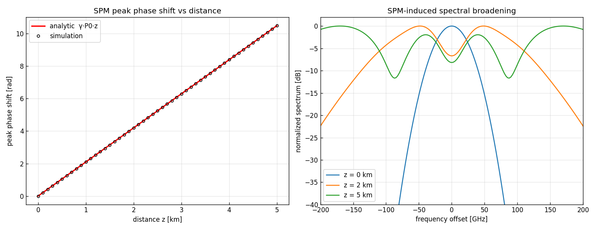
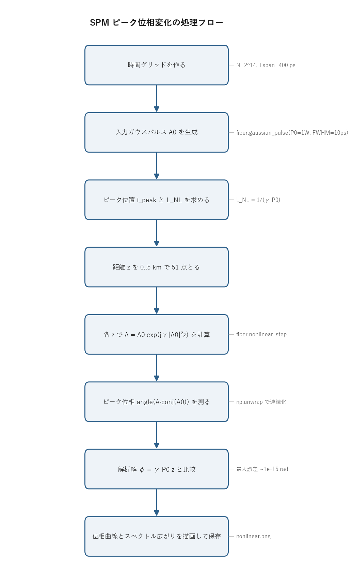

# 問題4-2: 非線形効果(自己位相変調 SPM)による位相変化

## 問題

標準単一モード光ファイバ($\gamma = 2.1\ \mathrm{W^{-1}km^{-1}}$)において、**非線形効果のみ**を考えて伝搬させる。
強度ピーク 1 W、強度 FWHM 10 ps のガウスパルスを入力し、**ピーク位置における位相変化量の $z$ 依存性**を求める。
さらに **解析解を導出**して比較する。

## 実行結果(出力)

```
γ = 2.1 1/(W·km), ピーク強度 = 1.0 W
非線形長 L_NL = 1/(γ P0) = 0.4762 km

  z [km]  φ_peak(sim) [rad]   φ_peak(theory) [rad]
     0.0              0.000                  0.000
     1.0              2.100                  2.100
     2.0              4.200                  4.200
     5.0             10.500                 10.500

数値 vs 解析解 最大絶対誤差 = 8.88e-16 rad
```



> **図の読み方**
> - 左:ピーク位相は距離に比例して増える($\phi=\gamma P_0 z$)。○(数値)が直線(解析解)にぴったり重なる。
> - 右:位相が時間的に変化することでスペクトルが広がる(SPM スペクトル広がり)。距離が伸びると山が増えて多峰構造になる。

---

## 0. 処理の流れ

`solution.py` を実行すると、次の順で処理が進む。



入力パルスを 1 つ作り、距離 $z$ を変えながら同じ非線形変換を繰り返しかける一本道の構成になっている。
分岐はなく、各 $z$ について「位相を乗せる → ピーク位相を測る」を 51 回まわすだけ。
最後に位相曲線(左)とスペクトル広がり(右)を 1 枚にまとめて保存する。

ここで距離ごとに伝搬を解き直しているのは、SPM が距離に対して厳密に解けるからで、
途中状態を積み上げずに $z$ を直接代入して $A(z)$ を一発で求められる。

---

## 1. 非線形効果(光カー効果)と SPM

光強度が強いと、ファイバの屈折率がわずかに強度に応じて変わる。屈折率を

$$ n(I) = n_0 + n_2 I $$

と書いたときの $n_2 I$ の項が**光カー効果**で、$n_2$ をカー係数という。
屈折率が強度で動くということは、光の通る「光路長」が強度で動くことなので、光は自分自身の強度に応じた位相変調を受ける。
これを **自己位相変調(SPM, Self-Phase Modulation)** という。
パルスの包絡線 $A(z,T)$ の従う方程式は、分散・損失を無視すると

$$ \frac{\partial A}{\partial z} = j\,\gamma\,|A|^2\,A $$

になる。$\gamma$ は非線形係数で、カー係数 $n_2$・波長・モード実効断面積 $A_\mathrm{eff}$ から
$\gamma = 2\pi n_2 / (\lambda A_\mathrm{eff})$ と決まる量。右辺が $|A|^2$(=瞬時強度)に比例しているところが要点で、
強いところほど速く位相が回る。

## 2. 解析解の導出

この方程式は手で解ける。まず**振幅が変わらない**ことを示す。$|A|^2 = A A^*$ の $z$ 微分を取ると

$$ \frac{\partial |A|^2}{\partial z}
   = A^*\frac{\partial A}{\partial z} + A\frac{\partial A^*}{\partial z}
   = A^*\,(j\gamma|A|^2 A) + A\,(-j\gamma|A|^2 A^*) = 0. $$

2 つの項は符号が逆で打ち消し合う(右辺が純虚数だから、エネルギーをやり取りせず位相だけ回す)。
よって $|A(z,T)| = |A(0,T)|$ は $z$ について一定になる。

振幅が一定だと、元の方程式の右辺の $|A|^2$ も $z$ について定数なので、残る位相は $z$ に線形に積もるだけ。
時刻 $T$ を固定して積分すると

$$ A(z,T) = A(0,T)\,\exp\!\bigl(j\,\gamma\,|A(0,T)|^2\,z\bigr) $$

が得られる。各時刻 $T$ で、その瞬時強度 $|A(0,T)|^2$ に比例した位相が乗る。これがコードの `nonlinear_step` がやっている計算そのもの。

> **数値例:ピークと裾で位相の回り方が違う**
> 本問のガウスパルスは強度 FWHM 10 ps なので $1/e$ 半値幅 $T_0 = 10/(2\sqrt{\ln 2}) = 6.01$ ps、強度は $|A(T)|^2 = P_0\,e^{-T^2/T_0^2}$。
> 「位相は強度に比例して回る」を $z=5$ km で具体的に並べると:
>
> | 時刻 $T$ [ps] | 瞬時強度 $|A|^2$ [W] | $\phi(T,z{=}5) = \gamma |A|^2 z$ [rad] |
> | ----: | ----: | ----: |
> | $0$(ピーク) | $1.000$ | $2.1 \times 1.000 \times 5 = 10.50$ |
> | $\pm 5$(強度半値点) | $0.500$ | $2.1 \times 0.500 \times 5 = 5.25$ |
> | $\pm T_0=\pm 6.01$ | $0.368$ | $2.1 \times 0.368 \times 5 = 3.86$ |
> | $\pm 12.0$ | $0.018$ | $2.1 \times 0.018 \times 5 = 0.19$ |
>
> ピークでは $10.5$ rad 回るのに、強度が半分の点では位相も半分の $5.25$ rad しか回らない。
> 裾(強度が小さいところ)はほとんど回らない。この**位相の回り方が時刻ごとに違う**ことが、次節のチャープとスペクトル広がりの正体になる。
ピーク($T=0$, $|A|^2 = P_0$)での位相変化は

$$ \boxed{\;\phi_\mathrm{max}(z) = \gamma\,P_0\,z\;} $$

で、距離に比例する。傾きは $\gamma P_0 = 2.1\ \mathrm{rad/km}$。$z=5$ km なら $10.5$ rad で、出力の数値と合う。

**非線形長** $L_\mathrm{NL} = 1/(\gamma P_0) = 0.476$ km は、ピーク位相がちょうど 1 rad たまる距離。
SPM がどれくらい効くかの目安になる長さで、伝送距離が $L_\mathrm{NL}$ を超えると非線形が無視できなくなる。

> **数値例:ピーク位相を手で計算する**
> 本問の値 $\gamma = 2.1\ \mathrm{W^{-1}km^{-1}}$、$P_0 = 1\ \mathrm{W}$ を $\phi_\mathrm{max}(z) = \gamma P_0 z$ に入れるだけ。
>
> | 距離 $z$ [km] | $\phi_\mathrm{max} = \gamma P_0 z$ [rad] | $\phi_\mathrm{max}/(2\pi)$ [周] |
> | ----: | ----: | ----: |
> | $L_\mathrm{NL}=0.476$ | $2.1 \times 1 \times 0.476 = 1.00$ | $0.16$ |
> | $1$ | $2.1 \times 1 \times 1 = 2.10$ | $0.33$ |
> | $2$ | $2.1 \times 1 \times 2 = 4.20$ | $0.67$ |
> | $5$ | $2.1 \times 1 \times 5 = 10.50$ | $1.67$ |
>
> $z=5$ km では位相が $10.5$ rad $\approx 1.67$ 周ぶん回っており、出力表の `φ_peak = 10.500` と一致する。
> 一般の実効長 $L_\mathrm{eff}$(損失込みの場合)を使う表記 $\phi_\mathrm{NL} = \gamma P L_\mathrm{eff}$ でも計算は同じで、本問は損失ゼロなので $L_\mathrm{eff}=z$。

## 3. SPM スペクトル広がり(右図)

位相 $\phi(T) = \gamma|A(T)|^2 z$ は時間とともに変わる。位相の時間変化は周波数のずれそのものなので、**瞬時周波数**

$$ \delta\omega(T) = -\frac{\partial\phi}{\partial T} = -\gamma z\,\frac{\partial|A(T)|^2}{\partial T} $$

が生じる(**チャープ**)。ガウスパルスでは、強度が立ち上がる前縁($\partial|A|^2/\partial T > 0$)で $\delta\omega < 0$、
強度が下がる後縁で $\delta\omega > 0$ になる。前縁で周波数が下がり後縁で上がるので、もともと無かった周波数成分が新しく作られ、**スペクトルが広がる**。

> **数値例:広がり量を見積もる**
> ガウス強度 $|A|^2 = P_0 e^{-T^2/T_0^2}$ では $\partial|A|^2/\partial T = -(2T/T_0^2)\,P_0 e^{-T^2/T_0^2}$ なので、
> $\delta\omega(T) = (2\gamma z\,P_0/T_0^2)\,T\,e^{-T^2/T_0^2}$。これが最大になるのは $T = T_0/\sqrt 2 = 4.25$ ps の付近で、$z=5$ km なら
> $$ \max|\delta\omega| = \frac{2\gamma z P_0}{T_0^2}\cdot\frac{T_0}{\sqrt 2}e^{-1/2} = 1.50\ \mathrm{rad/ps}, $$
> 周波数に直すと $\max|\delta\omega|/(2\pi) \approx 239\ \mathrm{GHz}$。右図のスペクトルが $\pm 200$ GHz 付近まで広がっているのは、このチャープ幅と整合する。
> 入力パルスのスペクトル幅(時間幅 10 ps から約 44 GHz)に比べてはるかに広く、SPM だけで桁違いに広がることがわかる。

広がるだけでなく、右図の $z=5$ km のように**多峰構造**が出る。これは同じ瞬時周波数が前縁と後縁の 2 か所で現れ、
両者の位相差に応じて強め合い・弱め合いが起きるため。最大位相 $\phi_\mathrm{max}$ が大きいほど干渉の縞が増え、山の数も増える。
強度波形(時間)は一切変わらないのに周波数だけが広がるのが SPM の特徴で、波形を見ても起きていることに気づけない。

> **分散との対比**
> 問4-1 の分散は「強度波形が広がるが、スペクトルは不変」。本問の SPM は逆に「強度波形は不変だが、スペクトルが広がる」。
> 時間と周波数を入れ替えた双対の関係になっている。

## 4. 数値との一致

非線形のみの伝搬は時間領域で厳密に解ける。$|A|$ が一定なので、各サンプルに $\exp(j\gamma|A|^2 z)$ を掛けるだけで $A(z)$ が出る。
近似(分割ステップなど)を一切使わないため、数値と解析解は浮動小数点の丸め誤差 $\sim10^{-16}$ rad までしか食い違わない。
出力の「最大絶対誤差 = 8.88e-16 rad」はこの丸め誤差そのもの。

---

## 5. 関数ごとの詳細

このコードは `main()` 1 つに処理がまとまっていて、中で `fiber.gaussian_pulse` と `fiber.nonlinear_step`、
それと図の右側用に内部関数 `spectrum` を呼ぶ。順に見ていく。

### `fiber.gaussian_pulse(t, p_peak, fwhm)`(`_common/fiber.py`)

入力ガウスパルスの複素振幅 $A_0(T)$ を作る。

| 項目 | 内容 |
| ---- | ---- |
| 引数 | `t`: 時間軸 [ps] の配列。`p_peak`: 強度ピーク [W]。`fwhm`: 強度の半値全幅 [ps]。 |
| 戻り値 | 各時刻の複素振幅 $A_0(T)$(初期は実数)。 |

内部では、まず強度 FWHM を $1/e$ 半値幅 $T_0$ に直す($T_0 = \mathrm{FWHM}/(2\sqrt{\ln 2})$)。
その上で $A_0(T) = \sqrt{P_0}\,\exp\!\bigl(-T^2/(2T_0^2)\bigr)$ を返す。
振幅に $\sqrt{P_0}$ を掛けているのは $|A_0|^2 = P_0$(強度がピークで $P_0$ W)になるようにするため。

### `fiber.nonlinear_step(A, gamma, dz)`(`_common/fiber.py`)

SPM を距離 `dz` だけ適用する。本問の主役。

| 項目 | 内容 |
| ---- | ---- |
| 引数 | `A`: 入力振幅。`gamma`: 非線形係数 $\gamma$。`dz`: 伝搬距離 [km]。 |
| 戻り値 | `A * np.exp(1j * gamma * np.abs(A)**2 * dz)`。 |

実装は 1 行で、第 2 節で導いた解析解 $A\,\exp(j\gamma|A|^2 z)$ をそのまま書いたもの。
分散が無い前提なので、距離をいくら飛ばしても 1 回の掛け算で厳密に求まる。
`np.abs(A)**2` が各サンプルの瞬時強度、それに $\gamma\,dz$ を掛けたものが乗る位相。

### `main()` の内部処理

1. 時間グリッドを作る。`N = 2**14` 点、全幅 `Tspan = 400 ps`。`t` は $-200$ ps から $+200$ ps を等間隔に並べた配列で、`dt` はサンプル間隔。
2. `A0 = fiber.gaussian_pulse(t, P_PEAK, FWHM0)` で入力パルスを生成。`i_peak = np.argmax(np.abs(A0))` でピーク位置のインデックスを取る(ガウスなので中央)。
3. 非線形長 `L_NL = 1.0 / (GAMMA * P_PEAK)` を計算して表示する。
4. `z_list = np.linspace(0, 5, 51)` の各 $z$ について、
   - `A = fiber.nonlinear_step(A0, GAMMA, z)` で位相を乗せ、
   - `phi = np.angle(A[i_peak] * np.conj(A0[i_peak]))` でピーク位置の位相増分を測る。
5. 測った位相を `np.unwrap` で連続化して `phi_sim` にする。`unwrap` は $2\pi$ ごとの巻き戻り($-\pi \sim \pi$ への折り返し)をつなぎ直す処理で、これが無いと $\phi$ が $\pi$ を超えた所で値が飛ぶ。
6. 解析解 `phi_theory = GAMMA * P_PEAK * z_list` を作り、$z=0,1,2,5$ km の値を並べて表示する。
7. 図を 2 枚並べて描く(左:位相曲線、右:スペクトル広がり)。
8. `nonlinear.png` に保存し、最後に `max(|phi_sim - phi_theory|)` を最大絶対誤差として表示する。

`phi = np.angle(A[i_peak] * np.conj(A0[i_peak]))` の行は、$A$ と入力 $A_0$ の**位相差**だけを取り出している。
$A\cdot\overline{A_0}$ は大きさが $|A||A_0|$、偏角が $(\arg A - \arg A_0)$ の複素数なので、`np.angle` を取ると振幅に左右されずに位相増分だけが残る。
基準を $A_0$ にすることで、入力時点を 0 rad とした「増えた分」を測れる。

### 内部関数 `spectrum(A)`(右図用)

右のスペクトル広がり図を描くために、`main()` の中で定義している小さな関数。

| 項目 | 内容 |
| ---- | ---- |
| 引数 | `A`: 振幅波形。 |
| 戻り値 | 正規化したパワースペクトル(最大値 1)。 |

`np.fft.fft(A)` で周波数領域に移し、`fftshift` で直流を中央に寄せ、`|・|**2` でパワーにしてから最大値で割る。
これを入力($z=0$)と $z=2,5$ km について計算し、`10*np.log10` で dB 表示して重ね描きする。
距離が伸びるほど裾が外へ広がり、山が増えていく様子が見える。

---

## 6. コードのポイント

- `fiber.nonlinear_step(A, γ, z)` は $A\,\exp(j\gamma|A|^2 z)$。分散が無いので 1 ステップで厳密に解ける。
- ピーク位相は `angle(A[peak] · conj(A0[peak]))` を `np.unwrap` で連続化して測る($2\pi$ 巻き戻り対策)。
- 右図のスペクトルは `|fft(A)|^2` を正規化して dB 表示。SPM で広がる様子を見せる。
- 図のラベルは日本語フォントに依存しないよう英語にしている。処理フロー図 `flow.png` は `python make_flow.py` で作り直せる。

### 実行

```bash
python solution.py
```

## 7. この問題のつながり

分散(問4-1)は波形を広げ、非線形(本問)は位相を回してスペクトルを広げる。
次の **問4-3** では、この 2 つをちょうど釣り合わせると、波形もスペクトルも崩れない特別なパルス
**ソリトン**ができることを見る。
