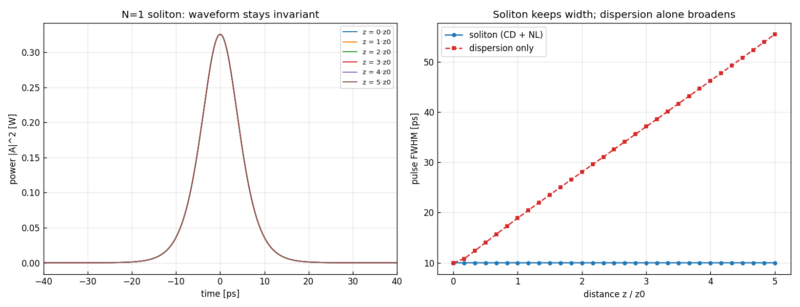
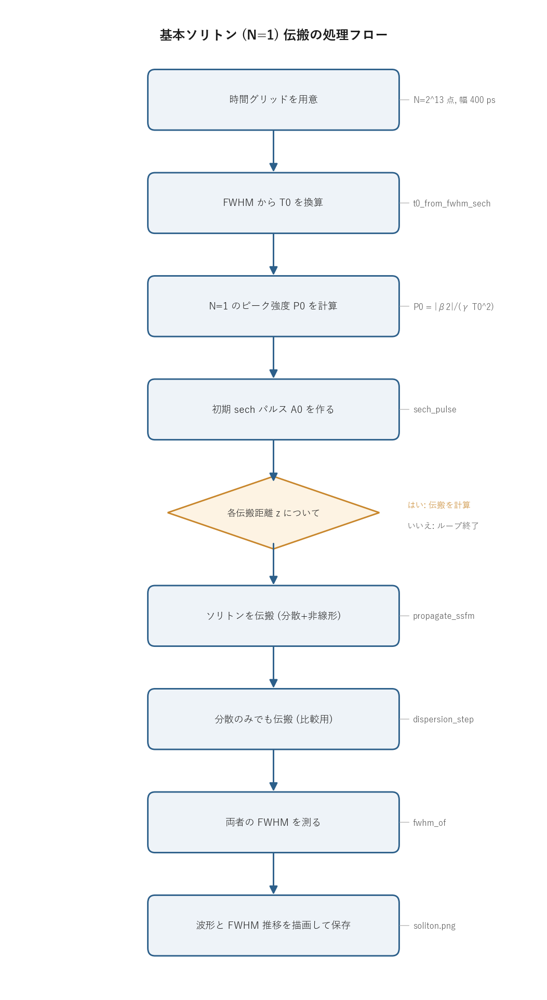

# 問題4-3: 基本ソリトン(N=1)の伝搬

## 問題

波長分散と非線形効果の双方を考える。ソリトン次数が $N=1$ となる条件の sech パルスを伝搬させ、伝搬に伴い時間波形が変化しないことを確認する。比較のため、同じパルスを分散のみで伝搬させた場合(どんどん広がる)も並べて示す。

## 実行結果(出力)

```
β2=-22.0 ps^2/km, γ=2.1 1/(W·km), FWHM=10.0 ps
T0(sech) = 5.673 ps
N=1 のピーク強度 P0 = |β2|/(γ T0^2) = 0.3255 W
確認: ソリトン次数 N = 1.0000
分散長 L_D = 1.463 km, ソリトン周期 z0 = (π/2)L_D = 2.298 km

  z/z0  FWHM soliton [ps]       FWHM 分散のみ [ps]
     0              10.00                10.00
     1              10.00                18.88
     2              10.00                28.06
     3              10.00                37.09
     4              10.00                46.21
     5              10.00                55.46

ソリトンの FWHM 変動 = 0.00 % (ほぼ一定なら 0% に近い)
```



> 図の読み方
> - 左:$z=0$ から $5z_0$ までの波形が完全に重なっている(=形が崩れない)。複数の $z$ で計算した強度波形を重ね描きしているのに、線が 1 本にしか見えない。
> - 右:ソリトン(青丸)は FWHM 10 ps を保つが、分散のみ(赤四角)は同じ距離で 55 ps まで広がる。

---

## 0. 処理の流れ

`solution.py` を実行すると、次の順で処理が進む。



前半(時間グリッドから初期パルス生成まで)が準備にあたる。FWHM から $T_0$ を求め、そこから $N=1$ になるピーク強度 $P_0$ を逆算し、その $P_0$ で sech パルスを作る。後半は伝搬距離 $z$ を変えながらのループで、各 $z$ について「分散+非線形(ソリトン)」と「分散のみ(比較)」の 2 通りを伝搬させ、それぞれの FWHM を測る。分岐はこのループの継続判定 1 箇所だけで、あとは一本道になっている。

---

## 1. ソリトンとは:分散と非線形の釣り合い

問4-1 の分散はパルスを時間方向に広げる。問4-2 の非線形(自己位相変調 SPM)は、強度の高いところほど大きな位相を与え、結果としてパルス内に周波数の傾き(チャープ)を作る。この 2 つを同時に効かせると、片方が広げようとし、もう片方がそれを巻き戻そうとする。

鍵になるのが分散の符号。$\beta_2<0$ の異常分散領域では、SPM が作るチャープを分散が時間方向に圧縮する向きに働く。SPM が広げたスペクトルを分散が「パルスの形を保つように」並べ替える、と言ってもよい。広がりと圧縮がパルス全体でちょうど打ち消し合う特別なパルスが存在し、これがソリトン(soliton)である。形が崩れずに伝わる。

支配方程式は、損失を無視した非線形シュレディンガー方程式(NLSE)。

$$ \frac{\partial A}{\partial z} = -j\frac{\beta_2}{2}\frac{\partial^2 A}{\partial T^2} + j\gamma|A|^2 A. $$

右辺第 1 項が分散、第 2 項が非線形(SPM)。第 1 項だけなら問4-1 のパルス広がり、第 2 項だけなら問4-2 のスペクトル拡大になる。この 2 項が特定のパルス形と強度で釣り合うと、左辺(=伝搬による変化)が形を変えない解が現れる。

## 2. ソリトン次数と N=1 条件

分散と非線形のどちらがどれだけ強いかを 1 つの無次元量にまとめたのがソリトン次数。

$$ N^2 = \frac{\gamma P_0 T_0^2}{|\beta_2|} = \frac{L_D}{L_{NL}}. $$

$L_D=T_0^2/|\beta_2|$ は分散がパルスを目立って広げるのにかかる距離(分散長)、$L_{NL}=1/(\gamma P_0)$ は非線形が目立つ位相を貯めるのにかかる距離(非線形長)。$N^2$ はこの 2 つの長さの比なので、$N$ が 1 に近いほど分散と非線形が同じくらいの強さで効いていることになる。

$N=1$(基本ソリトン)のとき、分散と非線形がぴったり釣り合い、強度波形が完全に不変になる。条件はピーク強度について解いて

$$ \boxed{\;P_0 = \frac{|\beta_2|}{\gamma T_0^2}\;}. $$

コードはこの式で $P_0$ を逆算している。$T_0=5.673$ ps(FWHM 10 ps の sech)では $P_0 = 22/(2.1\times5.673^2)=0.326$ W となり、出力の `P0 = 0.3255 W` と一致する。続けて $N=\sqrt{\gamma P_0 T_0^2/|\beta_2|}$ を計算し直して $N=1.0000$ を確認している(逆算が正しければ当然 1 になる、というセルフチェック)。

基本ソリトンの厳密解は

$$ A(z,T)=\sqrt{P_0}\,\mathrm{sech}\!\left(\frac{T}{T_0}\right)\exp\!\left(j\frac{z}{2L_D}\right) $$

で書ける。$z$ に依存するのは指数部の位相だけで、振幅の形 $\mathrm{sech}(T/T_0)$ は距離によらず一定。だから強度 $|A(z,T)|^2=P_0\,\mathrm{sech}^2(T/T_0)$ は $z$ に依らない。波形が動かず位相だけが回る、これがソリトンが「崩れない」ことの数式上の意味になる。

位相 $z/(2L_D)$ が一巡($2\pi$ 進む手前の自然な単位)する距離としてソリトン周期 $z_0=(\pi/2)L_D=2.30$ km が定義される。基本ソリトン($N=1$)では波形がそもそも一定なので $z_0$ は見た目に現れないが、高次ソリトン($N\ge2$)では波形が伸縮を繰り返し、$z_0$ ごとに元の形へ戻る。ここでは比較の基準距離として $z_0$ を使い、$5z_0\approx11.5$ km まで伝搬させている。

## 3. 数値による確認

対称 Split-Step Fourier 法(`fiber.propagate_ssfm`)で分散と非線形を交互に適用しながら $5z_0$ 伝搬させると、FWHM は 10.00 ps のまま、変動は 0.00% に収まる。一方、同じパルスを分散のみで伝搬させると 55 ps まで広がり、これは問4-1 で見たパルス広がりそのもの。図の右側でこの差が一目で分かる。非線形が分散をちょうど補償していることの直接的な証拠になっている。

ソリトンが崩れずに伝わるという結果は、Split-Step の実装が正しいことの強い検証も兼ねている。分散ステップと非線形ステップの相対符号が逆だと、釣り合いが成立せずパルスは即座に広がるか潰れる。崩れないという事実が、`fiber.propagate_ssfm` の符号規約がこのテストに合格していることを示している。

## 4. 関数ごとの詳細

このコードは計算の大半を `_common/fiber.py` の関数に任せ、`solution.py` 側は `main()` 一つで全体を組み立てる。ここでは `main()` の流れと、呼んでいる `fiber` の主要関数を順に見ていく。

### `main()`

全体をつなぐ唯一の関数。引数も戻り値もなく、計算結果を標準出力と `soliton.png` に出す。

| 項目 | 内容 |
| ---- | ---- |
| 引数 | なし(物理パラメータは定数 `BETA2` `GAMMA` `FWHM0` を使う) |
| 戻り値 | なし(標準出力と図ファイルが出力) |

内部の流れ。

1. 時間グリッドを作る。`N = 2**13`(8192 点)、全幅 `Tspan = 400.0` ps とし、`t = (arange(N) - N/2) * (Tspan/N)` で $-200$ ps から $+200$ ps を等間隔に並べる。`dt = Tspan/N` がサンプリング間隔。FFT を使うので点数は 2 のべきにしてある。
2. `fiber.t0_from_fwhm_sech(FWHM0)` で sech パルスの $T_0$ を求める。
3. `P0 = abs(BETA2) / (GAMMA * t0**2)` で $N=1$ 条件のピーク強度を逆算する。
4. `Nsol = sqrt(GAMMA*P0*t0**2/abs(BETA2))` で次数を計算し直し、1 になることを確認する。`LD` と `z0 = (π/2)·LD` も求めて表示する。
5. `fiber.sech_pulse(t, P0, FWHM0)` で初期パルス `A0` を作る。
6. 伝搬距離を `z_pts = linspace(0, 5*z0, 31)` と 31 点に取り、各 `z` でループする。各回で `propagate_ssfm`(分散+非線形)と `dispersion_step`(分散のみ)の 2 通りを伝搬させ、`fiber.fwhm_of` でそれぞれの FWHM を測って `fwhm_sol` `fwhm_disp` に貯める。
7. `z/z0` が整数になる点だけ表で表示し、`sol_var = (max-min)/mean` でソリトンの FWHM 変動率を出す。
8. 図を 2 枚作る。左は $z=0,z_0,\dots,5z_0$ の波形の重ね描き、右は FWHM の $z$ 依存性(ソリトン vs 分散のみ)。`soliton.png` に保存する。図のラベルは日本語フォントに依存しないよう英語にしている。

`P0 = abs(BETA2) / (GAMMA * t0**2)` の 1 行が、第 2 節の $P_0=|\beta_2|/(\gamma T_0^2)$ をそのまま書いたもの。ここで強度を決め打ちすることで $N=1$ を作っている。

### `fiber.t0_from_fwhm_sech(fwhm)`

sech パルスの強度 FWHM から、振幅式に出てくる時間幅 $T_0$ を求める。

| 項目 | 内容 |
| ---- | ---- |
| 引数 | `fwhm`: 強度波形の半値全幅 [ps]。 |
| 戻り値 | $T_0$ [ps]。 |

強度は $|\mathrm{sech}(T/T_0)|^2$ で、これが半分になる時刻が $T_0\,\mathrm{arccosh}\sqrt2$。両側で 2 倍なので FWHM $=2\,T_0\,\mathrm{arccosh}\sqrt2$。これを $T_0$ について解いた `fwhm / (2*arccosh(√2))` を返すだけの 1 行関数。FWHM 10 ps なら $T_0=5.673$ ps になる。

### `fiber.sech_pulse(t, p_peak, fwhm)`

sech 型パルスの複素振幅 $A(T)$ を返す。

| 項目 | 内容 |
| ---- | ---- |
| 引数 | `t`: 時間軸配列 [ps]。`p_peak`: ピーク強度 [W]。`fwhm`: 強度 FWHM [ps]。 |
| 戻り値 | 各時刻の振幅 `sqrt(p_peak)/cosh(t/t0)`(実数 ndarray)。 |

内部で `t0_from_fwhm_sech(fwhm)` を呼んで $T_0$ を求め、$\sqrt{P_0}/\cosh(T/T_0)$ を計算する。強度にすると $P_0\,\mathrm{sech}^2(T/T_0)$ になり、ソリストンの厳密解の $z=0$ 断面と一致する。位相は 0(チャープなし)で出発する。

### `fiber.propagate_ssfm(A0, z, dz, dt, beta2, gamma, alpha=0)`

対称 Split-Step Fourier 法で距離 $z$ だけ伝搬させる。NLSE を数値的に解く中核。

| 項目 | 内容 |
| ---- | ---- |
| 引数 | `A0`: 初期振幅。`z`: 伝搬距離 [km]。`dz`: 1 ステップ長 [km]。`dt`: サンプリング間隔 [ps]。`beta2` `gamma` `alpha`: 分散・非線形・損失の係数(0 にすればその効果を切れる)。 |
| 戻り値 | 距離 $z$ 後の複素振幅(複素 ndarray)。 |

内部の流れ。

1. `A` を複素数にコピーし、角周波数グリッド `omega = omega_grid(len(A), dt)` を作る。
2. ステップ数 `nstep = round(z/dz)` を決め、`dz` を $z/\text{nstep}$ に丸め直して端数をなくす。
3. 半ステップ分の分散演算子 `half_disp = exp(j (β2/2) ω² (dz/2))` を先に計算しておく。
4. `nstep` 回ループし、各回で「半分の分散 → 全部の非線形(+損失) → 半分の分散」を適用する。分散は周波数領域(`fft`→位相を掛ける→`ifft`)、非線形は時間領域(`A * exp(j γ |A|² dz)`)で処理する。

分散と非線形を一気に適用せず、分散を半分ずつ前後に挟む対称分割にしているのが「対称」Split-Step。これで 1 ステップあたりの誤差が $dz^2$ から $dz^3$ へ落ち、少ないステップ数でも精度が出る。このコードでは `dz = z0/200` と十分細かく取っているので、ソリトンの形が数値誤差で崩れることはない。

### `fiber.dispersion_step(A, beta2, dz, omega)`

比較用に、分散だけを距離 $dz$ 適用する。

| 項目 | 内容 |
| ---- | ---- |
| 引数 | `A`: 振幅。`beta2`: 二次分散。`dz`: 距離 [km]。`omega`: 角周波数グリッド。 |
| 戻り値 | 分散だけ効かせた後の振幅。 |

`ifft(fft(A) * exp(j (β2/2) ω² dz))` の 1 行。周波数ごとに 2 次の位相 $(\beta_2/2)\omega^2 dz$ を掛けるだけで、これが波長分散の全て。非線形を含まないので、`main` ではこれを単独で呼んで「分散のみだとどれだけ広がるか」を出している。$\omega^2$ は偶関数なので FFT の符号規約に依らず正しく動く。

### `fiber.fwhm_of(t, power)`

強度波形の半値全幅(FWHM)を線形補間で測る。

| 項目 | 内容 |
| ---- | ---- |
| 引数 | `t`: 時間軸。`power`: 強度波形 $|A|^2$。 |
| 戻り値 | FWHM($t$ と同じ単位、ピークが立たないときは 0)。 |

ピーク値 `power.max()` の半分を閾値とし、閾値以上になっている範囲の左端・右端のインデックスを取る。左端では一つ外側の点との間で `np.interp` を使い、強度がちょうど半分になる時刻を補間で求める(右端も同様)。両者の差の絶対値が FWHM。サンプル点の粗さに左右されないよう、補間で滑らかに測っているのがポイント。ソリトンではこれが常に 10.00 ps を返す。

## 5. なぜ重要か

ソリトンは分散で広がらずに長距離を伝わるため、かつてソリトン通信として盛んに研究された。現代のコヒーレント通信ではディジタル分散補償(問4-6)が主流になったが、ソリトンの意義は今も大きい。分散と非線形が「別々に効く独立な劣化」ではなく、互いに作用し合うものだということを最も鮮やかに示す例であり、非線形伝搬を理解する出発点になる。

## 6. コードのポイント

- `fiber.t0_from_fwhm_sech` / `fiber.sech_pulse`:sech パルス。FWHM から $T_0$ を $2\,\mathrm{arccosh}\sqrt2$ で換算する。
- `P0 = |β2|/(γ T0²)`:$N=1$ 条件のピーク強度。ここで強度を決め打ちしてソリトンを作る。
- `fiber.propagate_ssfm(A0, z, dz, dt, beta2, gamma)`:対称 Split-Step。`dz=z0/200` と十分細かく取る。
- `fiber.dispersion_step`:分散のみの伝搬。比較線として重ねている。

### 実行

```bash
python solution.py
```

標準出力は冒頭の「実行結果(出力)」、生成図は `soliton.png` を参照。処理フロー図 `flow.png` は `python make_flow.py` で作り直せる。

## 7. この問題のつながり

問4-1〜4-3 で、ファイバ伝搬の 3 要素(分散・非線形・その釣り合い)を扱った。次の問4-4 からは伝送路に EDFA(光増幅器)の ASE 雑音を導入し、QPSK 信号の BER を評価する(コヒーレント光受信の系全体の性能)。問4-5〜4-7 で多中継伝送へ拡張していく。
