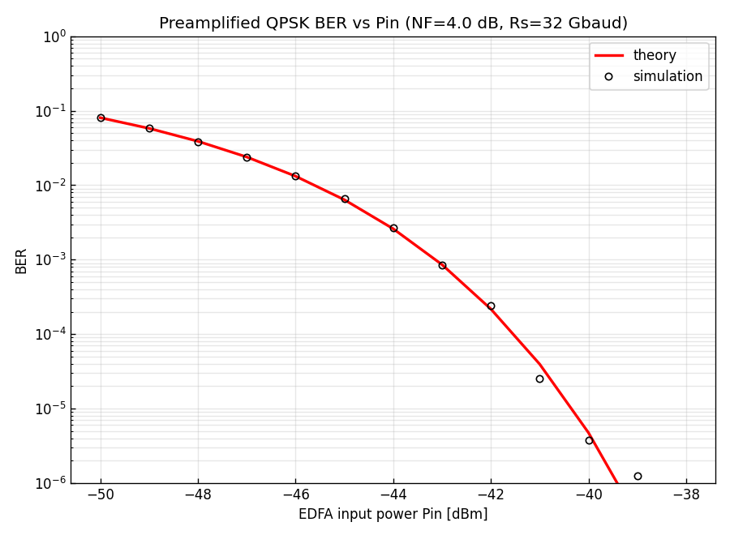
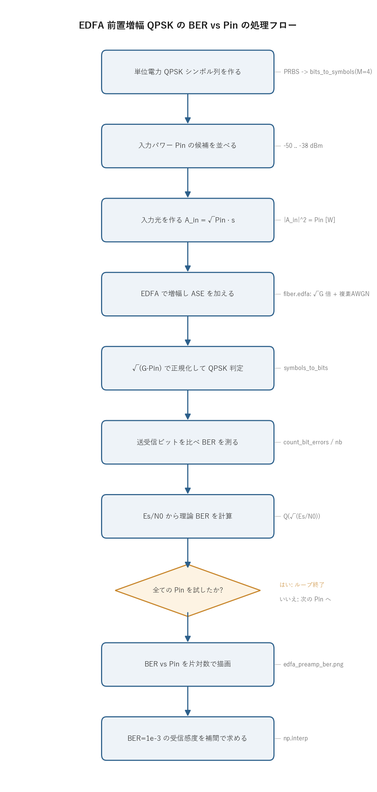

# 問題4-4: EDFA 前置増幅構成での QPSK の BER vs 入力パワー Pin

## 問題

単一偏波 QPSK 光信号を EDFA で増幅した後、コヒーレント光受信する(**前置増幅構成**)。
EDFA から生じる **ASE 雑音は複素 AWGN** でモデル化でき、**雑音指数 NF = 4 dB** とする。
このときの **BER の EDFA 入力パワー $P_\mathrm{in}$ 依存性**を求める(レーザ位相雑音は無視)。

## 実行結果(出力)

```
Rs=32 Gbaud, NF=4.0 dB, G=20.0 dB
hν = 1.282e-19 J, S_ASE = 1.593e-17 W/Hz

 Pin[dBm]  Es/N0[dB]    BER(sim)  BER(theory)
      -50       2.92    8.04e-02     8.07e-02
      -45       7.92    6.54e-03     6.38e-03
      -43       9.92    8.43e-04     8.59e-04
      -40      12.92    3.75e-06     4.75e-06
      -38      14.92    0.00e+00     1.24e-08
受信感度 (BER=1e-3) ≈ -43.1 dBm
```



> **図の読み方**
> - 横軸が EDFA への入力パワー $P_\mathrm{in}$、縦軸が BER(片対数)。
> - 実線が理論値 $Q(\sqrt{E_s/N_0})$、○がモンテカルロ・シミュレーション。両者が重なる。
> - $P_\mathrm{in}$ を上げるほど BER が急激に下がり、BER $=10^{-3}$ を切る入力パワー(**受信感度**)は約 $-43$ dBm。これは前置増幅コヒーレント受信機の典型値。

---

## 0. 処理の流れ

`solution.py` を実行すると、次の順で処理が進む。



最初に単位電力の QPSK シンボル列を 1 本だけ作っておき、その同じ系列を使い回す。
あとは入力パワー $P_\mathrm{in}$ を変えながら「入力光を作る → EDFA に通す → 判定して BER を測る」を
繰り返すループになっている。分岐は「全ての $P_\mathrm{in}$ を試したか」の 1 箇所だけで、
ループを抜けたら BER 曲線を描き、受信感度を補間で求めて終わる。
シンボル生成と EDFA・判定が分離しているので、雑音の効果だけを $P_\mathrm{in}$ 掃引で取り出せる。

---

## 1. 前置増幅構成と ASE 雑音

微弱な受信光をそのまま検出すると SNR が足りない。そこで受信機の前に **EDFA(エルビウム添加光ファイバ増幅器)**
を置いて増幅する(**前置増幅, preamplifier**)。ただし EDFA は信号を増幅すると同時に、自然放出光由来の
**ASE 雑音(Amplified Spontaneous Emission, 増幅された自然放出光)** を加える。前置増幅構成では、これが
主要な雑音源になる。

ASE 雑音は広帯域で各周波数成分が独立、振幅はガウス分布に従うので **複素 AWGN(加法性白色ガウス雑音)**
でモデル化できる。EDFA 出力での ASE のパワースペクトル密度(1 偏波・片側)は

$$ S_\mathrm{ASE} = n_\mathrm{sp}\,h\nu\,(G-1),\qquad n_\mathrm{sp} = \frac{\mathrm{NF_{lin}}}{2}, $$

で与えられる。各記号の意味は次の通り。

- $h\nu$ は光子 1 個のエネルギー。$1550$ nm では $h\nu = 1.28\times10^{-19}$ J。
- $G$ は EDFA の利得(線形値)。本問では $20$ dB なので $G=100$。
- $n_\mathrm{sp}$ は自然放出係数で、反転分布が完全なら $1$、不完全だと $1$ より大きくなる。
- $\mathrm{NF_{lin}}$ は雑音指数の線形値。高利得近似で $\mathrm{NF_{lin}}=2\,n_\mathrm{sp}$ の関係がある。NF=4 dB なら $\mathrm{NF_{lin}}=10^{0.4}\approx2.51$、よって $n_\mathrm{sp}\approx1.26$。

$(G-1)$ という因子は、自然放出された 1 個の光子が利得媒質を通って $G$ 倍に増幅され、もとの 1 個を差し引いた
正味の増分を表す。利得が高いほど ASE も増えるが、後で見るように信号も同じ $G$ 倍されるので、SNR は $G$ に
よらなくなる。

`solution.py` の出力にある `S_ASE = 1.593e-17 W/Hz` は、この式に $G=100$、$n_\mathrm{sp}=1.26$、
$h\nu=1.28\times10^{-19}$ を入れた値で、ここを起点に雑音電力を組み立てていく。

> **数値例: $S_\mathrm{ASE}$ を手で組み立てる**
> $1550$ nm の光子エネルギーは、$h=6.626\times10^{-34}$ J·s、$c=2.998\times10^{8}$ m/s、$\nu=c/\lambda$ から
> $$ h\nu = \frac{(6.626\times10^{-34})(2.998\times10^{8})}{1550\times10^{-9}} = 1.282\times10^{-19}\ \mathrm{J}. $$
> 雑音指数は $\mathrm{NF}=4$ dB なので線形値は $\mathrm{NF_{lin}}=10^{4/10}=10^{0.4}=2.512$、よって $n_\mathrm{sp}=\mathrm{NF_{lin}}/2=1.256$。
> 利得は $G=10^{20/10}=100$ なので $G-1=99$。これらを掛けると
> $$ S_\mathrm{ASE} = n_\mathrm{sp}\,h\nu\,(G-1) = 1.256\times(1.282\times10^{-19})\times99 = 1.593\times10^{-17}\ \mathrm{W/Hz}. $$
> 出力の `S_ASE = 1.593e-17 W/Hz` と一致する。これは「$1$ Hz の帯域あたり $1.6\times10^{-17}$ W の雑音」という、
> 帯域を掛ける前の密度であることに注意。

## 2. SNR と Pin の関係

ASE は PSD(単位帯域あたりの電力)なので、SNR を出すには受信帯域を決めて電力に直す必要がある。
ここでは 1 シンボルを 1 サンプルで表す(1 sample/symbol, $f_s=R_s$)モデルを使う。すると有効帯域は
符号速度 $R_s$ ぶんになり、1 シンボルあたりの ASE 雑音電力は $S_\mathrm{ASE}\cdot R_s$ になる。
一方、増幅後の信号電力は $G\,P_\mathrm{in}$。両者の比が **1 シンボル SNR(= $E_s/N_0$)** で、

$$ \frac{E_s}{N_0} = \frac{G\,P_\mathrm{in}}{S_\mathrm{ASE}\,R_s}
= \frac{G\,P_\mathrm{in}}{n_\mathrm{sp}h\nu(G-1)R_s}
\;\xrightarrow[G\gg1]{}\; \frac{P_\mathrm{in}}{n_\mathrm{sp}h\nu R_s}
= \frac{2P_\mathrm{in}}{\mathrm{NF_{lin}}\,h\nu\,R_s}. $$

高利得 $G\gg1$ では $G/(G-1)\to1$ となり、利得 $G$ が式から消える。これは増幅で信号も雑音も同じだけ
大きくなるためで、**SNR は $P_\mathrm{in}$ に正比例し、利得をいくら上げても改善しない**。前置増幅の役割は
SNR を稼ぐことではなく、後段の受信機雑音(熱雑音やショット雑音)に対して信号を持ち上げ、ASE 限界まで
性能を引き出すことにある。

最終形 $E_s/N_0 = 2P_\mathrm{in}/(\mathrm{NF_{lin}}\,h\nu\,R_s)$ を見ると、感度を決めるのは $\mathrm{NF_{lin}}$ と
$h\nu R_s$ だけ。NF が小さいほど、また符号速度が低いほど、同じ $P_\mathrm{in}$ で SNR が高くなる。

> **数値例: $P_\mathrm{in}=-43$ dBm での $E_s/N_0$**
> まず dBm を W に直す。$-43$ dBm $= 10^{-43/10}\ \mathrm{mW} = 10^{-4.3}\times10^{-3}\ \mathrm{W} = 5.01\times10^{-8}$ W。
> 増幅後の信号電力は $G\,P_\mathrm{in} = 100\times5.01\times10^{-8} = 5.01\times10^{-6}$ W。
> 1 シンボルあたりの ASE 雑音電力は、$S_\mathrm{ASE}$ に帯域 $R_s=32$ GHz を掛けて
> $$ N_0 = S_\mathrm{ASE}\,R_s = (1.593\times10^{-17})\times(32\times10^{9}) = 5.10\times10^{-7}\ \mathrm{W}. $$
> 両者の比が
> $$ \frac{E_s}{N_0} = \frac{5.01\times10^{-6}}{5.10\times10^{-7}} = 9.83 \;\Longrightarrow\; 10\log_{10}(9.83) = 9.92\ \mathrm{dB}, $$
> 実行結果の表(`-43 dBm` の行の `Es/N0=9.92`)とぴたり合う。これを QPSK の式に入れると
> $\mathrm{BER}=Q(\sqrt{9.83})=Q(3.13)=8.6\times10^{-4}$ で、表の `BER(theory)=8.59e-04` を再現する。

同じ計算を数点で行うと、$P_\mathrm{in}$ を $1$ dB 上げるごとに $E_s/N_0$ も $1$ dB 上がる(正比例なので当然)
ことが確認できる。下表は上の式だけで手計算した値で、$10$ dB 弱の SNR を境に BER が桁で落ちていく。

| $P_\mathrm{in}$ [dBm] | $P_\mathrm{in}$ [W] | $G\,P_\mathrm{in}$ [W] | $E_s/N_0$ [dB] | $\mathrm{BER}=Q(\sqrt{E_s/N_0})$ |
| ---: | ---: | ---: | ---: | ---: |
| $-50$ | $1.00\times10^{-8}$ | $1.00\times10^{-6}$ | $2.92$ | $8.1\times10^{-2}$ |
| $-45$ | $3.16\times10^{-8}$ | $3.16\times10^{-6}$ | $7.92$ | $6.4\times10^{-3}$ |
| $-43$ | $5.01\times10^{-8}$ | $5.01\times10^{-6}$ | $9.92$ | $8.6\times10^{-4}$ |
| $-40$ | $1.00\times10^{-7}$ | $1.00\times10^{-5}$ | $12.92$ | $4.7\times10^{-6}$ |
| $-38$ | $1.59\times10^{-7}$ | $1.59\times10^{-5}$ | $14.92$ | $1.2\times10^{-8}$ |

QPSK は I 軸・Q 軸が独立な 2 つの BPSK と等価なので、BER は

$$ \mathrm{BER} = Q\!\left(\sqrt{E_s/N_0}\right) $$

になる。$Q(x)$ は標準正規分布の上側確率で、SNR が上がると指数関数的に小さくなる。BER 曲線が片対数で
ほぼ直線的に急降下するのはこのため。

## 3. シミュレーションと一致

各 $P_\mathrm{in}$ について、単位電力 QPSK シンボル $s$ に $\sqrt{P_\mathrm{in}}$ を掛けて光パワー $P_\mathrm{in}$ の
入力光 $\sqrt{P_\mathrm{in}}\,s$ を作り、`fiber.edfa` に通す($\sqrt G$ 倍 + ASE 付加)。出力を $\sqrt{G P_\mathrm{in}}$ で
正規化してから QPSK 硬判定し、送信ビットと比べて BER を測る。実行結果のとおり、シミュレーション値は
理論値とよく一致する。$P_\mathrm{in}=-38$ dBm で `BER(sim)=0` になっているのは、誤りが出るほど SNR が
高くないためで、40 万シンボルでは 1 個も誤らなかったことを意味する(理論値 $1.24\times10^{-8}$ なら期待誤り数は
$0.01$ 個以下)。

**受信感度**(BER $=10^{-3}$ を達成する最小 $P_\mathrm{in}$)は約 $-43$ dBm。BER $=10^{-3}$ には $E_s/N_0\approx9.8$ dB が
必要で、これを上の SNR 式に代入すると $P_\mathrm{in}\approx-43$ dBm が得られる。1 シンボルあたりに換算すると
おおよそ十数個の光子で誤りなく受信できる感度で、コヒーレント前置増幅受信機の量子限界に近い高感度性を示す。

> **数値例: 感度を光子数で見る**
> 1 シンボルが運ぶ光子数は $n_\mathrm{ph}=P_\mathrm{in}/(h\nu R_s)$ で求まる。感度点 $P_\mathrm{in}=-43$ dBm($5.01\times10^{-8}$ W)では
> $$ n_\mathrm{ph} = \frac{5.01\times10^{-8}}{(1.282\times10^{-19})\times(32\times10^{9})} \approx 12.2\ \text{光子/シンボル}. $$
> わずか $12$ 個ほどの光子で BER $=10^{-3}$ を達成しており、これがコヒーレント前置増幅受信が高感度といわれる所以である。
> ちなみに $P_\mathrm{in}=-40$ dBm では $n_\mathrm{ph}\approx24$ 個に倍増し、BER は $4.7\times10^{-6}$ まで一気に下がる。

> **位相雑音を無視する意味**
> 本問はレーザ位相雑音を無視するので、劣化要因は ASE だけになる。実機では問3 の位相回復 DSP で
> 位相雑音を別途補償するため、ここで見た ASE 限界の性能をそのまま議論できる。

---

## 4. 関数ごとの詳細

`solution.py` は補助関数 `dbm_to_w` と、全体をつなぐ `main` から成る。物理計算と通信処理は
`_common/fiber.py` と `_common/comm.py` の関数に委ねている。

### `dbm_to_w(dbm)`

電力の単位 dBm をワットに直す小さな関数。

| 項目 | 内容 |
| ---- | ---- |
| 引数 | `dbm`: 電力 [dBm](1 mW を 0 dBm とした対数表示)。配列も可。 |
| 戻り値 | 電力 [W]。 |

中身は `10 ** (dbm / 10.0) * 1e-3` の 1 行。dBm は 1 mW 基準なので、`10**(dbm/10)` で mW に直し、
`1e-3` を掛けて W にする。例えば $-43$ dBm なら $10^{-4.3}\times10^{-3}\approx5.0\times10^{-8}$ W。

### `fiber.ase_psd(gain, nf_db)`

EDFA 出力での ASE パワースペクトル密度 $S_\mathrm{ASE}$ を返す(`_common/fiber.py`)。

| 項目 | 内容 |
| ---- | ---- |
| 引数 | `gain`: 利得 $G$(線形値)。`nf_db`: 雑音指数 [dB]。`wavelength_nm`: 波長(既定 1550 nm)。 |
| 戻り値 | $S_\mathrm{ASE}$ [W/Hz](1 偏波・片側)。 |

処理は次の通り。

1. `nf_lin = 10 ** (nf_db / 10.0)` で NF を線形値に直す。
2. `n_sp = nf_lin / 2.0` で自然放出係数を出す(高利得近似 $\mathrm{NF_{lin}}=2n_\mathrm{sp}$)。
3. `n_sp * photon_energy() * (gain - 1.0)` で $S_\mathrm{ASE}=n_\mathrm{sp}h\nu(G-1)$ を返す。

第 1 節の式そのままで、`main` の冒頭でこの値を表示している。

### `fiber.edfa(A, gain, nf_db, fs, rng)`

光信号を増幅し、ASE 雑音を付加する EDFA モデル(`_common/fiber.py`)。

| 項目 | 内容 |
| ---- | ---- |
| 引数 | `A`: 入力光振幅(単位 $\sqrt{\mathrm W}$、$|A|^2$ が光パワー)。`gain`: $G$。`nf_db`: NF。`fs`: サンプリングレート [Hz]。`rng`: 乱数生成器。 |
| 戻り値 | 増幅 + ASE 付加後の複素振幅。 |

内部処理。

1. `s_ase = ase_psd(gain, nf_db)` で PSD を求める。
2. `var = s_ase * fs` で、帯域 `fs` ぶんの複素雑音の総分散にする。PSD に帯域を掛けると電力になる。
3. `sigma = np.sqrt(var / 2.0)` で 1 軸(実部・虚部それぞれ)の標準偏差を出す。複素雑音は実部と虚部に分散を半分ずつ分配するので $\sqrt{\mathrm{var}/2}$ になる。
4. `noise = sigma * (rng.standard_normal(...) + 1j * rng.standard_normal(...))` で複素ガウス雑音を作る。
5. `np.sqrt(gain) * A + noise` を返す。振幅は $\sqrt G$ 倍(電力は $G$ 倍)で、そこに ASE を足す。

`var = s_ase * fs` の 1 行が「PSD × 帯域 = 電力」という ASE 雑音電力の本体で、ここで $f_s=R_s$ を渡すから
第 2 節の「1 シンボルあたり $S_\mathrm{ASE}R_s$」と整合する。

### `comm.bits_to_symbols(bits, M)` / `comm.symbols_to_bits(sym, M)`

ビット列とシンボル列を相互変換する(`_common/comm.py`)。`M=4` で QPSK になる。

- `bits_to_symbols`: 2 ビットごとに 1 つの単位電力 QPSK シンボル(複素数)へマップする。グレイ符号化。
- `symbols_to_bits`: 受信シンボルを最近傍判定(硬判定)してからビットに戻す。雑音入りの受信点でも、
  内部で各軸を一番近い基準点に丸めるので、そのまま BER 計算に使える。

QPSK は判定が I 軸・Q 軸の符号を見るだけなので、振幅スケールに依らない。`main` で $\sqrt{G P_\mathrm{in}}$ で
正規化しているのは判定上は不要だが、受信点の意味を明示するために入れている。

### `comm.ber_theory_qam(M, snr_db)`

方形 M-QAM の BER 解析解(近似式)を返す。QPSK では厳密解 $Q(\sqrt{E_s/N_0})$ に一致する。
`main` では各 $P_\mathrm{in}$ の $E_s/N_0$ を dB に直して渡し、理論曲線を描いている。

### `main()`

全体をつなぐ関数。

1. 乱数生成器を初期化し、$G=10^{20/10}=100$、$S_\mathrm{ASE}$、$h\nu$ を求めて表示する。
2. PRBS から単位電力 QPSK シンボル列 `s` を作り、40 万シンボルまでタイル状に並べる。送信ビット `bits_tx` も作る。
3. $P_\mathrm{in}=-50$ から $-38$ dBm まで 1 dB 刻みで掃引する。各 $P_\mathrm{in}$ で次をやる。
   - `A_in = √Pin · s` で入力光を作る。
   - `A_out = fiber.edfa(A_in, G, NF, RS, rng)` で増幅 + ASE。
   - `r = A_out / √(G·Pin)` で正規化し、`symbols_to_bits` で判定。
   - 送受信ビットを比べ `count_bit_errors / nb` で BER を出す。
   - SNR 式 `snr_lin = G·Pin / (S_ASE·RS)` から理論 BER も計算する。
4. 表を表示し、BER vs $P_\mathrm{in}$ を片対数で描いて `edfa_preamp_ber.png` に保存する(0 の点は対数軸に載らないので除外)。
5. BER 曲線を補間し、BER $=10^{-3}$ を切る受信感度を求めて表示する。

図のラベルは日本語フォントに依存しないよう英語にしている。

---

## 5. 実行

```bash
python solution.py
```

標準出力は冒頭の「実行結果(出力)」、生成図は `edfa_preamp_ber.png` を参照。
処理フロー図 `flow.png` は `python make_flow.py` で作り直せる。

---

## 6. この問題のつながり

ここでは EDFA 1 台(前置増幅)だけを扱った。次の **問4-5** では、ファイバ損失 + EDFA を 1 スパンとして
**多中継伝送**(1〜50 スパン)を行い、スパン数が増えると ASE が累積して BER が劣化する様子を見る。
**問4-6** で波長分散、**問4-7** で非線形効果を順に加えていく。
