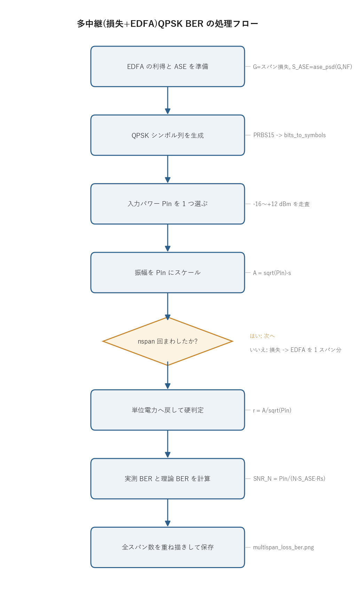

# 問題4-5: 損失 + EDFA 多中継伝送での QPSK の BER vs Pin

## 問題

単一偏波 QPSK について、標準 SMF と EDFA からなる中継伝送を考える。中継距離 100 km、
ファイバは損失のみ(0.3 dB/km)、EDFA の NF=4 dB、各スパンの入力パワーは同一とする。
1, 2, 5, 10, 20, 50 スパン中継後にコヒーレント受信し、BER の入力パワー $P_\mathrm{in}$ 依存性を求める
(レーザ位相雑音は無視)。

## 実行結果(出力)

```
1スパン: 100 km, 損失 30 dB, 利得 30 dB, NF 4.0 dB
S_ASE(1台) = 1.608e-16 W/Hz, 1スパン雑音電力 S_ASE·Rs = 5.146e-06 W

 1 spans (  100 km): 受信感度(BER=1e-3) ≈  -13.2 dBm
 2 spans (  200 km): 受信感度(BER=1e-3) ≈  -10.1 dBm
 5 spans (  500 km): 受信感度(BER=1e-3) ≈   -6.1 dBm
10 spans ( 1000 km): 受信感度(BER=1e-3) ≈   -3.2 dBm
20 spans ( 2000 km): 受信感度(BER=1e-3) ≈   -0.2 dBm
50 spans ( 5000 km): 受信感度(BER=1e-3) ≈    4.0 dBm
```


> **図の読み方**
> - 各色が 1 つのスパン数。線が理論曲線、丸印が数値シミュレーション。両者はよく重なる。
> - スパン数が増えるほど BER 曲線が右へ平行移動する。同じ BER を出すには、スパンが
>   2 倍になるごとに約 3 dB 高い入力パワーがいる。理由は各 EDFA が同じ ASE 雑音を足し、
>   その総量がスパン数に比例して増えるため。

---

## 0. 処理の流れ

`solution.py` を実行すると、次の順で処理が進む。



最初に EDFA の利得と 1 台あたりの ASE を決め、送信する QPSK シンボル列を 1 度だけ作る。
あとは「入力パワー $P_\mathrm{in}$ を 1 つ選ぶ → 信号をその振幅にして → 損失と EDFA のスパンを
nspan 回くぐらせる → 受信して BER を測る」を、6 種類のスパン数 × 入力パワー掃引の全組み合わせで
繰り返す。分岐はスパンを規定回数まわしたかを見る 1 箇所だけで、内側のループが多中継そのものにあたる。

---

## 1. 中継伝送の構成

長距離伝送では、ファイバ損失で信号レベルが下がり続け、いずれ雑音に埋もれる。これを防ぐため、
一定距離ごとに EDFA を入れて損失を補う。これが中継(インライン増幅)伝送で、1スパンは次の 2 段からなる。

```
[100 km ファイバ: 損失 30 dB] → [EDFA: 利得 30 dB, ASE 付加]
```

EDFA の利得はスパン損失をちょうど打ち消すように選ぶ。0.3 dB/km × 100 km = 30 dB の損失に対し、
利得も 30 dB にする。すると各スパンの入口と出口で信号パワーが揃い、どのスパンの入力も同じ $P_\mathrm{in}$ になる。
信号レベルは中継のたびに元へ戻るが、EDFA が出す ASE 雑音だけは打ち消されず、スパンを通るたびに積み上がる。

---

## 2. ASE の累積と SNR

EDFA は反転分布した媒質で信号を増幅するとき、自然放出光も一緒に増幅してしまう。これが
ASE(amplified spontaneous emission, 増幅自然放出)で、信号に乗る広帯域雑音になる。1 台の EDFA が
出力に足す ASE のパワースペクトル密度は次式で書ける(1 偏波・片側)。

$$ S_\mathrm{ASE} = n_\mathrm{sp}\,h\nu\,(G-1), \qquad n_\mathrm{sp} = \frac{NF_\mathrm{lin}}{2}. $$

$h\nu$ は光子エネルギー、$G$ は線形利得、$n_\mathrm{sp}$ は自然放出係数で、高利得近似では雑音指数
$NF_\mathrm{lin}$ の半分になる。NF が大きい(=増幅器が雑音を多く出す)ほど $S_\mathrm{ASE}$ が増える。

> **1 台あたり ASE を数字で出す**
> 本問の値(波長 1550 nm、$NF=4$ dB、$G=30$ dB)を入れてみる。
> - 光子エネルギー: $h\nu = \dfrac{(6.626\times10^{-34})(2.998\times10^{8})}{1550\times10^{-9}} = 1.282\times10^{-19}$ J
> - 雑音指数(線形): $NF_\mathrm{lin} = 10^{4/10} = 2.512$ → $n_\mathrm{sp} = NF_\mathrm{lin}/2 = 1.256$
> - 線形利得: $G = 10^{30/10} = 1000$ なので $G-1 \approx 999$
>
> $$ S_\mathrm{ASE} = n_\mathrm{sp}\,h\nu\,(G-1) = 1.256 \times 1.282\times10^{-19} \times 999 = 1.608\times10^{-16}\ \mathrm{W/Hz}. $$
>
> これにシンボルレート $R_s = 32$ GHz を掛けると、1 スパン分の ASE 電力は
> $S_\mathrm{ASE}\cdot R_s = 1.608\times10^{-16}\times 32\times10^{9} = 5.146\times10^{-6}$ W になる。
> 冒頭の「実行結果」に出ている $S_\mathrm{ASE}=1.608\times10^{-16}$ W/Hz、$S_\mathrm{ASE}\cdot R_s=5.146\times10^{-6}$ W は、まさにこの計算結果である。

ここで効いてくるのが「各スパンが損失 30 dB → 利得 30 dB」という構成。あるスパンの EDFA が出した ASE は、
次のスパンで 30 dB 減衰し、その次の EDFA で 30 dB 増幅される。減衰と増幅が打ち消し合うので、前段の ASE は
正味で減らずにそのまま後段へ通り抜ける。信号も ASE も同じ「損失→利得」を受けるため、両者の比が保たれる。
結果として、$N$ スパン後の総 ASE は 1 スパン分の単純に $N$ 倍になる。

信号パワーは毎スパン $P_\mathrm{in}$ に戻るので、$N$ スパン後の SNR は次のように書ける。

$$ \mathrm{SNR}_N = \frac{P_\mathrm{in}}{N\,S_\mathrm{ASE}\,R_s} = \frac{\mathrm{SNR}_1}{N}. $$

$R_s$ はシンボルレート(雑音を数える帯域)。スパン数 $N$ が増えると SNR は $1/N$ に下がり、
dB では $-10\log_{10}N$ の劣化になる。

> **SNR から BER を 1 点だけ手で出す**
> 1 スパン($N=1$)で $P_\mathrm{in} = -13.2$ dBm($=10^{-13.2/10}\times10^{-3}=4.79\times10^{-5}$ W)を入れたとき、
> $$ \mathrm{SNR}_1 = \frac{P_\mathrm{in}}{S_\mathrm{ASE}\,R_s} = \frac{4.79\times10^{-5}}{5.146\times10^{-6}} = 9.30 \quad(\,10\log_{10}9.30 = 9.69\ \mathrm{dB}\,). $$
> QPSK の理論 BER は $\mathrm{BER} = \tfrac12\,\mathrm{erfc}\!\sqrt{\mathrm{SNR}/2}$ なので、
> $$ \mathrm{BER} = \tfrac12\,\mathrm{erfc}\sqrt{9.30/2} = \tfrac12\,\mathrm{erfc}(2.16) = 1.1\times10^{-3}. $$
> ちょうど $10^{-3}$ 付近で、$N=1$ の感度 $-13.2$ dBm と整合する。
> 同じ $\mathrm{SNR}_1=9.30$ を $N=10$ で再現するには $P_\mathrm{in}$ を $10\log_{10}10=10$ dB 上げて
> $-13.2+10=-3.2$ dBm にすればよく、これが表の $N=10$ の感度と一致する。

| スパン | 距離 | SNR 劣化(理論) | 感度(実測, BER=1e-3) | 1スパン基準のシフト |
| --- | --- | --- | --- | --- |
| 1 | 100 km | 基準 | $-13.2$ dBm | 基準 |
| 2 | 200 km | $-3.0$ dB | $-10.1$ dBm | $+3.1$ dB |
| 5 | 500 km | $-7.0$ dB | $-6.1$ dBm | $+7.1$ dB |
| 10 | 1000 km | $-10.0$ dB | $-3.2$ dBm | $+10.0$ dB |
| 20 | 2000 km | $-13.0$ dB | $-0.2$ dBm | $+13.0$ dB |
| 50 | 5000 km | $-17.0$ dB | $+4.0$ dBm | $+17.2$ dB |

感度のシフト量が $10\log_{10}N$ にほぼ一致している。50 スパンなら $10\log_{10}50 = 17.0$ dB で、
実測の $+17.2$ dB と合う。SNR を一定に保つには、スパンが 2 倍(SNR が半分)になるたびに $P_\mathrm{in}$ を
3 dB 上げればよい、という関係がそのまま感度の平行移動として現れる。

逆に「入力パワーを固定したまま中継数だけ増やす」と、BER がどう悪化するかも数字で追える。
$P_\mathrm{in}=0$ dBm($=1$ mW $=10^{-3}$ W)に固定すると、$\mathrm{SNR}_N = 10^{-3}/(N\cdot5.146\times10^{-6})$ から次の表になる。

| スパン $N$ | $\mathrm{SNR}_N$ | $\mathrm{SNR}_N$ [dB] | BER(理論) |
| --- | --- | --- | --- |
| 1 | 194.3 | $22.9$ | $1.8\times10^{-44}$ |
| 2 | 97.2 | $19.9$ | $3.2\times10^{-23}$ |
| 5 | 38.9 | $15.9$ | $2.3\times10^{-10}$ |
| 10 | 19.4 | $12.9$ | $5.2\times10^{-6}$ |
| 20 | 9.7 | $9.9$ | $9.1\times10^{-4}$ |
| 50 | 3.9 | $5.9$ | $2.4\times10^{-2}$ |

$N$ が 1→50 で SNR は $1/50$($-17$ dB)になり、BER は実用域($10^{-3}$ より良い)から完全に破綻する領域まで
一気に悪化する。$P_\mathrm{in}=0$ dBm は 20 スパンあたりで BER=$10^{-3}$ を割り込む、というのが図でこの縦線
($P_\mathrm{in}=0$)が各曲線を横切る順番に対応している。

---

## 3. シミュレーションの仕組み

理論式だけでなく、QPSK 光を実際に「損失 → EDFA(+ASE)」のループへ通して BER を測る。中継ループの中心は次の数行。

```python
A = np.sqrt(Pin) * s                       # 平均電力 1 の信号を Pin にスケール
for _ in range(nspan):                     # 多中継
    A = fiber.loss_step(A, alpha, L_SPAN_KM)   # ファイバ損失 (30 dB)
    A = fiber.edfa(A, G, NF_DB, RS, rng)       # EDFA: 増幅 + ASE
r = A / np.sqrt(Pin)                        # 信号を単位電力へ戻す
```

毎スパンで `edfa` が独立な ASE を足すので、雑音は `n1 + n2 + ... + nN` と累積する。一方で信号振幅は
損失と利得が相殺して $\sqrt{P_\mathrm{in}}$ に戻る。最後に $\sqrt{P_\mathrm{in}}$ で割って平均電力 1 の座標へ戻し、
硬判定でビットに直す。理論曲線 $\mathrm{SNR}_N = P_\mathrm{in}/(N\,S_\mathrm{ASE}\,R_s)$ から計算した
QPSK の BER とよく一致する。

> **損失だけならパワーを上げれば解決するのか**
> この問題には非線形がないので、$P_\mathrm{in}$ を上げれば SNR がそのまま上がり、いくらでも BER を下げられる
> (図では右に行くほど良い)。ただし実際のファイバでは、$P_\mathrm{in}$ を上げすぎると非線形効果が効いて逆に
> 劣化に転じる。その上限を作るのが問4-7 の非線形で、本問はその手前にある線形(損失+ASE)だけの理想的な姿にあたる。

---

## 4. 関数ごとの詳細

このコードは小さな補助関数 `dbm_to_w` と本体 `main` の 2 つで、伝送の中身は `_common/fiber.py` と
`_common/comm.py` の関数に任せている。順に見ていく。

### `dbm_to_w(dbm)`

dBm 単位の電力をワットに直す変換。

| 項目 | 内容 |
| ---- | ---- |
| 引数 | `dbm`: 電力 [dBm](1 mW を 0 dBm とする対数表現)。スカラでも配列でも可。 |
| 戻り値 | 電力 [W]。 |

中身は `10 ** (dbm / 10.0) * 1e-3` の 1 行。dBm は 1 mW 基準なので、まず `10^(dbm/10)` で mW に直し、
`1e-3` を掛けて W にする。掃引する入力パワー $P_\mathrm{in}$ を W へ揃えるために使う。

### `fiber.loss_step(A, alpha, dz)`(ライブラリ)

ファイバ損失を距離 `dz` ぶん適用する。

| 項目 | 内容 |
| ---- | ---- |
| 引数 | `A`: 複素振幅(`|A|^2` が光パワー [W])。`alpha`: 振幅減衰係数 [1/km]。`dz`: 距離 [km]。 |
| 戻り値 | 減衰後の振幅 `A * exp(-alpha/2 · dz)`。 |

パワーは `exp(-alpha·dz)` で減るが、扱うのは振幅なので指数が半分の `exp(-alpha/2·dz)` になる。
`alpha` は `fiber.alpha_from_db(0.3)` で dB/km から 1/km へ換算した値。100 km で 30 dB の減衰、
振幅では $10^{-30/20} \approx 1/31.6$ 倍になる。

### `fiber.edfa(A, gain, nf_db, fs, rng)`(ライブラリ)

EDFA による増幅と ASE 雑音の付加を 1 ステップで行う。

| 項目 | 内容 |
| ---- | ---- |
| 引数 | `A`: 入力振幅。`gain`: 線形利得 $G$。`nf_db`: 雑音指数 [dB]。`fs`: サンプリングレート [Hz]。`rng`: 乱数生成器。 |
| 戻り値 | `sqrt(gain) * A + noise`(増幅した信号に複素 ASE を足したもの)。 |

内部の流れ。

1. `ase_psd(gain, nf_db)` で 1 台あたりの ASE のパワースペクトル密度 $S_\mathrm{ASE}$ を求める。
2. 帯域 `fs` ぶんの雑音電力 `var = S_ASE · fs` を雑音の総分散とする。
3. 複素ガウス雑音は実部・虚部に分散を半分ずつ振るので、1 軸の標準偏差は `sigma = sqrt(var/2)`。
4. `noise = sigma * (standard_normal + 1j*standard_normal)` で 1 サンプルごとに独立な ASE を生成する。
5. 信号は振幅で `sqrt(gain)` 倍(パワーで `gain` 倍)し、雑音を加えて返す。

`rng` を毎スパン使い回すので、各スパンの ASE は互いに独立になる。これが「ASE がスパンごとに累積する」挙動を作る。

### `comm.generate_prbs` / `comm.bits_to_symbols` / `comm.symbols_to_bits`(ライブラリ)

送信信号の生成と受信側の判定を担う。`generate_prbs(15)` で周期 32767 の PRBS を作り、`bits_to_symbols(..., 4)`
で 4QAM(=QPSK)シンボルへマップする。受信側は `symbols_to_bits(r, 4)` が内部で最近傍判定(硬判定)してから
ビットへ戻す。BER の数え上げは `count_bit_errors` が送受ビットの不一致数を返す。

### `main()`

全体をつなぐ関数。手順は次のとおり。

1. 乱数生成器 `rng` を固定シードで作り、利得 `G`、減衰係数 `alpha`、1 台あたり ASE の `s_ase` を計算する。
   `S_ASE` と 1 スパン雑音電力 `S_ASE·Rs` を表示し、雑音の大きさを確認する。
2. PRBS から QPSK シンボル `s` を作る。`np.tile` で `N_SYM = 100000` シンボルまで繰り返し、送信ビット `bits_tx` を控える。
3. 入力パワーを `-16` から `+12` dBm まで 1 dB 刻みで掃引する。スパン数 6 種類それぞれに色を割り当てる。
4. スパン数 `nspan` ごとに、各 `Pin` で次をやる。
   - `A = sqrt(Pin) * s` で振幅を設定し、`nspan` 回「損失 → EDFA」を通す。
   - `r = A / sqrt(Pin)` で単位電力へ戻し、`symbols_to_bits` でビットへ。実測 BER を求める。
   - `snr_lin = Pin / (nspan · s_ase · Rs)` から理論 BER `ber_theory_qam(4, ...)` を求める。
5. 理論を実線、実測(BER>0 のみ)を丸印で重ね描きする。
6. 各スパン数について、BER=1e-3 を与える入力パワー(受信感度)を `np.interp` で補間して表示する。
7. 図を `multispan_loss_ber.png` に保存する。

`r = A / np.sqrt(Pin)` の 1 行が要点。信号振幅は損失と利得が打ち消して $\sqrt{P_\mathrm{in}}$ のままだが、
ASE はそのまま乗っている。ここで $\sqrt{P_\mathrm{in}}$ で割ると、信号は平均電力 1 のコンステレーションへ戻り、
ASE は相対的に「SNR に応じた大きさの雑音」として残る。判定器はこの座標で動くので、SNR がそのまま BER を決める。

感度の補間 `np.interp(np.log10(1e-3), np.log10(ber_sim[v][::-1]), pin_dbm[v][::-1])` は、BER を対数軸で見て
1e-3 を横切る入力パワーを線形補間で読む処理。BER が掃引につれ単調に下がるので、配列を逆順 `[::-1]` にして
`np.interp` が要求する昇順に揃えている。

---

## 5. 実行

```bash
python solution.py
```

標準出力は冒頭の「実行結果(出力)」、生成図は `multispan_loss_ber.png` を参照。処理フロー図 `flow.png` は
`python make_flow.py` で作り直せる。

---

## 6. この問題のつながり

次の問4-6 では、ファイバに波長分散を加える。分散はパルスを広げて符号間干渉(ISI)を生むが、
受信後にディジタル分散補償をかければ完全に取り除ける(問4-1 で見た分散の可逆性)。補償後の BER が
本問とほぼ同じに戻ることを確認する。問4-7 ではさらに非線形を加え、分散補償でも取り切れない劣化と、
入力パワーに最適値が現れる様子を見る。本問はその出発点で、損失と ASE だけで決まる線形伝送の限界を与える。
