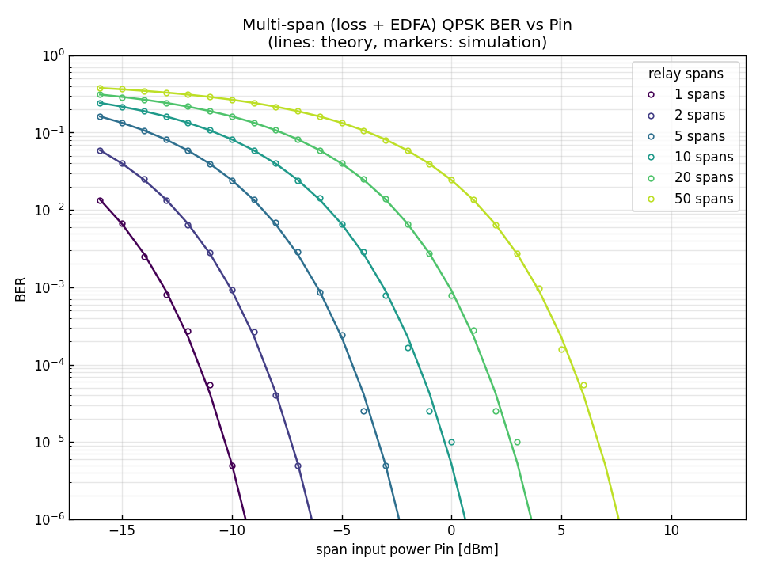

# 問題4-5: 損失 + EDFA 多中継伝送での QPSK の BER vs Pin

## 問題

単一偏波 QPSK について、標準 SMF と EDFA からなる **中継伝送**を考える。中継距離 100 km、
ファイバは **損失のみ**(0.3 dB/km)、EDFA の NF=4 dB、**各スパンの入力パワーは同一**。
**1, 2, 5, 10, 20, 50 スパン**中継後にコヒーレント受信。BER の入力パワー $P_\mathrm{in}$ 依存性を求める
(レーザ位相雑音は無視)。

## 実行結果(出力)

```
1スパン: 100 km, 損失 30 dB, 利得 30 dB, NF 4.0 dB
S_ASE(1台) = 1.608e-16 W/Hz, 1スパン雑音電力 S_ASE·Rs = 5.146e-06 W

 1 spans (  100 km): 受信感度(BER=1e-3) ≈  -13.2 dBm
 2 spans (  200 km): 受信感度(BER=1e-3) ≈  -10.1 dBm
 5 spans (  500 km): 受信感度(BER=1e-3) ≈   -6.1 dBm
10 spans ( 1000 km): 受信感度(BER=1e-3) ≈   -3.2 dBm
20 spans ( 2000 km): 受信感度(BER=1e-3) ≈   -0.2 dBm
50 spans ( 5000 km): 受信感度(BER=1e-3) ≈    4.0 dBm
```



> **図の読み方** — スパン数が増えるほど BER 曲線が右へ平行移動する。同じ BER を得るには、
> スパンが2倍になるごとに約 3 dB 高い入力パワーが必要(=ASE 雑音が2倍に累積する)。

---

## 1. 中継伝送の構成

長距離では、ファイバ損失でいずれ信号が雑音に埋もれる。そこで一定距離ごとに EDFA を入れて
損失を補償する **中継(インライン増幅)伝送**を行う。1スパン =

```
[100 km ファイバ: 損失 30 dB] → [EDFA: 利得 30 dB, ASE 付加]
```

EDFA の利得はスパン損失をちょうど補償するので、**各スパンの入力パワー・出力パワーはすべて等しく $P_\mathrm{in}$**。
信号レベルは中継のたびに元に戻るが、**ASE 雑音だけが各 EDFA で足し込まれて累積**していく。

## 2. ASE の累積と SNR

各 EDFA は同じ ASE(PSD $S_\mathrm{ASE}=(NF_\mathrm{lin}/2)h\nu(G-1)$)を加える。前段の ASE は、後段の
「損失 → 利得(=1倍)」を素通りするので減らない。よって **$N$ スパン後の総雑音 = 1スパンの $N$ 倍**:

$$ \mathrm{SNR}_N = \frac{P_\mathrm{in}}{N\,S_\mathrm{ASE}\,R_s} = \frac{\mathrm{SNR}_1}{N}. $$

つまり **スパン数 $N$ が増えると SNR は $1/N$**。dB では $-10\log_{10}N$ の劣化:

| スパン | 距離 | SNR劣化 | 感度シフト(実測) |
| --- | --- | --- | --- |
| 1 | 100 km | 基準 | $-13.2$ dBm |
| 2 | 200 km | $-3$ dB | $-10.1$ dBm |
| 10 | 1000 km | $-10$ dB | $-3.2$ dBm |
| 50 | 5000 km | $-17$ dB | $+4.0$ dBm |

感度のシフト量(1スパン基準)がちょうど $10\log_{10}N$ になっている(50スパンで $+17$ dB)。

## 3. シミュレーションの仕組み

各 Pin・各スパン数で、QPSK 光を実際に「損失 → EDFA(+ASE)」のループに通す:

```python
A = np.sqrt(Pin) * s
for _ in range(nspan):
    A = fiber.loss_step(A, alpha, 100)     # 30 dB 減衰
    A = fiber.edfa(A, G, NF, Rs, rng)      # 30 dB 増幅 + ASE
```

信号は毎スパン $P_\mathrm{in}$ に戻り、ASE が `n1 + n2 + ... + nN` と累積する。
得られる BER は理論曲線 $Q(\sqrt{\mathrm{SNR}_N})$ とよく一致する。

> **損失だけならパワーを上げれば解決?** — この問題では非線形がないので、$P_\mathrm{in}$ を上げれば
> いくらでも BER を下げられる(右に行くほど良い)。しかし実際のファイバでは、$P_\mathrm{in}$ を上げすぎると
> **非線形効果**が効いて逆に劣化する。その「上げられない上限」を作るのが問4-7 の非線形。
> 本問はその手前、線形(損失+ASE)だけの理想的な姿。

## 4. コードのポイント

- `fiber.loss_step(A, α, 100)` — 振幅を $e^{-\alpha\cdot100/2}$ 倍(30 dB 減衰)。`α` は dB/km から換算。
- `fiber.edfa(A, G, NF, Rs, rng)` — 利得 $\sqrt G$ + ASE。スパンごとに独立な ASE を加える。
- 理論は `SNR_N = Pin/(N·S_ASE·Rs)` から `comm.ber_theory_qam(4, ...)`。
- 6つのスパン数を色分けし、線(理論)+ 点(数値)で重ねている。

### 実行

```bash
python solution.py
```

## 5. この問題のつながり

次の **問4-6** では、ファイバに **波長分散**を加える。分散はパルスを広げて ISI を生むが、
**受信後にディジタル分散補償**すれば完全に取り除ける(問4-1 の可逆性)。BER が本問とほぼ同じに戻ることを確認する。
**問4-7** ではさらに **非線形**を加え、分散補償しきれない劣化と「最適入力パワー」の存在を見る。
