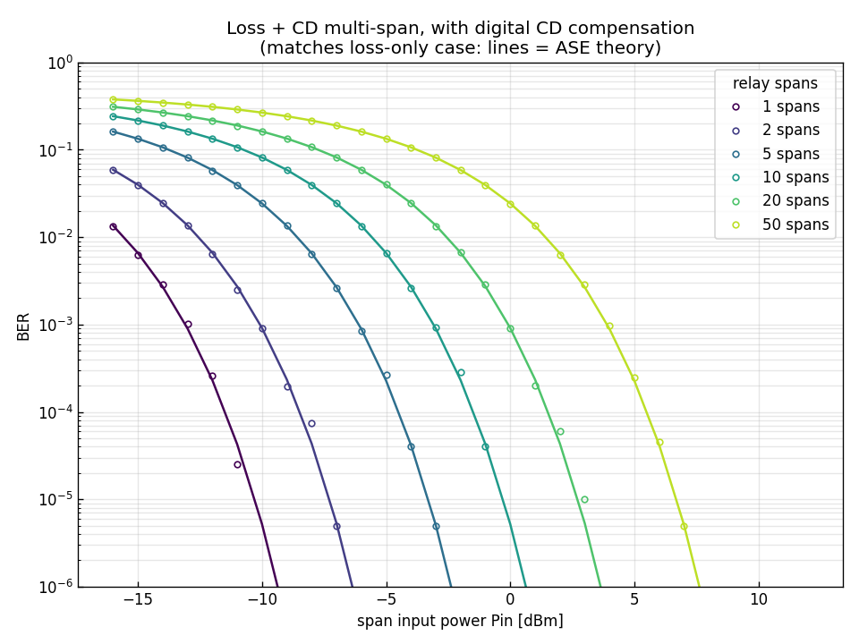
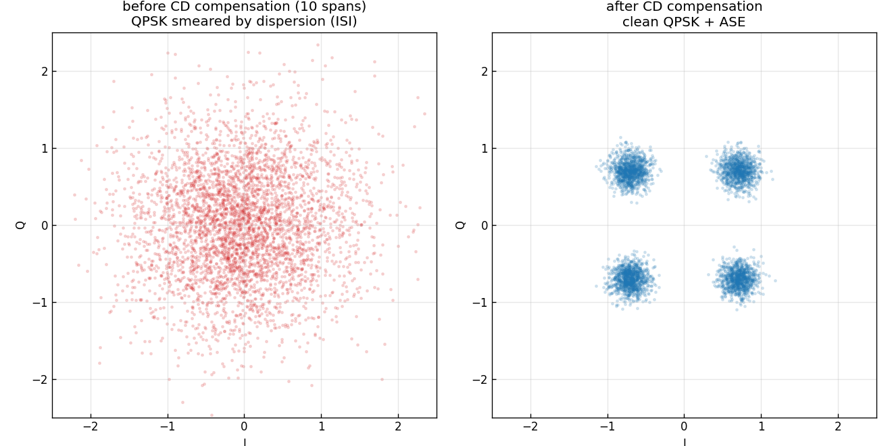
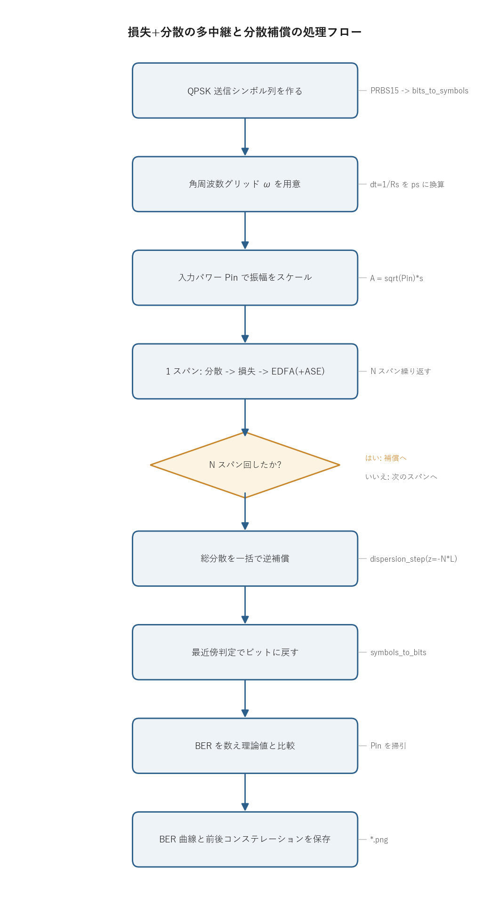

# 問題4-6: 損失 + 波長分散の多中継伝送とディジタル分散補償後の BER

## 問題

問4-5(損失のみの多中継)に **波長分散**を加える。伝送路は損失係数 0.3 dB/km、二次分散
$\beta_2=-22\ \mathrm{ps^2/km}$ のファイバを 100 km ごとに区切ったスパンの連結とする。各スパンの
末尾に EDFA(NF=4 dB)を置き、スパン損失 30 dB をちょうど打ち消す利得を与える(各スパンの入力
パワーは同一)。1, 2, 5, 10, 20, 50 スパン中継した後にコヒーレント受信し、**蓄積した総波長分散を
受信側でまとめて完全補償**してから QPSK を復調する。BER の入力パワー $P_\mathrm{in}$ 依存性を求める
(レーザ位相雑音は無視)。

## 実行結果(出力)

```
β2=-22.0 ps^2/km, スパン 100 km, 損失/利得 30 dB, NF 4.0 dB

 1 spans (  100 km): 受信感度(BER=1e-3) ≈  -13.0 dBm
 2 spans (  200 km): 受信感度(BER=1e-3) ≈  -10.1 dBm
 5 spans (  500 km): 受信感度(BER=1e-3) ≈   -6.1 dBm
10 spans ( 1000 km): 受信感度(BER=1e-3) ≈   -3.1 dBm
20 spans ( 2000 km): 受信感度(BER=1e-3) ≈   -0.1 dBm
50 spans ( 5000 km): 受信感度(BER=1e-3) ≈    4.0 dBm
```





> **図の読み方**
> - **上**: 分散を補償した後の BER 曲線。スパン数を変えても、各曲線は問4-5(損失のみ)と完全に重なる。
>   波長分散を足してもペナルティはゼロ。スパンが増えるほど右へ寄り、必要な入力パワーが上がる。
> - **下(左)**: 10 スパン伝送後、補償前のコンステレーション。QPSK の 4 点が分散による符号間干渉 (ISI) で
>   雲状に崩れている。
> - **下(右)**: 同じ信号を分散補償した後。きれいな QPSK の 4 点に戻り、残るのは ASE による丸い広がりだけ。

---

## 0. 処理の流れ

`solution.py` を実行すると、次の順で処理が進む。



QPSK のシンボル列を作って入力パワーでスケールし、スパンごとに「分散 → 損失 → EDFA」を繰り返す。
全スパンを通したら、蓄積した総分散を受信側で 1 回の逆位相フィルタで打ち消し、最近傍判定でビットに戻して
BER を数える。これを入力パワー $P_\mathrm{in}$ とスパン数 $N$ の組み合わせで掃引するのが本体のループになる。
分岐はスパン繰り返しの終了判定だけで、伝搬から判定までは一本道でつながっている。

---

## 1. 波長分散は線形で可逆

波長分散は、周波数ごとに違う位相を与えるフィルタとして書ける。スペクトルの各成分 $\omega$ に対し、距離
$z$ を進んだときの伝達関数は

$$ H_\mathrm{CD}(\omega) = \exp\!\left(j\frac{\beta_2}{2}\omega^2 z\right),\qquad |H_\mathrm{CD}(\omega)|=1 $$

となる。振幅 $|H_\mathrm{CD}|$ がすべての周波数で 1 なので、これは **全域通過(オールパス)フィルタ**である。
振幅を一切変えず、位相だけを $\omega^2$ に比例して回す。位相が周波数で変わると各成分の到着タイミングがずれ、
時間波形のパルスは広がって隣のシンボルにはみ出す(符号間干渉、下図左)。ただし振幅を触らないので、
**エネルギーも、信号に載った情報も失われない**。

$N$ スパン進むと総分散は $\beta_2\cdot(N\times100\,\mathrm{km})$ まで蓄積する。これに対し受信側で逆符号の位相

$$ H_\mathrm{comp}(\omega) = \exp\!\left(-j\frac{\beta_2}{2}\omega^2 z_\mathrm{total}\right) $$

を掛けると、$H_\mathrm{CD}\cdot H_\mathrm{comp}=1$ となって位相回転がちょうど打ち消され、波形は **完全に元へ戻る**
(下図右)。この操作が **ディジタル分散補償**である。コヒーレント受信は光の複素振幅(振幅と位相の両方)を
そのまま電気信号として取り出せるので、DSP 上で位相を逆向きに回すだけでよい。直接検波だと位相が失われて
この補償はできない。

> **数値例:位相の打ち消しを数字で追う(10 スパン)**
>
> $\beta_2=-22\ \mathrm{ps^2/km}$、$R_s=32\ \mathrm{GHz}$、1 sample/symbol だと、扱う最高角周波数は
> ナイキスト周波数 $f_\mathrm{N}=R_s/2=16\ \mathrm{GHz}$ にあたる $\omega_\mathrm{N}=2\pi f_\mathrm{N}=0.1005\ \mathrm{rad/ps}$。
> 10 スパン($z=1000\ \mathrm{km}$)進んだとき、この成分が受ける位相は
>
> $$ \phi = \frac{\beta_2}{2}\,\omega_\mathrm{N}^2\,z = \frac{-22}{2}\times(0.1005)^2\times1000 \approx -111.17\ \mathrm{rad}\ (= -35.39\pi) $$
>
> と巨大で、$2\pi$ で折り返すと $\approx 1.93\ \mathrm{rad}$ ほど回っている。補償フィルタは同じ大きさで符号だけ逆の
> $+111.17\ \mathrm{rad}$ を掛けるので、合計位相は $\phi+(-\phi)=0$、すなわち $H_\mathrm{CD}\cdot H_\mathrm{comp}=e^{j0}=1$ で
> 寸分の狂いなく元へ戻る。位相が周波数ごとに何回転していようと、線形フィルタなので **逆位相を 1 回掛けるだけで
> 全周波数が同時に揃う**のがポイントである。

> **数値例:累積分散 vs スパン数(なぜ補償前の点が雲状に崩れるか)**
>
> 1 スパン 100 km で蓄積する分散は $|\beta_2|\,L = 22\times100 = 2200\ \mathrm{ps^2}$。波長分散の係数 $D$ に直すと
> $D=-\dfrac{2\pi c}{\lambda^2}\beta_2 \approx 17.2\ \mathrm{ps/(nm\cdot km)}$、つまり 80 km 級の標準 SMF に近い値である。
> スパンを重ねると分散はそのまま線形に積み上がる。信号帯域 $\approx R_s=32\ \mathrm{GHz}$ の端と端では群遅延に差が
> 生じ、その差 $\Delta\tau \approx |\beta_2|\cdot\Delta\omega\cdot z$($\Delta\omega=2\pi R_s$)はシンボル周期 $T_s=1/R_s=31.25\ \mathrm{ps}$ の
> 何倍にもなる。これがコンステレーションを崩す符号間干渉 (ISI) の正体である。
>
> | スパン数 $N$ | 距離 $z$ [km] | 累積 $\beta_2 z$ [ps²] | 群遅延差 $\Delta\tau$ [ps] | $\Delta\tau / T_s$(シンボル数) |
> | ---: | ---: | ---: | ---: | ---: |
> | 1  | 100  | $-2{,}200$   | 442    | 約 14  |
> | 2  | 200  | $-4{,}400$   | 884    | 約 28  |
> | 5  | 500  | $-11{,}000$  | 2,211  | 約 71  |
> | 10 | 1000 | $-22{,}000$  | 4,423  | 約 142 |
> | 20 | 2000 | $-44{,}000$  | 8,847  | 約 283 |
> | 50 | 5000 | $-110{,}000$ | 22,117 | 約 708 |
>
> 10 スパンでは 1 シンボルが約 142 シンボル分まで時間的に広がる(下図左の雲状の崩れ)。それでも振幅情報は
> 失われていないので、逆位相を 1 回掛ければ下図右のようにきれいな 4 点へ戻る。

## 2. なぜ BER が問4-5 と一致するのか

補償後の BER が損失のみの問4-5 とぴったり同じになる理由は、信号側と雑音側の両方を見ると分かる。

信号側は前節のとおりで、分散は可逆なので補償後は分散の無い場合と同じ QPSK 点に戻る。判定に使う
信号点の位置は損失のみのときと変わらない。

雑音側がもう一つのポイントになる。EDFA が出す ASE 雑音は全周波数に均一に広がった白色雑音である。
これが分散補償フィルタ(オールパス)を通っても、各周波数成分の振幅は変わらず位相だけが回る。白色雑音の
電力は周波数ごとの振幅で決まるので、位相をいくら回しても電力も白色性も変化しない。各スパンの ASE が
途中で何回分散を受けようと、最後に補償フィルタを通そうと、受け取る変換はすべてオールパスであり、
受信端での雑音電力は損失のみの場合と同じ $N\cdot S_\mathrm{ASE}\cdot R_s$ のままになる。

信号点が同じで雑音電力も同じなら、SNR も BER も問4-5 と一致する。

$$ \mathrm{SNR}_N = \frac{P_\mathrm{in}}{N\,S_\mathrm{ASE}\,R_s},\qquad \mathrm{BER}=Q\!\left(\sqrt{\mathrm{SNR}_N}\right) $$

受信感度(BER $=10^{-3}$ を満たす入力パワー)も問4-5 とまったく同じ値($-13.0,\ -10.1,\ \dots,\ +4.0$ dBm)に
なる。スパンが 2 倍になると雑音電力が 2 倍(+3 dB)になり、同じ SNR を保つには入力を約 3 dB 上げる必要がある。
出力の各スパンが 3 dB 刻みで右へ寄っているのはこのためである。波長分散は線形である限り、補償すれば無害という
のがこの問題の結論になる。

> **数値例:受信感度を手計算で出す**
>
> まず 1 スパンの ASE スペクトル密度を求める。$G=10^{30/10}=1000$、NF $=4\ \mathrm{dB}\Rightarrow$ NF$_\mathrm{lin}=10^{0.4}=2.51$、
> $n_\mathrm{sp}=\mathrm{NF_{lin}}/2=1.256$、$h\nu=1.28\times10^{-19}\ \mathrm{J}$(1550 nm)なので
>
> $$ S_\mathrm{ASE}=n_\mathrm{sp}\,h\nu\,(G-1)\approx 1.61\times10^{-16}\ \mathrm{W/Hz} $$
>
> 1 スパンぶんの雑音電力は $S_\mathrm{ASE}\,R_s = 1.61\times10^{-16}\times32\times10^{9} \approx 5.15\times10^{-6}\ \mathrm{W} = -22.9\ \mathrm{dBm}$。
> QPSK で BER $=10^{-3}$ には $\mathrm{SNR}=Q^{-1}(10^{-3})^2\approx 3.09^2 = 9.55$($=9.8\ \mathrm{dB}$)が要る。よって
>
> $$ P_\mathrm{in}=\mathrm{SNR}\cdot N\,S_\mathrm{ASE}\,R_s \;\Rightarrow\; N=1:\ -13.1\ \mathrm{dBm},\quad N=2:\ -10.1\ \mathrm{dBm},\quad N=10:\ -3.1\ \mathrm{dBm} $$
>
> となり、冒頭の出力($-13.0,\ -10.1,\ -3.1\ \mathrm{dBm}$)と一致する。$N$ が 10 倍で雑音が $10\log_{10}10=+10\ \mathrm{dB}$
> 増えるので、感度もちょうど 10 dB($-13.1\to-3.1$)悪化している。

## 3. 数値実装の注意

このシミュレーションは 1 sample/symbol(1 シンボルを 1 サンプルで表す)で計算している。サンプリング間隔は
$\Delta t = 1/R_s$ で、これを ps に換算してから $\beta_2$ [ps²/km] と単位をそろえる。分散はこのサンプル列の
スペクトルに対するオールパス位相フィルタとして適用する。各スパンでは

```
分散 → 損失 → EDFA(+ASE)
```

の順に処理し、全スパンを通した後に総分散の逆を 1 回掛ける。分散ステップも補償ステップも線形なので、途中の
ASE がどの順序で分散を受けても、トータルで見ればオールパス変換しか受けず、雑音電力は保存される。

実機では信号のスペクトルが帯域 $(1+\alpha)R_s$(ロールオフ $\alpha$ を含む)まで広がるため、それを取りこぼさない
よう 2 sample/symbol 以上で処理する。サンプル数を増やしても、線形なら補償が完全という結論は変わらない。

## 4. 関数ごとの詳細

`solution.py` は補助関数 `dbm_to_w` と本体 `main` から成り、伝搬の部品は `_common/fiber.py`、QPSK の
変復調は `_common/comm.py` を呼び出す。順に見ていく。

### `dbm_to_w(dbm)`

入力パワーの単位を dBm からワットに直す。

| 項目 | 内容 |
| ---- | ---- |
| 引数 | `dbm`: パワー [dBm](スカラまたは配列)。 |
| 戻り値 | パワー [W]。 |

中身は `10 ** (dbm / 10.0) * 1e-3` の 1 行。dBm は 1 mW を基準にしたデシベル表記なので、`10^(dBm/10)` で
mW に直し、`1e-3` を掛けて W にする。例えば 0 dBm は 1 mW = 0.001 W になる。

### `main()`

全体をつなぐ関数。準備、伝搬ループ、作図の 3 段に分かれる。

準備の段。

1. 乱数生成器 `rng` を固定シード `SEED=22` で作る。ASE 雑音の再現性のため。
2. スパン利得 `G = 10^(0.3*100/10)`(= 30 dB)を求める。損失をちょうど打ち消す利得。
3. `fiber.alpha_from_db` で損失係数 [dB/km] を振幅減衰係数 $\alpha$ [1/km] に、`fiber.ase_psd` で
   1 スパンあたりの ASE パワースペクトル密度 $S_\mathrm{ASE}$ を計算する。
4. 角周波数グリッド `omega` を作る。`dt_ps = 1e12 / RS` でサンプル間隔を ps にし、`np.fft.fftfreq` から
   $\omega = 2\pi f$ [rad/ps] を得る。これが分散ステップで使う $\omega$ になる。
5. `comm.generate_prbs(15)` で PRBS を作り、`comm.bits_to_symbols(..., 4)` で QPSK(M=4)シンボルに
   マップする。それを `N_SYM=100000` シンボル分タイルで並べ、送信ビット `bits_tx` を控えておく。

伝搬ループの段。外側がスパン数 `SPANS`、内側が入力パワー `pin_dbm`(−16〜+12 dBm)の二重ループ。
内側 1 回で次をやる。

1. `Pin = dbm_to_w(pdbm)` をワットに直し、`A = sqrt(Pin) * s` で送信振幅を作る($|A|^2$ が光パワー)。
2. `nspan` 回ループし、各スパンで `fiber.dispersion_step`(分散)→ `fiber.loss_step`(損失)→
   `fiber.edfa`(増幅と ASE 付加)を順に適用する。
3. 補償前の信号 `A_disp = A.copy()` を控える(後でコンステレーション用)。
4. `fiber.dispersion_step(A, BETA2, -nspan*L_SPAN_KM, omega)` で総分散を逆向きに 1 回掛けて補償する。
   距離が `-nspan*L_SPAN_KM` と負なので、行きと逆の位相になる。
5. `r = A / sqrt(Pin)` で振幅スケールを戻し、`comm.symbols_to_bits(r, 4)` で最近傍判定してビットに戻す。
6. `comm.count_bit_errors` で送受ビットを比べ、誤り数をビット数で割って BER とする。
7. 理論値は `snr_lin = Pin / (nspan * s_ase * RS)` を `comm.ber_theory_qam` に渡して計算する。
8. 10 スパン・$P_\mathrm{in}=2$ dBm のときだけ、補償前後の信号を `cap` に保存しておく。

掃引が終わったら、各スパンについて BER が $10^{-3}$ を横切る入力パワーを `np.interp` で補間して受信感度を
求め、表示する。`r = A / sqrt(Pin)` で割って戻している 1 行が効いていて、信号点を理想振幅 1 に正規化する
ことで、雑音の相対的な大きさ(= SNR)だけが BER を決める形になる。

作図の段。

1. BER 図(`multispan_cd_ber.png`): スパンごとに理論曲線(実線)とシミュレーション点(丸)を片対数で
   重ねる。色はスパン数で変える。すべての曲線が問4-5 と重なることを示す。
2. コンステレーション図(`cd_compensation.png`): 控えておいた補償前 `cap["before"]` と補償後 `cap["after"]`
   を左右に並べ、分散で崩れた QPSK が補償できれいに戻る様子を対比する。

### 呼び出している `fiber.py` の部品

| 関数 | 役割 | 本問での使い方 |
| ---- | ---- | ---- |
| `dispersion_step(A, β2, z, ω)` | 距離 `z` の分散をスペクトルに掛ける | 順方向は `z=L_span`、補償は `z=-N·L_span` |
| `loss_step(A, α, z)` | 振幅を `exp(-α/2·z)` 倍に減衰 | 各スパン 100 km の損失 |
| `edfa(A, G, NF, fs, rng)` | 振幅を `√G` 倍し ASE 雑音を足す | 各スパン末尾で損失を補償 |
| `ase_psd(G, NF)` | ASE のパワースペクトル密度 $S_\mathrm{ASE}$ | 理論 SNR の分母に使う |
| `alpha_from_db(dB/km)` | 損失 [dB/km] を $\alpha$ [1/km] に換算 | `loss_step` に渡す $\alpha$ |

`dispersion_step` の中身は `ifft(fft(A) * exp(j·(β2/2)·ω²·z))` で、まさに第 1 節のオールパス位相フィルタを
スペクトルに掛けて時間波形に戻している。補償が距離を負にするだけで済むのは、この位相が `z` に比例する
線形量だからである。

---

## 5. 実行

```bash
python solution.py
```

標準出力は冒頭の「実行結果(出力)」、生成図は `multispan_cd_ber.png` と `cd_compensation.png` を参照。
処理フロー図 `flow.png` は `python make_flow.py` で作り直せる。

---

## 6. この問題のつながり

ここまでの問4-5・問4-6 では、伝送路の要素(損失・分散・ASE)がすべて **線形**だった。線形な範囲では
$P_\mathrm{in}$ を上げるほど SNR が上がり、BER は下がる一方になる。分散のような線形ひずみは、補償すれば
ペナルティを残さずに取り除ける。

最後の問4-7 では **非線形効果**(自己位相変調 SPM)を加える。非線形ひずみは入力パワーが大きいほど強く
なり、分散補償では取り除けない。その結果、$P_\mathrm{in}$ を上げすぎると今度は BER が悪化に転じ、
ちょうどよい **最適入力パワー**が存在するようになる。
