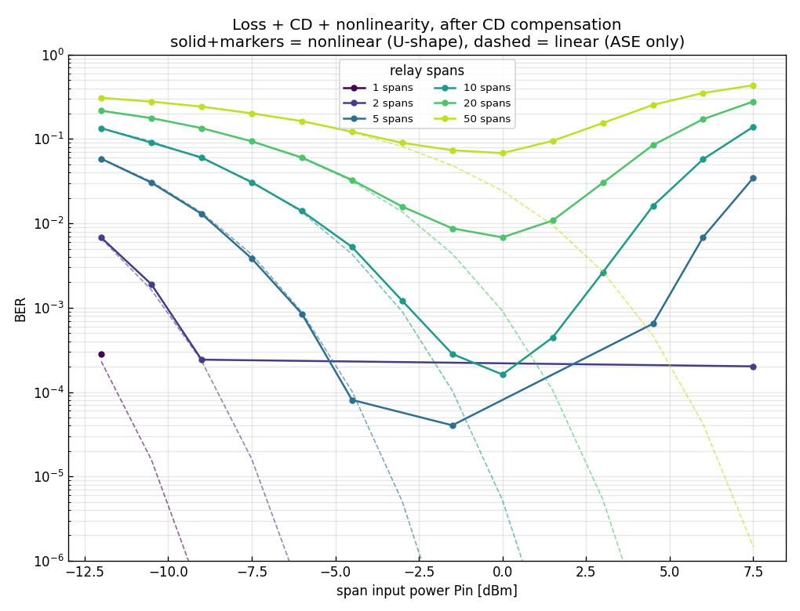
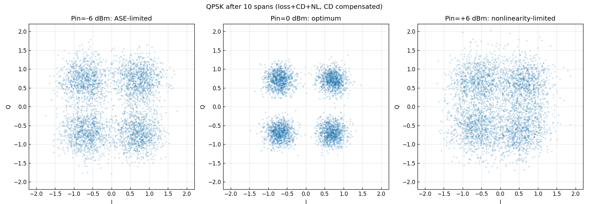
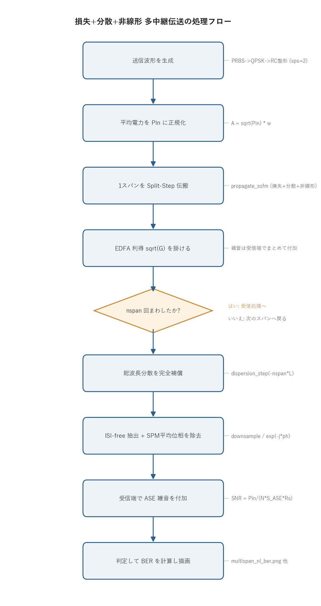

# 問題4-7: 損失 + 波長分散 + 非線形効果の多中継伝送、分散補償後の BER vs Pin

## 問題

問4-6 の構成に**非線形効果**($\gamma = 2.1\ \mathrm{W^{-1}km^{-1}}$)を加える。各スパンを
**Split-Step Fourier 法**で(損失 + 分散 + 非線形)伝搬させ、EDFA で損失を完全補償する。
1, 2, 5, 10, 20, 50 スパン中継後にコヒーレント受信し、受信端で総波長分散を完全補償してから復調する。
BER の入力パワー $P_\mathrm{in}$ 依存性を求める(レーザ位相雑音は無視)。

## 実行結果(出力)

```
β2=-22.0 ps^2/km, γ=2.1 1/(W·km), スパン 100 km
有効長 L_eff = 14.46 km, スパン非線形位相係数 γ·L_eff = 30.37 rad/W/span

 spans   最適Pin[dBm]        最小BER
     1        -10.5     0.00e+00
     2         -7.5     0.00e+00
     5         -3.0     0.00e+00
    10          0.0     1.61e-04
    20          0.0     6.82e-03
    50          0.0     6.80e-02
```





> **図の読み方**
> - **上図**: U字(バスタブ)曲線。実線(非線形)は低パワー側で破線(線形 = ASE のみ、問4-6)に沿うが、高パワー側で非線形ひずみのため上昇する。各スパン数に最適入力パワー(谷)がある。
> - **下図**: 10 スパン後の QPSK コンステレーション。低 Pin は ASE で広がり(左)、最適 Pin で最も小さくなり(中)、高 Pin は非線形ひずみで再び広がる(右)。

---

## 0. 処理の流れ

`solution.py` を実行すると、次の順で処理が進む。



中心となるのは `propagate` 関数で、送信波形を作って入力パワー $P_\mathrm{in}$ に正規化し、スパンごとに Split-Step Fourier 法で伝搬させて EDFA 利得を掛ける、という中継ループを回す。ループを抜けると受信端で総波長分散をまとめて補償し、シンボルを抽出し、SPM による平均位相回転を取り除いてから ASE 雑音を付加する。この一連を全スパン数 `[1,2,5,10,20,50]` × 全 $P_\mathrm{in}$ について繰り返し、BER 曲線とコンステレーションを描く。分岐はスパンの中継ループ判定の 1 箇所だけになる。

---

## 1. 何が変わったか: 非線形は補償できない

問4-6 までは伝送路がすべて線形(損失・分散・ASE)だった。線形なら $P_\mathrm{in}$ を上げるほど SNR が上がり、BER は単調に下がる(図の破線)。線形の効果は受信側のフィルタで原理的に元へ戻せるので、分散補償をかければ無害になる。

非線形効果(SPM、および分散と相互作用するチャネル内 FWM/XPM)は強度に依存する位相ひずみを生む。これは波長分散と違って線形フィルタでは元に戻せない。分散補償をかけても残る。しかも強度の 2 乗・3 乗で効くので、$P_\mathrm{in}$ を上げるほど急激に悪化する。問4-7 で BER 曲線が U 字になる根本原因がこれにあたる。

## 2. 最適入力パワー(U字曲線)の物理

BER は 2 つの競合する効果で決まる。

| パワー | 支配要因 | BER |
| --- | --- | --- |
| 低い | ASE 雑音($\mathrm{SNR}=P_\mathrm{in}/(N S_\mathrm{ASE}R_s)$) | 信号が雑音に埋もれて高い |
| 高い | 非線形ひずみ($\propto \gamma P_\mathrm{in} L_\mathrm{eff} N$) | ひずみが増えて高い |
| 最適 | 両者が釣り合う | 最小 |

低パワー側では信号が ASE 雑音に対して弱く、SNR が足りずに BER が高い。$P_\mathrm{in}$ を上げると SNR が上がって BER は下がるが、ある点を超えると今度は非線形位相ひずみが支配的になり、再び BER が上がる。この谷が最適入力パワー(optimum launch power)になる。

図を見ると、スパン数が増えるほど次の 2 つが起きる。

- 最適パワーは(非線形がスパンごとに累積するので)上げられず頭打ちになる。本問では約 0 dBm に収束する。
- 達成できる最小 BER は悪化する。10→20→50 スパンで $1.6\times10^{-4}\to6.8\times10^{-3}\to6.8\times10^{-2}$ と上がっていく。

これが「光ファイバの非線形シャノン限界」と呼ばれる、長距離光通信の根本的な容量制限になる。線形ならパワーをいくらでも上げて距離を稼げるが、非線形があるとそれができない。

> **有効長 $L_\mathrm{eff}$** 損失で強度が下がるため、非線形が効くのはスパン前半だけになる。
> $L_\mathrm{eff}=(1-e^{-\alpha L})/\alpha = 14.5$ km(100 km スパンのうち実質これだけが効く)。
> 1 スパンの非線形位相係数 $\gamma L_\mathrm{eff}=30.4$ rad/W は、1 W 入れると 30 rad 回る強さを意味する。

## 3. 数値解法: Split-Step Fourier 法

非線形シュレディンガー方程式

$$ \frac{\partial A}{\partial z} = -\frac{\alpha}{2}A - j\frac{\beta_2}{2}\frac{\partial^2 A}{\partial T^2} + j\gamma|A|^2 A $$

は解析的に解けない。分散項(2 階微分)と非線形項($|A|^2 A$)が混ざっているためで、片方ずつなら解けるが両方同時には閉じた解が出ない。そこで Split-Step Fourier 法を使う。微小区間 $dz$ ごとに分散と非線形を交互に分離し、各々を厳密に適用する。

```
半分の分散(周波数領域) -> 全部の非線形+損失(時間領域) -> 半分の分散(周波数領域)
```

分散は周波数領域で 2 次位相 $\exp(j(\beta_2/2)\omega^2 dz)$ を掛けるだけで厳密に解け、非線形は時間領域で $\exp(j\gamma|A|^2 dz)$ を掛けるだけで厳密に解ける。両方を $dz$ ごとに切り替えれば、$dz$ が十分小さければ元の方程式の解に収束する。分散を半ステップずつ前後に挟む対称型(symmetric split-step)にすると、誤差が $dz$ の 2 次から 3 次に下がって精度が上がる。これが `fiber.propagate_ssfm` の中身になる。

### 実装上の2つの簡略化(明記)

1. **無雑音伝搬 + 受信端 ASE ローディング**: ASE を伝搬中に加えると信号と ASE の間で非線形混合が起きる。これは 2 次的な効果なので、本問では「信号を無雑音で非線形伝搬 → CD 補償 → 受信端で問4-6 と同じ ASE を付加」とした。こうすると線形項(損失・分散)は問4-6 と完全に一致し、問4-6 との差分が純粋に信号-信号間の非線形ひずみになる。破線(線形)と実線(非線形)を同じ図に重ねられるのはこの作りのおかげになる。
2. **平均非線形位相の除去**: SPM はコンステレーション全体を一定角だけ回す(決定論的な回転)。これは実機のキャリア位相回復で除かれるので、ここではデータ援用で 1 つだけ取り除いてから判定する。除かないと QPSK の 90° 対称性のせいで BER が見かけ上ふらつく。残るのが本質的な非線形位相雑音とひずみになる。

---

## 4. 関数ごとの詳細

`solution.py` は定数群、補助関数 `dbm_to_w`、そして `main` からなる。スパン伝搬と BER 計算の本体は `main` 内のネスト関数 `propagate` と `ber_of` に置かれている。順に見ていく。

### `dbm_to_w(dbm)`

dBm 単位のパワーを W に直す変換関数。

| 項目 | 内容 |
| --- | --- |
| 引数 | `dbm`: パワー [dBm](スカラまたは ndarray)。 |
| 戻り値 | パワー [W]。 |

`10 ** (dbm / 10.0) * 1e-3` の 1 行。dBm は「1 mW を基準にした dB 値」なので、まず $10^{\mathrm{dBm}/10}$ で mW に直し、$\times 10^{-3}$ で W にする。

### `main()` の前半: 系の定数と送信波形

`main` はまず系のパラメータを確定させる。

1. `rng = np.random.default_rng(SEED)` で再現性のある乱数生成器を作る。
2. `G = 10 ** (ALPHA_DB * L_SPAN_KM / 10.0)` で、1 スパンの損失(0.3 dB/km × 100 km = 30 dB)をちょうど補う EDFA 利得 $G$ を求める。
3. `alpha = fiber.alpha_from_db(ALPHA_DB)` で dB/km を振幅減衰係数 $\alpha$ [1/km] に換算する。
4. `s_ase = fiber.ase_psd(G, NF_DB)` で EDFA 1 段あたりの ASE 雑音パワースペクトル密度を求める。
5. `L_eff = (1 - np.exp(-alpha * L_SPAN_KM)) / alpha` で有効長を求め、$\gamma L_\mathrm{eff}$ とともに表示する。

続いて送信波形を作る。`comm.generate_prbs(15)` で PRBS を生成し、`comm.bits_to_symbols(..., 4)` で QPSK(4QAM)シンボルにし、`np.tile` で `N_SYM = 16384` シンボルまで繰り返す。`comm.pulse_shape(s, SPS, BETA_RC, SPAN_FILT)` でレイズドコサイン整形(sps=2、ロールオフ 0.1)し、`w = shaped / np.sqrt(np.mean(np.abs(shaped)**2))` で平均電力 1 の波形に正規化する。あとで $\sqrt{P_\mathrm{in}}\, w$ とすれば平均電力がちょうど $P_\mathrm{in}$ になり、非線形の強さが正しく決まる。最後に `omega = 2*np.pi*np.fft.fftfreq(len(w), d=dt_ps)` で角周波数グリッドを作る。分散補償で使う。

### `propagate(nspan, Pin)`(`main` 内ネスト関数)

無雑音で `nspan` スパン伝搬させ、CD 補償し、ISI-free 抽出し、平均位相を除いた受信シンボルを返す中核関数。

| 項目 | 内容 |
| --- | --- |
| 引数 | `nspan`: 中継スパン数。`Pin`: 入力パワー [W]。 |
| 戻り値 | 単位電力に正規化した受信 QPSK シンボル列(複素 ndarray、長さ `N_SYM`)。 |

内部の流れ。

1. `A = np.sqrt(Pin) * w` で、平均電力 $P_\mathrm{in}$ の送信波形にする。
2. `nspan` 回ループする。各回で `fiber.propagate_ssfm(...)` で 1 スパン(損失 + 分散 + 非線形)を Split-Step 伝搬させ、`A = A * np.sqrt(G)` で EDFA 利得 $\sqrt G$ を掛けてスパン損失を補う。雑音はここでは加えない。
3. ループ後、`fiber.dispersion_step(A, BETA2, -nspan * L_SPAN_KM, omega)` で全スパン分の波長分散をまとめて逆向きに掛け、完全補償する。
4. `comm.downsample_isi_free(A, delay, SPS, N_SYM)` で ISI の出ないシンボル中心タイミングを抜き出す。
5. `ph = np.angle(np.vdot(s, rs))` で送信シンボル `s` と受信 `rs` の内積の角度を求め、`rs * np.exp(-1j * ph)` で SPM による平均位相回転を取り除く。
6. `rs / np.sqrt(np.mean(np.abs(rs)**2))` で単位電力に正規化して返す。あとで付ける ASE 雑音の SNR を正しく効かせるため。

`A = fiber.dispersion_step(A, BETA2, -nspan * L_SPAN_KM, omega)` の 1 行が分散補償にあたる。伝搬で累積した分散は距離 $+nspan\cdot L$ 分の 2 次位相なので、距離を $-nspan\cdot L$ にした同じ演算子を掛けると位相が打ち消えて元のスペクトルに戻る。非線形位相はこの操作の影響を受けず残る。これが「非線形は補償できない」を実装の上で表している。

### `ber_of(r)`(`main` 内ネスト関数)

受信シンボル列からビット誤り率を求める関数。

| 項目 | 内容 |
| --- | --- |
| 引数 | `r`: 受信 QPSK シンボル列。 |
| 戻り値 | BER(`float`)。 |

`WARMUP = 2000` シンボルを前後で捨ててから、`comm.symbols_to_bits` で受信ビット `rb` と送信ビット `tb` に戻し、`comm.count_bit_errors(tb, rb) / n` で誤り率を出す。前後を捨てるのは、整形フィルタの過渡(畳み込みの端)やタイミングずれの影響を避けるためになる。

### `main()` の後半: BER 掃引と作図

1. `pin_dbm = np.arange(-12, 9, 1.5)` で入力パワーを -12〜+7.5 dBm まで掃く。
2. スパン数 `nspan` ごとにループし、各 $P_\mathrm{in}$ で次をやる。
   - `snr_ase = Pin / (nspan * s_ase * RS)` で問4-5/4-6 と同じ ASE 限界の SNR を求める($N$ スパンで ASE は累積するので $1/N$)。
   - `r = propagate(nspan, Pin)` で無雑音の非線形ひずみだけを乗せた受信波を得る。
   - `comm.add_awgn(r, 10*np.log10(snr_ase), signal_power=1.0, rng=rng)` で受信端 ASE を付加する。
   - `ber_of(r)` で非線形ありの BER、`comm.ber_theory_qam(4, ...)` で線形(ASE のみ)の理論 BER を記録する。
   - `nspan == 10` のとき、低 Pin(-6 dBm)・最適(0 dBm)・高 Pin(+6 dBm)の受信波を `cap` に保存し、後でコンステレーションに使う。
3. スパン数ごとに、線形理論 BER を破線、非線形 BER を実線+マーカーで `semilogy` 描画し、最小 BER を与える $P_\mathrm{in}$ を表示する。`multispan_nl_ber.png` に保存する。
4. 保存しておいた 3 つの受信波で、10 スパン後の QPSK コンステレーション(低/最適/高 Pin の 3 枚)を描き、`nl_constellation.png` に保存する。

`snr_ase = Pin / (nspan * s_ase * RS)` の 1 行が ASE 限界の核心になる。分子は信号パワー、分母は $N$ 段ぶん累積した ASE を信号帯域 $R_s$ で積分した雑音パワーで、スパン数に反比例して SNR が落ちることを表している。

### 共通ライブラリ側(`fiber.py`)

- `fiber.propagate_ssfm(A, z, dz, dt, beta2, gamma, alpha)`: 対称 Split-Step。各ステップで「半分の分散 → 非線形 → 損失 → 半分の分散」を回す。`beta2/gamma/alpha` のどれかを 0 にすると、その効果だけ無効化できる。
- `fiber.dispersion_step(A, beta2, dz, omega)`: 波長分散を距離 `dz` だけ掛ける(周波数領域の 2 次位相)。`dz` を負にすると分散補償になる。
- `fiber.ase_psd(gain, nf_db)`: EDFA 出力の ASE 雑音 PSD(1 偏波・片側)$S_\mathrm{ASE}=n_\mathrm{sp}h\nu(G-1)$ を返す。
- `fiber.alpha_from_db`: dB/km を振幅減衰係数 $\alpha$ [1/km] に換算する。

---

## 5. 実行

```bash
python solution.py
```

標準出力は冒頭の「実行結果(出力)」、生成図は `multispan_nl_ber.png` と `nl_constellation.png` を参照。各 $P_\mathrm{in}$・各スパン数で Split-Step を回すため、実行に数十秒かかる。処理フロー図 `flow.png` は `python make_flow.py` で作り直せる。

---

## 6. 第4週(と演習全体)のまとめ

第4週では、光ファイバ伝搬の物理を順に積み上げた。

- **波長分散**(問4-1): 線形・可逆で、パルスを広げる($T\propto\sqrt{1+(z/L_D)^2}$)。
- **非線形 SPM**(問4-2): 位相を強度で回し、スペクトルを広げる($\phi=\gamma P_0 z$)。
- **ソリトン**(問4-3): 分散と非線形が釣り合うと形が崩れない。
- **EDFA/ASE**(問4-4): 増幅は ASE 雑音を伴い、BER の Pin 依存性を決める。
- **多中継**(問4-5): ASE が累積し、$N$ スパンで SNR は $1/N$ になる。
- **分散補償**(問4-6): 線形分散は補償すれば無害になる。
- **非線形限界**(問4-7): 非線形は補償できず、最適入力パワーと距離による BER 限界を生む。

演習全体を通して、ビット → QAM 変調 → パルス整形 → 光ファイバ伝搬(分散・非線形・雑音)→ コヒーレント受信 → DSP(位相回復・MIMO・分散補償)→ 判定・BER 評価という、現代の光ディジタルコヒーレント通信の送受信系を端から端まで Python で構築した。各段の理論(解析解)と数値が一致することを各問で確認している。
