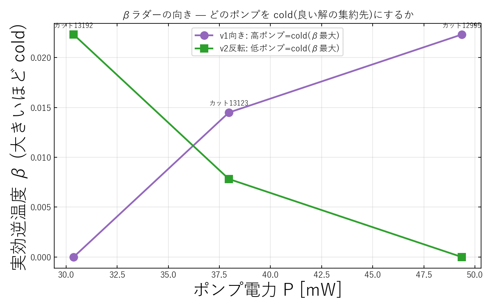
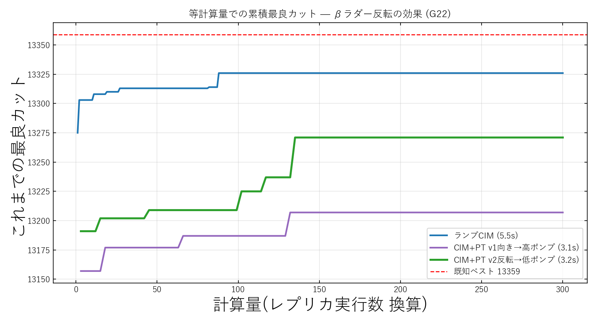
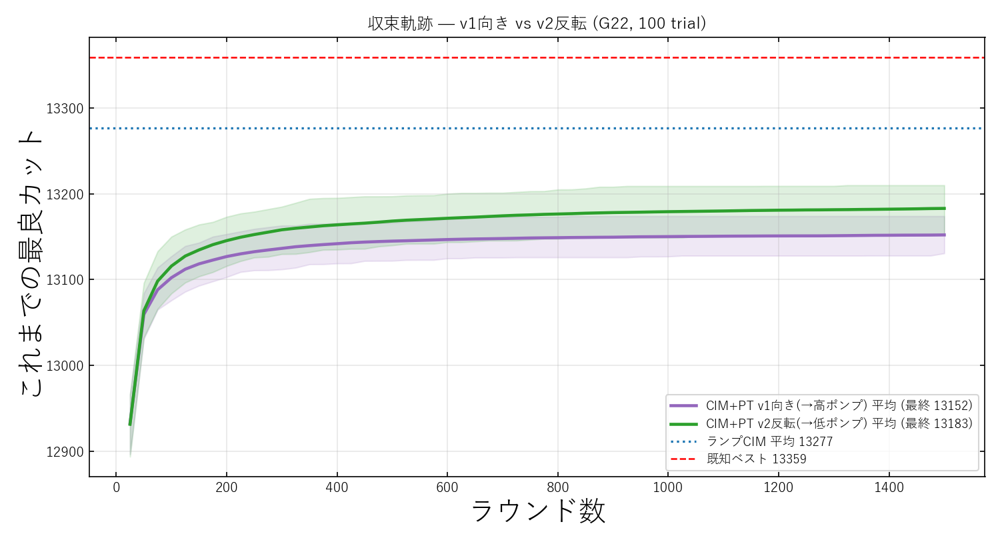
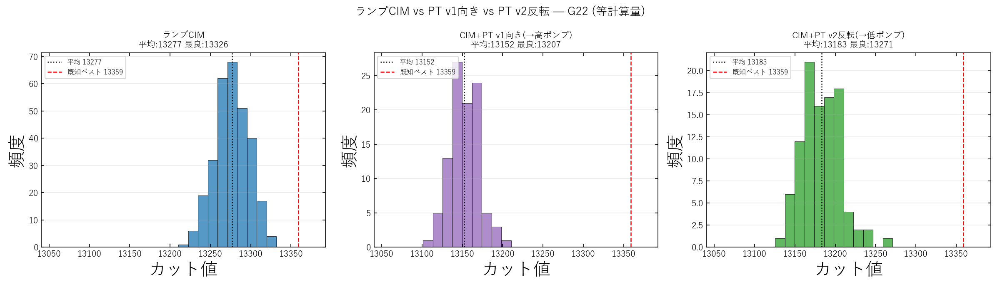

# CIM+PT v2(β ラダー反転)結果まとめ — G22

実験日: 2026-06-06 / グラフ: **G22**(N=2000, 辺数 19990) / 既知ベスト: **13359**
再現コード: `modules/2026-06-06_CIM_PT_v2.py`
データ: `results/2026-06-06/cim_pt_v2/v1_rounds1500_swap10_revladder/`

---

## 1. この実験で何を試したか(一言で)

> **v1 の診断「温度と解質が逆転している」を受け、β ラダーの向きだけを反転して、実測で最良の低ポンプ・レプリカを cold(β 最大)に割り当てたらどうなるかを検証した。**

v1/v2 はいずれも **各レプリカのポンプを固定**(時間発展なし)した PT である。v1 では「高ポンプ=cold(低温)」という素朴な向きにしたが、CIM では高ポンプ側が早く飽和して悪い配置に凍結する=**温度と解質が逆転**しており、PT の前提(低温ほど良い解)が崩れていた。

そこで v2 では **β の向きだけを反転**(物理パラメータ・ポンプ準位・スワップ間隔・seed はすべて v1 と同一)し、良い配置を「実測最良の低ポンプ側」へ集めるようにした。

### ポンプは定数(時間発展なし)

v2 のポンプは全ラウンドを通じて固定:

$$P_r = \text{mult}_r \times P_{\rm th} = \text{const}\ (k \text{ に依存しない})$$

`mult=[0.8, 1.0, 1.3]` → `P_r = [30.4, 37.96, 49.3] mW`(= `P_th` の 0.8/1.0/1.3 倍)。
利得 `g0 = 2κL√P` も実行前に1回だけ計算して全 1500 ラウンド使い回す。**この「定数ポンプ」が後述の限界の根本**で、v3(各レプリカにランプ=時間発展)への伏線になる。

### 正準式 `E(n)=F(n)exp[α·p(n)(1−β|F|²)]` でのポンプ項

CIM の正準更新式:

$$\mathbf{F}(n) = a\,\mathbf{E}(n-1) + b\,\mathbf{J}\mathbf{E}(n-1) + c\,\mathbf{n}_0,\qquad \mathbf{E}(n) = \mathbf{F}(n)\exp\!\big[\,\alpha\,p(n)\,(1-\beta|\mathbf{F}(n)|^2)\,\big]$$

| 正準式 | 意味 | コード対応 |
|---|---|---|
| `E(n)` / `F(n)` | round n の振幅 / 結合後の場 | `c[r,i]` / `coupled_in` |
| `a` / `b·J` / `c·n₀` | 自己結合 / 相互作用 / ノイズ | `√η` / `Jc` / `noise_i` |
| **`α·p(n)`** | **ポンプ項(利得)** | **`½·g0 = κL√P`** |
| `β` / $|F|^2$ | 飽和係数 / 強度 | `γ` / `coupled_in²` |

→ **ポンプ項は** $\alpha\,p(n)=\tfrac{1}{2}g_0=\kappa L\sqrt{P}$。`α` を定数とみなすと正味ポンプ `p(n)` は `√P` に比例。
指数中 `α·p(n)(1−β|F|²)` の符号で「`|F|²` 小 → `exp[+]` 増幅 / `|F|²>1/β` → `exp[−]` 飽和」と切り替わり、符号 ± がロックする。

**v2 の本質**:このポンプ項に入る `P` を `P_r=mult_r·P_th`(定数)としたため、

$$\alpha\,p(n) = \kappa L\sqrt{\text{mult}_r\,P_{\rm th}} = \text{const}\quad(n\text{ に依存しない})$$

すなわち **`p(n)` が時間発展しない**。v3 では `P=mult_r·(k+1)·dP` として `p(n)∝√(n+1)` と round で増やす——この差が v2→v3 の逆転の数式的な所在である。

---

## 2. 実験条件

| 項目 | 値 |
|---|---|
| グラフ | G22(N=2000, 辺19990) |
| CIM ラウンド数 | 1500 |
| レプリカ数 | 3 |
| ポンプ倍率 mult | [0.8, 1.0, 1.3](**固定**) |
| ポンプ電力 `P_r` | [30.4, 37.96, 49.3] mW(定数) |
| 発振しきい値 `P_th` | 37.96 mW |
| スワップ間隔 | 10 ラウンド |
| 試行数 | PT系=100 trial / ランプCIM=300 trial |
| 計算量 | **等計算量**(PT は3レプリカ=3倍コスト) |
| 変更点 | **β ラダーの向きのみ**(v1 と他は同一) |

### β ラダーの較正(swap 無効ランの定常カットから)

swap 無効で各レプリカ本来の質を測ると、定常カットは(低→高ポンプ)で:

| | replica0(低ポンプ/ノイズ) | replica1(臨界) | replica2(高ポンプ/飽和) |
|---|---|---|---|
| 定常カット(swap無) | **13191.7(最良)** | 13122.7 | 12994.8(最悪) |
| β v1向き(高ポンプ=cold) | 0 (hot) | 0.0145 | **0.0223 (cold)** |
| β v2反転(低ポンプ=cold) | **0.0223 (cold)** | 0.0078 | 0 (hot) |

→ **低ポンプ側が最良・高ポンプ側が最悪**(温度と解質の逆転)。v2 はこの実測に合わせて低ポンプを cold にした。

---

## 3. 結果

| 手法 | 平均カット | 最良カット | 最悪 | 標準偏差 | 既知ベスト比 |
|---|---|---|---|---|---|
| ランプ CIM(baseline) | **13276.7** | **13326** | 13220 | 21.0 | 0.9975 |
| CIM+PT v1向き(良い解→高ポンプ) | 13152.1 | 13207 | 13106 | 18.4 | 0.9882 |
| **CIM+PT v2反転**(良い解→低ポンプ) | **13183.0** | **13271** | 13137 | 23.7 | 0.9934 |

- **v2 反転は v1 向きを平均 +30.9・最良 +64 上回った**(向きの修正は確かに効いた)。
- **ただし v2 も依然ランプ CIM に届かない**(13183 < 13277、平均で −93.7)。

---

## 4. 図と読み取り

### 4-1. 累積最良カット(β ラダー反転の効果)

- 緑(v2反転)は紫(v1向き)より一貫して上を走る。向きの修正は有効。
- だが両 PT とも青(ランプCIM)を大きく下回ったまま。

### 4-2. 収束軌跡(100 trial 平均 ± 帯)

- v2(緑)は v1(紫)より上で収束するが、ランプCIM 平均(青点線 13277)には終始届かない。
- 両者とも早期に頭打ちし、ランプCIM との差が埋まらない。

### 4-3. カット値分布

- ランプCIM(青)が最も右(高カット)。v2反転(緑)は中央、v1向き(紫)が最も左。
- v2 は v1 より右へ寄ったが、ランプCIM には遠い。

---

## 5. 考察 — 「向きは逆だったが、それでも届かない」

### (1) ラダーの向きは確かに逆だった
v2 反転は v1 向きに対し平均 +30.9・最良 +64 改善し、図でも一貫して上を走る。スワップ受理率も v1 の [0.86, 0.93](混ざりすぎ)から v2 の [0.65, 0.79] へ健全化した。診断どおり「良い配置は実測最良の低ポンプ側へ集めるべき」で、v1 の割り当ては裏返しだったと検証できた。

### (2) ただし向きを直しても、依然ランプ CIM には届かない
これは**構造的な理由**による:

- **低ポンプ(ノイズ支配)レプリカは探索は得意だが、良い配置を「凍結」できない**。発振しないので符号が揺らぎ続け、流し込んだ良い配置もすぐ崩れる。一方で唯一「凍結」できる高ポンプ側は、早すぎる飽和で悪い配置に固まる。**「探索する場所」と「凍結する場所」が分離してしまい両立しない**。
- ランプ CIM の強みは、ポンプ倍率を $0\to$ 約 $2$ へ**連続的に上げる時間的な焼きなまし**そのものにある。**固定ポンプ 3 点 + スワップでは、この「時間軸の冷却スケジュール」を再現できない**。スワップが移すのは *瞬間の配置* であって、*ポンプを徐々に上げる* という時間発展は移せない。

---

## 6. 結論

β ラダーの向きを「実測の解質」に合わせて反転すると **PT 内部の整合性は改善する(v2 > v1)**。しかしそれでもランプ CIM に勝てないことが、

> **「CIM は非平衡力学系であり、固定ポンプ + 構成スワップでは焼きなまし(連続的な凍結)を代替できない」**

という本質をかえって強く裏付けた。PT を活かすには、向きの修正に加えて「各レプリカ内にも時間的なポンプランプを持たせる」など、**非平衡な凍結ダイナミクスそのものを設計に組み込む**必要がある。

→ この結論が次の **v3(各レプリカにランプを復活)** に直結した。v3 はランプCIMを上回ったが、後日の swap アブレーションで「勝因は swap ではなく multi-start」と判明している(`results/2026-06-08/cim_pt_v3_swap_ablation/`)。

(再現コード: `modules/2026-06-06_CIM_PT_v2.py`、背景: `docs/CIM_PT_why_failed.md`)
