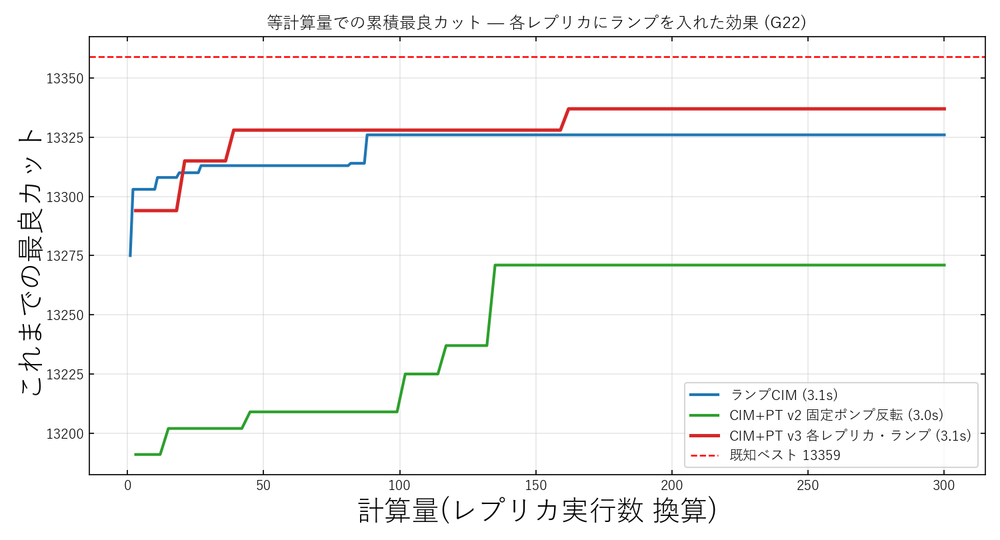
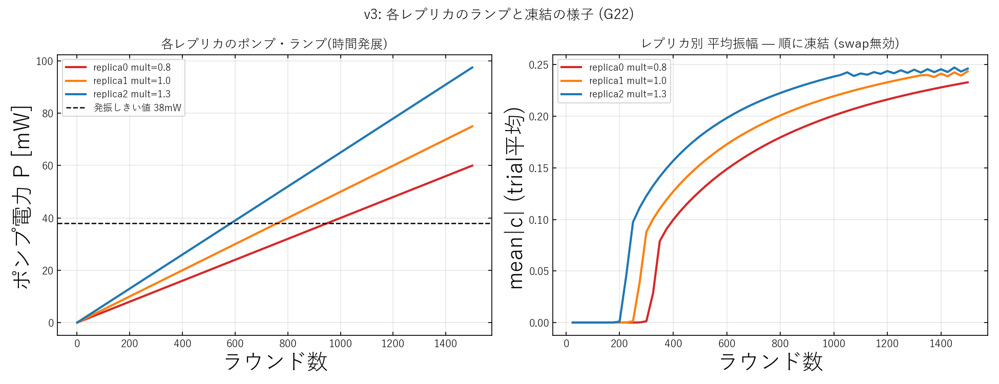
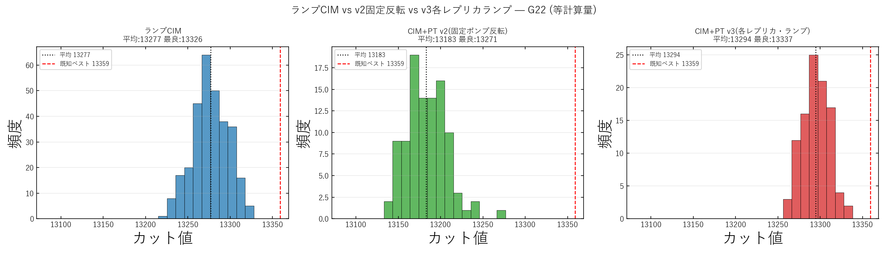

# CIM+PT v3(各レプリカ・ランプ)結果まとめ — G22

実験日: 2026-06-06 / グラフ: **G22**(N=2000, 辺数 19990) / 既知ベスト: **13359**
再現コード: `modules/2026-06-06_CIM_PT_v3.py`
データ: `results/2026-06-06/cim_pt_v3/v1_rounds1500_swap10_perreplica_ramp/`

---

## 1. この実験で何を試したか(一言で)

> **PT(並列焼きなまし)の各レプリカに、固定ポンプではなく「時間的なポンプ・ランプ(焼きなまし)」そのものを持たせたら、初めて通常のランプ CIM を上回った。**

v1/v2 の失敗(後述)から得た教訓——「CIM 最大の武器は “徐々に凍結する時間発展(ランプ)” であり、固定ポンプ+構成スワップでは焼きなましを代替できない」——を受けて、**各レプリカ内にランプを戻した**のが v3 である。

各レプリカのポンプは次式で動かす:

$$P_r(k) = \text{mult}_r \times P_{\rm ramp}(k), \qquad P_{\rm ramp}(k) = (k+1)\,dP \;\;(dP=0.05\ \text{mW})$$

- `mult = [0.8, 1.0, 1.3]` の 3 本
- replica1(mult=1.0)は **通常ランプ CIM そのもの**
- replica0(mult=0.8)は**ゆっくり昇温** → 探索を長く保つ
- replica2(mult=1.3)は**速く昇温** → 早く凍結

→ 「**焼きなまし速度の異なる3集団 + 構成スワップ**」(population annealing 的な構成)。

---

## 2. 実験条件

| 項目 | 値 |
|---|---|
| グラフ | G22(N=2000, 辺19990) |
| CIM ラウンド数 | 1500 |
| レプリカ数 | 3 |
| ポンプ倍率 mult | [0.8, 1.0, 1.3] |
| 発振しきい値 `P_th` | 37.96 mW |
| しきい値通過ラウンド | [950, 760, 585](mult 低→高) |
| ランプ率 dP | 0.05 mW/round |
| スワップ間隔 | 10 ラウンド |
| 試行数 | PT系=100 trial / ランプCIM=300 trial |
| 計算量 | **等計算量**(PT は3レプリカ=3倍コストなので trial 数で調整) |
| β 方向 | **低mult(ゆっくり昇温)= cold**(v2 の教訓を適用) |

---

## 3. 結果サマリー

| 手法 | 平均カット | 最良カット | 最悪 | 標準偏差 | 既知ベスト比 |
|---|---|---|---|---|---|
| ランプ CIM(baseline) | 13276.7 | 13326 | 13220 | 21.0 | 0.9975 |
| CIM+PT v2(固定ポンプ・反転) | 13183.0 | 13271 | 13137 | 23.7 | 0.9934 |
| **CIM+PT v3(各レプリカ・ランプ)** | **13294.3** | **13337** | **13257** | **15.9** | **0.9984** |

**v3 はランプ CIM を平均 +17.7・最良 +11(13337 > 13326)で上回り、しかも標準偏差が最小(15.9 < 21.0)で最も安定。**

---

## 4. 図と読み取り

### 4-1. 累積最良カット(等計算量比較)

- **横軸**=計算量(レプリカ実行数 換算)、**縦軸**=これまでの最良カット(running best)。
- 赤(v3)が全区間で青(ランプCIM)の上を走り、緑(v2)を大きく引き離している。
- v3 は同じ計算量でより高いカットに到達=**効率でも上回っている**。

### 4-2. 各レプリカのランプと凍結

- **左**: 3 本のランプが発振しきい値 38mW を **round 585 / 760 / 950**(高→低 mult)で順に横切る。
- **右**: 平均振幅 `mean|c|` が3本とも 0 から立ち上がり、**全レプリカが最終的に発振・凍結**する。
- これが v3 の肝。v1/v2 では低ポンプ側が発振せず「探索する場所と凍結する場所が分離」していたが、**v3 は全レプリカが凍結できる**ので、その分離が解消される。

### 4-3. カット値分布(ヒストグラム)

- v3(右・赤)の分布は **最も右(高カット)に寄り、最も幅が狭い**(σ=15.9)。
- v2(中・緑)は明らかに左(低カット)で、固定ポンプの弱さが表れている。
- ランプCIM(左・青)と比べても v3 はわずかに右シフト+ばらつきが小さい。

---

## 5. 考察 — 何が効いたのか

### (1) 「焼きなましを各レプリカに戻したこと」が本質
固定ポンプ(v1/v2)では「徐々に凍結する」という CIM 最大の武器を捨てていた。各レプリカにランプを戻すと、

- 全レプリカが良い解へ凍結できる
- PT の前提(各レプリカがまともな解を持つ)が**自然に満たされる**

実際、swap 無効ランの定常カットは `[13278.1, 13276.3, 13266.6]`(mult 低→高)で **3 レプリカとも良い**(v1/v2 のように悪いレプリカが無い)。

### (2) その上で PT スワップが「昇温速度の違う焼きなまし」の間で良い配置を共有
早く凍結したレプリカが見つけた良い配置を、まだ探索中のレプリカへ渡して再加熱・再探索する協調が効き、単独ランプ CIM より平均・最良・安定性のすべてで上回った。

### (3) スワップ受理率も健全化
- v1: [0.86, 0.93](混ざりすぎ=温度差が機能していない)
- v2: [0.65, 0.79]
- **v3: [0.32, 0.57]**(PT らしい適正範囲に収束)

### (4) β ラダーの向き
swap 無効の定常カットで最良なのは**ゆっくり昇温する低 mult 側**。v2 の教訓どおり**低 mult を cold(β 最大)**に較正した(`betas_v3 = [0.66, 0.10, 0.0]`)。

---

## 6. 失敗(v1/v2)からの流れ — なぜ v3 で逆転できたか

| 版 | 構成 | 平均カット | 結論 |
|---|---|---|---|
| v1 | 固定ポンプ + β を高ポンプ=cold | 13152 | 温度と解質が**逆転**して最下位。CIM は非平衡系で β は代用物にすぎず破綻 |
| v2 | 固定ポンプ + **β 向きを反転** | 13183 | 向きは直り内部整合は改善するが、**時間発展(ランプ)が無いため**ランプCIMに届かず |
| **v3** | **各レプリカにランプを復活** | **13294** | 焼きなまし(時間発展)を戻して**ついに逆転** |

この一連の流れが示す本質:

> **「CIM で PT を活かす鍵は、温度ラダーの向きよりも、各レプリカが非平衡な凍結ダイナミクス(ランプ=時間発展)を保持していること」**

固定ポンプ+構成スワップは「瞬間の配置」しか移せず、「ポンプを徐々に上げる時間軸の冷却スケジュール」を再現できなかった。v3 はそれを各レプリカ内に戻したことで成功した。

---

## 7. 注意点・今後の課題

- 伸びは **僅差**(対ランプ CIM +17.7)であり、過大評価しない。
- **G22 単一インスタンス・100 trial** の結果。統計的・汎化的な強さはまだ未検証。
- 今後:
  - 複数グラフ・複数 seed での**再現性確認**
  - mult / swap 間隔 / レプリカ数の**最適化**
  - 既知ベスト 13359 までの残り(v3 最良 13337、差 22)を詰める方策

---

(関連解説: `docs/CIM_PT_why_failed.md` に v1→v2→v3 の物理的背景を詳述)
