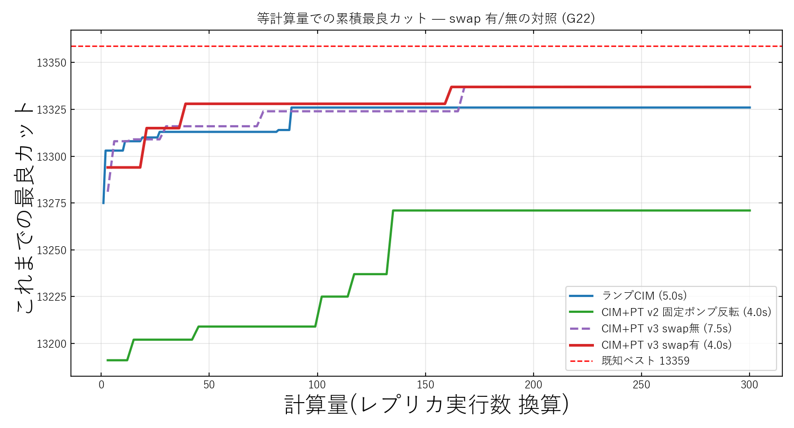
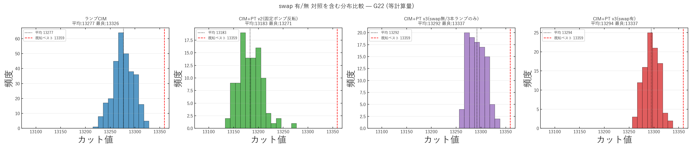

# CIM+PT v3 swap アブレーション — swap の純粋効果を切り分ける

実験日: 2026-06-08 / グラフ: **G22**(N=2000, 辺数 19990) / 既知ベスト: **13359**
再現コード: `modules/2026-06-08_CIM_PT_v3_swap_ablation.py`
データ: `results/2026-06-08/cim_pt_v3_swap_ablation/v1_rounds1500_swap10_swap_ablation/`

---

## 0. なぜこの追試をしたか(比較設計の見直し)

従来の v3 比較(`results/2026-06-06/cim_pt_v3/...`)は

> ランプCIM(**1レプリカ**) / CIM+PT v2(swap有) / CIM+PT v3(swap有)

を並べていた。これだと「v3 がランプCIMに勝った」効果に、

- **(a) 1→3 レプリカ化**(異なるランプ速度の多スタート集団=multi-start)の寄与
- **(b) その3本の間で swap した寄与**(= PT の本体)

が**混在**し、**swap 自体が効いたのか、単に3本回してベストを取っただけ**(multi-start)なのかを区別できなかった。

そこで本実験では **3本ランプ構成のまま swap 有/無だけを切り替えた対照**を取る。

| | pump_mults | ランプ | seed | trial数 | **swap** |
|---|---|---|---|---|---|
| v3 swap無(対照群) | [0.8,1.0,1.3] | あり | 同一 | 100 | **無** |
| v3 swap有 | [0.8,1.0,1.3] | あり | 同一 | 100 | **有** |

→ **swap 以外すべて同一**。この2つの差こそが「swap の純粋効果」である。
(swap無の best 分布は元々 β較正用に計算していたものを正式な比較対象に昇格させた)

---

## 1. 結果

| 手法 | 平均カット | 最良カット | 最悪 | 標準偏差 | 既知ベスト比 |
|---|---|---|---|---|---|
| ランプ CIM(1レプリカ・baseline) | 13276.7 | 13326 | 13220 | 21.0 | 0.9975 |
| CIM+PT v2(固定ポンプ反転) | 13183.0 | 13271 | 13137 | 23.7 | 0.9934 |
| **CIM+PT v3 swap無(3本ランプのみ)** | **13291.9** | **13337** | 13262 | 17.0 | 0.9984 |
| **CIM+PT v3 swap有** | **13294.3** | **13337** | 13257 | 15.9 | 0.9984 |

### 効果の分解

| 寄与の内訳 | 平均カット | 最良カット |
|---|---|---|
| **(a) 3本ランプ化**(v3 swap無 − ランプCIM) | **+15.3** | **+11** |
| **(b) swap 自体**(v3 swap有 − v3 swap無) | **+2.4** | **±0** |
| 合計(v3 swap有 − ランプCIM) | +17.7 | +11 |

---

## 2. 図

### 2-1. 累積最良カット(swap 有/無の対照)

- **紫破線(swap無)と赤(swap有)がほぼ重なって走っている**。両者とも青(ランプCIM)を明確に上回る。
- すなわち「ランプCIM超え」をもたらしたのは **3本ランプ化(multi-start)** であって、swap ではない。

### 2-2. 分布比較

- swap無(紫)と swap有(赤)の分布はほぼ同形・同位置。swap で目立った右シフトは起きていない。

---

## 3. 考察 — 結論が変わった

### (1) swap(PT の本体)の寄与は誤差レベル
swap の純粋効果は **平均 +2.4・最良 ±0**。100 trial の標準偏差が 16〜17 ある中での +2.4 は**統計的に有意とは言えない**。最良カットに至っては swap有・無とも **13337 で同一**(同一 seed で同じ配置に到達)。
→ **「PT スワップが良い配置を集団間で共有して効いた」とは、このデータからは言えない。**

### (2) 効いていたのは「3本の異なるランプ速度による multi-start」
ランプCIM超えの +17.7 のうち **+15.3(約 87%)は3本ランプ化**による。mult=[0.8, 1.0, 1.3] でランプ速度を散らし、各 trial で3本のベストを取る——これは本質的に **「冷却スケジュールを変えた multi-start アンサンブル」** であり、swap を介した温度交換(PT)ではない。

### (3) 旧 v3 結論の訂正
旧 `docs/CIM_PT_why_failed.md` / 旧 RESULTS.md は v3 の勝因を
> 「PT スワップが昇温速度の異なる焼きなましの間で良い配置を共有した」

と説明していたが、**正しい対照(swap無)を取るとこの主張は支持されない**。正確には:

> **v3 がランプCIMを上回った主因は、PT スワップではなく「異なるランプ速度を持つ3本のCIMを並走させ、その最良を採る multi-start 効果」である。swap の追加寄与はこの設定では誤差程度。**

「各レプリカに時間発展(ランプ)を戻したことが本質」という点(v1/v2 の固定ポンプが悪かった)は**正しい**。だが、その上に乗せた swap が効いたという因果は**過大評価だった**。

---

## 4. 示唆・今後

- **PT を名乗るなら swap の寄与を必ず swap有/無の対照で示す**(本実験の教訓)。今回は swap がほぼ効いていないので、現状は「PT」ではなく「ランプ速度違いの population/multi-start CIM」と呼ぶのが正確。
- swap を本当に効かせるには:
  - swap 間隔・β ラダー・レプリカ数の最適化(現状 swap 受理率 [0.32, 0.57] は健全だが利得に結びついていない)
  - レプリカ間の**多様性をもっと大きく**する(mult 幅拡大、初期位相の分散)など、交換で意味のある配置差が生まれる設計
- **multi-start 自体は安価で有効**(+15.3, std も改善)。まず multi-start を素直に強化する方が費用対効果が高い可能性。
- 単一インスタンス(G22)・100 trial の結果。複数グラフ・複数 seed での再確認が必要。

---

---

## 付録: pump_mults = [0.8, 1.0, 1.3] は数式のどこに入るか

レプリカ間で変えたのは **ランプの傾き(昇温速度)だけ**。コード上は `P_r` を作る1行のみで、`J`・`γ`・`η`・`κ`・`L`・`dP`・ノイズは3レプリカ共通。

$$P_r(k) = \text{mult}_r \times P_{\rm ramp}(k), \qquad P_{\rm ramp}(k) = (k+1)\,dP \quad (dP=0.05\ \text{mW})$$

利得係数は `g0 = 2κL√P` なので、**mult は平方根で効く(緩やか)**:

$$g_{0,r}(k) = 2\kappa L\sqrt{\text{mult}_r}\,\sqrt{(k+1)\,dP}$$

→ replica2(mult=1.3)の利得は replica1 比 $\sqrt{1.3}\approx1.14$ 倍、replica0(mult=0.8)は $\sqrt{0.8}\approx0.89$ 倍。
発振しきい値 `P_th` を横切るラウンドは $k_{\rm cross}=\lceil P_{\rm th}/(\text{mult}_r\,dP)\rceil = [950,760,585]$(低→高 mult)。

---

(関連: 旧 v3 結果 `results/2026-06-06/cim_pt_v3/`、背景 `docs/CIM_PT_why_failed.md`)
