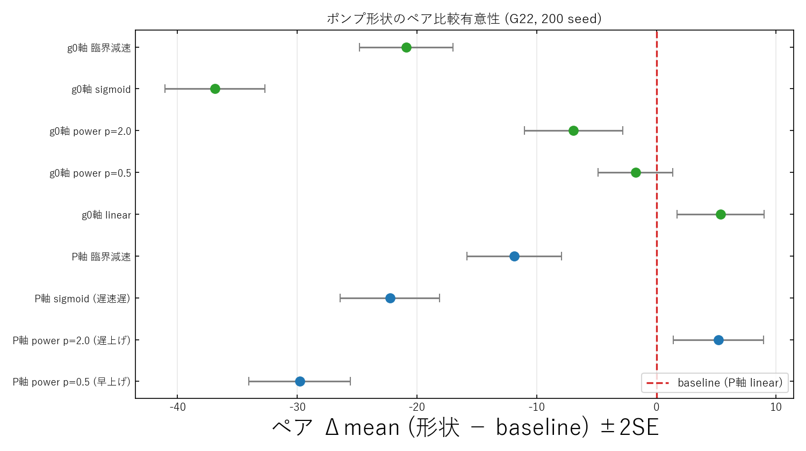
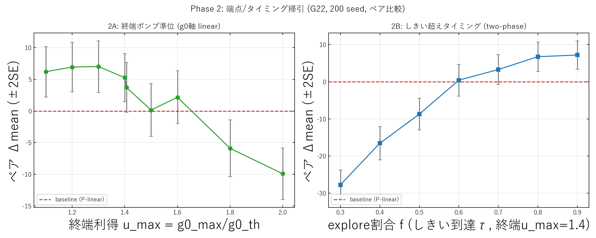

# CIM ポンプ関数の最適化 — Phase 0/1/2 考察

実験日: 2026-06-08 / グラフ: **G22**(N=2000, 辺数 19990) / 既知ベスト: **13359**
計画: `docs/20260608/1612_pump_function_optimization_plan.md`
再現コード: `modules/2026-06-08_CIM_pumpsched.py`(Phase 0/1)、`modules/2026-06-08_CIM_pumpsched2.py`(Phase 2)
データ: `results/2026-06-08/cim_pumpsched/{v2_*(Phase1, 200seed), v3_*(Phase2)}/`

---

## 0. 目的と位置づけ

戦略文書の **戦略A(時間発展=ランプスケジュールの改良)** を本丸として、CIM のポンプ関数の
**時間軌跡の形状**を最適化する。ポンプは 2 層で見える:

- 電力 $P(k)$:現行は `(k+1)·dP`(ラウンドに**線形**)
- 利得項 $g_0(k)=2\kappa L\sqrt{P}$:実際に分岐を駆動。$\propto\sqrt{k+1}$。分岐は $g_0=g_{0,\rm th}=\ln(1/\eta)$
  ($P_{\rm th}=37.96$mW, $g_{0,\rm th}=2.533$)。

「ポンプ関数最適化」= 正規化軌跡 $u(k)=g_0(k)/g_{0,\rm th}$(または $P/P_{\rm th}$)の**形状と端点**の最適化。
設計判断:(1) **P軸とg0軸を別軸で比較**、(2) **手設計スイープと掃引の両方**、(3) **単一レプリカで純粋評価**。

---

## 1. Phase 0 — 配列対応カーネル(イネーブラ)

任意のポンプ形状を試すため、ポンプを `(k+1)·dP` でハードコードする代わりに
**電力スケジュール配列 `P_sched[k]`(長さ K)を受け取るカーネル** `simulate_cim_sched_batch` を実装。
modules/CIM.py の `_simulate_cim_batch` を正確にミラーし、`P_p=(k+1)·dP` → `P_p=P_sched[k]` のみ変更。

**サニティ(必須)**: 線形配列 `P_sched[k]=(k+1)·dP` を渡すと現行カーネルを **seed 一致で完全再現**
(mean=13275.7 ビット一致)。→ 以降の形状比較は、この再現済みカーネル上で公平に行える。

---

## 2. Phase 1 — 手設計族スイープ(端点一致, ペア200 seed)

同じ正規化形状 $s(\tau)$ を P軸/g0軸に**端点を揃えて**適用し、形状だけの効果を見る。

**手法上の要点**: 全形状が同一 seed なので **per-seed のペア差 $\Delta=$形状$-$baseline** で評価する。
32 seed の非ペア比較では「誤差」に見えたが、**200 seed＋ペア比較**で seed 起因のばらつきが相殺され、
有意差が出た(z 最大 ±18)。

### 結果(baseline = P軸 linear = 現行, mean 13276.1, std≈20)

| 形状 | ペア Δmean | z | 判定 |
|---|---|---|---|
| **g0軸 linear** | **+5.35 ±3.63** | +2.95 | ★有意に改善, best 13337 |
| **P軸 power p=2.0(遅上げ)** | **+5.18 ±3.78** | +2.74 | ★有意に改善 |
| g0軸 power p=0.5 | −1.75 | −1.12 | 非有意 |
| g0軸 power p=2.0 | −6.92 | −3.36 | ★悪化 |
| P軸 臨界減速 / g0軸 臨界減速 | −11.9 / −20.9 | ★ | **悪化** |
| P軸 sigmoid / g0軸 sigmoid | −22.3 / −36.9 | ★ | **悪化** |
| P軸 power p=0.5(早上げ) | −29.8 | −14.1 | ★悪化 |

### 解釈
- **改善する2形状は物理的に同一軌跡**: $P\propto\tau^2 \Leftrightarrow g_0=2\kappa L\sqrt{P}\propto\tau$。つまり
  **「利得 $g_0$ を線形に上げる」ランプ**で、別パラメータ化が一致(+5.18 と +5.35)= 強い整合性チェック。
- **2軸比較の答え: g0 軸が正しい空間**。現行の線形電力ランプは利得が $g_0\propto\sqrt{k}$ と**早く立ち上がりすぎ**、
  有意に最適でない。利得を一様に上げる方が +5.3 良い(しきい超えが round 760→1055 と遅く、低利得探索を長く取る)。
- **臨界減速(仮説H1)・シグモイドはこの端点では明確に逆効果**。早上げ(power<1)も大きく悪化。
- ただし効果は小さく、**形状(固定端点)は2次効果**。未検証の主レバーは端点。

---

## 3. Phase 2 — 端点 $u_{\max}$ / しきい超えタイミングの掃引(ペア200 seed)

基準形状を linear-gain に固定し、2つの 1-D 掃引で「終端準位」と「タイミング」を**交絡分離**。

### 2A. 終端利得 $u_{\max}$(g0軸 linear, $u_0$ 固定)

| $u_{\max}$ | しきい超え round | ペア Δmean | z |
|---|---|---|---|
| 1.1 | 1359 | +6.21 | +3.12 ★ |
| 1.2 | 1242 | +6.95 | +3.54 ★ |
| **1.3** | **1143** | **+7.03** | **+3.45 ★(最良)** |
| 1.4 | 1059 | +5.27 | +2.78 ★ |
| 1.406(現行到達) | 1055 | +3.73 | +1.91 − |
| 1.5 / 1.6 | 987 / 924 | +0.15 / +2.17 | 非有意 |
| 1.8 | 819 | −5.91 | −2.63 ★悪化 |
| 2.0 | 735 | −9.93 | −4.87 ★悪化 |

### 2B. explore 割合 $f$(two-phase: しきいに $\tau=f$ で到達 → 終端 $u_{\max}=1.4$ へ凍結)

| $f$ | しきい超え round | ペア Δmean | z |
|---|---|---|---|
| 0.3 | 450 | −27.74 | −13.98 ★悪化 |
| 0.4 | 600 | −16.55 | −7.33 ★悪化 |
| 0.5 | 750 | −8.70 | −4.10 ★悪化 |
| 0.6 | 900 | +0.44 | +0.21 − |
| 0.7 | 1050 | +3.31 | +1.63 − |
| 0.8 | 1200 | +6.76 | +3.42 ★ |
| **0.9** | **1350** | **+7.21** | **+3.76 ★(最良)** |

### 解釈(統一したレバー)
- **2A**: $u_{\max}\approx1.2$–$1.3$ で頂点(+7)。**$u_{\max}\ge1.8$ の過剰ポンプは有意に悪化**(−6〜−10)。
  現行は $u_{\max}=1.406$ まで上げており**やや過剰・しきい超えが早い**(round 760)。
- **2B**: 終端を固定すると、**しきいを遅く超えるほど単調に改善**(round 450 で −28 → round 1350 で +7)。
- **統一結論**: ポンプ関数のレバーは **「しきい超えを遅らせ、過剰に上げない」**。
  低利得で長く探索し(しきい超え round ≈1100–1350)、終端利得は控えめ($u_{\max}\approx1.3$)=
  **explore を長く → gentle freeze**。物理的に素直で、2A/2B が独立に同じ結論を支持。

---

## 4. 総括と論点(次の指示用)

- **ポンプ関数は実在するが2次のレバー**。形状だけ +5.3 → 端点込み +7.0(z≈3.5)と積み上がるが、
  **絶対値では +7 mean = +0.05%(13275.7→13282.9)、best はほぼ不変**。doc の「大レバーは multi-start」
  と整合する。
- **得られた最良ポンプ関数(G22)**: 利得 $g_0$ をほぼ線形に、**終端 $u_{\max}\approx1.3$**・**しきい超えを後半
  (round ≈1100–1350)** に遅らせる。現行(線形電力, 早く高く)は明確に非最適。
- **未確認(重要)**: この +7 が **G22・この seed 集合に過適合していないか**。評価プロトコル上、
  **held-out seed＋複数グラフ(G15/G55/G70)** での汎化確認が必須。
- **詰めの余地**: 2B は f=0.9 まで単調 → さらに遅い超え(f≈0.95)と、$u_{\max}\times f$ の2D最適化。

### 想定される次フェーズ(どれを行うかは指示を仰ぐ)
1. **Phase 3(汎化検証)**: 最良設定を held-out seed＋G15/G55/G70 でペア検証。
2. **Phase 3.5(2D詰め)**: $u_{\max}\times f$ を小 Optuna、f=0.95 追加。
3. **別レバーへ**: ポンプ +7 を確定値として持ち越し、multi-start 強化(B)や後処理(E)へ。
