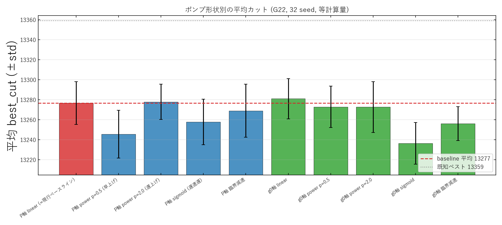
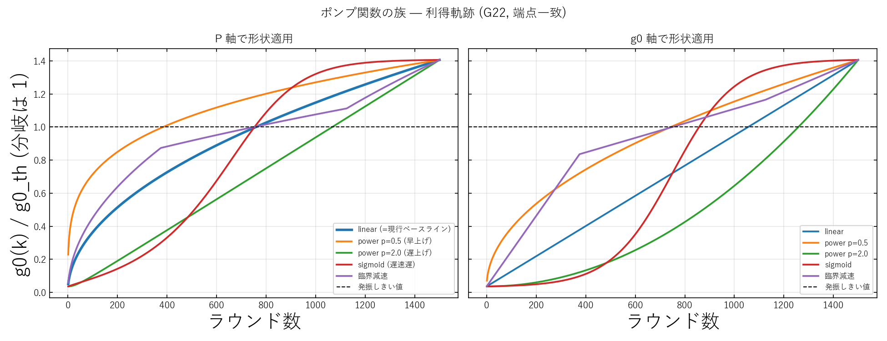

# CIM ポンプ形状スイープ Phase 1（初回・32 seed）考察

実験日: 2026-06-08 / グラフ: **G22**(N=2000, 辺数 19990) / 既知ベスト: **13359**
計画: `docs/20260608/1612_pump_function_optimization_plan.md`
再現コード: `modules/2026-06-08_CIM_pumpsched.py`（`--trials 32`）
位置づけ: ポンプ関数最適化の**初回スイープ**。本版は「有意差を出せなかった」記録で、
方法論の改善（→ v2: 200 seed＋ペア比較）の出発点。全体考察は親 `../RESULTS.md`。

---

## 1. 目的・設定

配列対応カーネル（Phase 0 で現行をビット再現済み）の上で、**端点を揃えて形状だけ**の効果を見る。
同じ正規化形状 $s(\tau)$ を P軸（$P/P_{\rm th}$）と g0軸（$g_0/g_{0,\rm th}$）に適用し、10 形状を比較。

- グラフ G22、K=1500、**32 seed**（seed 0–31）、結合 −0.03、等計算量。
- baseline = **P軸 linear**（= 現行の線形電力ランプ）。

## 2. 結果（32 seed, 非ペア）

| 形状 | mean | best | std | Δmean(vs baseline) |
|---|---|---|---|---|
| **P軸 linear（baseline）** | 13276.7 | 13324 | 21.4 | — |
| g0軸 linear | 13281.0 | **13337** | 20.1 | **+4.3** |
| P軸 power p=2.0（遅上げ） | 13277.8 | 13320 | 17.7 | +1.2 |
| g0軸 power p=0.5 | 13272.9 | 13321 | 20.7 | −3.8 |
| g0軸 power p=2.0 | 13272.7 | 13324 | 25.5 | −4.0 |
| P軸 臨界減速 | 13268.9 | 13317 | 26.5 | −7.8 |
| P軸 sigmoid | 13257.8 | 13313 | 22.7 | −18.9 |
| g0軸 臨界減速 | 13256.1 | 13285 | 16.9 | −20.6 |
| P軸 power p=0.5（早上げ） | 13245.5 | 13306 | 23.8 | −31.2 |
| g0軸 sigmoid | 13236.4 | 13281 | 20.7 | −40.3 |

## 3. 考察

- **唯一 baseline を上回ったのは g0軸 linear**（Δmean +4.3、best +13 → 13337）。次点が P軸 power p=2.0。
- ただし **std≈21、32 seed では平均の標準誤差 SE ≈ 21/√32 ≈ 3.7**。最良候補 g0軸 linear の +4.3 は
  **約 1.2σ にすぎず有意でない**。この版だけでは「形状が効く」とは結論できない。
- 早上げ（power p=0.5）・シグモイド・臨界減速は大きく悪化する**傾向**は見える（数十のマイナス）。
- 方向性として **g0軸 ≳ P軸**（g0軸 linear のみ baseline 超え）は示唆された。

## 4. この版の教訓 → v2 へ

1. **全形状は同一 seed で評価している** → 独立平均の比較ではなく、**per-seed のペア差 Δ** で見れば
   seed 起因のばらつきが相殺され、はるかに鋭く判定できる（本版はこれを未実施）。
2. **seed が少ない**（32）→ SE が大きく小さな効果を検出できない。

→ 次版 **v2** で「**200 seed＋ペア比較**」に改善し、有意性を確定する。
（結果: v2 で g0軸 linear / P軸 power p=2.0 が有意に改善することが判明。`../v2_rounds1500_phase1_shapes/RESULTS.md`）
