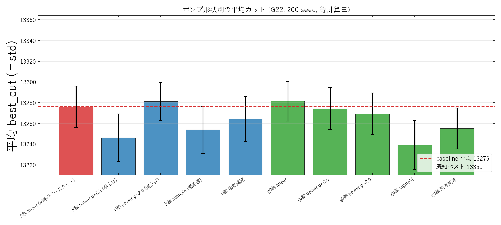

# CIM ポンプ形状スイープ Phase 1（200 seed・ペア比較）考察

実験日: 2026-06-08 / グラフ: **G22**(N=2000, 辺数 19990) / 既知ベスト: **13359**
計画: `docs/20260608/1612_pump_function_optimization_plan.md`
再現コード: `modules/2026-06-08_CIM_pumpsched.py`（`--trials 200`）
位置づけ: v1（32 seed・非ペア＝有意差出ず `../v1_rounds1500_phase1_shapes/RESULTS.md`）の**方法論を改善**した版。
端点を揃えた「形状だけ」の効果の**有意性を確定**する。全体考察は親 `../RESULTS.md`。

---

## 1. 方法論の改善（v1 からの変更点）

- **seed を 32 → 200 に増やす**（平均の標準誤差を縮める）。
- **ペア比較**: 全形状は同一 seed なので、per-seed の差 $\Delta=$（形状）$-$（baseline）を取る。
  seed 起因のばらつきが相殺され、平均差の SE が大幅に縮む。
  有意性は $z=\overline{\Delta}/\mathrm{SE}(\Delta)$、$|z|\ge2$ を有意とする。
- baseline = **P軸 linear**（現行の線形電力ランプ）、mean 13276.1, std≈20。

## 2. 結果（200 seed, ペア比較）

| 形状 | ペア Δmean | z | 判定 |
|---|---|---|---|
| **g0軸 linear** | **+5.35 ±3.63** | **+2.95** | ★ 有意に改善（best 13337） |
| **P軸 power p=2.0（遅上げ）** | **+5.18 ±3.78** | **+2.74** | ★ 有意に改善 |
| g0軸 power p=0.5 | −1.75 | −1.12 | − 非有意 |
| g0軸 power p=2.0 | −6.92 | −3.36 | ★ 有意に悪化 |
| P軸 臨界減速 | −11.87 | −6.04 | ★ 悪化 |
| g0軸 臨界減速 | −20.89 | −10.73 | ★ 悪化 |
| P軸 sigmoid | −22.25 | −10.77 | ★ 悪化 |
| P軸 power p=0.5（早上げ） | −29.79 | −14.08 | ★ 悪化 |
| g0軸 sigmoid | −36.85 | −17.71 | ★ 悪化 |

## 3. 考察

- **v1 で「誤差」に見えた差は、ペア200 seed では明確に有意**（z 最大 ±18）。手法の差が結論を分けた好例。
- **有意に改善する2形状は物理的に同一軌跡**：$P\propto\tau^2 \Leftrightarrow g_0=2\kappa L\sqrt{P}\propto\tau$。
  すなわち**「利得 $g_0$ を線形に上げる」ランプ**で、別パラメータ化（g0軸 linear と P軸 power p=2）の結果が
  +5.18 / +5.35 と一致＝**強い整合性チェック**。
- **2軸比較の答え：g0 軸が正しい空間**。現行の線形電力ランプは利得が $g_0\propto\sqrt{k}$ と早く立ち上がりすぎ、
  有意に最適でない。利得を一様に上げる方が +5.3 良い（しきい超えが round 760→1055 と遅く、低利得探索を長く取る）。
- **臨界減速（仮説H1）・シグモイド・早上げは明確に逆効果**（このパラメータ・端点で）。

## 4. 限界 → 次（Phase 2 = v3）

- 効果は **+5.3 と小さく、形状（固定端点）は2次効果**。
- 本版は**端点を baseline に揃えて固定**しているため、終端利得 $u_{\max}$ やしきい超えタイミングという
  **未検証の主レバー**が残る。
- → **Phase 2（v3）**で、linear-gain を基準形状に **$u_{\max}$ と explore 割合 $f$** を掃引する
  （`../v3_rounds1500_phase2_endpoints/`）。結果: 端点込みで +7.0 まで伸び、レバーは「しきい超えを遅らせ、
  過剰に上げない」と判明。
