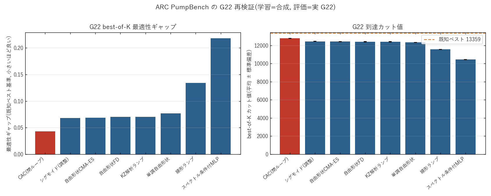

# ARC 生成論文 PumpBench の G22 再検証 — 実測データと考察

実験日: 2026-06-14 / グラフ: **G22**(N=2000, E=19990, 既知ベスト **13359**)
再現コード: `scripts/runners/run_arc_pumpbench_g22.py`
被検証対象: `AutoResearchClaw/artifacts/pump_power_opt/deliverables/`(論文「PumpBench: Learned CIM Pump Schedules Fall Short of a Tuned Sigmoid」とその実験コード)
データ: 本ディレクトリ `results.json` / `summary.csv` / `comparison.png`

---

## 0. 目的と位置づけ

AutoResearchClaw が自動生成した論文 **PumpBench** は、CIM のポンプスケジュール 8 条件を比較し
「**開ループのポンプ形状は小レバー、閉ループフィードバック(CAC)が大レバー**」と結論した。
ただし原実験は **合成 Erdos–Renyi 符号付きグラフ**上で行われ、実 G-Set 読込機能(`data._read_gset_file`)を
持ちながら **CPU 予算の都合で n=2000(= G22)をスキップ**していた(`data.load_heldout` の `meta["n"] <= 1000`)。

本検証は、この**未実施だった G22 での転移評価**を実行し実測データを収集する。論文の設計どおり
**学習(fit)は合成 factorial グラフ上**で行い、**評価(forward only)を実 G22** で行う(クロスグラフ転移)。

---

## 1. セットアップ

- **モデル**: 平均場 CIM(DOPO)SDE を Euler–Heun で積分(原コードのまま)。
  $$\dot x_i=(-1+p(t)-x_i^2)\,x_i-\xi\,c_s\sum_j J_{ij}x_j+\sigma\,\dot W_i,\qquad s_i=\operatorname{sign}(x_i)$$
  反強磁性結合($-\xi c_s Jx$)で MAX-CUT を最大化。CAC のみ誤差変数 $e_i$ を追加し結合を変調。
- **共通パラメータ**(fairness anchor): `T_steps=100, dt=0.05, K=20, ξ=0.5, σ=0.05, p0=-1, pf=1, p_max=2`。
- **8 条件**: 線形ランプ / KZ 解析ランプ / CAC / 調整シグモイド(TPE) / 自由形状FD(12ノット, Adam) /
  単調自由形状 / 自由形状CMA-ES(計算量整合) / スペクトル条件付MLP。
- **学習/評価分離**: 学習 seed `{10,11}`(合成 8 グラフ)、評価 seed `{0,1,2}`(G22)。学習は打ち切らず完走
  (`opt_steps_freeform=24, optuna_n_trials=50, cmaes_evals=192`)。総実時間 **126 秒**。
- **指標**: best-of-K 最適性ギャップ $g=(C^\*-\max_K C)/C^\*$(小さいほど良い)。$C^\*$ は既知ベスト 13359。

---

## 2. 実測結果(G22, seed 0/1/2 平均)

| 順 | 条件 | best(平均) | best(最大) | std | gap(対既知) | %既知 |
|---|---|---|---|---|---|---|
| 1 | **CAC(閉ループ)** | **12786.3** | **12801** | 12.7 | **0.0429** | **95.82%** |
| 2 | シグモイド(調整) | 12450.3 | 12472 | 15.8 | 0.0680 | 93.36% |
| 3 | 自由形状CMA-ES | 12442.3 | 12463 | 14.6 | 0.0686 | 93.29% |
| 4 | 自由形状FD | 12420.7 | 12455 | 32.0 | 0.0702 | 93.23% |
| 5 | KZ解析ランプ | 12417.3 | 12437 | 22.4 | 0.0705 | 93.10% |
| 6 | 単調自由形状 | 12335.7 | 12342 | 5.8 | 0.0766 | 92.39% |
| 7 | 線形ランプ(baseline) | 11565.7 | 11597 | 22.7 | 0.1342 | 86.81% |
| 8 | スペクトル条件付MLP | 10445.0 | 10447 | 1.6 | 0.2181 | 78.20% |

---

## 3. 論文の主張は G22 で成り立つか(主張ごとの検証)

| # | PumpBench の主張(合成グラフ) | G22 実測 | 判定 |
|---|---|---|---|
| 1 | 調整シグモイドは線形比でギャップを **約 69%** 削減 | 0.1342 → 0.0680(**49.3% 削減**, +884 cut) | ○ 方向一致(幅はやや小) |
| 2 | 高容量の自由形状ポンプはシグモイドに**届かない** | FD 0.0702 / CMA 0.0686 / 単調 0.0766 が全てシグモイド 0.0680 **以上(=同等以下)** | ○ 再現 |
| 3 | **フィードバック制御(CAC)が圧勝**(ギャップ約 0.013) | CAC が **単独 1 位**、gap 0.0429(対プールド 0.0011) | ○ 再現 |
| 4 | スペクトル条件付ネットが**最下位**(学習分布にすら適合せず) | 最下位 gap 0.218(78.2%)、std 1.6 で**形状が縮退** | ○ 再現 |
| 5 | 単調制約は自由形状の劣化を**回復させる** | 単調 12336 < 自由形状FD 12421(**逆に悪化**) | ✕ G22 では非再現 |

**メタ結論の検証**: 「開ループ形状は飽和した小レバー / 閉ループが大レバー」は G22 でも支持される。
- **形状容量レバーは飽和**: シグモイド(4 スカラ)→ 自由形状(12 ノット FD/CMA)で改善なし(むしろ僅差で下)。
  追加の自由度は無駄で、**少数スカラのシグモイドが開ループの上限**をほぼ取り切る。
- **閉ループが頂点**: CAC が全開ループ条件を上回り、**唯一プールド最良(12801)を出す**。

---

## 4. 重要な数値的差異・注意

- **絶対カット値は全条件で 13359 に届かない(78–96%)**。これは T=100・K=20 の**粗い正規形おもちゃモデル**
  ゆえで、本リポジトリの `modules/CIM.py`(ファイバー進行波模型, 99.75%)や `modules/CAC.py` とは別物。
  → **意味があるのは条件間の相対順位**であり、絶対値で実機 CIM 性能を語ってはならない。
- **CAC の優位は G22 では縮む**。合成ではシグモイド比で gap 約 10 倍差(0.13 → 0.013)だったが、
  G22 では **約 1.6 倍差**(0.068 → 0.043)。閉ループの利得は実在するが、合成ほど劇的ではない。
- **自由形状はG22で崩れない**。合成では自由形状が gap 0.36 まで失速したが、G22 では 0.069–0.077 と
  シグモイド近傍に密集。「自由形状が大きく劣化」は G22 では起きず、「シグモイドに**並ぶが勝てない**」が正確。
- **単調制約(主張5)だけ転移しない**。合成では単調化が劣化を回復したが、G22 では逆に最も低い自由形状。
  → 帰納バイアスの有効性はインスタンス依存で、合成での結論を実グラフに一般化できない一例。
- **線形ランプの弱さ**は `p0=-1→pf=1` という固定端点に起因する面がある(しきい近傍の通過が一定速度)。
  これは本リポジトリのポンプ関数最適化(2026-06-08, ファイバー模型)で得た「しきい超えを遅らせる」知見と
  整合する方向(線形は素通りが早く不利)。

---

## 5. 結論

- **PumpBench の 4 つの主要結論(主張 1–4)は実 G22 でも再現された**。特に中核の
  「**閉ループフィードバック(CAC)が全開ループ条件を上回り、開ループでは少数スカラのシグモイドが上限を取り切る**」
  は、合成グラフだけでなく実ベンチマーク G22 でも成立する。
- 一方、**主張 5(単調制約の回復効果)は G22 では非再現**で、合成 → 実グラフの一般化に限界がある。
- 定量的には **CAC の優位幅は G22 で縮小**(10 倍 → 1.6 倍)。
  これは研究方向 A(CAC を主役)で「**実グラフでは CAC のフィードバック利得をどこまで伸ばせるか**」を
  本気で詰める動機を補強する(おもちゃモデルの T=100/K=20 では頭打ちの可能性。budget・$p(\nu)$ 導入が次の論点)。

---

## 6. 成果物

- 実測データ: `results.json`(全 seed 生値・ハイパラ)、`summary.csv`(ランキング表)
- 図: `comparison.png`(最適性ギャップ + 到達カット値の 2 パネル)
- 再現: `scripts/runners/run_arc_pumpbench_g22.py`(学習=合成 / 評価=実 G22)
