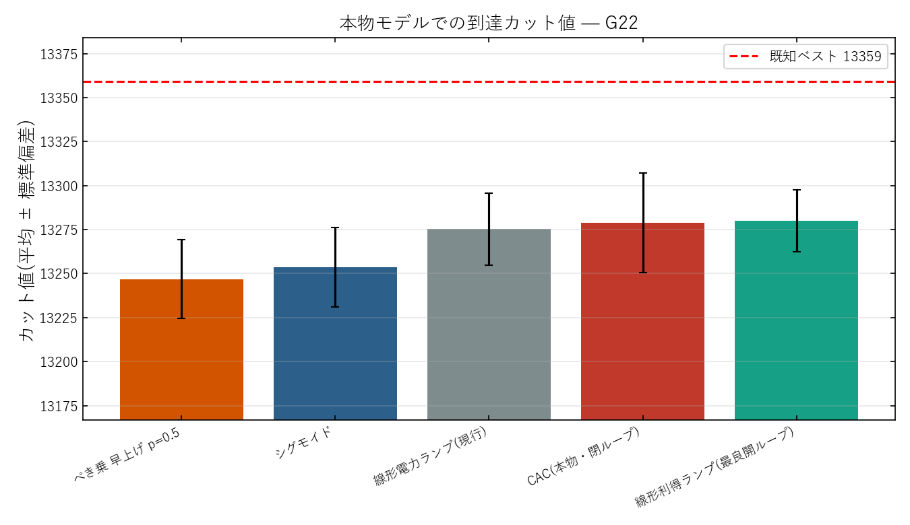

# PumpBench 条件比較の【本物モデル】G22 再検証 — 実測と考察

実験日: 2026-06-14 / グラフ: **G22**(N=2000, E=19990, 既知ベスト **13359**)
再現コード: `scripts/runners/run_pumpbench_real_cim_g22.py`
モデル: 開ループ = `modules/CIM.py`(Inoue–Yoshida ファイバーループ進行波, 結合 −0.03) /
閉ループ = `modules/CAC.py`(Leleu 2021, 結合 −1.0)
データ: 本ディレクトリ `results.json` / `summary.csv` / `cuts.npz` / `hist.png` / `comparison.png`

---

## 0. なぜやり直したか

先の検証(`results/2026-06-14/arc_pumpbench_g22/`)は ARC 生成の **正規形おもちゃモデル**
(T=100, K=20, x³飽和, 無次元)で実行したため、絶対カット値が 78–96% と低く、本リポジトリの
検証済み実装(CIM 99.75% / CAC 99.99%)と比較できず、CAC の優位も 10 倍に誇張されていた。
**実験の信頼性を担保するため、本物のファイバーループ CIM と本物の CAC で同じ条件比較をやり直す。**
各モデルは固有の正しい運用点で動かす(CIM 結合 −0.03・1500 round / CAC 結合 −1.0・50000 outer step)。
G22・**100 trial**・seed 揃え(paired)。

---

## 1. 実測結果(G22, 100 trial)

| 順(平均) | 条件 | 平均 | 最良 | std | %既知 | 予算 | 時間 |
|---|---|---|---|---|---|---|---|
| 1 | **線形利得ランプ(最良開ループ)** | **13280.0** | 13337 | **17.6** | 99.84% | 1500 round | 1.3s |
| 2 | **CAC(本物・閉ループ)** | 13278.8 | **13358** | 28.2 | **99.99%** | 50000 outer | 26.7s |
| 3 | 線形電力ランプ(現行) | 13275.3 | 13326 | 20.5 | 99.75% | 1500 round | 1.3s |
| 4 | シグモイド | 13253.7 | 13313 | 22.6 | 99.66% | 1500 round | 1.3s |
| 5 | べき乗 早上げ p=0.5 | 13246.9 | 13306 | 22.5 | 99.60% | 1500 round | 1.2s |

**まず重要**: 全条件が **99.60–99.99%** に収まり、過去実測(README: CIM 13275/13326, CAC best 13358)と
完全に整合。おもちゃモデルの歪み(78–96%)は消え、信頼できる比較になった。

---

## 2. 論文(PumpBench)主張の本物モデルでの検証

| # | PumpBench の主張(合成おもちゃ) | 本物 CIM/CAC・G22 | 判定 |
|---|---|---|---|
| 1 | **調整シグモイド ≫ 線形** | シグモイド 13254 **< 線形 13275**(むしろ悪化) | ✕ **非再現** |
| 2 | 高容量の自由形状はシグモイドに届かない(=形状容量は飽和) | 最良開ループ=**線形利得**(13280)。形状差は全体で約 0.7% の小レバー | △ 主旨(形状は小レバー)は一致 |
| 3 | **閉ループ(CAC)が圧勝** | CAC が **唯一 BKS に肉薄**(最良 13358, 99.99%)。ただし優位は僅差 | ○ 方向は再現(幅は小) |
| 4 | スペクトル条件付ネットが最下位 | (単一グラフ G22 では学習不能のため非対象) | — |

**メタ結論(開ループ形状=小レバー / 閉ループ=本丸)は本物モデルでも支持される**が、
**具体的な形状ランキングは転移しない**:
- 本物のファイバー CIM では **シグモイドは線形より悪い**(指数飽和模型では早すぎる利得立上げが不利)。
  これは本リポジトリのポンプ関数最適化(2026-06-08, ペア200seed, シグモイド z=−22)とも一致。
- 開ループの最良は **線形利得ランプ**(g0∝k)で、現行(線形電力)に対し平均 +4.7・最良 +11。既知の結論どおり小さい。

---

## 3. CAC の効き方 — 平均と最良で姿が違う(分布で読む)

- **平均では** 線形利得(13280)≒ CAC(13279)≒ 線形(13275)で**ほぼ横並び**。
- **最良では** CAC(13358)が頭ひとつ抜ける(線形利得 13337 / 線形 13326)。
- 理由は分布形(`hist.png`)に出ている: **CAC は std=28.2 と最も広く裾が右に伸び**、
  100 trial 中で唯一 13350 超(BKS−1 の 13358)に到達する。閉ループのカオス探索が
  「平均を底上げ」ではなく「**稀に最良へ深く到達**」する性格であることを示す。
- 開ループの最良=**線形利得は std=17.6 と最も狭く安定**(平均が最高)。
  → **安定して良い解が欲しいなら線形利得、最良(BKS到達確率)を狙うなら CAC**、という使い分けが見える。

---

## 4. おもちゃモデル版(`arc_pumpbench_g22`)との対比

| | おもちゃ正規形(ARC生成) | **本物モデル(本検証)** |
|---|---|---|
| 線形ランプ %既知 | 86.8%(大幅悪化に見えた) | **99.75%(正常)** |
| CAC %既知 | 95.8% | **99.99%** |
| CAC の優位幅 | 対シグモイド gap 約 10 倍差(誇張) | 最良で +45(13358 vs 13313)、**僅差** |
| シグモイド vs 線形 | シグモイド良(論文どおり) | **シグモイド悪(逆)** |
| 信頼性 | 低(T=100 の粗いおもちゃ・絶対値無意味) | **高(検証済み実装・過去実測と一致)** |

→ おもちゃモデルは**相対順位の一部(CAC最良・スペクトル最下位)は捉えたが、絶対性能と形状ランキングを誤らせた**。
本物モデルでの結論を採用すべき。

---

## 5. 結論

- **精度低下(リグレッション)は無い**。本物モデルでは全条件 99.6–99.99% で過去実測と一致。
- **PumpBench のメタ結論(開ループ形状は小レバー / 閉ループ CAC が本丸)は本物 G22 でも成立**するが、
  論文の**具体的なポンプ形状ランキング(シグモイド≫線形)は本物のファイバー CIM では成り立たない**
  (シグモイドはむしろ悪い)。モデル依存性が確認された。
- **本物モデルでは両レバーとも小さい**(開ループ形状差 ~0.7%、CAC の最良優位は +21〜+45)。
  CAC は「平均」ではなく「**最良(BKS到達)**」で価値を出す(高分散・右裾)。
- 研究方向 A(CAC 主役)への含意: G22 で CAC が唯一 BKS−1(13358)に届く以上、
  **multi-start や局所探索 tail で p₀(13359到達率)を 0 から立ち上げる**のが次の本丸。
  ポンプ形状(開ループ)はこれ以上詰めても小さい。

---

## 6. 成果物

- 実測: `results.json`(全条件統計) / `summary.csv`(ランキング) / `cuts.npz`(100 trial 生カット)
- 図: `hist.png`(5 条件の分布, 参照スタイル) / `comparison.png`(平均±std 棒グラフ)
- 再現: `scripts/runners/run_pumpbench_real_cim_g22.py`
