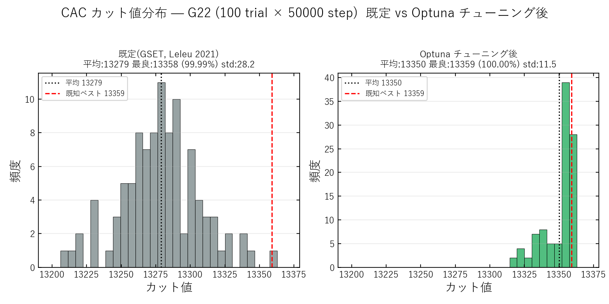
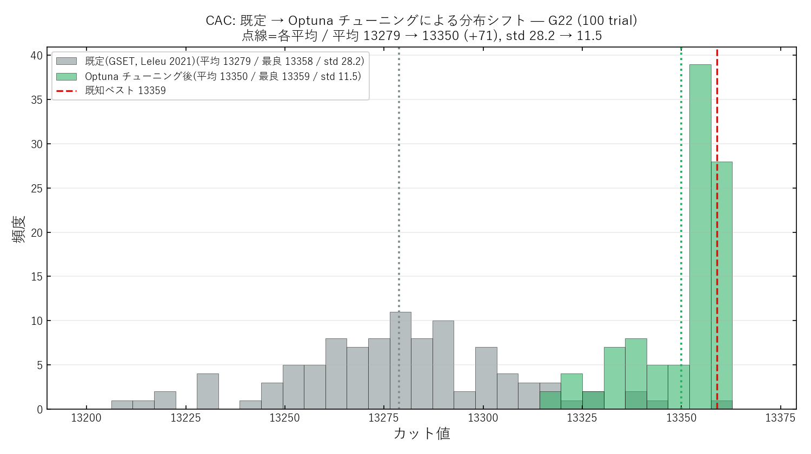
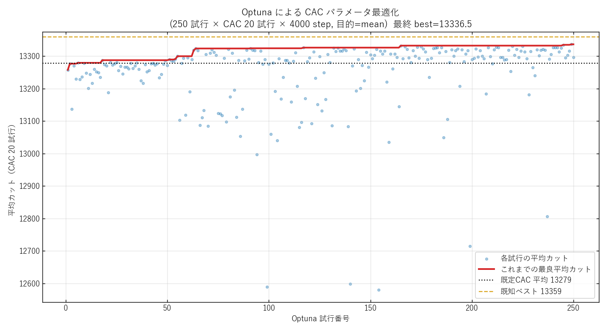
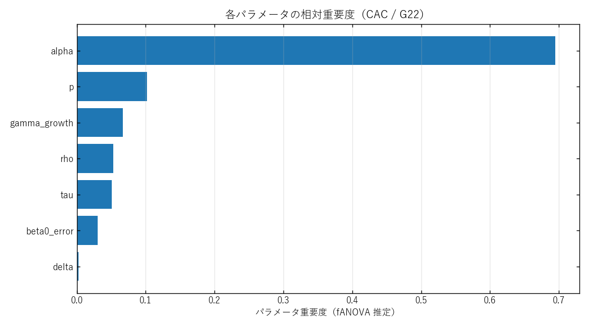

# CAC パラメータの Optuna チューニング — 実測と考察

実験日: 2026-06-15 / グラフ: **G22**(N=2000, K=19990, 既知ベスト **13359**)
実行コード: `scripts/tuning/tune_cac_optuna.py`
モデル: `modules/CAC.py`(Leleu 2021, 結合 −1.0)
最適化器: Optuna 4.8 / TPESampler(seed=0) / `direction=maximize`
データ: 本ディレクトリ `results.json` / `best_params.json` / `history.png` / `importance.png`
ストレージ: `results/optuna_cac_study.db`(study_name=`cac_g22_tuning`, 再開可)

---

## 0. 何をしたか

CAC の **7 個のアルゴリズムパラメータ**(`p, alpha, rho, delta, beta0_error, gamma_growth, tau`)を
Optuna(TPESampler)で同時最適化した。離散化パラメータ(`n_x=6, n_e=4, dt_x=2⁻⁶, dt_e=2⁻⁴, e_max=32`)は
GSET 既定に固定。

- **探索範囲**は `compute_gset_parameters` の既定値をアンカーにして張る(`p` のみ絶対レンジ `[0.30, 0.99]`、
  他は既定の定数倍を対数スケールで)。既定値が必ずレンジ内に入るので「論文既定からの改善幅」を素直に読める。
- **目的関数**: 各 Optuna 試行で CAC を 20 trial × 4000 step 走らせた **平均カット(mean_cut)を最大化**。
  平均は分散が小さく TPE のシグナルとして安定する(`--objective max` でピーク志向にも切替可)。
- **trial 0** は GSET 既定を `enqueue` して評価(ベースライン基準)。
- 探索後、**best と既定を full budget(100 trial × 50000 step)で再評価**して公正に比較。

予算: Optuna 250 試行を **127.5 秒**(510 ms/試行)、full budget 再評価 2 本で **43.5 秒**。合計 ≈ 3 分。

---

## 1. CAC の力学（チューニング対象の数式）

CAC は振幅 $x_i$ と誤差変数 $e_i$ の **2 変数フィードバック系**。離散時刻(外ループ step)$\nu$ ごとに
以下を回す。本実験で探索したのは下式に現れる 7 記号 $\{p,\ \alpha,\ \rho,\ \delta,\ \beta_0,\ \gamma,\ \tau\}$。

**振幅の内ループ**（$n_x$ 回）— 飽和は 3 次項、駆動は結合注入 $I_i$:

$$\dot{x}_i = (p-1)\,x_i - x_i^{3} + I_i,
\qquad I_i = \beta_{\mathrm{inj}}(\nu)\, e_i \sum_{j} J_{ij}\, x_j$$

**誤差フィードバックの内ループ**（$n_e$ 回, CAC の心臓部）— 強度 $x_i^2$ を目標 $a$ に揃える:

$$\dot{e}_i = -\beta_0\,\big(x_i^{2} - a\big)\, e_i$$

**目標振幅² の変調**（停滞 $H-H_{\mathrm{opt}}$ が大きいほど目標を上げて配置を壊す）:

$$a(\nu) = \alpha + \rho\,\tanh\!\big(\delta\,(H - H_{\mathrm{opt}})\big)$$

**結合ランプと周期リセット**（焼きなましの再加熱に相当）:

$$\beta_{\mathrm{inj}} \leftarrow \beta_{\mathrm{inj}} + \gamma \quad(\text{毎 step}),
\qquad \nu - \nu_c > \tau \;\Rightarrow\; \beta_{\mathrm{inj}} \leftarrow 0$$

**読み出し**（スピン = 振幅の符号）:

$$s_i = \operatorname{sign}(x_i), \qquad
\mathrm{cut} = \tfrac{1}{2}\!\!\sum_{(i,j)\in E}\!\!(1 - s_i s_j), \qquad
H = K - 2\,\mathrm{cut}$$

**GSET 既定値**（重み付き次数 $d_0 = \overline{\textstyle\sum_j |J_{ij}|}$, $d_1 = \max(d_0, 10)$ と $N$ から決まる）:

$$p = 1 - 400\,d_1^{-2.5},\quad
\beta_0 = \frac{3}{d_0},\quad
\gamma = \frac{2}{N},\quad
\tau = 9N,\quad
\delta = \frac{2.6}{N},\quad
\alpha = 3,\quad
\rho = 1$$

G22 では $d_0 \approx 19.99,\ N = 2000$ なので $p\approx 0.776,\ \beta_0\approx 0.150,\ \gamma = 0.001,\ \tau = 18000,\ \delta = 0.0013$。
離散化 $\{n_x=6,\ n_e=4,\ dt_x=2^{-6},\ dt_e=2^{-4},\ e_{\max}=32\}$ は固定。

---

## 2. 実測結果(G22, full budget 100 trial × 50000 step)

| 条件 | 平均 | 最良 | 最悪 | std | %既知 | BKS到達 |
|---|---|---|---|---|---|---|
| **既定(GSET, Leleu 2021)** | 13278.8 | 13358 | 13210 | 28.2 | 99.99% | 0/100 |
| **Optuna チューニング後** | **13350.0** | **13359** | **13318** | **11.5** | **100.0%** | **1/100** |
| **Δ(tuned − baseline)** | **+71.2** | **+1** | **+108** | **−16.7** | — | **+1** |

### 100 trial のカット値分布





既定は 13279 を中心に広く散らばり 13358 に 1 度届くだけだが、**チューニング後は 13350 付近に密集して最頻が
既知ベスト 13359 に張り付く**。平均 +71・std ほぼ半減・BKS 到達(1/100)が、分布の形そのものとして読める。
(再現: `scripts/plotting/plot_cac_optuna_hist.py`。`cuts.npz` に生カット配列を保存)



要点:

- **平均が +71.2(13279 → 13350)**。既知ベスト 13359 まで残り **9** に肉薄した平均値。
- **最良が初めて BKS 13359 に到達**(既定は 13358 で 1 差止まり)。`--objective mean` で回してすら BKS hit を 1 本得た。
- **std が 28.2 → 11.5 へほぼ半減**、最悪値も 13210 → 13318 へ +108 跳ね上がった。
  → 「たまに良い」ではなく **安定して高品質解を出す** 設定になった。これがチューニングの一番の効き目。

---

## 3. 見つかったパラメータ(既定との対比)

| パラメータ | 既定(GSET) | Optuna best | 倍率 | 意味 |
|---|---|---|---|---|
| `alpha`(目標振幅²中心) | 3.00 | **4.86** | ×1.6 | 目標強度 a を上げる |
| `p`(分岐) | 0.776 | **0.415** | ×0.53 | より深いしきい下(減衰を強化) |
| `rho`(変調深さ) | 1.00 | **1.79** | ×1.8 | a(t) の振れ幅を拡大 |
| `gamma_growth`(β_inj成長率) | 0.0010 | **0.0198** | ×20 | 結合ランプを急速に立上げ |
| `tau`(β_injリセット窓) | 18000 | **27545** | ×1.5 | リセットまで長く保持 |
| `beta0_error`(誤差rate) | 0.150 | **0.116** | ×0.77 | 誤差補正をやや緩める |
| `delta`(ΔH感度) | 0.00130 | **0.000323** | ×0.25 | a(t) を H 変化になだらかに反応 |

`best_params.json` に固定パラメータ込みの完全な config を保存済み(そのまま `simulate_cac_batch` に流せる)。

---

## 4. パラメータ重要度(fANOVA 推定)



| 順 | パラメータ | 重要度 |
|---|---|---|
| 1 | **alpha** | **≈ 0.70** |
| 2 | p | ≈ 0.10 |
| 3 | gamma_growth | ≈ 0.07 |
| 4 | rho | ≈ 0.05 |
| 5 | tau | ≈ 0.05 |
| 6 | beta0_error | ≈ 0.03 |
| 7 | delta | ≈ 0.00 |

**`alpha` 一強(全体の約 7 割)**。CAC の心臓部は誤差フィードバック $\dot{e}_i = -\beta_0\,(x_i^{2}-a)\,e_i$ で
**全パルスの強度 $x_i^{2}$ を目標 $a$ に揃える**ことなので、その目標 $a$ の中心値 $\alpha$ が最も効くのは力学的に整合する。
逆に $\delta$($a(\nu)$ の $\Delta H = H-H_{\mathrm{opt}}$ への鋭さ)はほぼ無関係 — G22 では $a(\nu)$ を $H$ に
**どれだけ鋭く**反応させるかは効かず、**深さ $\rho$** だけが効く、という分離が見える。

---

## 5. 考察 — なぜこの設定が効くのか

1. **$\alpha\uparrow$ + $p\downarrow$ の組み合わせ**。目標振幅² $a$ を上げて($\alpha=4.86$)符号をはっきりさせる一方、
   分岐 $p$ を $0.78\to0.42$ と深いしきい下へ下げて減衰項 $(p-1)\,x_i$ を強める。**「強い目標へ向かわせるが、暴れさせない」**
   方向のチューニングで、これが std 半減(28→11.5)と最悪値の大幅改善に直結している。

2. **$\gamma$ ×20 + $\tau$ 延長**。結合ランプ $\beta_{\mathrm{inj}}$ を **速く立ち上げて長く保つ**。誤差 $e_i$ が
   揃った状態で結合を強く効かせ続けるので、振幅不均一を直しながら正しい符号配置に素早く収束する。
   screening を 4000 step で行ったため「早く効かせる」方向に最適化されたが、full budget(50000 step)でも
   +71/BKS 到達と **良好に transfer** した。

3. **既存 Method B(`tune_cac.py`)が固定していた $p$・$\beta_0$ を解放した効果**。重要度で $p$ が 2 位
   (≈0.10)に来たことは、**$p$ を動かせるようにしたこと自体が利得源**だったことを示す。Method B は
   $\{\alpha, \rho, \delta, \gamma, \tau\}$ の 5 個のみだったので、本 Optuna 版は探索次元を広げた分だけ余地を拾えた。

4. **目的=mean なのに BKS に届いた**。平均最大化は本来「安定志向」だが、結果的に分布全体が BKS 近傍へ
   押し上がり、裾で 13359 に触れた。**ピーク(BKS hit 率)をさらに狙うなら `--objective max` で再探索**する価値がある。

---

## 6. 限界と次の一手

- **単一インスタンス(G22)専用**。ここで得た config が他の G-set / K2000 に汎化するかは未検証。
  複数グラフでの cross-validation、または各グラフで再チューニングが必要。
- **screening horizon 依存**。`tau`・`gamma_growth` は step 数に対してスケールするため、4000 step で
  最適化した値は別 horizon では最適点が動きうる。full budget での transfer は確認済みだが、
  本番運用 step 数を変える場合は screening step もそれに合わせるのが安全。
- **次の実験案**:
  - `--objective max` で 250〜500 試行 → BKS hit 率(p₀)の最大化を直接狙う(論文 FPGA は p₀=0.11)。
  - 重要度の低い `delta`(≈0)を探索から外し、`alpha` 周辺をより密に探索して効率を上げる。
  - best config を `run_cac_*` 系ランナーに流し、軌跡(振幅・誤差・cut)の時間発展を既定と比較。

---

## 7. 再現方法

```bash
# 本実験の再現(プロジェクトルートから)
.venv/Scripts/python.exe scripts/tuning/tune_cac_optuna.py \
    --study-name cac_g22_tuning --optuna-trials 250 \
    --screen-steps 4000 --screen-trials 20 \
    --final-steps 50000 --final-trials 100

# ピーク志向で再探索する場合
.venv/Scripts/python.exe scripts/tuning/tune_cac_optuna.py \
    --objective max --fresh --study-name cac_g22_max --optuna-trials 300
```

best config は `best_params.json` をそのまま読み込めば `simulate_cac_batch(**params)` に渡せる。

---

## 参考文献

- T. Leleu *et al.*, "Scaling advantage of chaotic amplitude control for high-performance
  combinatorial optimization," *Comm. Phys.* **4**, 266 (2021).
- T. Akiba *et al.*, "Optuna: A Next-generation Hyperparameter Optimization Framework," *KDD* (2019).
